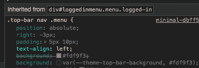

# 德夫·托的前端:一幕脑转储

> 原文：<https://dev.to/nickytonline/dev-to-s-frontend-a-brain-dump-in-one-act-7mg>

目前有一个问题需要改进前端文档(见[前端开发文档](https://docs.dev.to/frontend/))以使人们在前端更快地加入进来。大呼为[@韵](https://dev.to/rhymes)开此期！

# [ 添加关于 JavaScript 前端的开发者文档 #2507](https://github.com/thepracticaldev/dev.to/issues/2507) 

[](https://github.com/rhymes) **[rhymes](https://github.com/rhymes)** posted on [<time datetime="2019-04-21T19:10:09Z">Apr 21, 2019</time>](https://github.com/thepracticaldev/dev.to/issues/2507)

**您的功能请求是否与某个问题相关？请描述一下。**

紧随[关于迁移到 TypeScript 和提高前端开发代码库整体质量的想法](https://dev.to/ben/thoughts-on-migrating-to-typescript-and-improving-the-overall-quality-of-the-frontend-dev-codebase-1121)，[开发人员注意:不要忘记清除缓存！https://github.com/thepracticaldev/dev.to/issues/2499](https://dev.to/jess/dev-notes-don-t-forget-to-clear-cache-962)和我认为如果有一些关于前端部分(尤其是 JavaScript 层)如何组合在一起的概述会很好，也很有用。

我知道有两套 JS 代码库，一套是由 Rails 的链轮管理的[app/assets/JavaScript](https://github.com/thepracticaldev/dev.to/tree/master/app/assets/javascripts)中的“遗产”，另一套是由 webpack 管理的 [app/javascript](https://github.com/thepracticaldev/dev.to/tree/master/app/javascript) 中的“遗产”。

除此之外，我不确定一切是如何工作的(我承认我没有在前端花太多时间，除了偶尔的错误修复或小功能)。

`docs/frontend/javascript.md`可能会回答的几个问题:

*   初始化是如何工作的？
*   Preact 层是不是完全不了解香草 JS 层？
*   两个 JS 代码库是否相互交互/调用？
*   它们是如何附加到模板页面上的？每个网页是否提供两套压缩/缩小的 JS 文件？
*   服务人员在开发到环境中做什么？是登记在整页上吗？是不是不止一个？
*   边缘缓存如何适应这一切？
*   即时点击在这一切中有什么作用？

加上其他重要的东西。它不需要有很深的深度，只需要一个知道什么做什么以及所有东西如何组合在一起的藏宝图。

**描述您想要的解决方案**

包含 JS 前端如何工作的描述的文档文件

**描述你考虑过的替代方案**

我还没有考虑替代方案 TBH，现状还可以，如果有一些关于代码基础的入门文档，对贡献者来说会更容易，特别是如果目标是重构它，使它现代化，甚至用 TypeScript 或其他解决方案进行调整。

[View on GitHub](https://github.com/thepracticaldev/dev.to/issues/2507)

我决定写这篇文章，因为我将对这个文档问题做出贡献，并认为这对每个人都有好处，包括我自己。我希望人们能在评论中提出问题，或者填补帖子中的空白。

## [香草 JS](#vanilla-js)

`app/assets/javascripts`文件夹里有很多前端代码库。这部分代码库没有使用 [ES 模块](https://hacks.mozilla.org/2018/03/es-modules-a-cartoon-deep-dive/)。它加载脚本，运行 DOM 加载后的内容，在全局范围内提供内容，并在客户端为 dev.to 提供许多功能。

资产通过标准的 [rails](https://rubyonrails.org/) / [fastly](https://github.com/fastly/fastly-ruby) 方法加载，这些方法添加了`<script />`标签来加载前端代码。大多数(如果不是所有的话)这些脚本都被延迟(参见 [<脚本>:脚本元素- HTML](https://developer.mozilla.org/en-US/docs/Web/HTML/Element/script) 中的`defer`属性)。

## [Preact，webpacker & webpack](#preact-webpack-webpacker)

该应用程序还有一个更现代的 JavaScript 部分，但它不是一个[单页面应用程序](https://en.wikipedia.org/wiki/Single-page_application) (SPA)。它是一组分散在关键位置的组件，例如搜索、v2 编辑器、入职培训等。

Preact 组件使用 [webpacker gem](https://github.com/rails/webpacker) 和 [webpack](https://webpack.js.org/) 进行管理。如果你对 webpacker 感兴趣，团队中的 [@maestromac](https://dev.to/maestromac) 是一个很好的交流对象。

webpack 入口点的脚本被添加到 Ruby ERB 模板中，但是它们使用 webpacker `javascript_pack_tag`来添加服务器端的脚本。有一个 webpack 配置文件，但它是 yaml 格式的。在那个配置中，有一些设置决定了代码在哪里以及入口点是如何定义的。

[dev.to/webpacker.yml 在 master the practical dev/dev . to GitHub](https://github.com/thepracticaldev/dev.to/blob/master/config/webpacker.yml)

```
...
default: &default
  source_path: app/javascript
  source_entry_path: packs
... 
```

Enter fullscreen mode Exit fullscreen mode

查看上面的配置，这部分前端代码库可以在`app/javascript`文件夹中找到，webpack 入口点可以在`app/javascript/packs`文件夹中找到。

这代表了 webpack 的基本配置。如果环境需要额外的配置，webpacker 允许您通过 webpack 配置导出来增强配置。

[dev.to/development.js 在 master the practical dev/dev . to GitHub](https://github.com/thepracticaldev/dev.to/blob/master/config/webpack/development.js)

```
const environment = require('./environment');
const config = environment.toWebpackConfig();

// For more information, see https://webpack.js.org/configuration/devtool/#devtool
config.devtool = 'eval-source-map';

module.exports = config; 
```

Enter fullscreen mode Exit fullscreen mode

随着项目的继续推进，预计将会看到更多的东西客户端变得预激活(我刚刚做了，嘣！).

# [  @在评论框中提及自动完成 #354](https://github.com/thepracticaldev/dev.to/issues/354) 

[](https://github.com/benhalpern) **[benhalpern](https://github.com/benhalpern)** posted on [<time datetime="2018-08-14T18:32:13Z">Aug 14, 2018</time>](https://github.com/thepracticaldev/dev.to/issues/354)

## 功能请求或任务

作为一个用户，我希望能够开始输入@并让它给我一个下拉菜单。这是这种情况下的预期行为。

这意味着框必须成为内容可编辑的 div，并且代码应该附加到每个框。让这部分工作可能需要一些牦牛毛。

这应该写在 Preact 中，如果认为包含一个不同的库是有意义的，让我们讨论一下。我们对每个依赖都很挑剔，因为我们希望在这方面高效。这并不意味着你一定不能使用图书馆，但让我们只是讨论一下如果你走这条路的含义。

下拉菜单将使用 Algolia 搜索，我们可能需要在`User`模型上添加一个适当的新自定义索引来实现这一点。

### 做过的定义

当所有的内容框都有一个下拉菜单，并且在 GitHub 和 Twitter 这样的网站上行为正常时，这就完成了。核心团队在此帮助处理问题的细微差别。

[View on GitHub](https://github.com/thepracticaldev/dev.to/issues/354)

### Preact 如何在前端代码库中工作的例子

1.  搜索入口点脚本通过 webpacker 的`javascript_pack_tag`加载，例如`<%= javascript_pack_tag "Search", defer: true %>`。

[dev.to/application.html.erb 在 master the practical dev/dev . to GitHub](https://github.com/thepracticaldev/dev.to/blob/master/app/views/layouts/application.html.erb#L38)

```
<!DOCTYPE html>
<html lang="en">
  <head>
    <meta charset="utf-8">
    <% title = yield(:title) %>
    <%= title || "#{ApplicationConfig['COMMUNITY_NAME']} Community" %>
    <% if internal_navigation? %>
      <style>
            ...
      </style>
    <% else %>
      ...
      <style>
        ..
      </style>
      ...
      <%= javascript_pack_tag "Search", defer: true %>
... 
```

Enter fullscreen mode Exit fullscreen mode

1.  初始页面加载时，搜索栏也呈现在服务器端。这就是我目前所说的 Preact 的贫民区服务器端渲染(SSR)。我知道 [@ben](https://dev.to/ben) 想在某个时候添加 preact SSR，但当时并没有那么高的优先级。随着 preact 创建的组件越来越多，现在它的排名可能会更高。

[dev.to/_top_bar.html.erb 在 master the practical dev/dev . to GitHub](https://github.com/thepracticaldev/dev.to/blob/master/app/views/layouts/_top_bar.html.erb#L12)

```
...
    <div id="nav-search-form-root">
      <div class="nav-search-form">
        <form acceptCharset="UTF-8" method="get">
          <input class="nav-search-form__input" type="text" name="q" id="nav-search" placeholder="search" autoComplete="off" />
        </form>
      </div>
    </div>
... 
```

Enter fullscreen mode Exit fullscreen mode

1.  在客户端，一旦加载了 DOM 内容，Preact 就会接管。

[dev.to/Search.jsx 在 master the practical dev/dev . to GitHub](https://github.com/thepracticaldev/dev.to/blob/master/app/javascript/packs/Search.jsx#L5)

```
import { h, render } from ‘preact’;
import { Search } from ‘../src/components/Search’;

document.addEventListener(‘DOMContentLoaded’, () => {
  const root = document.getElementById(‘nav-search-form-root’);

  render(<Search />, root, root.firstElementChild);
}); 
```

Enter fullscreen mode Exit fullscreen mode

1.  从那以后，所有与搜索框的交互都是客户端的。

## [瞬间点击](#instant-click)

正如标语所说，“ [InstantClick](http://instantclick.io) 是一个 JavaScript 库，它极大地加速了你的网站，使得导航在大多数情况下都是即时的。”。基本上，它的工作方式是，如果用户悬停在超链接上，他们的意图很可能是点击它。InstantClick 将在用户悬停在超链接上时开始预取页面，这样当用户点击它时，它是即时的。注意，在移动设备上，预加载从“[触摸开始](https://developer.mozilla.org/en-US/docs/Web/API/Element/touchstart_event)”开始。

除了预取页面之外，InstantClick 还允许您定制当 InstantClick 页面发生变化时会发生什么。

[dev.to/githubRepos.jsx 在 master the practical dev/dev . to GitHub](https://github.com/thepracticaldev/dev.to/blob/master/app/javascript/packs/githubRepos.jsx#L11)

```
...
window.InstantClick.on('change', () => {
  loadElement();
});
... 
```

Enter fullscreen mode Exit fullscreen mode

您还可以通过`data-no-instant`属性决定是否重新评估 InstantClick 加载页面中的脚本。我不相信代码库中有黑名单脚本重评估的例子。你也可以把一个链接列入黑名单。下面是代码库中的一个例子。

[dev.to/buildCommentHTML.js.erb 在 master the practical dev/dev . to GitHub](https://github.com/thepracticaldev/dev.to/blob/master/app/assets/javascripts/utilities/buildCommentHTML.js.erb#L80)

```
...

function actions(comment) {
  if (comment.newly_created) {
    return '<div class="actions" data-comment-id="'+comment.id+'" data-path="'+comment.url+'">\
              <span class="current-user-actions" style="display: '+ (comment.newly_created ? 'inline-block' : 'none') +';">\
                <a data-no-instant="" href="'+comment.url+'/delete_confirm" class="edit-butt" rel="nofollow">DELETE</a>\
                <a href="'+comment.url+'/edit" class="edit-butt" rel="nofollow">EDIT</a>\
              </span>\
                <a href="#" class="toggle-reply-form" rel="nofollow">REPLY</a>\
            </div>';
  } else {
... 
```

Enter fullscreen mode Exit fullscreen mode

有关这方面的更多信息，请参见 InstantClick 文档中的[事件和脚本重新评估。](http://instantclick.io/scripts)

## [【林挺】/代码格式化](#linting-formatting)

### 斯洛文尼亚&职业

该项目使用 eslint 和更漂亮的插件。这意味着所有与代码格式化相关的 eslint 规则都由更漂亮的处理。在很大程度上，我们使用我们扩展的配置提供的开箱即用规则，但也有一些调整。

同样，如上所述，有一些对象存在于全局范围内，例如`Pusher`。我们需要告诉 eslint 它被定义了，否则它会抱怨它没有被定义。这就是 eslint `globals`部分派上用场的地方。

```
...
  globals: {
    InstantClick: false,
    filterXSS: false,
    Pusher: false,
    algoliasearch: false,
  }
... 
```

Enter fullscreen mode Exit fullscreen mode

### 粗硬，不掉毛

代码库带有预提交挂钩，允许我们在提交之前运行 eslint。如果有可以修复的列表问题，它们会自动修复并提交。如果存在无法解决的问题，提交将失败，需要手动处理更改。

## [故事书](#storybook)

开发到前端代码库使用[故事书](https://storybook.js.org/)。这用于开发/展示组件。可以在 dev.to/app/javascript/.storybook[的 master practical dev/dev . to GitHub](https://github.com/thepracticaldev/dev.to/tree/master/app/javascript/.storybook)找到它的定制配置。

### 写故事书故事

故事书文档很不错，但是如果你想找一些例子，可以在 master the practical dev/dev . to GitHub 查看[dev.to/app/javascript/src/components/**故事**。](https://github.com/thepracticaldev/dev.to/tree/master/app/javascript/src/components/__stories__)

### 为故事书做的事情

这目前还没有部署到 Netlify，但有一个问题尚未解决。

# [ 部署故事书 #338](https://github.com/thepracticaldev/dev.to/issues/338) 

[](https://github.com/nickytonline) **[nickytonline](https://github.com/nickytonline)** posted on [<time datetime="2018-08-13T02:05:51Z">Aug 13, 2018</time>](https://github.com/thepracticaldev/dev.to/issues/338)

## 任务

Storybook 可以在本地运行，但是我也放了一个[脚本来为它生成一个静态站点。在我们这样做之前，我一直在等待这个项目开源。如果你运行`npm run build-storybook`，它将为 dev.to 的故事书生成一个静态站点。它当前构建到`./storybook-static`文件夹中。您可以在任何地方部署该文件夹。我假设 Netlify 是开发文档所在的地方。](https://github.com/thepracticaldev/dev.to/blob/master/package.json#L15)

同样，您需要为 storybook 站点的名称添加一个 DNS 记录，例如 storybook.dev.to

我还采取了预防措施，将这个文件夹添加到[中。gitignore](https://github.com/thepracticaldev/dev.to/blob/master/.gitignore#L44)

### 做过的定义

作为 CI 的一部分`npm run build-storybook`应该运行，如果失败(很可能是因为有人忘记更新它们)，构建应该失败。当 PRs 被合并到 master 时，上述情况仍然会发生，但是`./storybook-static`静态文件夹也应该被部署到像 Netlify 这样的服务中，该服务将解析到一个网站 URL，例如 [https://storybook.dev.to](https://storybook.dev.to) 。

如果你需要讨论这些问题，请随时联系我 [@maestromac](https://dev.to/maestromac) 或@benhalpern。

[View on GitHub](https://github.com/thepracticaldev/dev.to/issues/338)

这部分代码库可能需要一些爱。对于有兴趣贡献的前端来说，这里可能有很多唾手可得的成果，因为我相信有几个组件是故事书中没有的。

# 主题化

[](/devteam) [## 诚聘投稿人:夜间模式/开发主题

### 开发团队的 Ben Halpern 月 29 日 192 分钟阅读

#contributorswanted #opensource #meta #css](/devteam/contributors-wanted-night-mode-themes-on-dev-i8n)

我没有参与这个项目，但我知道它大量使用 CSS 变量来进行主题化，并有一些备用变量。现代主题化的一个好方法。

因此，所有可主题化的内容总是应用 CSS 变量，不管它们的当前值是多少(除非因为您的浏览器不支持 CSS 变量，所以您只有退路)。

[](https://res.cloudinary.com/practicaldev/image/fetch/s--8OdzbR0W--/c_limit%2Cf_auto%2Cfl_progressive%2Cq_auto%2Cw_880/https://thepracticaldev.s3.amazonaws.com/i/mbpdyjirntq3aoefp2m3.png)

主题切换的魔力可以在用户配置中看到。在这里，我们可以看到一些应用的风格，无论是夜晚主题还是粉色主题。

[dev.to/_user_config.html.erb 在 master the practical dev/dev . to GitHub](https://github.com/thepracticaldev/dev.to/blob/master/app/views/layouts/_user_config.html.erb#L8)

```
<script>
  try {
    var bodyClass = localStorage.getItem('config_body_class');
    document.body.className = bodyClass;
    if (bodyClass.includes('night-theme')) {
            document.getElementById('body-styles').innerHTML = '<style>\ :root {\ --theme-background: #0d1219;\ --theme-color: #fff;\ --theme-logo-background: #0a0a0a;\ ...
        --theme-social-icon-invert: invert(100)</style>'
    } else if (bodyClass.includes('pink-theme')) {
      document.getElementById('body-styles').innerHTML = '<style>\ :root {\ --theme-background: #FFF7F9;\ --theme-color: #333;\ --theme-logo-background: #fff7f9;\ ...
      --theme-social-icon-invert: invert(0)</style>'
    }
  } catch(e) {
      console.log(e)
  }
</script> 
```

Enter fullscreen mode Exit fullscreen mode

因此，如果你在项目中参与了任何与 CSS 相关的事情，如果你需要将主题应用到你正在做的事情中，请记住这一点。不要害羞，在问题中不明显就问。@venarius 在这方面做了很多工作，所以他可能是一个谈论主题化的好人选。

## [未知数](#unknowns)

### 服务人员

我从来没有在代码库中做过任何与服务人员相关的工作，所以如果有人能在它的用法上插话，那就太棒了😺。我知道它支持离线页面，这很有趣。向 [@aspittel](https://dev.to/aspittel) 大声欢呼，感谢她在离线页面上的出色工作！同样，我确信它也做了大量的缓存工作，但是同样，我不知道关于这部分代码库的所有细节。

### 边缘缓存和前端

我没有做过任何关于边缘缓存的工作，但是我知道 dev.to 使用[很快](https://www.fastly.com/)。我想象所有的前端都被大量缓存在全球的 CDN 上。 [@ben](https://dev.to/ben) 我觉得你或许可以在这一部分详细阐述一下。😺

<center>

[](https://i.giphy.com/media/3o7btNhMBytxAM6YBa/giphy.gif)T3】

</center>

希望这能让人们对开发前端有更多的了解。👋

其他资源:

*   [前端开发文档](https://docs.dev.to/frontend/)
*   [可插入 ESLint 的 JavaScript linter](https://eslint.org/)
*   [更漂亮的固执己见的代码格式化程序](https://prettier.io/)
*   [GitHub - rails/webpacker:使用 Webpack 管理 rails 中类似 app 的 JavaScript 模块](https://github.com/rails/webpacker)
*   [网络包](https://webpack.js.org/)
*   [GitHub - typicode/husky:🐶Git 挂钩变得简单](https://github.com/typicode/husky)
*   [GitHub - okonet/lint-staged:🚫💩—在 git 暂存文件上运行 linters](https://github.com/okonet/lint-staged)
*   [故事书:面向前端开发者的 UI 组件工作坊](https://storybook.js.org/)
*   [InstantClick — JS 库让你的网站变得即时](http://instantclick.io/)

米拉德·法库里安在 [Unsplash](https://unsplash.com/s/photos/brain?utm_source=unsplash&utm_medium=referral&utm_content=creditCopyText) 上拍摄的照片