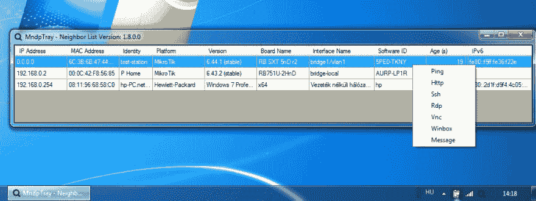
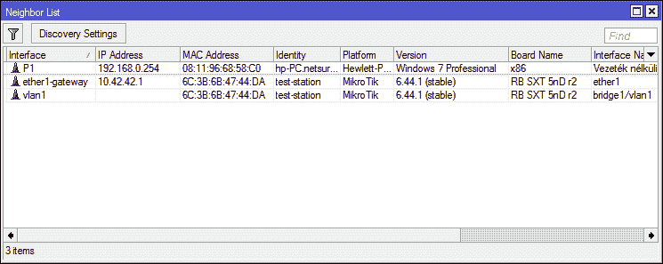

# Mndp 托盘微数学发现工具

> 原文：<https://dev.to/xmegz/mndp-tray-1nei>

## [xmegz](https://github.com/xmegz)/[MndpTray](https://github.com/xmegz/MndpTray)

### MNDP Mikrotik 邻居发现协议托盘应用

<article class="markdown-body entry-content container-lg" itemprop="text">

# MndpTray[](https://ci.appveyor.com/project/xmegz/mndptray)[](https://www.codefactor.io/repository/github/xmegz/mndptray)[](https://camo.githubusercontent.com/ad478f0b3a152c2b11c9e3c6edebc2fd3b41c8f7cd695f39cb296aa7b5f63c83/68747470733a2f2f696d672e736869656c64732e696f2f6769746875622f646f776e6c6f6164732f786d65677a2f4d6e6470547261792f746f74616c)[](https://camo.githubusercontent.com/13417ec47fe443ddad3ee12b2243ed7ad43c0e7f43264060c1e01790ce8f064b/68747470733a2f2f696d672e736869656c64732e696f2f6e756765742f762f4d6e6470547261792e50726f746f636f6c)

MNDP -米克罗提克邻居发现协议-托盘应用工具

这个协议类似于 CDP 和 LLDP，但是 Mikrotik 专用

## 功能:

*   定期通过 MNDP 发送 Windows 主机信息，Mikrotik 路由器会发现它。
*   监听 mndp 消息并将它们放入列表
*   运行时阻止 winbox 发现功能
*   使用 SSH、VNC、RDP、HTTP、PING 协议打开的工具提示列表
*   通过 windows 消息服务发送消息(远程 RPC)
*   IPv4 和 IPv6 支持
*   来自 github 的自我更新

## 下载:[最新](https://github.com/xmegz/MndpTray/releases/download/v1.8.0/MndpTray.exe)

## 截图:

[ ](https://raw.githubusercontent.com/xmegz/MndpTray/master/MndpTray/MndpTrimg/screenshot6.png) [ ](https://raw.githubusercontent.com/xmegz/MndpTray/master/MndpTray/MndpTrimg/screenshot5.png)

## 测试:

*   Windows 10，Windows 7，Windows Server 2012 R2，Windows Server 2016
*   单网卡和多网卡
*   。净 4.5.2

## Windows 服务:

*   定期通过 MNDP 发送 Windows 主机信息，Mikrotik 路由器会发现它。
*   开机后自动启动
*   与服务安装程序集成
*   来自 github 的自我更新
*   。Net 核心支持(Ubuntu 18.04 中的 Alpha 状态测试)

```
MndpService, Version=1.8.0.0, Culture=neutral, PublicKeyToken=d876b79f32e69502
Usage
MndpService install - Install Service
MndpService uninstall - Uninstall Service
MndpService start - Start Service
MndpService stop - Stop
```

…</article>

[View on GitHub](https://github.com/xmegz/MndpTray)