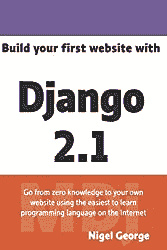

# Django 启动序列

> 原文：<https://dev.to/highcenburg/django-startup-sequence-55jl>

*最初发布于[https://highceburg . tech . blog](https://highceburg.tech.blog)T3】*

# 初始化项目目录，安装虚拟环境和 django:

```
mkdir _project_name_
cd project_name
virtualenv _dir_name_
. ./_dir_name_/bin/activate
python -m pip install django

```

要测试安装是否有效，请在虚拟环境命令提示符下键入以下命令，启动交互式解释器

```
python
```

如果安装成功，您应该能够导入 django 模块并检查安装了什么版本:

```
Python 3.10.0 (default, Oct 14 2021, 20:54:55) [Clang 13.0.0 (clang-1300.0.29.3)] on darwin
Type "help", "copyright", "credits" or "license" for more information.

```

```
>>> import django
>>> django.get_version()
'3.2.8'
>>> 

```

完成后退出解释器。

# 开始一个项目:

```
django-admin startproject _app_name_ 
```

# 创建数据库:

在最后一步中创建的文件夹内，运行以下命令:

```
python -m manage migrate

```

这将创建一个 sqlite 数据库和任何必要的数据库表。如果一切顺利，这就是你将看到的:

```
Operations to perform:
  Apply all migrations: admin, auth, contenttypes, sessions
Running migrations:
  Applying contenttypes.0001_initial... OK
  Applying auth.0001_initial... OK
  Applying admin.0001_initial... OK
  Applying admin.0002_logentry_remove_auto_add... OK
  Applying admin.0003_logentry_add_action_flag_choices... OK
  Applying contenttypes.0002_remove_content_type_name... OK
  Applying auth.0002_alter_permission_name_max_length... OK
  Applying auth.0003_alter_user_email_max_length... OK
  Applying auth.0004_alter_user_username_opts... OK
  Applying auth.0005_alter_user_last_login_null... OK
  Applying auth.0006_require_contenttypes_0002... OK
  Applying auth.0007_alter_validators_add_error_messages... OK
  Applying auth.0008_alter_user_username_max_length... OK
  Applying auth.0009_alter_user_last_name_max_length... OK
  Applying auth.0010_alter_group_name_max_length... OK
  Applying auth.0011_update_proxy_permissions... OK
  Applying sessions.0001_initial... OK

```

# 开发服务器:

要验证迁移，请运行:

```
python -m manage runserver

```

您将在命令行上看到以下输出:

```
Watching for file changes with StatReloader
Performing system checks...

System check identified no issues (0 silenced).
April 22, 2019 - 15:24:21
Django version 2.2, using settings 'app.settings'
Starting development server at http://127.0.0.1:8000/
Quit the server with CONTROL-C.

```

那都是乡亲们！

###### 引用:

###### [用 Python 和 Django 构建你的第一个网站:用 Python & Django](https://amzn.to/2IypHGB) 构建并部署一个网站

[ ](https://www.amazon.com/gp/product/0994616864/ref=as_li_tl?ie=UTF8&camp=1789&creative=9325&creativeASIN=0994616864&linkCode=as2&tag=vagr888-20&linkId=fcc76125667c318f3ab0f253eb86ff5d) [ ](//ir-na.amazon-adsystem.com/e/ir?t=vagr888-20&l=am2&o=1&a=0994616864)