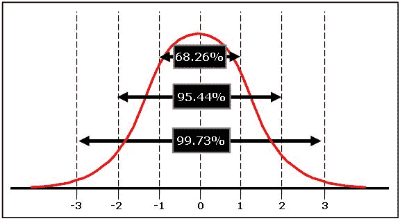

# 技术领先:增长的四大支柱

> 原文：<https://dev.to/wparad/leadership-in-technology-the-four-pillars-of-growth-16j4>

最近，我受到了 Reddit 上一些[无辜帖子](https://www.reddit.com/r/startups/comments/afxgtz/how_to_be_a_great_cto/)的启发，来谈谈成为当今世界的技术领导者意味着什么。对于那些新发现的技术领导角色，你会立即注意到的一件事是，它与你所知道的不同，而且职责在不断变化。事实是，这与技术关系不大，与领导力关系更大，而且没有 TL；博士

有四个关键方面。下面我将逐一向您展示它们与技术领导角色的关系。

## 代表团

对你和你的公司来说显而易见的事情可能对每个人都不明显。作为领导团队的一员，你真的要记住这一点。一旦你这样做了，你会很快意识到你不会成为你需要成为的每个领域的专家。

这里的一个解决方案是找到那些专家。表面上看，这似乎是善意的建议，但实际上你是如何做到的呢？你可能会听到“雇用比你聪明的人”，这是正确的。然而，如果有什么，你会想确保你能回答为什么你应该这样做。

你只是没有时间去解决存在的每一个问题。让世界接受你的解决方案当然很好，但事实并非如此。时间不是唯一的问题。要解决一个问题，你需要创造一个不同于最初导致问题的环境。你可以通过把注意力集中在学习你以前不知道的东西上来做到这一点。但你不能一直这样。问题会开始在任何地方出现，你会很快不知所措。你学到的东西会比你需要的少，而且只能解决一小部分问题。

完美的世界是拥有自己的迷你复制品来完成工作。如果光谱是“自己做所有的工作”到“精确克隆”，真正的解决方案是在中间的某个地方。找到那些能够理解大部分必要内容的人。然后，提供一致性和策略，以便他们可以创建您想要的大部分解决方案。你仍然可以解决你想解决的问题，用你想用的大部分方法。成功。

现在你知道了你的原因并且你雇佣了正确的人，是时候将同样的原则应用到你的团队的日常运作中了。利用你的团队，他们每天都在处理移动的部件，而你负责将所有部件组装在一起。没有他们你无法做出决定，因为他们掌握了更多相关信息。弄清楚谁是你可以从中获得灵感的人。

虽然壮大你的团队很重要，但作为一名领导者，你应该已经在考虑谁是你的好替代者(仅供参考，这不仅仅是给 CTO 的建议)。由于公司的未来岌岌可危，你可以更加努力地工作，但寻求帮助更有效。当你离开目前的职位，开始承担更艰巨的任务时，你需要一个替代者。此外，随着团队的成长，你将没有时间跟进所有的细节，所以授权变得更加重要。

请记住，一旦你的公司成长，明天将会不同，会有更多的钱，更多的员工，和更多的问题。这些问题可以帮助你为即将到来的考试做好准备:

*   你目前的管理策略奏效了吗？你怎么知道的？
*   如果今天有 3 名团队成员来告诉你他们要离开，你会知道你正在失去什么人才，他们的优势和劣势是什么吗？虽然你不会单方面决定雇佣谁，但你了解你的团队吗？
*   在公司内外，你信任谁来帮助你？

## 技术

你对技术的未来负责。这不仅仅是如何构建当前的软件、服务和设计。不要忘记，现在的一切将决定未来 6 个月、1 年甚至更长时间的情况。你真的想确保你公司的技术是在未来的轨道上。此外，您还需要回答以下一些问题:

*   你知道你的发展战略是否过时了吗？
*   你去哪里寻找别人创造的新技术解决方案？
*   你的团队能够回答这些问题吗，或者他们需要来找你吗？
*   你的解决方案和产品中最重要的部分是什么？
*   使用您当前的技术，哪些相邻的解决方案易于导航？
*   如果您有 3 个月的停机时间，没有外部指导(来自管理团队、客户或市场)，您会建议您的团队做些什么？

在前进的过程中，你会面临来自你自己和你的团队的许多问题。你不需要当场回答所有的问题，但是你需要知道如何得到这些答案。在这些可能的情况出现之前，花些时间思考一下会有所帮助。有准备是好的。

## 个人成长

找个导师。我怎么强调都不为过。

重要的是，你可以继续寻找其他人，他们可能知道一些可以帮助你的事情。他们可能扮演着不同的角色，也就是说，他们不是纯粹的技术专家，也许你此刻需要的是一个有着不同思维方式的人。你也想找到与你职位相当的人，这样你就有其他人来交流想法。这并不是一个新概念，阅读这篇快速的文章只是一个开始，但是你将从这里走向何方呢？你需要找到获得新见解的机会。

每个人都可以给你很好的建议，但并不是所有的都是相关的。其他地方可能有类似的角色，但这并不意味着他们都负责相同的事情。例如，如果你是一名首席技术官，那么来自另一名首席技术官的反馈可能会因你的情况而异。然而，最重要的是弄清楚你的团队需要什么才能成功。

找到一个好的导师可能很难，但也可能很容易，你只需要保持警惕:

*   有没有人在你身边做了你喜欢的事情？
*   你当时的情况是不是你不知道发生了什么，别人知道吗？
*   你的弱点在哪里，谁在那些方面有优势？
*   你的强项是什么？你也许可以和那些有共同爱好的人一起工作。

更多地了解你自己和你所处的环境有助于发现其他可能成为好伴侣的人。他们会鼓励你进步。

## 沟通/协作

你需要考虑你的沟通方式。不只是你说了什么，而是你怎么说，以及你说了什么。你不能让每个人都理解，但他们必须理解到足以做正确的事情。每个人都会听到不同的声音。

最简单的解释是，我们并不都说同一种语言。但即使我们做到了，也不完全一样。总的来说，这是一种逃避。当我们只和另外一个人交流时，需要交流双方都参与进来，以确保他们相互理解。当你同时与许多人交谈时，获得这种反馈会更加困难。你经常发现自己在重复一个信息吗？你怎么知道其他人是否听到了你说的话？人们在不同的波长上思考。这就是你的信息被听到的方式:

虽然大约 68%的人听到了正确的信息，但每个部分都是人们听到不同信息的地方。每个人都会听到你信息的一个横截面。每个听众会做一些稍微不同的事情。那些在中间的人理解你的信息，但是当你离信息的中心越来越远时，边缘理解就会发展。有些人会陷入一个发音错误，或者一个不相关的人的问题，或者只是不明白你用的短语。会发生的。

解决这个问题的一个方法可能是问“你听到了什么？”我的经验是，80%的人应该用正确的事情来回应，10%的人认为我不知道我在说什么，因为他们比我想象的更聪明，做得更好，10%的人会忽略我，因为他们远远落后。

作为一名技术领导者，你也需要学会与他人合作。在您的角色中，这可能意味着将行动委托给其他人。这里要记住的关键是:明确你的期望，但也要理解他们的期望。如果做不到这一点，就会加剧误解造成的问题。如果你不清楚，其他人很容易填写期望，他们会的。这需要一个简单的请求，有时会夸大其词。“熊粘着蜂蜜”，可能是深刻的，也可能是简单的，那瓶蜂蜜粘着蜂蜜。

至于把我的任务分配给团队中的其他人，我会把任何我认为至少能完成 70%的任务分配给他们。这似乎是一个很低的数字，确实如此。不要忘记，你的时间比完美地做事更有价值。如果一项任务可以被委派，并在可接受的水平上完成，那就去做。可接受的水平远低于你想要的水平。如果为你委派一些事情没有风险，那么你就没有委派足够多的事情。是的，你确实需要关注大局，但是如果你不委派，他们怎么能做到 80%或 90%的好呢？他们将如何解决这些问题？

作为一个场景:

> 你的项目经理，首席执行官，不管是谁，决定你今天就要转向，而不是 X(等等...)你要去追 y。

我首先想到的是**这会影响我的团队**。在与他人就这一变化进行沟通和协作时，您应该考虑以下几点:

*   你的团队准备好改变了吗？
*   你将如何沟通——电子邮件、空闲时间、传真、全体会议？
*   他们会惊讶吗？
*   在分享给大家之前，你的想法跑过谁？

这些是关于你的团队如何工作以及什么对他们最合适的问题。想想吧。对公司有意义的东西对你现在的团队不一定有意义。

确保你的团队准备好尽快处理新的方向，但也准备好全力以赴，投入更多时间来解决当前的情况。

这里最重要的一点是:既然你被公认为领导者，你就永远在舞台上。你的一言一行都会对公司产生多方面的影响。当你在回答关于公司或你自己的问题时，别人会把这理解为“公司认为 X”。这是你负责的一个极其强大的信息，但也可能是危险的。你的想法可以转化为真正的成功或创新，或者导致螺旋式下降。

不要忘记，一旦你成为领导者，有些人会因为你的角色而听你的，有些人会因为同样的原因而不听你的。你会想为这两者做好准备。你的信息需要调整，以将正确的信息传递给正确的受众。思考“当我这么说时，我的工程师会听到什么？当我这么说时，高管团队会怎么想？”，“这是同样的信息吗？”，“可以吗？”。

每个人都想要书，所以我在这里列出了我最喜欢的书。

如何成为一名伟大的领导者:

*   [从西蒙·西内克的《为什么》开始](https://www.goodreads.com/book/show/7108725-start-with-why)
*   [Jurgen Appelo 的管理 3.0](https://www.goodreads.com/book/show/10210821-management-3-0)
*   大卫·马奎特
*   [约翰·C·麦斯威尔领导的 21 条颠扑不破的定律](https://www.goodreads.com/book/show/815716.The_21_Irrefutable_Laws_of_Leadership)
*   [亚当·格兰特著](https://www.goodreads.com/book/show/16158498-give-and-take)
*   迈克尔·洛普的《管理人类》

如何看待技术随着公司的发展，技术越来越不重要，更多的是解决方案如何协同工作:

*   贾雷德·戴蒙德的《枪支、细菌和钢铁》
*   彼得·圣吉的《第五项修炼》

有技术发展战略或如何有效沟通？请在 [Twitter](https://twitter.com/yourTeaminator) 或 [r/TechLeader](https://www.reddit.com/r/TechLeader/) 上告诉我们！

* * *

最初发布于[https://blog . teaminator . io](https://blog.teaminator.io)。