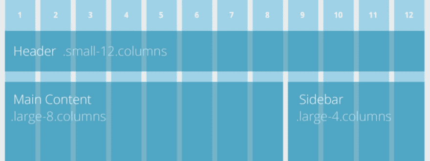
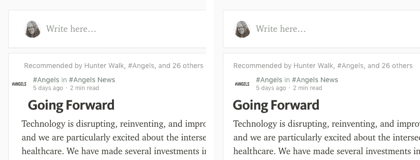
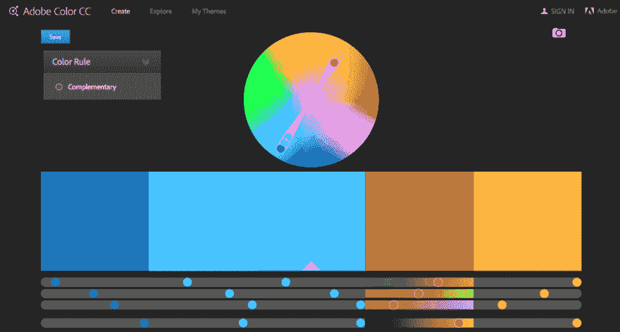
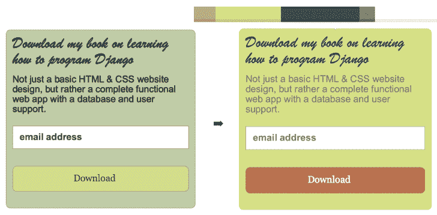
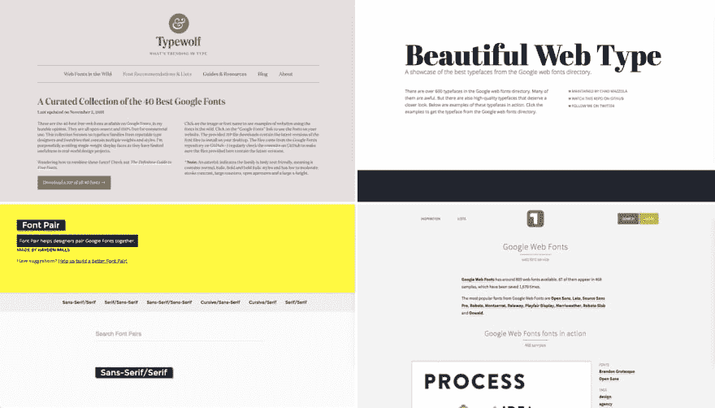
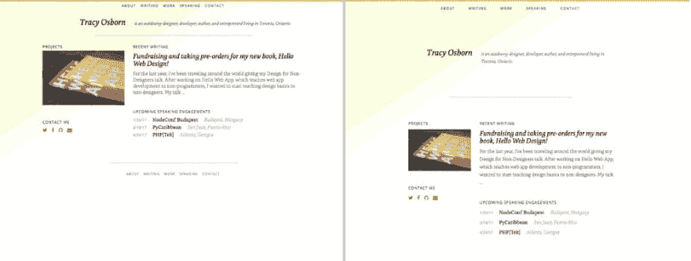
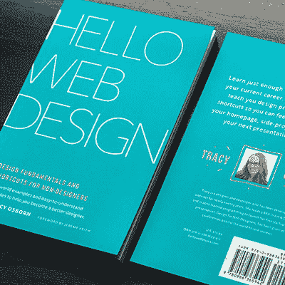

# 为非设计师设计(上)

> 原文：<https://dev.to/tracymakes/design-for-non-designers-part-1-28m2>

即使你不是设计师，我敢打赌，在你职业生涯的某个时候，你需要做一些视觉上的事情，无论是为你的项目制作一个登陆页面，设计一个表格，创建你的个人网站，还是制作幻灯片。

那么，第一部分— **设计时要记住的一件主要事情是什么？**

### 减少杂乱。

就是这样。专注于这一件事。如果你想让你的设计看起来更漂亮，减少视觉混乱。

<figure> 

<figcaption>我们要应用设计理念的丑部件。</figcaption>

</figure>

我制作了这些小部件来帮助说明这些整理杂物技巧。当我们浏览下面的概念时，我们将把它们应用到小部件上，看看它是如何开始看起来更有凝聚力和视觉吸引力的。

我们开始吧！

## 通过添加网格将东西排好来减少杂乱。

<figure> 

<figcaption>图像经由基础前端框架。</figcaption>

</figure>

有一个关于设计师和前端开发人员之间冲突的轶事:设计师给开发人员一个模型，开发人员用代码实现设计。设计师然后抱怨某某元素差了两个像素，导致开发者翻白眼——两个像素？这么小应该没关系！愚蠢的设计师和他们的吹毛求疵！

然而，**小的错位可能很难发现，但会造成设计中的“杂乱”感**。当元素彼此不对齐时，它们会感觉随意放置且不协调。

<figure> 

<figcaption>哪个看起来更有凝聚力？</figcaption>

</figure>

很容易通过在标题和内容中添加额外的填充和边距来增加意外的错位。在上面的例子中，右边的屏幕截图有均匀的边距和填充，所有的元素都对齐到同一个左边的网格，这使得设计更有凝聚力，看起来更专业。

<figure> 

<figcaption>将所有东西的左右边缘对齐，让小工具看起来更有凝聚力。</figcaption>

</figure>

在我们的示例小部件中，左边距和右边距到处都是。对齐这些边距会让小部件看起来不那么混乱。

简而言之，通过整理物品来减少杂乱感。

对于 web 工作，使用包含网格的前端 web 框架来使用快捷方式，如 [Foundation](http://foundation.zurb.com/) 、 [Bootstrap](http://getbootstrap.com/css/) 、 [Skeleton](http://getskeleton.com/) 和 [PureCSS](http://purecss.io/) ，这将使 HTML 元素的随机放置几乎不可能。

对于非网页设计工作和模型，你也可以在设计程序中使用网格和指南，比如 [Sketch](https://www.sketchapp.com/learn/documentation/canvas/rulers-guides-grids/) 、 [Photoshop](https://1200px.com/) 和 [Gimp](https://docs.gimp.org/en/gimp-view-show-grid.html) 。

## 通过限制设计中的颜色来减少混乱。

选择颜色可能会非常困难，这也是为什么色彩理论在设计学校经常是一门长达一学期的课程的原因之一。

<figure> 

<figcaption>旧戈达达网站与当前。</figcaption>

</figure>

在上面的 GoDaddy 旧址中，我们可以看到的一件事是在整个设计中使用了大量的颜色。红色、绿色、橙色、深灰色、浅灰色、黄色和蓝色都是特色——这种彩虹色的显示(以及其他因素)给人一种严重的杂乱感。

目前的 GoDaddy 网站要干净得多，在整个设计中使用了相同色调的黑色、绿色和橙色。照片也大多是灰色的，允许它褪色到背景，让表单上的绿色按钮突出。

在选择颜色的背后有很多理论和最佳实践会淹没这篇文章，这就是为什么我在这里特别提倡使用捷径。

<figure>

<figcaption>Adobe Color CC 网站有一个很棒的点击式界面来构建补色调色板。</figcaption>

</figure>

从零开始选择调色板是一件棘手的事情，这就是为什么我喜欢依赖那些展示预先构建的调色板或帮助你从一种基本颜色构建调色板的网站，如 [Colormind](http://colormind.io) 、 [Adobe Color CC](https://color.adobe.com/) 和 [Colorblendy](http://colorblendy.com/) 。这些网站将帮助你建立一个调色板，其中包含少量的颜色可以很好的搭配。

<figure> 

<figcaption>应用调色板。</figcaption>

</figure>

对于我们的小部件，我们抓取了一个调色板并将其应用到小部件。请注意，并不是所有的颜色都必须使用，也不是调色板中指定的确切颜色。新的“下载”按钮和调色板中的不太一样，但是调色板给了我们一个很好的起点。

如果你想了解更多关于构建颜色的过程，我推荐 Smashing Magazine 上的这篇优秀文章:[一个简单的 Web 开发人员颜色指南](https://www.smashingmagazine.com/2016/04/web-developer-guide-color/)。

## 通过减少使用的字体数量来减少杂乱。

谢天谢地，我们现在有更多的字体可用了！只有几种字体可供选择的日子已经一去不复返了。

印刷术是另一个让人不知所措的大课题。Serif、sans-serif、monospace、display、web-safe 和 slab 都是用于描述和分类字体和字样的术语(这些术语对于非印刷工来说通常可以互换使用)。

当谈到选择字体时，有很多指导方针，但我喜欢推荐两个开始:**每个设计只使用两种字体，避免花哨/显示字体。**

<figure> 

<figcaption>仅使用两种字体使小工具看起来更整洁。</figcaption>

</figure>

左侧的原始小部件使用了四种不同的字体，右侧的刷新小部件仅使用了两种字体。新的小工具使用了斜体和全大写等风格，这仍然给人一种不同元素之间存在差异的感觉，但整体感觉更有凝聚力。

但是在我们所有的选项中选择两种字体仍然会让人不知所措。像 [Typekit](https://typekit.com/) (免费至 99 美元/年)和 [Google Fonts](http://fonts.google.com/) (免费)这样的网站是专业、漂亮字体的绝佳资源，但包含数百种选择。

<figure> 

<figcaption>使用策划免费字体的网站，如 [Typewolf](https://www.typewolf.com/google-fonts) 、 [Beautiful Web Type](http://chad.is/beautiful-web-type/) 、 [Font Pair](http://fontpair.co/) 和 [Typ.io](https://typ.io/libraries/google) 。</figcaption>

</figure>

减少选择，通过使用字体管理网站来查看更有限数量的字体，并看到他们的行动。许多网站列出了可用的最佳谷歌字体，包括 [Typewolf](https://www.typewolf.com/google-fonts) 、 [Beautiful Web Type](http://chad.is/beautiful-web-type/) 、[字体对](http://fontpair.co/)和 [Typ.io](https://typ.io/libraries/google) 。**您不再需要浏览数百种字体，只需浏览这些网站，直到找到适合您和您的情况的组合。**

关于选择字体的更多信息，请查看这篇优秀的 Smashing 杂志文章:[如何选择字体——一步一步的指导](https://www.smashingmagazine.com/2011/03/how-to-choose-a-typeface/)。

除此之外，还有一本非常好的书详细介绍了网页排版:[关于网页排版](https://abookapart.com/products/on-web-typography)

## 通过添加空白来减少杂乱的感觉。

空白是最终的杂乱减少器。

作为初级设计师，我们倾向于将过多的信息放在一起。大而空的空白让人感觉不舒服和不自然，初学者经常有用信息和元素填充空白空间(也称为空白或负空间)的冲动。

<figure> 

<figcaption>在我的个人网站添加空白之前和之后。</figcaption>

</figure>

然而，设计中的空白(元素周围的空白和填充，以及文本和字母之间的空间)使我们的文字更易读，我们的界面不那么混乱，我们的设计感觉更专业。

<figure> 

<figcaption>添加空白(并规范化元素之间的空间)使小部件看起来更专业。</figcaption>

</figure>

**通过在我们的小工具**的许多地方添加空白——在内容和绿色背景的边缘之间，在标题和段落之间，在单独的文本行之间，以及在我们的表单内——**我们的小工具感觉更专业，更容易阅读。**

这里没有什么好的捷径，只是提醒一下:**使用比你认为需要的更多的空格。**确保你设计的所有元素之间有足够的边距和空间，你的文本在各行之间有足够的空间/行高，你的设计在内容和空间边缘之间有足够的空间。

要了解更多信息，请查看这些精彩的文章:

*   网页设计中的空白:它是什么，为什么你应该使用它
*   [在你的设计中使用空白(或负空间)](https://webdesign.tutsplus.com/articles/using-white-space-or-negative-space-in-your-designs--webdesign-3401)

## 总之，为了更好的外观和感觉，记得减少杂乱。

<figure> 

<figcaption>应用于这个小工具的每一个减少杂乱的原则都极大地改善了它的外观。</figcaption>

</figure>

*   把东西排好，用网格。
*   限制设计中的颜色数量，使用互补色。
*   减少使用的字体数量。
*   添加空白。

简而言之，以“干净”和有序的设计为目标。

当然，设计不仅仅是看起来如何，更重要的是，它是如何工作的。请继续关注本系列文章的第二部分和第三部分，深入了解用户体验，以及如何训练你的设计眼光的设计过程和策略。

* * *

这是一个为非设计师设计的三部分系列。在这里见第二部分关于用户体验[在这里](https://hellowebbooks.com/news/tutorial-design-for-non-designers-part-3/)见第三部分关于训练你的设计直觉。

你可以在我的书里找到更多的信息和建议！ *Hello Web Design* 将不仅包含上述信息，还将包含针对程序员和非设计人员的务实且易于理解的理论和最佳实践。

订购你好网页设计 <small>*电子书的起价为 24.95 美元。*</small>

谢谢大家！如有任何问题，[关注并在 Twitter 上给我发消息](https://twitter.com/tracymakes)。

你怎么想呢?我错过了什么吗？请在下面的评论中告诉我！