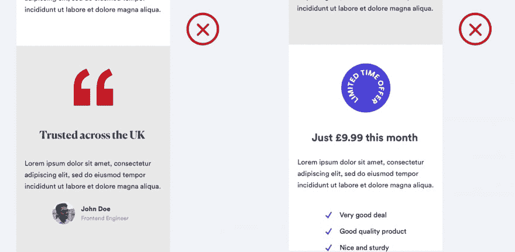
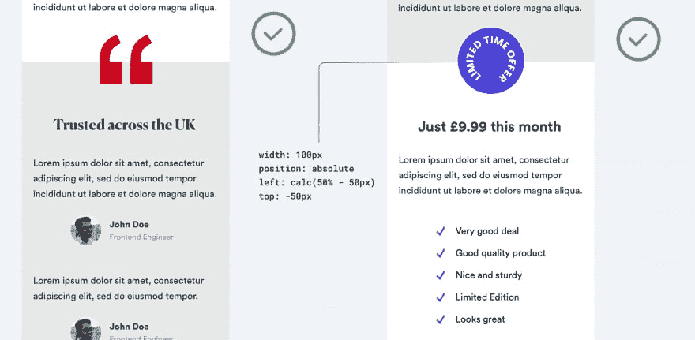

# 提升用户界面设计水平的鲜为人知的技巧

> 原文：<https://dev.to/leomercier/lesser-known-tricks-to-level-up-your-ui-design-491o>

在过去的三年里，我们在 Crowdform 设计了无数的数字产品。在这个过程中，我们学到了一些微妙的和意想不到的技巧，它们可以真正提升产品设计。所以我们想:为什么不把这些技巧整理成一系列文章来帮助其他 UI 设计师呢？

1)在截面上叠加形状以增加深度

有时候从一个部分到另一个部分的直接过渡看起来，嗯…很无聊。

如果你的页面上有一个图形元素，可以尝试将它覆盖在两个部分。你的设计应该看起来更流畅，更少的条块分割。

我们在我们的[产品工作室的博客](https://www.crowdform.co.uk/blog/7-lesser-known-tricks-to-level-up-your-ui-design)上写了一篇更长的文章，还有另外 6 个例子。