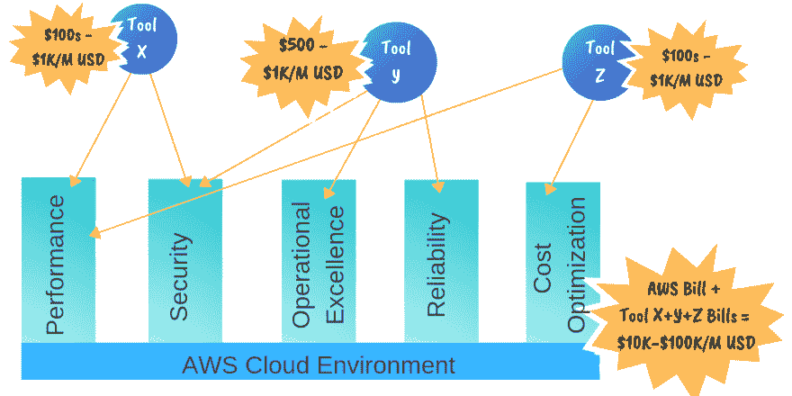
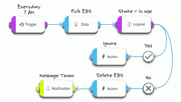
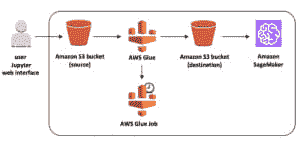

# 构建您自己的云管理平台

> 原文：<https://dev.to/totalcloudio/build-your-own-cloud-management-platform-2l5b>

在不断增长的[【2000 亿美元](https://www.informationweek.com/cloud/cloud-computing-2019-the-cloud-comes-of-age/d/d-id/1333442) 价值的云计算市场中，多重云管理为自己开拓了一片天地。预计到 2022 年将增长至[44.927 亿美元。数字本身就说明了问题，表明了我们如今对云管理工具的依赖程度。](https://www.marketsandmarkets.com/PressReleases/multi-cloud-management.asp)

## **云中 ROI 拼图:**

作为云用户，我们一直依赖几种孤立的云管理工具，一种用于成本优化，另一种用于安全&治理，还有一种用于运营和监控等等&等等。

我们使用来自这些工具的数据作为云提供商主要接口数据之上的构建模块，以获得事物的背景并解决现实世界的云问题。

> ### **Therefore, we finally bought several SaaS tools and analyzed data from multiple tools, thus reducing the return on investment of cloud. T3】**

在与数百名云客户讨论了他们的痛点后，我们意识到还有其他因素降低了投资回报率。

这些云管理工具为云管理问题提供了一套模板化的解决方案。这给了企业更少的活动和整合业务需求的空间。

> ### Result: You end up spending precious time performing the same tasks, writing one script after another, and performing repeated organizational tasks. T3】

举个例子:定期在整个企业成千上万个 S3 桶中寻找可公开访问的桶。这不是一项容易的任务。每天都会发现如此多的可公开访问的 S3 存储桶，例如最近在一个公共存储桶 上发现了 [数百万条脸书记录，企业投入了大量的时间和精力来检查每个存储桶的策略，同时遵守组织的业务流程。这显然有助于降低云投资回报率。](https://www.bloomberg.com/news/articles/2019-04-03/millions-of-facebook-records-found-on-amazon-cloud-servers?utm_campaign=website&utm_source=Last%20Week%20in%20AWS&utm_medium=email)

### **作为热情的云实践者，我们必须挺身而出，加入这个云投资回报难题的缺失部分。我们是这样做的...**T3】

## **释放出**内的力量

我们在 TotalCloud 开始了我们的旅程，提供游戏化的视觉界面。该界面通过单个面板上的上下文数据层提供完整的云可见性。

我们之所以能够在一个面板上展示包含如此多层次上下文数据(如资源相关性和视角)的整个架构，主要原因之一是因为我们的本地 ***云图形引擎。*** 该引擎一直运行在我们平台的后端，与前端的 3D 可视化引擎紧密集成。

自 TotalCloud 诞生以来，这个云图引擎就一直是我们框架不可或缺的一部分。这是我们创建“自主云工程师”工具的使命的驱动力之一，该工具可以自行监控和管理任何类型的云服务和任何数量的云服务。

> **今天，我们以 web 控制台的形式向 AWS 云用户开放了我们强大的云图引擎，您可以在其中利用它的力量创建智能工作流。现在，您可以灵活地对任何 AWS 资源执行自动化，使符合您的业务需求，而无需依赖第三方解决方案或 AWS 管理控制台/CLI。**

有了这个，你就可以自动:

*   定义“任何”AWS 云管理要求，无论是优化、安全性、治理、可靠性等。在工作流程中
*   从 TotalCloud 云图形引擎获取特定于此需求的上下文数据层
*   使用顶端带有各种视角的等轴视图进行快速分析
*   在正确用户批准的情况下采取补救措施，无需使用 AWS 控制台或 CLI
*   通过电子邮件或备用渠道向利益相关方传达最终结果

> ### **Result: A powerful multi-functional tool was obtained to help accelerate the execution of cloud management tasks.** T3】

简单地说:无需编写任何代码，您就可以根据您的组织需求定义和自动化多项云管理任务。这样，您可以节省在多个云管理工具上花费的几个工时和数百美元，并最终构建自己的云管理平台。

## **云配方:一次一个工作流地构建自己的云管理平台**

全新的 TotalCloud 不再只是一个可视化界面，而是一个强大的工具，可以帮助您创建自己的“云配方”每个云方案都可以根据您在云管理任务中直观采取的操作，在工作流中设置逻辑操作。

以下面这个机器学习架构为例:

来源:[https://docs . AWS . Amazon . com/solutions/latest/machine-learning-for-telecom munications/architecture . html](https://docs.aws.amazon.com/solutions/latest/machine-learning-for-telecommunication/architecture.html)

为了成功管理该架构的成本、安全性和治理，您可以借助工作流创建自己的云方案，例如:

*   自动对停机的 SageMaker 笔记本实例执行操作，并通知您的团队，而无需手动键入电子邮件/slack 消息。对于这个用例，您可以轻松地创建一个工作流，在 CloudWatch Alarm 启动时监控 SageMaker 笔记本实例，重新启动这些受影响的笔记本实例，并自动向 SysOps 团队推送电子邮件通知以通知他们。
*   自动请求经理的批准，并根据需求将笔记本实例修改为更大的轮廓。对于这个用例，您可以轻松地创建一个工作流，在系统全速运行时使用 CloudWatch 触发 SNS，并通过电子邮件进一步获得用户批准，在批准后将系统扩展到更大的配置文件，并获得修改通知。

随着您创建每个云方案，您对其他云管理工具的依赖将会减少。最终，您将拥有自己的云管理平台。由于您只需设置一次工作流程，并让机器来完成任务，因此节省的时间是不可估量的。

为了确保对所有云资源的安全访问和适当的管理，每个工作流都通过我们的策略管理工具获得自己的定制策略。

此外，您还可以像以前一样在 web 控制台中获得我们内置的等轴视图和透视数据层，以便进行深入的上下文分析。这弥补了您一直在使用的调试和映射工具！

## **结论:用高阶语言** 将云 ROI 拼图的缺失部分连接起来

我们在智能工作流中引入的高阶语言，加上根据您的业务需求自动执行云管理流程的能力，完善了云投资回报难题中缺失的部分。

> 请试一试，并注册使用我们的测试版。T3】

为了缩短学习曲线，我们提供了常见用例的 [工作流模板](https://help.totalcloud.io/use-case-examples) 来帮助您快速开始使用 TotalCloud。一定要去看看。