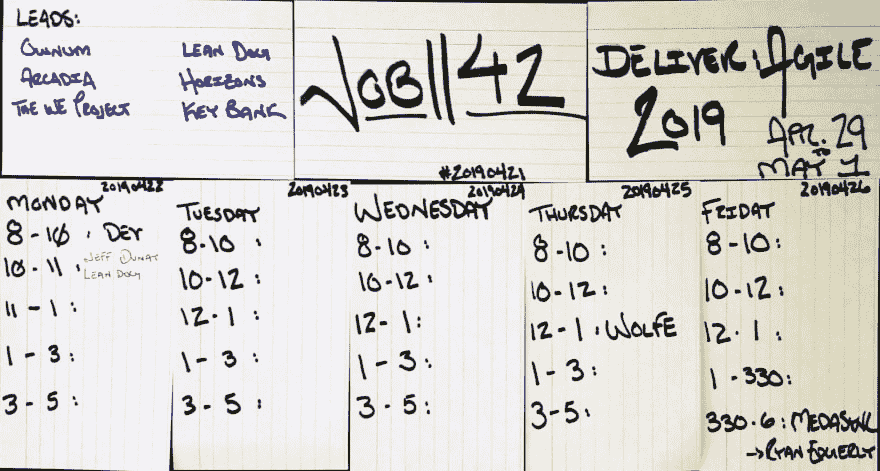
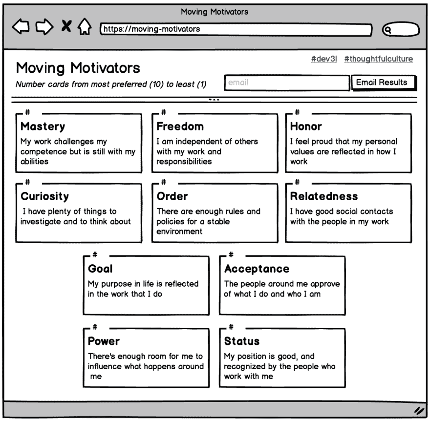
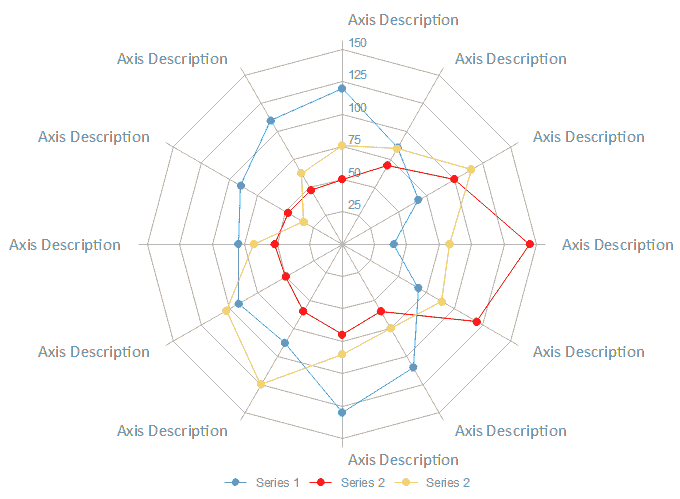

# 求职-42 天中的第 3 天

> 原文：<https://dev.to/dev3l/job-search-day-3-of-42-24m2>

```
Actively looking for employment is a job itself
The fastest pace is infinitely sustainable 
```

Enter fullscreen mode Exit fullscreen mode

# 求职计划表

[](https://res.cloudinary.com/practicaldev/image/fetch/s--o6012WEq--/c_limit%2Cf_auto%2Cfl_progressive%2Cq_auto%2Cw_880/https://thepracticaldev.s3.amazonaws.com/i/lrq22biqnk2c7o2rl847.jpg)

一个工程师一周应该为他/她的雇主工作多少小时？工程师一周应该为自己工作多少小时？

罗伯特·马丁(Robert Martin)([@ uncle bob](https://twitter.com/unclebobmartin)):

```
You should plan on working 60 hours a week.
The first 40 are for your employer. The remaining 20 are for you.

During this remaining 20 hours you should be:
    reading, practicing, learning, and otherwise enhancing your career. 
```

Enter fullscreen mode Exit fullscreen mode

这是一个很高的要求，但有多少人花甚至个位数小时锐化

# 缩小焦点

志愿者假期的求职部分进展顺利

我有几个项目排队

### [团队的移动激励因素](https://management30.com/practice/moving-motivators/)

**移动激励因素**是管理 3.0
中的一个性格测试/游戏，我在[快乐管理](https://management30.com/books/managing-for-happiness/)中读到过，作者[尤尔根·阿佩洛](https://twitter.com/jurgenappelo)

概念是连接团队的远程交互方式
团队独立交互订购卡片
提交后，显示团队结果的实时蜘蛛图
*独特的文化数据可视化*

[](https://res.cloudinary.com/practicaldev/image/fetch/s--2aKB8LjH--/c_limit%2Cf_auto%2Cfl_progressive%2Cq_auto%2Cw_880/https://thepracticaldev.s3.amazonaws.com/i/hxxxbw8mlydhku9w04s2.png)

[](https://res.cloudinary.com/practicaldev/image/fetch/s--FY6BYyS2--/c_limit%2Cf_auto%2Cfl_progressive%2Cq_auto%2Cw_880/https://www.edrawsoft.com/chaimg/spider-chart-basic-example.png)