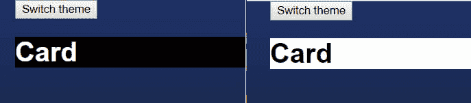
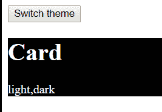

# 道具演练、反应上下文和高阶组件(HoC)

> 原文：<https://dev.to/lennythedev/prop-drilling-react-context-and-higher-order-component-hoc-40m9>

对 React Context 感到好奇，使用 HoC 来概括上下文消费者，为什么您可能需要使用 contextType，或者什么是 prop-drilling？🤔

[](https://i.giphy.com/media/3NtEfcZmzePW6Ps7Gn/giphy-downsized.gif)

如果是，酷！继续读下去，因为这可能是帮助你开始了解上下文的指南。

# 简介:为什么需要 React 上下文？

[](https://res.cloudinary.com/practicaldev/image/fetch/s--AJJMWQNa--/c_limit%2Cf_auto%2Cfl_progressive%2Cq_auto%2Cw_880/https://thepracticaldev.s3.amazonaws.com/i/fupirzu2t7zqttlpcdkb.png)

假设您有一个从当前主题`App`中获取样式的`Card`组件，那么您最终会将主题从`App`传递到`Card`，不必要地涉及到中间的所有组件。

> App -主题- >
> 容器-主题- >
> 章节-主题- >
> 主题卡片-主题- >
> 卡片

在代码中，它可能是这样的:

```
// Card.jsx

import React from 'react';
import styles from './styles';

const Card = (props) => (
    <div style={styles[props.theme]}>
        <h1>Card</h1>
    </div> )

export default Card;

// App.jsx

import React from 'react';

const ThemedCard = (props) => <Card theme={props.theme} /> const Section = (props) => <ThemedCard theme={props.theme} /> const Container = (props) => <Section theme={props.theme} /> 
class App extends React.Component {
    state = {
        theme: 'dark',
    }

    switchTheme = () => {
        const newTheme = this.state.theme === "dark" ? "default" : "dark";
        this.setState({
            theme: newTheme
        });
    };

    render() {
        return (
            <div>
                <button onClick={this.switchTheme}>Switch theme</button>
                <Container theme={this.state.theme} />
            </div>
        );
    }
}
export default App; 
```

第一部分的代码在这里:[https://codesandbox.io/s/94p2p2nwop](https://codesandbox.io/s/94p2p2nwop)

这被称为 **prop-drilling** ，如果在数据源和用户之间有更多的组件层，情况会变得更糟。一个非常好的选择是使用**上下文**。

### 创建上下文

首先是使用`React.createContext`创建一个上下文。

```
// ThemeContext.jsx
import React from "react";
const ThemeContext = React.createContext();
export default ThemeContext; 
```

### 上下文提供者:`<ThemeContext.Provider>`

现在我们可以用**上下文提供者**包装所有的上下文用户，并传递我们想要‘广播’的`value`。

我们传递的值后来成为实际的上下文，所以您可以决定在这里放一个值或整个对象。

> 注意:我们选择做`value={this.state}`，所以我们稍后访问`context.theme`。如果我们做`value={this.state.theme}`，我们通过`context`
> 访问它

```
// App.jsx

...
import ThemeContext from "./ThemeContext";
    ...
    return (
        <div>
                <button onClick={this.switchTheme}>Switch theme</button>
                <ThemeContext.Provider value={this.state}>
                    <Container />
                </ThemeContext.Provider>
        </div>
    );
    ... 
```

那么我们如何从它的后代`Card`访问`theme`？

### 语境消费者:`<ThemeContext.Consumer>`

为了访问上下文，我们使用来自任何`Card`祖先的**上下文消费者** `<ThemeContext.Consumer>`。
这里我们选择`ThemedCard`,所以我们保持`Card`的表象，没有任何上下文的东西。

消费者提供对上下文的访问，并向下传播它。
需要注意的是，它需要一个*子函数*，该子函数将上下文值作为一个属性，并返回使用上下文值的 React 节点。

这也被称为*渲染属性*模式。更多关于[渲染道具在这里](https://reactjs.org/docs/render-props.html)。

```
<SomeContext.Consumer>
  {(context_value) =>  (<div> ...do something with context_value </div>)  } </SomeContext.Consumer> 
```

在我们的例子中，我们从上下文对象中获取`theme`来呈现`<Card>`。
我们使用`({theme})`来解构主题，但你也可以做`(context) => ...context.theme`，和/或添加东西到我们的应用状态，并通过`({theme, name})`在这里访问它们，我们稍后会做。

请注意，我们不再需要将`theme`属性传递给容器，也不再需要来自 Section 的`theme`属性，因为我们可以使用消费者直接“点击”上下文。

```
// App.jsx
...
const ThemedCard = () => (
  <ThemeContext.Consumer>
    {({theme}) => <Card theme={theme} />}
  </ThemeContext.Consumer> )
...
const Section = () => <ThemedCard />
const Container = () => <Section /> 
```

最后，我们可以使用卡片中的主题来设计它。

```
// Card.jsx
...
const Card = props => (
    <div style={styles[props.theme]}>
        <h1>Card</h1>
    </div> )
... 
```

第二部分代码如下:[https://codesandbox.io/s/5wrzoqp7ok](https://codesandbox.io/s/5wrzoqp7ok)

现在我们的上下文提供者和消费者工作得很好！
我们有保存状态的根组件`<App />`，通过*提供者*传播状态，还有使用*消费者*访问上下文并使用它来样式化`<Card />`的表示组件`<ThemedCard />`。

# 使用高阶组件(HoC)来概括上下文容器

拥有一个`ThemedCard`对于主题化`Card`来说很好，但是如果我们想要主题化其他的东西，比如头像、按钮或者文本呢？这是否意味着我们必须为每一个都创建`Themed...`？

我们可以，但是有一个更好的方法来一般化*主题容器*，这样我们就可以将它用于任何我们想要使用主题上下文的组件。

## 同 Theme HoC

> React 中的一个 **HoC** 是一个接受一个组件并返回另一个组件的函数。

我们没有创建`ThemedWhatever`，而是创建了一个`withTheme` HoC，它返回一个通用组件`ThemedComponent`，该组件包装了**任何我们想要用**上下文消费者**进行主题化的**组件。所以不管那个组件是什么:卡片、头像、按钮、文本，无论什么，它都可以访问我们的上下文！😃

```
// withTheme.js

import React from "react";

import ThemeContext from "./ThemeContext";

const withTheme = Component => {
  class ThemedComponent extends React.Component {
    render() {
      return (
        <ThemeContext.Consumer>
          {({theme}) => <Component theme={theme} />}
        </ThemeContext.Consumer>
      );
    }
  }

  return ThemedComponent;
};

export default withTheme; 
```

请注意，消费者部分与前面的相似，我们添加的唯一内容是包装它的`ThemedComponent`。

但是，我们如何使用这个特设的卡？

## 使用特设

我们可以扔了它！因为我们不再需要它了！:是:
段现在可以直接渲染卡牌

```
// App.jsx
...
// remove/comment out const ThemedCard = () => ()

const Section = () => <Card />;
const Container = () => <Section />;
... 
```

要使用 HoC，我们只需要调用 HoC 函数`withTheme`。
我们的组件没有其他变化，它仍然是表示性的。我们只是用没有主题的上下文来“包装”它。

`export default withTheme(Card)`

这里是`Card` :
的新版本

```
// Card.jsx
import React from 'react';

import withTheme from "./withTheme";
import styles from './styles';

const Card = (props) => (
    <div style={styles[props.theme]}>
        <h1>Card</h1>
    </div> )

export default withTheme(Card); 
```

第三部分代码如下:[https://codesandbox.io/s/9l82k7y2w](https://codesandbox.io/s/9l82k7y2w)

不错！现在我们有一个特设的主题组件。我们也可以很容易地拥有一个可以访问上下文的
`Avatar`或`Button`组件。

例如:

```
const Avatar = props => (
    <div style={styles[props.theme]}>
        ...  all avatar stuff
)
export default withTheme(Avatar); 
```

# [使用`contextType`访问`this.context`](#access-raw-thiscontext-endraw-using-raw-contexttype-endraw-)

这里有一个关于特设组件灵活性的小提示。
如果出于某种原因，您希望在`ThemedComponent`中包含生命周期方法，该怎么办？

```
// withTheme.js
...
  class ThemedComponent extends React.Component {
    componentDidMount() {
        // NO ACCESS TO context here 😱
        console.log(`current theme: ${ this.context.theme }`);
        // -> ERROR: this.context is undefined ❌
    }

    render() {...}
    ... 
```

React 16.6 引入了`contextType`，允许你访问`this.context`来:

*   访问生命周期方法中的上下文
*   使用上下文而不使用*渲染属性*模式

怎么会？只需在类中声明一个静态变量，并将其赋给上下文对象。

```
// withTheme.js
...
class ThemedComponent extends React.Component {
    static contextType = ThemeContext;

    componentDidMount() {
      console.log(`current theme: ${ this.context.theme }`);
      // -> current theme: dark ✅
    }
    ... 
```

我们现在还可以将我们的消费者改成更简单、更熟悉的语法。
而不是`<ThemeContext.Consumer>{theme => <Component theme={theme}>}</ThemedContext.Consumer>`，我们可以这样做:

```
// withTheme.js
...
    render() {
      return (
        <Component theme={this.context.theme} />
      );
    } 
```

第四部分代码:[https://codesandbox.io/s/9l82k7y2w](https://codesandbox.io/s/9l82k7y2w)

这还差不多。简单且不易混淆的括号。唯一需要注意的是，你只能订阅一个上下文。更多关于[多重语境在此](https://reactjs.org/docs/context.html#consuming-multiple-contexts)

# 向上下文添加内容

如前所述，只要您在使用者中相应地访问数据，您就可以通过提供者以任何方式构造您在上下文中公开的数据。

假设您在提供者的上下文中添加了`themes`...

**提供商**

```
// App.jsx

class App extends React.Component {
    state = {
        theme: 'dark',
        themes: ['light', 'dark'],
    }
    ... 
```

在消费者中，您可以传递整个`this.context`而不是
，您可以将上下文作为`themeData`属性传递给`<Card />`，并从 Card 中访问其属性。

**消费者**

```
// withTheme.js
...
    render() {
      return (
        <Component themeData={this.context} />
      );
    }
...

// Card.jsx
...
const Card = ({themeData}) => (
    <div style={styles[themeData.theme]}>
        <h1>Cards</h1>
        <p>{themeData.themes.toString()}</p>
    </div> )
... 
```

[](https://res.cloudinary.com/practicaldev/image/fetch/s--LwNGvLpM--/c_limit%2Cf_auto%2Cfl_progressive%2Cq_auto%2Cw_880/https://thepracticaldev.s3.amazonaws.com/i/w2rjfhptvf9ui18710z3.png)

第五部分代码如下:[https://codesandbox.io/s/l2z1wxm8lq](https://codesandbox.io/s/l2z1wxm8lq)

仅此而已！我希望这有助于阐明为什么你需要上下文以及实现它的不同方式。欢迎发表任何问题、评论或建议。

> 如果你想通过构建一个迷你 Spotify 来学习 React，并且你喜欢跟随幻灯片，请查看[我的 React workshop repo](https://github.com/lenmorld/react_workshop)

快乐语境🤓！