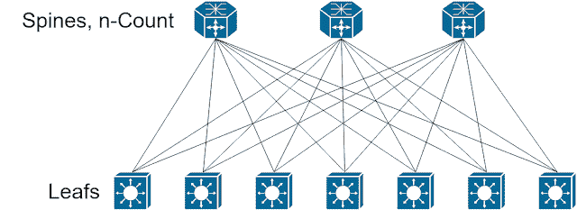

# 脊柱和叶网络，介绍

> 原文：<https://dev.to/ngschmidt/spine-and-leaf-networks-an-introduction-ibc>

## 网络工程师将面临的两个最大问题是**变化**和**环路。**

在我们的思科考试中，绝大多数教育内容都是关于防止环路的方法，这是有充分理由的。不幸的是，我们用来防止循环的方法非常复杂——如果我们部分理解了这些概念，风险就会转移到**变化**上，我们会因为数据中心的各种原因修改循环防止机制:

*   添加新服务器
*   添加新网络以适应工作负载
*   添加新硬件以适应新服务器和工作负载的增加
*   添加新的互连，因为以前的操作非常成功，现在需要新的站点

我敢肯定，许多人说，“让它成为第三层！”好像这是某种简单的修复方法，可以神奇地解决远程数据中心的可靠性问题。现实情况是，不当的第 3 层网络可能与第 2 层网络一样不稳定，甚至更不稳定。更糟糕的是，您可能无法满足工作负载需求，导致业务失败。

首先，让我们了解一下网络设计师所说的第 2 层或第 3 层是什么意思，因为它违反了 OSI 模型。简而言之，它指的是端口配置以及第 2 层环路预防机制是否起作用。

### 第二层

第 2 层网络供应可能是最容易配置的，也是最不可扩展的。大多数典型的系统管理员自己部署一个可行的小规模第 2 层网络不会有任何问题，并且可能有这样做的经验。

第 2 层网络配置涉及 VLAN 的创建，这反过来又会实例化某种类型的环路防止过程，例如:

*   每 VLAN 生成树(PVST)
*   每 VLAN 快速生成树(PVRST)
*   多生成树(MST)[https://en . Wikipedia . org/wiki/Multiple _ Spanning _ Tree _ Protocol](https://en.wikipedia.org/wiki/Multiple_Spanning_Tree_Protocol)
*   fabric path[https://www . Cisco . com/c/en/us/solutions/data-center-virtual ization/fabric path/index . html](https://www.cisco.com/c/en/us/solutions/data-center-virtualization/fabricpath/index.html)
*   TRILL[https://en . Wikipedia . org/wiki/TRILL _(计算)](https://en.wikipedia.org/wiki/TRILL_(computing))

奇怪的是，TRILL 实际上可以被配置为符合 Spine 和 Leaf 规范。我不会在这里讨论这个问题——稍后我会解释原因。

### 第三层

第 3 层网络供应的灵活性要差得多，但也更加稳定和可扩展。在这种情况下，第 2 层环路预防可能会发挥作用，例如 SVIs，但不是环路预防的主要或强制来源。取而代之的是路由协议和潜在的重新分发，每一种都有其自身的危险:

*   RIP 和 Split horizon[https://en . Wikipedia . org/wiki/Split _ horizon _ route _ advertision](https://en.wikipedia.org/wiki/Split_horizon_route_advertisement)
*   OSPF、EIGRP 和重新分配问题(整本书，但也有[https://www . Cisco . com/c/en/us/support/docs/IP/enhanced-interior-gateway-routing-protocol-EIGRP/8606-redist . html](https://www.cisco.com/c/en/us/support/docs/ip/enhanced-interior-gateway-routing-protocol-eigrp/8606-redist.html))
*   eBGP 和 AS-Path 问题[https://www . juniper . net/documentation/en _ US/Junos/topics/usage-guidelines/policy-prepending-AS-numbers-to-BGP-AS-paths . html](https://www.juniper.net/documentation/en_US/junos/topics/usage-guidelines/policy-prepending-as-numbers-to-bgp-as-paths.html)
*   iBGP 和一切

同样，这只是为了防止循环。大多数网络设计在防止上述方式的环路方面做得很好，但代价是通过将网络与特定设备紧密耦合来增加变化的风险。我们知道，紧耦合对于高变化频率是一个很大的负面影响。

### 目标

要设计一个高度可靠、高度可变和高度可维护的网络，网络设计人员必须满足以下目标:

1.  可靠且自动地防止环路
2.  允许频繁地、最好是自动地添加和删除新网络
3.  易于维护、修理和故障排除
4.  **执行上述所有操作，但对最少数量的设备进行最少数量的更改**

### 输入书脊和树叶

Clos 网络是由 Charles Clos 在 20 世纪 50 年代提出的(详情[此处](https://en.wikipedia.org/wiki/Clos_network) ), Clos 网络是**无阻塞多级电路**的数学模型。这是一个很大的难题:

*   **无阻塞:**几乎所有的第 2 层环路防止机制都会通过拒绝在二级或 n 级路径上转发来防止环路。电信公司真的不喜欢这样，因为这样会减少一半的可用带宽(从而减少一半的收入)。无阻塞表示所有可用端口都能够以所有可用速度转发。
*   **多级:**几乎每个数据中心网络都有 6 个以上的网络端口。因此，我们需要超越单个集成电路或网络设备的能力。

今天，我们比 20 世纪 50 年代拥有更多的技术进步。大多数数据中心网络交换机利用 Clos 拓扑来降低制造成本，提高可靠性，方法是在交换机上提供比单个 ASIC 更多的端口，而单个 ASIC 可以通过将 4、6 或 8 端口 ASIC 聚合到一个交叉开关上来提供端口。

这就引出了一个问题，为什么不是第 1 层呢？既然交换机本身是 Clos，为什么不干脆买个大交换机收工呢？这里有一些好处:

*   只需管理一个 IP，让变更变得更容易
*   第 1 层拓扑非常可靠，中断-修复操作通常只是重新放置一些东西
*   不需要第 2/3 层环路防护

但是当我们仔细想想，它的缺点是相当大的:

*   除非你使用 VSS、VCS 等技术，否则你没有冗余
*   第一次尝试时，您必须始终完美地评估数据中心的正确端口数，这导致了**大量的浪费**
*   这完全违反了规则 4，因为你要么改变整个网络，要么根本不改变。

第 2 层叶型主干或多或少会遇到相同的问题，但不需要始终保持端口计数完全正确。

第 3 层主干(L3LS)仅利用网络设备之间的**第 3 层环路预防机制，同时在三级拓扑中构建无阻塞 Clos 模式:**

很奇怪，不是吗？刺之间的连接在哪里，或者在叶子后面？

使用 Clos 网络时，交叉/主干不应相互连接——这违反了规则#4，并导致电路阻塞。

现在，这显然完全消除了所有的 IP 可移植性，并迫使在结构上运行的工作负载至少在某种程度上参与路由，因为叶子不会直接意识到彼此，但具有一定的可靠性增益:

*   想象一下，如果您可以在交换机内部进行 ASIC 级别的故障排除
*   现在想象一下，如果你作为一个网络工程师，可以做到这一点，而不必学习如何做 ASIC 级别的故障排除。相反，你熟悉的路由协议是你进入结构的接口
*   现在想象一下，所有故障域都局限于您正在使用的单个 ASIC，不会对交换机产生更大的影响

很大的优势，对吧？

因此，由于我在这里提到的原因，这里我们需要有一点分歧。部署主干网和叶网的方法有很多，几乎所有的方法都非常可靠。有些甚至被用作生产网络！

撇开幽默不谈——可用性问题是个大问题。我的建议和这一系列博客文章的顺序是选择最适合您的组织需求的平台、协议和管理方法，因为它们都可以工作。**扯平。**

在我们继续之前，我想介绍一下我在讨论 L3LS 在数据中心的使用时看到的一些相当严重的问题。我为我的长篇大论道歉，但是这里有很多内容要讲。下面列出的陈述是我见过的扼杀这一技术原则的误解。

*   L3LS 很贵:这是完全错误的。获得路由许可的第 1 代 Catalyst 3560s 可以运行它。你所需要的是第三层交换。虽然在某些情况下这很贵，但产品选择还是有所帮助的。与较新的 10/25g 交换机选项相比，即使是较旧的仅支持第 2 层的数据中心交换机，成本也相当高。如果您的部门能够负担得起新的、未使用的 10 千兆位交换机，L3LS 可能不会花费更多，如果有的话。
*   L3LS 是一种产品:虽然一些产品，如 [Big Switch](https://www.bigswitch.com/products/big-cloud-fabric) 、 [Cisco ACI](https://www.cisco.com/c/en/us/solutions/data-center-virtualization/application-centric-infrastructure/index.html) 或 [Juniper 的 QFabric](https://www.juniper.net/documentation/en_US/junos/topics/concept/qfabric-overview.html) 提供了一个预先制作的、自我配置的网络解决方案，大致符合这些设计原则，但如果一个现成的解决方案能满足您的需求，构建您自己的解决方案并不特别困难。
*   L3LS 很难:我们将在后面的文章中讨论这个问题，但是设计起来有点困难，但是易于维护和扩展。
*   L3LS 不得不用。几乎任何事情都会发生。

解决了这个问题，让我们来看看下一个有趣的问题——运行以 RIPv2/3 作为指定路由协议的 L3LS。在所有情况下，目标都是提供一个双栈网络——IPv6 在 7 年前就已经最终实现了。对于这些示例，我将使用 CSR1000v 和虚拟 NX-OS 映像，但是您选择的路由平台也可以工作得很好。我的观点是，你知道你的平台，并且应该能够规划出来。这不是堆栈溢出:)