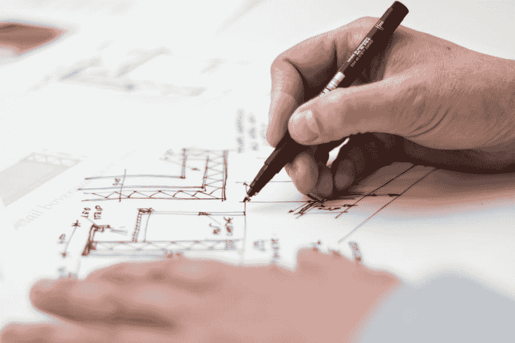

# 承认你的问题

> 原文：<https://dev.to/nickwu007/own-your-problems-535l>

最初发布于[我的个人网站](https://nickwu007.github.io/non_technical/life/2019/04/21/own-your-problems/)。

之前我们已经在这个博客中讨论过[冒名顶替综合症](https://nickwu007.github.io/life/non_technical/2017/10/22/impostor-syndrome-thoughts-and-tips/)，今天我想谈谈克服它的一个具体方法:拥有你的问题。

### 这是怎么来的？

我必须承认这个想法不是原创的。几周前，我和我的经理进行了一次谈话，内容是关于我如何在团队中成为一名更有效率的工程师。这是他提出的建议之一:

> 你应该审视你自己正在解决的问题。与其他人合作，但要成为解决问题的驱动力。

这让我开始思考我在最近几个项目中的工作风格。作为一名初级工程师和团队中的最新成员，我经常听从其他工程师的意见，无论是在设计还是实现方面。虽然这有助于我们及时交付项目，但我并不觉得我实际上是在“解决”问题本身，而只是巩固其他工程师的想法。更糟糕的是，我注意到我已经养成了一个可怕的习惯:当我遇到一个乍看不明显的问题时，我的本能是去问别人。换句话说，我没有**拥有**我应该解决的问题，而是**把**其他人拖进了我的问题。

但我为什么要这么做？我仔细思考这种情况何时会发生，我意识到我害怕承认这个问题。我可能根本想不出解决方案，或者更糟，我可能想出完全错误的东西，把事情搞砸。因此，向更了解的人寻求帮助更安全。尽管这种逻辑在技术上并没有错，但它只是在短期内解决了眼前的问题，而且我不会成长为独立的人，在未来承担其他问题。

一旦我意识到我的工作方式需要改变，我就有意识地确保我问得少一些，并尝试对我正在解决的任何问题做更多的研究。仅过了大约一周，效果就出人意料地迅速显现出来。尽管解决单个问题的时间稍长，但我实际上能够解决几乎所有出现在我面前的问题，而无需一直询问其他工程师。从团队的角度来看，生产力提高了，因为团队中的其他人都没有花时间来回答我。

我发现的另一个好处是，这实际上不仅仅是工作。几周前，当我在寻找公寓时，我意识到我不需要就每一套公寓咨询我的朋友和家人，而我那时一直在这么做。我列出了我所寻找的标准，并做出了自己的决定。要点是这适用于你所面临的任何问题，无论是在工作中，还是在生活中，等等。

### 那么，你能做什么呢？

希望我的故事鼓励你主动承认自己的问题。下面我列出了一些建议，我认为会帮助你开始。

#### 从思想转变开始

要做出任何切实的改变，你必须首先改变你的思维方式。我完全理解你独自承担一个问题的所有顾虑。事实上，这些是我自己经历过的精神障碍:

##### 不知道怎么解决怎么办？

现在，我确实相信我有能力解决我遇到的大多数问题，至少在工作中。如果你真的扩展你的思维，你会比你意识到的更聪明。对自己有信心。

##### 我搞砸了怎么办？

即使你得到一个错误的答案，你也不会“搞砸”。事情没有你想的那么糟。相反，如果你自己做对了，那你承担更多的问题将会是一个巨大的自信提升。

问问你自己到底是什么阻止了你拥有这个问题。一旦你把它大声说出来，分析它的有效性就更容易了。最有可能的是你过度担心，如果你是这个领域或问题空间的新手，这是很正常的。

#### 制定一个处理不熟悉事物的流程

当你面对一个涉及很多不熟悉的地方的问题时，你会感到迷惑和困惑。根据我自己的经验，处理这个问题的诀窍是制定一个“流程”来完成。

以一个技术问题为例。一开始理解问题对我来说至关重要。首先，我会做一些研究来了解背景，并明确问题到底是什么，以及系统的哪些部分与之相关。一旦我确定了大致的范围，我会更深入地研究每个部分，通常是通过阅读文档和代码。在这一点上，我会知道零件目前是如何工作的，以及解决问题到底需要什么。有了这种心理上的“差异”,事情就简单多了。

当我理解问题时，我可以考虑改变系统来解决它。通常情况下，解决一个问题有很多种方法，各有利弊。列出这些并进行比较将是一个很好的方法来看看是否有一个最佳的解决方案。很多时候必须做出权衡，现在你可能需要咨询其他人。有了背景、问题定义、所有方法的优缺点，对于其他工程师来说，这是快速跟进所有事情并提供建议的好方法。

#### 不要做独狼

在鼓励你承认这个问题之后，我想指出的是不要对此过于极端。有些问题你需要帮助，这也是过程的一部分。在某些时候，你可能会意识到你缺少一些重要的信息，而且你不容易找到它。那还不如去问个人，而不是读几千行代码来得出自己的真知灼见。必须要有一个平衡，但我的观点是至少要考虑自己解决。

### 最后几个字

我希望你在读完这篇文章后，开始对自己的问题负责。我自己也在寻找一个好的平衡，很想知道你对此的感受。在 [Twitter](https://twitter.com/WujunaoNick) 上告诉我，或者直接给我发邮件！