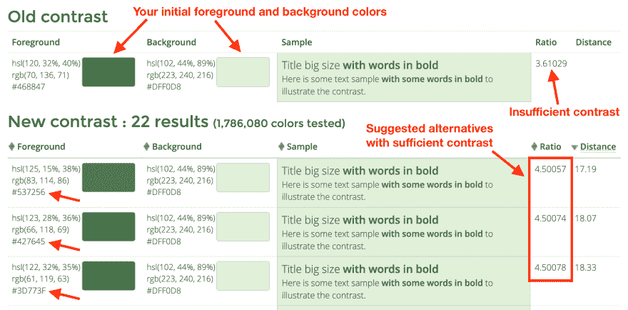

# 每周网络平台新闻#4

> 原文：<https://dev.to/simevidas/weekly-web-platform-news-4-3j9l>

*这是 3 月 13 日至 3 月 27 日发表在 [https://webplatform.news](https://webplatform.news) 上的新闻精选。*

* * *

[阿克塞尔·劳施迈尔](https://mobile.twitter.com/rauschma/status/1110175435466391554):你可以在`for` - `of`循环中通过迭代数组的*条目*来访问<mark>当前索引(通过标准的 [`entries`方法](https://developer.mozilla.org/docs/Web/JavaScript/Reference/Global_Objects/Array/entries))。</mark> 

```
// Before:
for (const elem of arr) {
  // ...
}

// After:
for (const [i, elem] of arr.entries()) {
  // ...
} 
```

Enter fullscreen mode Exit fullscreen mode

* * *

[理查德·鲁特](https://mobile.twitter.com/clagnut/status/1109002567340707840):通过 CSS `hyphens: auto`声明的自动断字得到了广泛的支持(除了 Windows 上的 Chrome)，但是只有 Safari 和 Edge 提供了额外的属性用于<mark>调整断字</mark>。

```
p {
  /* Set the minimum number of characters before/after the hyphen */
  -webkit-hyphenate-limit-before: 3;
  -webkit-hyphenate-limit-after: 3;
  -ms-hyphenate-limit-chars: auto 3;
} 
```

Enter fullscreen mode Exit fullscreen mode

**注意:**以前 Web Platform News 上启用了自动断字，但我取消了它，因为 Chrome 和 Firefox 有时会在两个字符后用断字连接单词，我认为这使文本更难阅读。

* * *

[尤利娅·斯塔策夫](https://mobile.twitter.com/mozhacks/status/1107660133281206272) : TC39 的新网站( [tc39.github.io](https://tc39.github.io/) )突出了(目前)九个 <mark>JavaScript 提案</mark>，这些提案接近完成(第三阶段)，需要实现者和用户的反馈。

* * *

[布莱恩·比特莱斯](https://discourse.wicg.io/t/what-s-the-standard-way-to-render-an-element-s-outline-above-its-siblings-in-css/3436?u=simevidas):有许多不同的 CSS 属性和值会创建一个<mark>新的堆栈上下文</mark>，但是`isolation: isolate`声明仅仅是为了这个目的。

> 对于 CSS，将`isolation`设置为`isolate`会将元素转换为堆栈上下文。

**注意:**IE 和 Edge 不支持该功能。

* * *

[斯蒂芬尼·沃尔特](https://mobile.twitter.com/WalterStephanie/status/1102935881487388672):如果您选择的前景和背景颜色没有足够的<mark>对比度</mark>，您可以使用 Tanaguru Contrast-Finder 在线工具来寻找符合 WCAG 对比度要求的备选前景或背景颜色([成功标准 1.4.3](https://w3c.github.io/wcag/21/guidelines/#contrast-minimum) )。

[](https://res.cloudinary.com/practicaldev/image/fetch/s--kbVhhEgN--/c_limit%2Cf_auto%2Cfl_progressive%2Cq_auto%2Cw_880/https://thepracticaldev.s3.amazonaws.com/i/a970sqkzcdm9k3753b98.png)

**注意:**我建议使用 light house(Chrome DevTools 中的*审计*面板)来查找页面上对比度不足的文本。

* * *

*访问 [https://webplatform.news](https://webplatform.news) 获取最新的 web 开发新闻。*