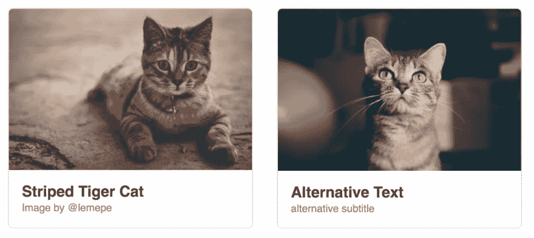
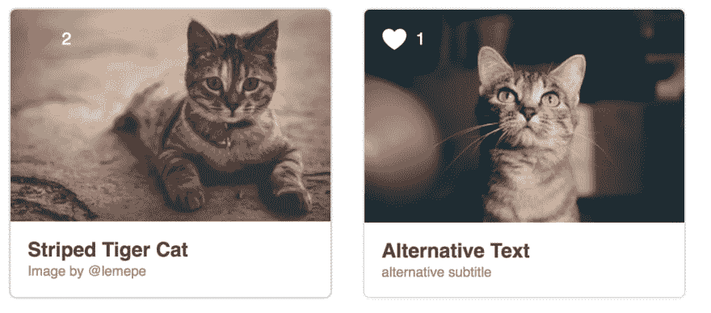

# Vue.js 组件简介

> 原文：<https://dev.to/fdietz/introduction-to-components-with-vue-js-2p6n>

在本文中，我将向您介绍 Vue.js 组件模型，并展示组件重用和
封装的好处。

如果你还不了解 Vue.js，我可以强烈推荐官方的 [Vue.js 指南](https://vuejs.org/v2/guide/index.html)。

但是，请不要害怕和我一起深入这篇文章。我将向您介绍相关的官方文档，为您提供更多的背景知识，并让您有机会阅读更多的背景资料。

我们将从一个简单的示例组件开始，逐步改进它的功能。

<figure>

<figcaption>Example 1 - Who doesn't like cats?</figcaption>

</figure>

这个卡片组件的 HTML 由一个大的图像区域和一些文本组成:

```
<div id="demo">
  <div class="image-card">
    
    <div class="image-card__body">
      <h3 class="image-card__title">Striped Tiger Cat</h3>
      <div class="image-card__author">Image by @lemepe</div>
    </div>
  </div>
</div> 
```

我们使用带有`demo` id 的根 HTML 元素作为我们的元素来启动 Vue:

```
new Vue({ el: '#demo' }) 
```

我们取得了什么成就？我们用 Vue.js 渲染了这张图像卡。但是我们不能真正重用这些代码，我们也不想复制粘贴，从而复制代码。

解决我们问题的方法是把它变成一个组件。

## 组件可以重复使用

所以，让我们将图像卡从剩余的 Vue.js 应用程序中分离出来。

首先，我们引入一个包含所有图像卡内容的模板元素:

```
<template id="template-image-card">
  <div class="image-card">
    
    <div class="image-card__body">
      <h3>Striped Tiger Cat</h3>
      <div class="image-card__author">Image by @lemepe</div>
    </div>
  </div>
</template> 
```

我们用`Vue.component`定义组件，并引用我们的模板 id `template-image-card` :

```
Vue.component('image-card', {
  template: "#template-image-card"
}) 
```

这又被包装在一个 HTML 根元素中:

```
<div id="demo">
  <image-card></image-card>
  <image-card></image-card>
</div> 
```

然后实例化:

```
new Vue({ el: '#demo' }) 
```

瞧啊。我们有两只猫:-)

[](https://res.cloudinary.com/practicaldev/image/fetch/s--MVLRnh0K--/c_limit%2Cf_auto%2Cfl_progressive%2Cq_auto%2Cw_880/https://thepracticaldev.s3.amazonaws.com/i/tuyn69ffj8jjsrzvxpyb.png) 

<figure>

<figcaption>例 2——两只猫！</figcaption>

</figure>

现在，两只猫显然比一只猫好，我们展示了我们可以在同一个页面上有几个`image-card`组件的实例。

我们现在有办法在我们的应用程序中重用这个组件。如果你想一想，它实际上是相当了不起的，这包括我们的 HTML，CSS 和 Javascript 代码都包装在一个组件中。

但是，这个组件并不是很有用，不是吗？它就是不够灵活！如果我们可以改变每个组件的图片和文本，那就太棒了。

## 将数据作为道具传递给子组件

为了定制组件的行为，我们将使用道具。

让我们从如何使用我们的组件开始:

```
<div id="demo">
  <image-card image-src="cat1.jpg" heading="Striped Tiger Cat" text="Image by @lemepe"></image-card>
  <image-card image-src="cat2.jpg" heading="Alternative Text" text="alternative subtitle"></image-card>
</div> 
```

我们引入三个新道具`image-src`、`heading`和`text`。当使用组件时，这些将作为 HTML 属性传递。

接下来是组件的`prop`定义:

```
Vue.component('image-card', {
  template: "#template-image-card",
  props: {
    heading: String,
    text: String,
    imageSrc: String
  }
}); 
```

请注意，属性`imageSrc`是如何在 camelCase 中编写的，而 HTML 属性使用了破折号`image-src`。你可以在官方 [Vue.js 指南](https://vuejs.org/v2/guide/components-props.html)中阅读更多关于`props`的内容。

并且附带的模板再次在 camelCase 格式中使用了这个道具:

```
<template id="template-image-card">
  <div class="image-card">
    
    <div class="image-card__body">
      <h3>{{heading}}</h3>
      <div class="image-card__author">{{text}}</div>
    </div>
  </div>
</template> 
```

让我们来看看结果:

[](https://res.cloudinary.com/practicaldev/image/fetch/s--Tzu2HPKW--/c_limit%2Cf_auto%2Cfl_progressive%2Cq_auto%2Cw_880/https://thepracticaldev.s3.amazonaws.com/i/0zx6abbeqhdp8baaij1s.png) 

<figure>

<figcaption>例 3——带道具的形象牌</figcaption>

</figure>

成功了！我们使用了两个带有不同属性的`image-card`组件实例。

我们可以使用道具作为输入来不同地呈现一个组件，这不是很好吗？

### 组件有状态

在我的日常工作中，产品经理很可能会注意到`image-card`本身和猫之类的东西在一起看起来很不错。但是，它还没有真正吸引人。我们让用户喜欢我们的猫，然后统计哪只猫有最多的喜欢，怎么样？

组件可以使用`data`属性拥有状态:

```
 Vue.component('image-card', {
    template: "#template-image-card",
    props: {
      heading: String,
      text: String,
      imageSrc: String
    },
    data: function () {
      return {
        count: 0
      }
    }
  }); 
```

注意，`data`返回的是一个函数，而不仅仅是一个 Javascript 对象`data: { count: 0 }`。
这是必需的，以便每个组件实例可以维护返回数据的独立副本。
在 [Vue.js 指南](https://vuejs.org/v2/guide/components.html#data-Must-Be-a-Function)中了解更多相关信息。

我们的模板使用这个计数:

```
<template id="template-image-card">
  <div class="image-card">
      
    <div class="image-card__body">
        <h3 class="image-card__heading">{{heading}}</h3>
      <div class="image-card__author">{{text}}</div>
      <button class="image-card__heart" @click="count++">
        
          <path d="M16,28.261c0,0-14-7.926-14-17.046c0-9.356,13.159-10.399,14-0.454c1.011-9.938,14-8.903,14,0.454 C30,20.335,16,28.261,16,28.261z"/>            
        
      </button>
      <div class="image-card__count" v-if="count > 0">{{count}}</div>
    </div>
  </div>
</template> 
```

[](https://res.cloudinary.com/practicaldev/image/fetch/s--2OHyUIqb--/c_limit%2Cf_auto%2Cfl_progressive%2Cq_auto%2Cw_880/https://thepracticaldev.s3.amazonaws.com/i/5tco9pbu7t77yhfjfbei.png) 

<figure>

<figcaption>例 4 -图像卡带状态</figcaption>

</figure>

我们使用一个 SVG 元素来呈现一个小心形，在发生`click`事件时，我们将计数加 1。当前`count`值的心脏旁边会显示一个小计数。

如果您对使用 SVG 更感兴趣，请看一下 [Vue.js Cookbook](https://vuejs.org/v2/cookbook/editable-svg-icons.html) 了解更多信息。

注意，每个组件实例都有自己的本地状态`count`，可以独立于其他组件的`count`进行更改。

而在前一个例子中，我们只封装了 HTML 代码，并通过 props 使其更加灵活。我们现在还封装了一些业务逻辑来保持计数。

鉴于`props`是组件的输入参数，状态是组件内部的东西，对组件代码的用户是隐藏的。我们可以把变量的名字从`count`改成`clickCount`，我们组件的用户甚至不需要知道。这太棒了，因为我们可以在不破坏用户代码的情况下不断改进我们的组件。

## 用事件给家长发消息

既然我们知道了如何将数据传递给孩子，以及如何封装状态。还缺少一点:我们如何从一个孩子那里获取数据？

在 Vue.js 中，我们可以从组件向监听特定事件的父组件发出自定义事件。此事件还可以传递数据。

在我们的例子中，我们可以使用`$emit`向父节点
发送一个名为`change`的事件

```
Vue.component('image-card', {
  template: "#template-image-card",
  props: {
    heading: String,
    text: String,
    imageSrc: String
  },
  data: function () {
    return {
      count: 0
    }
  },
  methods: {
    handleClick() {
      this.count++;
      // leanpub-start-insert
      this.$emit("change", this.count);
      // leanpub-end-insert
    }
  }
}); 
```

我们定义了方法`handleClick`，它不仅增加了我们的`count`状态，还额外使用了`$emit`向我们的父节点发送消息。`handleClick`是我们心中的`click`事件:

```
<template id="template-image-card">
  <div class="image-card">
    
    <div class="image-card__body">
        <h3 class="image-card__heading">{{heading}}</h3>
      <div class="image-card__author">{{text}}</div>
      <button class="image-card__heart" @click="handleClick">
        
          <path d="M16,28.261c0,0-14-7.926-14-17.046c0-9.356,13.159-10.399,14-0.454c1.011-9.938,14-8.903,14,0.454 C30,20.335,16,28.261,16,28.261z"/>            
        
      </button>
      <div class="image-card__count" v-if="count > 0">{{count}}</div>
    </div>
  </div>
</template> 
```

现在父模板可以用它来监听`change`事件，以增加一个`totalCount` :

```
<div id="demo">
  <image-card image-src="cat.jpg" heading="Striped Tiger Cat" text="Image by @lemepe" @change="handleChange"></image-card>
  <image-card image-src="cat.jpg" heading="Alternative Text" text="alternative subtitle" @change="handleChange"></image-card>
  <p>Total Count: {{totalCount}}</p>
</div> 
```

与 Vue.js 实例一起跟踪一个`totalCount` :

```
new Vue({
  el: '#demo',
  data: {
    totalCount: 0
  },
  methods: {
    handleChange(count) {
      console.log("count changed", count);
      this.totalCount++;
    }
  }
}); 
```

请注意，父组件不知道组件的内部结构。它只知道有一个可用的变更事件，并且消息发送组件的`count`。

通过`this.$emit("event")`发出的事件只发送给父组件。它不会像原生 DOM 事件那样冒泡组件层次结构。

## 总结

在本文中，我们探讨了组件模型的基本概念。我们讨论了组件重用和封装，如何使用 props 将数据传递给子组件，以及如何发出事件将消息传递给父组件。

如果你喜欢这篇文章，也可以看看我的新课程 [Vue.js 组件模式课程](///vue-component-patterns-course.html)。