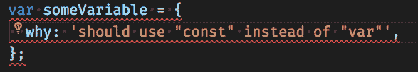

# 就我而言，欢迎我们的埃斯林霸主

> 原文：<https://dev.to/mlennox/i-for-one-welcome-our-eslint-overlords-2ckp>

功能团队通常同意旨在使每个人的生活更容易的代码标准。不幸的是，我们经常无视这些商定的规则，这对我们不利。这不仅会导致更难管理的代码，还会导致团队内部的摩擦和不和谐。

我认为亚历山大·波普说得最好

> 不要如此渴望荣耀，也不要在批判中迷失自我！善良和理智必须永远结合在一起；
> 人非圣贤，孰能无过；宽恕，神圣的。

理想情况下，我们希望将代码审查中有争议的方面交给一个客观的第三方，这个第三方知道并理解我们同意的规则。如果我们可以依靠可信的代码来评论我们编写的代码，那么我们都可以讨厌这些代码，而不是彼此讨厌。

从根本上说，使用代码来检查我们的代码更快，并且(通常)没有错误或偏见。这就是我们使用林挺工具的原因，在规则的驱动下，我们同意预定义的指标，如行长度、圈复杂度、嵌套回调以及我在[一篇关于使用 eslint](https://www.webpusher.ie/2019/02/01/eslint-complexity/) 查找最复杂文件的文章中提到的其他指标。

## 用尺子给它划线

现在已经有很多很多你应该使用的现有规则[https://eslint.org/docs/rules/#best-practices](https://eslint.org/docs/rules/#best-practices)。如果你使用 eslint，你可能已经通过使用`eslint:recommended`或`airbnb`使用了这些规则。大多数团队应该添加他们自己的规则或[使用`overrides`](https://www.webpusher.ie/2019/04/18/eslint-override) 来更改或删除他们不同意的 Airbnb/推荐规则。

第一次引入 eslint 规则时，一个好的方法是定期讨论它们的当前使用情况以及它们对您的代码标准的支持程度；参数是否调整得当(你认为的圈复杂度*应该达到什么水平？只有你的团队会知道...)，它们应该是警告还是错误，应该引入哪些新规则，哪些规则碍事，应该删除。最终，您很少会重新访问您的 eslint 配置。*

## 不要打破规则——创造你自己

很可能你会遇到标准的 eslint 规则不够用的情况。我在这里建议的是超越使用预定义规则的一小步——你可以编写你自己的 eslint 插件来 ***执行你自己的代码标准*** 。有两种主要的方法来编写自己的 eslint 规则——这两种方法我都将在抽象语法树系列的[未来文章](https://www.webpusher.ie/2019/02/06/ast-series)中介绍:

*   AST 选择器
*   编写一个`proper` eslint 规则

## 规则是作为一个团队商定并作为一个团队建立的

每个人都需要参与决定使用哪些规则，以及实现和维护现有规则的配置。愉快的、运转良好的团队建立在稳固的沟通和大量的跨职能能力之上——后者在成功运用这种方法中很重要。实际上，如果只有少数开发人员知道如何编写 eslint 规则，这将很快成为一个瓶颈，他们不会经常更新，并且他们可能很快成为一个障碍，导致他们从代码库中被删除。

此外，更重要的是，如果一小部分人负责编写林挺规则，他们将受到指责，而不是代码——无论这可能是多么不合理！

### 代码片段可以用来强制执行标准吗？

有，但是没有。

代码片段很棒，但是也有一些缺点。在我看来，主要的绊脚石是[可提供性](https://uxdesign.cc/affordance-in-user-interface-design-3b4b0b361143)；开发人员需要知道代码片段就在那里，他们需要知道如何使用代码片段。

此外，许多团队并不强制使用单一的 IDE，这使得情况更加复杂。例如，我的团队混合使用了 Webstorm、VS Code 和 Sublime。为这些编辑器中的每一个添加、维护和记录代码片段的开销对于代码片段的采用来说只是更多的摩擦。

代码标准检查应该尽可能自动化，重点是加强链条中最薄弱的环节:开发人员。依靠开发人员在编写代码时选择代码片段，或者在审查代码时注意到代码片段应该已经被使用，并不能解决代码片段应该解决的问题。

并不是说代码片段没有用——如果你喜欢就使用它们，我也喜欢，但不要指望其他开发人员也会这样做。

## 知道自己的位置

简而言之，为了让您的生活更轻松，缩短您的代码审查(一点点)，并促进团队内部的和谐和友好(嗯，可能)，让规则约束您，向 eslint 霸主屈膝！