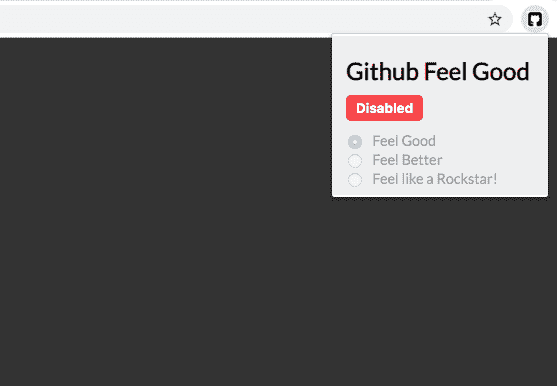
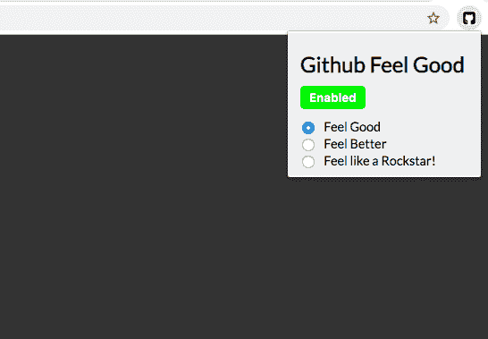
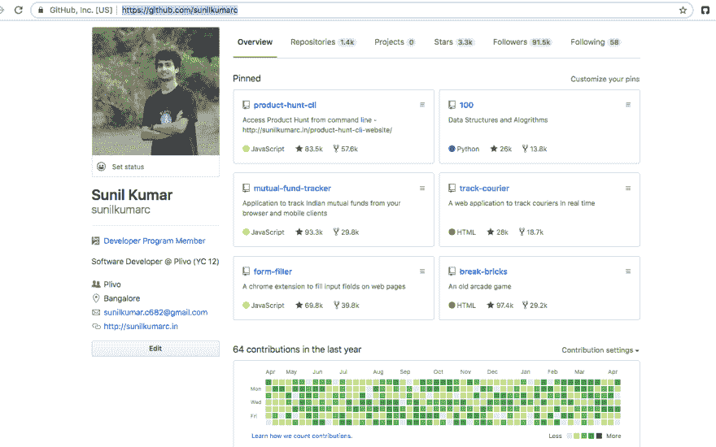

# 一个 chrome 扩展，帮助你对你的 Github 个人资料感觉良好

> 原文：<https://dev.to/sunilc_/a-chrome-extension-to-help-you-feel-good-about-your-github-profile-12i7>

Github Feel Good 是一个 chrome 扩展，帮助你对自己的 Github 个人资料感觉良好。该扩展增加了所有固定存储库、追随者、总存储库的星形和分叉的计数，并基于所选的模式增强了贡献图。

有三种可用模式:

*   感觉良好-在 100 - 1k 的范围内增加回购计数。
*   感觉更好-在 1k - 10k 范围内增加回购计数。
*   感觉像个摇滚明星！—在 10k - 100k 范围内增加回购计数。

叉子数量和追随者数量在增加的星星数量的 30 - 70%范围内增加。

有一天，我在看伟大的 Sindre Sorhus 的 github 简介，我嫉妒他在开源社区所做的伟大工作。不要忘记，星星，叉子计数和他的个人资料的贡献图。于是 Github Feel Good 扩展诞生了。

这只是一个有趣的扩展，并不打算灌输虚假的成功在一个人的脑海里。该扩展将一些 javascript 代码注入到您的浏览器中，并增加这些计数，而您实际的 Github 配置文件中没有任何变化(很明显:P)。

## 如何使用

*   安装[镀铬扩展件](https://chrome.google.com/webstore/detail/github-feel-good/boklfjlipjpjjfabepnnnnggcogponmf?hl=en-US)，点击`Disabled`按钮启用。

*   从三种可用模式中选择一种。默认情况下，选择“感觉良好”。

*   打开您的 Github 个人资料，查看更改后的号码。

*   您可以随时点击`Enabled`按钮将其禁用。

请注意，您需要登录该扩展才能工作。请随时在这里报告您发现的任何问题[。](https://github.com/sunilkumarc/github-feel-good/issues)

产品搜寻[发布](https://www.producthunt.com/posts/github-feel-good)。

如果你喜欢延期，请通过捐赠来支持我的工作。
你可以在这里找到源代码[。](https://github.com/sunilkumarc/github-feel-good)

请在评论中告诉我你对这个扩展的看法！