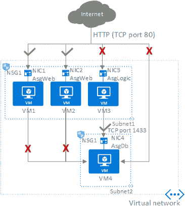

# 安全应用

> 原文：<https://dev.to/cheahengsoon/secure-applications-2bpa>

**配置 SSL/TLS 证书**

*   分配给 Azure 服务的证书的主要特征:
    *   X.509 v3 格式
    *   由受信任的 CA 签名或自签名
    *   主题名称与目标服务的完全限定域名(FQDN)匹配:
        *   FQDN 必须包括一个自定义域名
        *   不允许使用平台分配的域名(如 cloudapp.net)
    *   最低 2048 位加密
*   实现自签名证书:-Windows:New-self signed certificate(取代了不推荐使用的 makecert.exe)-Linux:ssh-keygen

**为应用服务配置托管服务身份**

*   托管服务身份的主要特征:
    *   表示 Azure 广告标识
    *   是平台化管理的(无需轮换机密)
    *   便于 Azure 服务托管的应用程序进行身份验证
    *   支持两种类型的身份:
        *   系统分配的:直接与特定 Azure 服务自动关联的身份
            *   用户分配的:允许与多个 Azure 服务关联的独立身份
*   实施托管服务身份:
    *   Azure 门户:直接来自目标 Azure 服务的刀片
    *   Azure PowerShell
    *   Azure CLI
    *   REST API

**实施 PaaS 防火墙规则**

*   平台即服务(PaaS)防火墙的主要特征:
    *   支持许多 Azure PaaS 服务，包括 Azure 存储
    *   默认允许(所有网络)
    *   在网络级别上操作(仍然需要对目标服务进行适当的授权)
*   配置 PaaS 防火墙:
    *   要限制来自互联网的流量:
        *   指定一个或多个允许流量的 IP 地址范围
    *   要仅允许来自虚拟网络特定子网的流量:
        *   在虚拟网络子网上，创建虚拟网络服务端点
        *   在 PaaS 防火墙上，指定虚拟网络的子网

**配置 Azure 服务以保护 web 应用**

*   Azure 前门服务的主要特征:
    *   便于定义、管理和监控流量定向 web 应用的全局路由
    *   运行在 OSI 模型的第 7 层(HTTP/HTTPS)
    *   将 anycast 与 split TCP 和微软全球网络结合使用，以优化性能和可靠性-为 web 应用程序实施 AFD:
    *   创建一个 AFD 实例
    *   添加应用后端和后端池
    *   添加路由规则

**配置 Azure 应用安全组**

*   助理秘书长的主要特点:
    *   作为 NSG 的延伸
    *   无需在 NSG 中引用 IP 地址范围
    *   允许根据 Azure 虚拟机的工作负载对其进行分组，而不考虑其 IP 地址
    *   被分配给 Azure 虚拟机的网络接口卡(NIC)
*   ASG 约束条件:
    *   与同一个 ASG 关联的所有网卡都必须连接到同一个虚拟网络
    *   您不能将多个 ASG 指定为 NSG 规则的来源和/或目的地