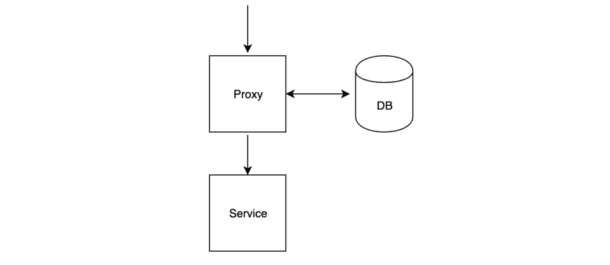
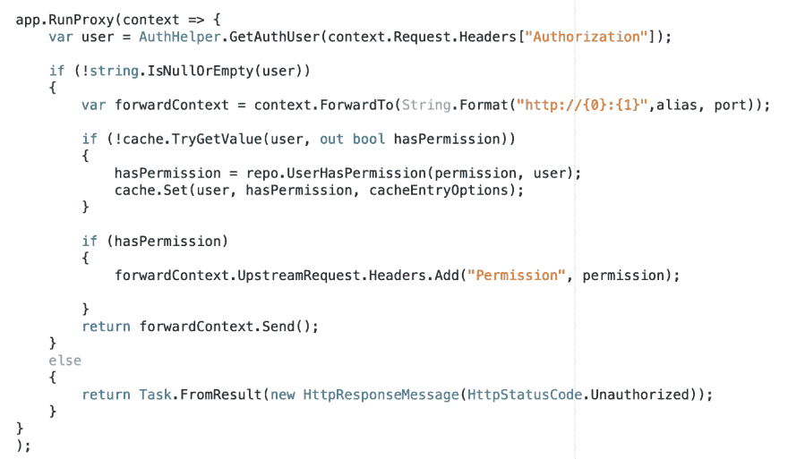

# 使用代码优先代理丰富 web 请求

> 原文：<https://dev.to/mattyjward/enriching-requests-using-a-code-first-proxy-2c1n>

这篇文章着眼于使用一个可重用的、可配置的、代码优先的代理来提供一个一致的、可控制的和可维护的方法来丰富 web 请求。

# 问题

如果我经常发现自己需要在服务的 API 入口点或附近运行一些特定于组织的通用代码。您可以在很多地方执行这项任务，但每一种都有自己的挑战:

| [计]选项 | 服务距离 | 挑战 |
| 请求中间件 | 同一应用程序 | 与服务紧密相关——更新很难！ |
| HTTP 过滤器 | 相同的 web 服务器 | 将您与 web 服务器联系起来——不再是真正的惯例了 |
| 边车 | 相同节点 | 构建和运行的巨大开销 |
| 服务网格 | 相同节点 | 通常不太支持自定义代码 |
| 反向代理 | 相同的逻辑系统 | 构建和运行的巨大开销 |
| 基础设施优先设备
(负载平衡器/ API 网关) | 同一组织 | 通常不太支持自定义代码 |

# 一解？

我将在本文中描述的解决方案既可以用作边车，也可以用作反向代理，这取决于您的基础设施抽象级别。

示例系统包含三个组件，服务、代理和数据库。

代码可以在[这里](https://github.com/matthewjward/proxysidecar)找到

我使用 Docker for Mac 在本地运行所有组件。代理和服务的 Dockerfile 包含在 repo 中。容器在由创建的[用户定义的桥接网络](https://docs.docker.com/network/bridge/)上运行

`docker network create mybridge`

## 代理人

对于代理，我设想了一个苗条的服务，使开发者能够以最简单的方式插入一些定制的功能。

大约在这个时候 [Damian Hickey](https://twitter.com/randompunter) 宣布了 ProxyKit，这似乎正是我所追求的，所以我开始用它创建一个解决方案。

> 达米安·希基·❄️@ random counter看起来 ProxyKit 是 github 上的一个顶级趋势 C#项目。它似乎满足了一种需求。
> 
> -自吹自擂14:48PM-06 2019 年 1 月675

我的代理将查看用户的授权头，在数据存储中查找关于用户的信息，然后在将请求转发到下游服务之前将该信息作为头添加。

这个简单的代理可以通过多种方式进行配置

*   “别名”(即。ip 地址、容器名)和下游服务的端口
*   数据库的连接详细信息
*   要从数据库中检索的信息
*   缓存从数据库中检索的数据所需的时间

`docker run -p 49161:80 -d \
--network=mybridge \
-e Downstream:Alias=api \
-e Downstream:Port=8080 \
-e Database:Host=postgres \
-e Database:Password=mysecretpassword \
-e Permission=HasSpecialPower \
-e CacheTimeSeconds=60 \
mattyjward/proxysidecar:blog`

## 数据库

对于数据库，我使用了一个相当普通的 Postgres 数据库，它只有一个“用户”表和一些“角色”信息。

`docker run -p 5432:5432 -d -e POSTGRES_PASSWORD=mysecretpassword \
--network=mybridge \
--name=postgres \
--mount=type=volume,src=posgres,dst=/var/lib/postgresql/data \
postgres`

这里只公开了端口，以便我可以直接连接到它并配置数据——就像这样

`psql postgres -h localhost -U postgres`

然后

`CREATE DATABASE Users;
\connect users
Create Table Users ( Name TEXT PRIMARY KEY, HasSpecialPower bool);`

## 服务

对于这项服务，我在 express 上创建了一个简单的节点应用程序。它寻找代理设置的报头，并使用它来做出授权决定。

这确实在代理和服务之间引入了一些耦合。

`docker run -d \
--network=mybridge \
--name=api \
mattyjward/permissionapi:blog`

# 运行它

一旦这三个容器都运行了，就在代理服务器上发出一个请求

`curl -I localhost:49161 --header`

最初，您应该得到一个 HTTP 401 未授权响应。这是从代理服务返回的。如果没有授权头，它甚至不会将请求转发给服务。

所以我们将添加标题

`curl -I localhost:49161 --header "Authorization:matt"`

现在你应该得到一个 HTTP 403 禁止响应。这是由服务返回的。代理在数据库中找不到具有所需权限的用户，因此没有添加服务正在查找的头。

使用 psql，将用户添加到数据库中，并授予他们所需的权限。

`Insert into Users (Name, HasSpecialPower) Values ('matt', true);`

重新发送之前的 curl http 请求(确保您已经等待缓存过期)，瞧！你应该得到一个 HTTP 200。在代理在数据库中找到具有该权限的用户并将头添加到请求后，服务将返回该消息。

# 接下来呢

现在可以直接启动代理的第二个实例，它是为不同的服务适当配置的。

这个代码是一个公平的方式从生产质量，但如果我要进一步，我会看看

*   用正确的 OAuth JWT 令牌验证替换授权头处理
*   使用更复杂的授权策略
*   使用容器编排器

# 谢谢！