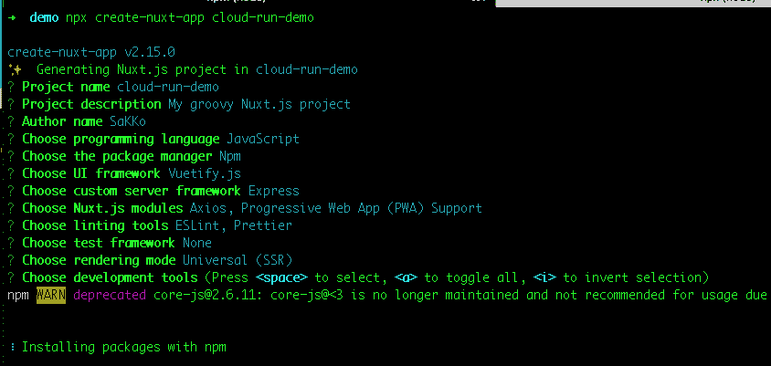
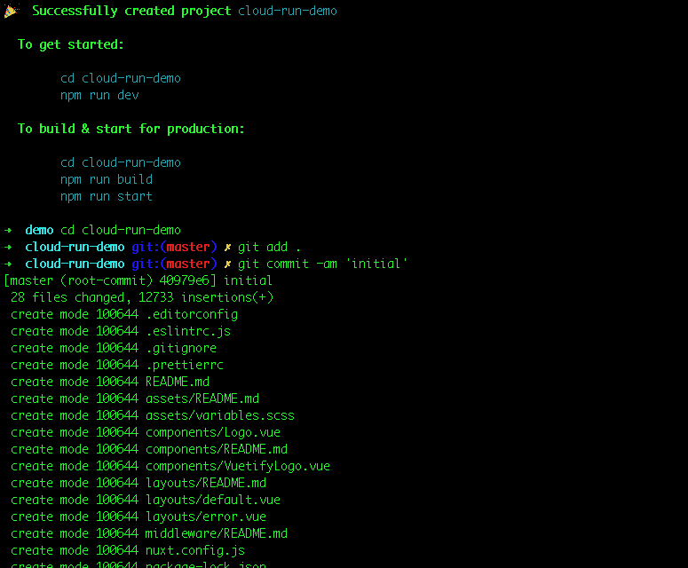
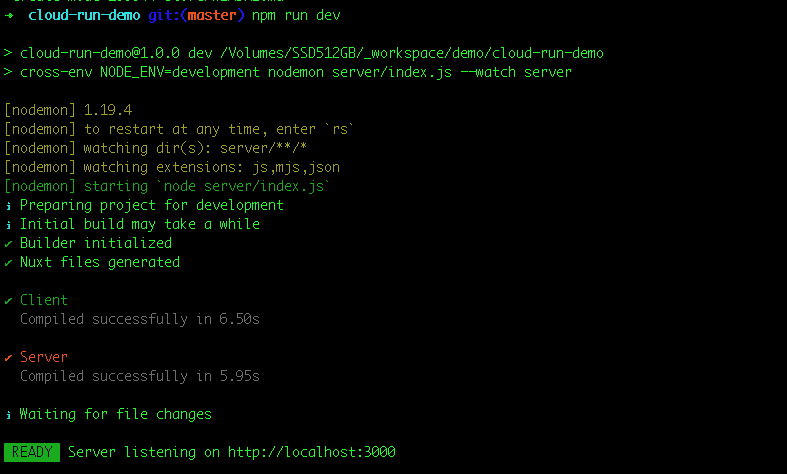
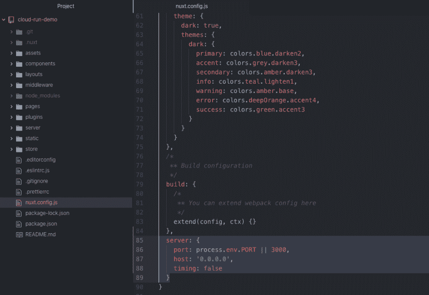
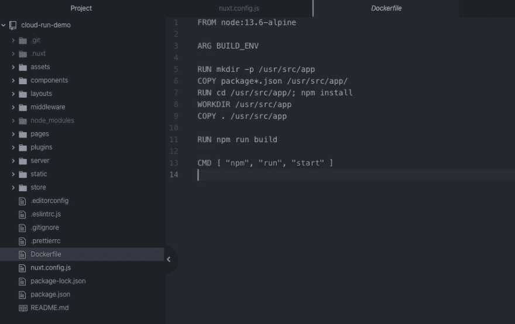
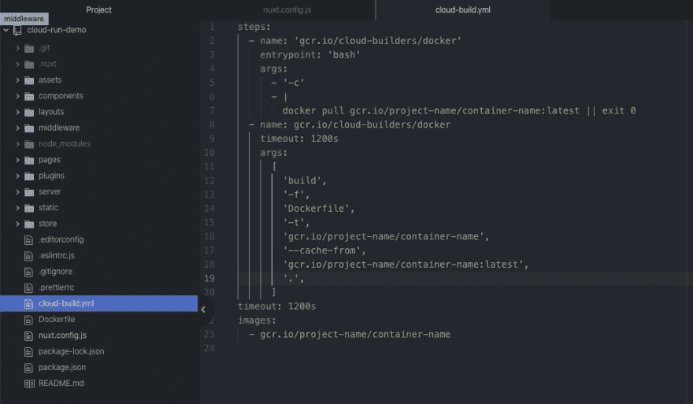
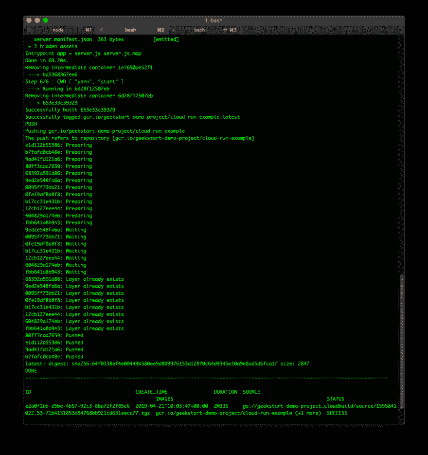
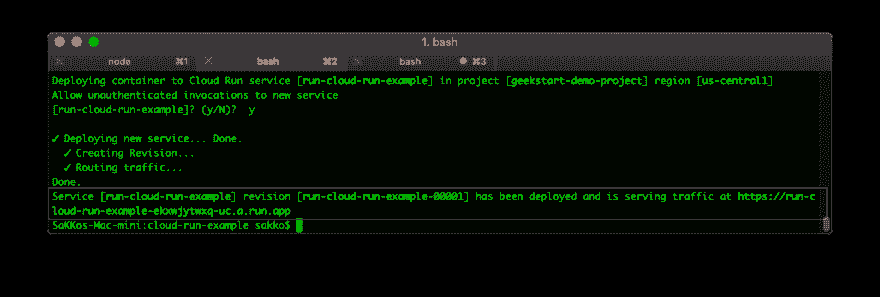

# 在 Google Cloud Run 上部署 Nuxtjs(无服务器)

> 原文：<https://dev.to/sakko/deploying-nuxtjs-on-google-cloud-run-1fic>

更好的`cloud-build.yaml`文件在构建之前拉旧的图像。节省构建时间。

# 更新

Cloud run 现已在几乎所有地区推出(包括新加坡 Hooooray！！！)

# 什么和为什么？

我喜欢 NuxtJS，并且在我的许多客户项目中经常使用它。我非常喜欢它，而且在 Google Cloud Run 上不用服务器也非常容易。它很便宜，而且支持 SSR。不过，你应该在继续之前检查一下价格...

# 先决条件

> 我用的是 MacOS。如果我遗漏了什么，请让我知道。

*   安装`gcloud`CLI[https://cloud.google.com/sdk/docs#mac](https://cloud.google.com/sdk/docs#mac)
*   通过运行`gcloud auth login`在命令行中登录到`gcloud`

> 在本教程中，有时 gcloud cli 会要求您启用云构建/云运行等功能。如果您不启用它们，本教程将不起作用。如果你这样做，确保你知道即将到来的成本。

# 我们开始吧

首先，我们将创建一个空项目。你可能想看看这个。[https://nuxtjs.org/guide/installation](https://nuxtjs.org/guide/installation)

```
# or just run
npx create-nuxt-app cloud-run-demo 
```

Enter fullscreen mode Exit fullscreen mode

[](https://res.cloudinary.com/practicaldev/image/fetch/s--GKWevEEi--/c_limit%2Cf_auto%2Cfl_progressive%2Cq_auto%2Cw_880/https://dev-to-uploads.s3.amazonaws.com/i/4o4fkd4u850mnfw3ej34.png)

我喜欢 git，那就先提交吧。

[](https://res.cloudinary.com/practicaldev/image/fetch/s---oBYTFtw--/c_limit%2Cf_auto%2Cfl_progressive%2Cq_auto%2Cw_880/https://dev-to-uploads.s3.amazonaws.com/i/ug5ahaw8p6j959yh9e7d.png)

我想知道它到底有没有用。让我们试一试。进入项目目录并运行`npm run dev`

[](https://res.cloudinary.com/practicaldev/image/fetch/s--aZj9v_mD--/c_limit%2Cf_auto%2Cfl_progressive%2Cq_auto%2Cw_880/https://dev-to-uploads.s3.amazonaws.com/i/to3d4yrmcnh64tcgcljj.png)

云运行需要`process.env.PORT`作为您的应用程序端口。因此，让我们改变我们的服务器配置。另外，请注意，使用 express + cloud run 要求主机是`0.0.0.0`而不是`localhost`或`127.0.0.1`。

[](https://res.cloudinary.com/practicaldev/image/fetch/s--D3cA-nni--/c_limit%2Cf_auto%2Cfl_progressive%2Cq_auto%2Cw_880/https://dev-to-uploads.s3.amazonaws.com/i/xab2smxfo93fybqao3fd.png)T3】

```
 server: {
    port: process.env.PORT || 3000,
    host: "0.0.0.0",
    timing: false
  } 
```

Enter fullscreen mode Exit fullscreen mode

添加`Dockerfile`来构建我们的项目。您可以更改节点版本以匹配您的项目。

[](https://res.cloudinary.com/practicaldev/image/fetch/s--W4tfG53X--/c_limit%2Cf_auto%2Cfl_progressive%2Cq_auto%2Cw_880/https://dev-to-uploads.s3.amazonaws.com/i/4vh5vvfmu66vm5br8mv4.png)T3】

```
FROM node:13.6-alpine

ARG BUILD_ENV

RUN mkdir -p /usr/src/app
COPY package*.json /usr/src/app/
RUN cd /usr/src/app/; npm install
WORKDIR /usr/src/app
COPY . /usr/src/app

RUN npm run build

CMD [ "npm", "run", "start" ] 
```

Enter fullscreen mode Exit fullscreen mode

我喜欢在 yaml 中配置我的云构建。让我们通过添加一个文件调用`cloud-build.yml`(或者任何你喜欢的东西)来实现。你需要改变`project-name`来匹配你的谷歌`gcloud-project-id`。和`container-name`到任何你想要的。

[](https://res.cloudinary.com/practicaldev/image/fetch/s--gzN4_6mD--/c_limit%2Cf_auto%2Cfl_progressive%2Cq_auto%2Cw_880/https://dev-to-uploads.s3.amazonaws.com/i/etxkj0dht6c3y3lgehpe.png)T3】

```
steps:
  - name: 'gcr.io/cloud-builders/docker'
    entrypoint: 'bash'
    args:
      - '-c'
      - |
        docker pull gcr.io/project-name/container-name:latest || exit 0
  - name: gcr.io/cloud-builders/docker
    timeout: 1200s
    args:
      [
        'build',
        '-f',
        'Dockerfile',
        '-t',
        'gcr.io/project-name/container-name',
        '--cache-from',
        'gcr.io/project-name/container-name:latest',
        '.',
      ]
timeout: 1200s
images:
  - gcr.io/project-name/container-name 
```

Enter fullscreen mode Exit fullscreen mode

让我们在 Google Cloud Build 上构建我们的项目。别忘了用你的`gcloud-project-id`换`project-name`。

```
# build from yml config
gcloud builds submit --project "project-name" --config=./cloud-build.yaml 
```

Enter fullscreen mode Exit fullscreen mode

[](https://res.cloudinary.com/practicaldev/image/fetch/s--l3Ejfmge--/c_limit%2Cf_auto%2Cfl_progressive%2Cq_auto%2Cw_880/https://dev-to-uploads.s3.amazonaws.com/i/cs6u0iwnf3rywfebdbq1.png)

最后让我们部署。别忘了换衣服

*   `cloud-run-name`服务名称(您喜欢的任何名称)。它将在 https://console.cloud.google.com/run 播出。
*   `--region asia-northeast1`您可以选择离您最近的地区。
*   `project-name`到你的`gcloud-project-id`
*   将其更改为与 cloud-build.yaml 中的设置相匹配

```
# deploying (rerun to redeploy)
gcloud beta run deploy cloud-run-name --region asia-northeast1 --project "project-name" --image gcr.io/project-name/container-name --platform managed 
```

Enter fullscreen mode Exit fullscreen mode

[](https://res.cloudinary.com/practicaldev/image/fetch/s--klta6RHF--/c_limit%2Cf_auto%2Cfl_progressive%2Cq_auto%2Cw_880/https://dev-to-uploads.s3.amazonaws.com/i/9ipfylmjqlcxd7kf8a1x.png)

现在，您可以访问控制台中给出端点。通常[https://cloud-run-name-{ some _ hash }-UC . a . run . app](https://cloud-run-name-%7Bsome_hash%7D-uc.a.run.app)

或者您可以将域更改为其他名称。你应该能在这里找到它。[https://console.cloud.google.com/run/domains](https://console.cloud.google.com/run/domains)

部署无服务器的 Nuxtjs 应用程序太简单了。

我相信你也可以在 Nextjs 或 Gatsby 中做到这一点。如果你做过，请分享。

同样，如果我错过了什么，请告诉我。

请谷歌，我需要这个在新加坡地区。

罚款。罚款