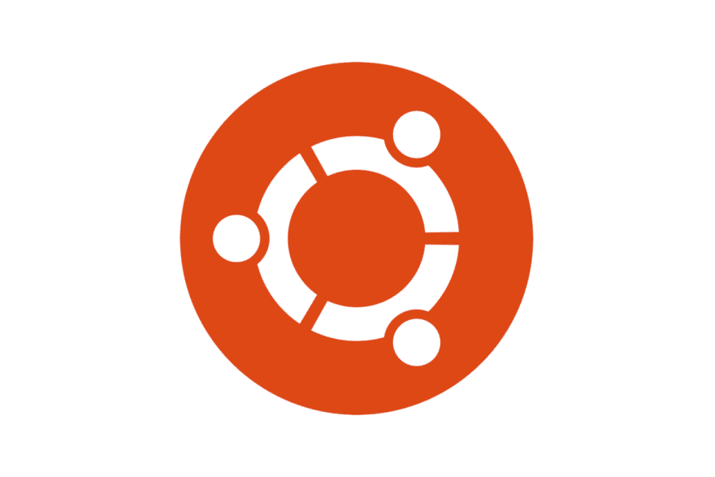

# 开始使用 Ubuntu 的 5 个理由

> 原文：<https://dev.to/roelofjanelsinga/5-reasons-to-start-using-ubuntu-2jb8>

# 开始使用 Ubuntu 的 5 个理由

大多数人都知道 Ubuntu 是一个服务器操作系统，然而，它也可以作为一个桌面环境。这篇文章描述了为什么你应该使用 Ubuntu 作为桌面操作系统而不是像 Windows 或 Mac 这样的操作系统的几个原因。以下是我选择使用 Ubuntu 作为我的主要操作系统，而不是我以前使用的 Windows 的一些原因:

1.  安全性
2.  稳定性
3.  高性能
4.  改变一切的能力
5.  易于设置

## 安全

在 Ubuntu 上安装应用程序的方式与 Android 和 iOS 类似，你通过应用商店(也称为存储库)下载应用程序。
如果您想要安装任何附加应用程序，您必须在该存储库中选择一个应用程序，但是，您可以为附加应用程序添加第三方存储库。这意味着您可以控制从哪些来源安装哪些应用程序。这也意味着这些应用程序有官方支持，并且被 Ubuntu 核心开发者认为是安全的。如果您想从额外的存储库中添加任何额外的应用程序，您必须相信这些存储库是无害的。如果你不信任一个库，你就不要把它添加到你的系统中。您控制着应用程序的源代码，而不是其他人。

## 稳定

因为 Ubuntu 社区真的很大，如果你有任何问题，有很多支持。这意味着你可能面临的任何问题都可能在过去得到解决，你可以简单地复制别人解决问题的步骤。因为社区非常大，所以应用程序会定期更新，以便提供更好的安全性，并以更好、更高效的方式工作。这也意味着应用程序在被新版本弃用之前会被长期支持。Ubuntu 的 LTS(长期支持)版本支持 5 年，这意味着你可以使用相同的系统 5 年，然后你需要升级到一个新的版本。

## 高性能

安装 Ubuntu 时，有机会安装第三方库。您可以选择不包含这些库，只安装最少的库。如果你只安装最低限度的，你会有一个非常干净和精简的操作系统版本。从这个干净的基础上，您可以安装任何您想要的东西，而不会有很多臃肿的系统应用程序。

当我得到一台新的笔记本电脑时，Windows 是预装的，所以当启动系统时，我必须经历安装和设置过程。这个过程花了将近 45 分钟，这让我很恼火。我想启动笔记本电脑，立即开始手头的任务，但因为这个过程花费了太长时间，我失去了所有的注意力和动力。当我最终进入桌面环境时，我对预装的应用程序数量感到震惊。开始菜单上全是各种各样的废话，30-40 个应用程序已经安装在系统中，等待我开始使用它们。很明显，他们服务的目标受众不是我这个软件开发人员，而是更多的媒体消费者。

我在安装 Mac OSX 时也有类似的经历。安装的系统应用程序太多了，我无法删除。我知道我永远不会使用这些程序，没有能力删除这些应用程序对我来说是一个负担。这时候我才完全明白为什么 Ubuntu 的整体性能要高于这两个操作系统。它安装了更少的应用程序，你知道你永远不会使用，你可以简单地删除，以释放一些资源对你来说很重要。

## 改变任何事物的能力

Ubuntu 社区非常大，如果你想改变操作系统的任何东西，你都可以找到办法。例如，如果你不喜欢默认的桌面环境，你可以安装一个完全不同的。如果你不喜欢 GNOME 或 Unity 环境，你可以简单地安装 KDE 或 Xfce。如果你喜欢默认的环境，但想改变它的外观和功能一点点，你可以安装“Unity Tweak tools”并改变任何你想要的。

不喜欢默认的文件管理器？再装一个！不喜欢在 Nautilus(文件管理器)中从一个文件夹导航到另一个文件夹的方式，在终端中运行一个命令就可以输入你想去的路径。因为这个社区很大而且很活跃，所以你可以很快找到如何做这件事。

## 易于设置

任何 Linux 发行版(distro)都是免费的，除非你想使用某种类似 Red Hat 的企业操作系统。这意味着没有理由不亲自尝试其中的一些。大多数发行版甚至有一个活动 USB 模式，这意味着你可以不用在你的系统上安装它就可以试用。你可以简单地从 USB 驱动器运行它。事实上，它是免费的，这让我得以恢复几台运行 Windows 的旧笔记本电脑，但它们要么已经损坏，要么速度太慢，要么就是无法正常工作了。
实时 USB 模式允许我安装一个干净的操作系统，它在旧的、留给死硬件的系统上运行非常流畅。这些特殊的笔记本电脑现在有了新的生命，并被再次使用。这意味着我不必投资购买另一台笔记本电脑或支付另一个 Windows 许可证。

## 你呢？

你开始使用 Ubuntu 的原因是什么？如果你还没用过，为什么不用？请在 Twitter 上告诉我，因为我喜欢听别人讲述这个神奇的操作系统。