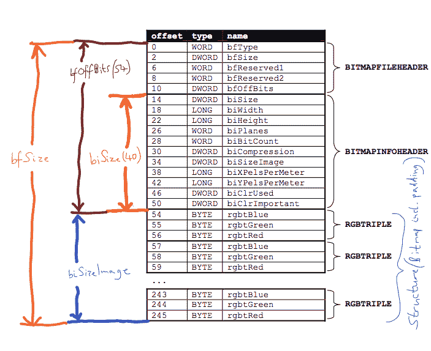

# øxoposɇcmɇɇtuᵽ[0x 72]和[0x73]挑战写操作

> 原文：<https://dev.to/jpdias/oxoposc-mtu-0x72-and-0x73-challenges-write-up-2o3a>

“总部位于波尔图的øxoposɇc 集团是由热衷于安全的 g33ks 创立的。meetup 的主要任务是通过利用小组成员的专业知识和技能来讨论和解决紧急的安全问题。”这是由@ArmySick 和@Simps0n 撰写的关于 0x72 和 0x73 meetup 版本的挑战的文章。

聚会每月举行一次，欢迎[加入](https://www.meetup.com/0xOPOSEC/)。

## 【0x 72】房间里最大的声音很少是最对的。

> 房间里最大的声音很少是最正确的。

`$ wget <ip_address>/omegalul.bmp`

生成的图像是已知 XKCD 草图“随机数”的修改版本:

修改后的图像可以在下面下载:

> [下载图像](img/oposec/omegalul.png)

### 如何解决？

这似乎是一个隐写术的挑战。第一次尝试是尝试运行几种隐写术工具，包括 [zsteg](https://github.com/zed-0xff/zsteg) 。然而它们都没有抛出各种各样的错误，但是`steghide`抛出了一个奇怪的错误:

`steghide: the BMP file "omegalul.bmp" has a format that is not supported (biSize: 124).`

经过一番搜索，找到了这个相关的 [StackOverflow 问题](https://stackoverflow.com/questions/25713117/what-is-the-difference-between-bisizeimage-bisize-and-bfsize):

> biSize 仅是 BITMAPINFOHEADER 的大小。它是 40 字节。

并且，通过使用 HxD Editor 将文件头中的值从 124 更改为 40(偏移量 14 / DWORD ),我们可以毫无困难地运行 zsteg:

`b1,msb,bY .. text: "flag{Least_Significant_is_Most_Significant}\n"`

> > mark {least important}

## 【0x 73】这是军事等级的挑战！

> 检查链接 <url>(+)</url>

> [下载图像](img/oposec/challenge.jpg)

### 如何解决？

另一个隐写术挑战。在使用 [010 编辑器](https://www.sweetscape.com/010editor/)对文件进行了一点手动分析后，文件末尾出现了未知填充。在胡言乱语中，出现了一个古怪的字符串:`dd02c7c2232759874e1c205587017bed`。

经过一些搜索和反复试验，它看起来像是字符串`secret`的 md5 散列。但那不是一面旗帜。

接下来，我想到了对嵌入文件的检查。于是，使用`$ binwalk -e challenge.jpg`出现了一个 ZIP 文件:`46D41.zip`，里面有一个名为`dd02c7c2232759874e1c205587017bed`的文件。

由于某种原因 [fcrackzip](https://github.com/hyc/fcrackzip) 不能正确处理 zip 文件(包括单词列表和暴力破解)。

按照传统方式，我在 GitHub 上发现了几个 Python 脚本，它们能够暴力破解 ZIP 密码保护文件。用*军事等级挑战*作为提示，我猜一定是一个“容易”的密码。

使用下面的脚本，和**字典** [`SecLists/Passwords/Common-Credentials/best1050.txt`](https://github.com/danielmiessler/SecLists/blob/master/Passwords/Common-Credentials/best1050.txt) 。

很快找到了密码: *admin123* 。

> > 标志{ ThisIsaOldTrickInTheBook }
> > 
> > T3】

##### *那都是乡亲们！*