# 了解如何在微服务架构之上构建无服务器的 GraphQL API，第二部分，将其部署到云中

> 原文：<https://dev.to/azure/learn-how-you-can-build-a-serverless-graphql-api-on-top-of-a-microservice-architecture-part-ii-deploy-it-to-the-cloud-26b6>

在 [Twitter](https://twitter.com/chris_noring) 上关注我，很乐意接受您对主题或改进的建议/Chris

> 这就是我们把我们的微服务，我们的 GraphQL API，托管在一个无服务器的应用程序，并把它全部投入生产。是的，这是一个 15 分钟的阅读，但是你所得到的是你可以在你自己的项目上建立的东西。它值得一读，途中还有大量图片。希望你和我在一起:)

这是系列的一部分:

*   [构建微服务和 GraphQL API，第一部分](https://dev.to/azure/learn-how-you-can-build-a-serverless-graphql-api-on-top-of-a-microservice-architecture-233g)
*   将 GraphQL API 托管在一个无服务器应用程序中，并将其全部带到云中，第二部分，**我们在这里**

这是我们的 GraphQL、无服务器、Docker 和微服务系列的第二部分。到目前为止，我们已经创建了微服务，对这些服务进行了文档化，并且在我们整合 GraphQL API 时能够使用这些服务的 URL。这本身就是一项成就，然而，我们对此并不满意。我们想投入生产，我们想走向云端。

我强烈推荐阅读这个系列的第一部分，[第一部分](https://dev.to/azure/learn-how-you-can-build-a-serverless-graphql-api-on-top-of-a-microservice-architecture-233g)

如果你有，让我们摇滚吧！

[](https://res.cloudinary.com/practicaldev/image/fetch/s--JatQk9uz--/c_limit%2Cf_auto%2Cfl_progressive%2Cq_66%2Cw_880/https://thepracticaldev.s3.amazonaws.com/i/i9fz44ky7tonla33mw6k.gif)

## 计划

我们在第一部分提到过这个计划，但现在又来了

1.  **创建**微服务，第一部分
2.  服务，第一部分
3.  创建 graphql api 并让解析函数指向每个 dockerized 服务的 url，第一部分
4.  **创建**一个无服务器功能，**这部分**
5.  **将**我们的微服务部署到云端，**这部分**
6.  **添加**我们的 graphql api 到我们的无服务器函数中，**这部分**
7.  **部署**无服务器功能到云端，**这部分**

我们服务的第一部分已经完成了前三项，现在是时候处理剩下的四项了

## 资源

你当然可以不阅读这些链接而直接阅读本指南，但要了解更多关于部署选项的细节，以及如何构建无服务器或如何在 Azure 中部署你的容器。我建议你浏览这些链接:

*   为了能够部署你的服务和托管你的无服务器功能，你需要一个免费的 Azure 账户
*   将容器部署到 Azure 在将容器部署到 Azure 时，看到所有可用的选项总是好的
*   你所有的集装箱都是属于我们的。喜欢上面的链接，但解释更多
*   [在 VS 代码中创建和部署 Azure 函数](https://docs.microsoft.com/en-US/azure/azure-functions/functions-create-first-function-vs-code?wt.mc_id=devto-blog-chnoring)这展示了我们如何在 VS 代码中创建 Azure 函数并将其部署到云中
*   [使用 CLI 创建 Azure 功能](https://docs.microsoft.com/en-us/azure/azure-functions/functions-create-first-azure-function-azure-cli?wt.mc_id=devto-blog-chnoring)CLI 是创建 Azure 功能和部署 Azure 功能的绝佳选择。
*   [我在 Docker 上的 5 部分系列，如果你需要 Docker 复习工具](https://dev.to/softchris/5-part-docker-series-beginner-to-master-3m1b?wt.mc_id=devto-blog-chnoring)这是 Docker 上的 5 部分入门

## 项目结构

让我们提醒自己，我们在项目结构中处于什么位置，这样我们才能在同一页上前进。我们应该有以下内容:

```
/graphql-api
  /products  // our product service
  /reviews // our reviews service
  /serverless // will contain our serverless function
  docker-compose.yml 
```

## 创建无服务器功能

为了创建我们的函数，我们首先需要一个`Function app`来存放它。在我们进行到这一步之前，让我们确保已经安装了我们需要的所有先决条件。这在 Mac 和 Windows 上看起来有点不同。让我们从 Mac 开始，打开一个终端，输入:

```
brew tap azure/functions
brew install azure-functions-core-tools 
```

如果您缺少`brew`，请参考此[链接](https://brew.sh/)进行安装。

对于 Windows，我们只需要安装 Node.js，然后打开终端，输入:

```
npm install -g azure-functions-core-tools@2 
```

我们还需要安装一个 Visual Studio 代码扩展，以使搭建、调试和部署我们的 Azure 功能变得轻而易举，所以让我们接下来做这件事。在 VS 代码中点击扩展的图标，寻找`Azure Functions`并选择安装。
[](https://res.cloudinary.com/practicaldev/image/fetch/s--6RVfGE9v--/c_limit%2Cf_auto%2Cfl_progressive%2Cq_auto%2Cw_880/https://thepracticaldev.s3.amazonaws.com/i/psz5ihp5kjyujpvq1qrq.png)

### 脚手架工程

我们的下一步是创建一个 Azure 应用程序，对于 Windows，我们通过按`COMMAND + SHIFT + P`或`CTRL+SHIFT+P`来完成。这将弹出一个如下所示的菜单:

[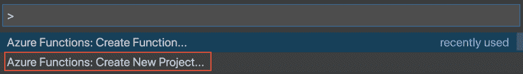](https://res.cloudinary.com/practicaldev/image/fetch/s--_xmFXRnf--/c_limit%2Cf_auto%2Cfl_progressive%2Cq_auto%2Cw_880/https://thepracticaldev.s3.amazonaws.com/i/whmkarb5duxry8b4er1u.png)

此后，您选择上面指示的命令，现在您将看到以下内容。

[](https://res.cloudinary.com/practicaldev/image/fetch/s---FoPx8kY--/c_limit%2Cf_auto%2Cfl_progressive%2Cq_auto%2Cw_880/https://thepracticaldev.s3.amazonaws.com/i/0v0iq5ul9x35rn09mkoo.png)

您可以选择您想要的任何文件夹，但要知道它会在您当前所在的工作区中创建一个文件夹`.vscode`。包含了一堆文件，使得这个项目的调试成为可能。我选择了`serverless`文件夹，并确保 VS 代码已经打开了该文件夹，这样我的`.vscode`文件夹就创建在了正确的位置。

[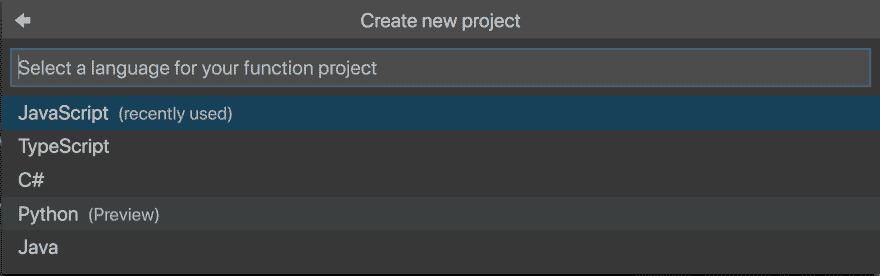](https://res.cloudinary.com/practicaldev/image/fetch/s--9uZYEUQp--/c_limit%2Cf_auto%2Cfl_progressive%2Cq_auto%2Cw_880/https://thepracticaldev.s3.amazonaws.com/i/zcj2e414fd0npniv57db.png)

这次我们用`Javascript`去。下一个屏幕是选择一个触发器，即什么事件将导致该代码被执行:

[](https://res.cloudinary.com/practicaldev/image/fetch/s--zW4Cwt-j--/c_limit%2Cf_auto%2Cfl_progressive%2Cq_auto%2Cw_880/https://thepracticaldev.s3.amazonaws.com/i/0razhjgzwkmqy5y4mrji.png)

下一步是给 Azure 函数一个名字。是的，它不仅为我们创建了一个 Azure 应用程序项目，还创建了一个功能。如果我们愿意，我们可以随时添加更多的功能。

[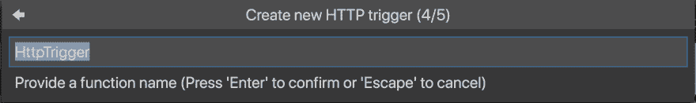](https://res.cloudinary.com/practicaldev/image/fetch/s--eHvxXMW1--/c_limit%2Cf_auto%2Cfl_progressive%2Cq_auto%2Cw_880/https://thepracticaldev.s3.amazonaws.com/i/8qz3rkncd0x57ixx163m.png)

我选择名字`graphql`。那里，只差一步，`Authorization level`。授权使用我们的 app 有三种方式，`Anonymous`，`Function`，`Admin`。有了`Anonymous`，任何人都可以调用我们的 API，我们不需要发送任何额外的凭证。使用`Function`我们需要发送一个功能键作为标题，而使用`Admin`我们需要做更多的事情，才能被允许调用函数。我们满足于选项`Anonymous`，因为我们现在想让它更容易测试。随着我们开发应用程序的进展，我们肯定应该重新考虑这个选择。如果是一个玩具应用程序`Anonymous`很好，但是在生产场景中，你可能希望有`Function`或`Admin`作为选项。

此时，您应该拥有以下项目结构:

[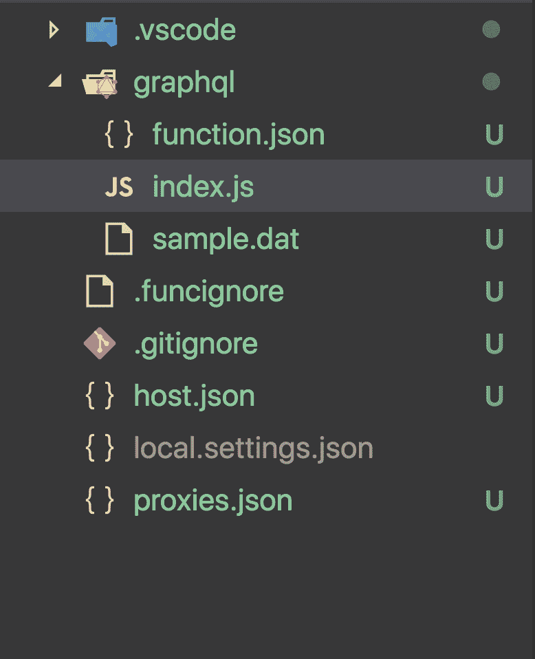](https://res.cloudinary.com/practicaldev/image/fetch/s--6cIMYz_M--/c_limit%2Cf_auto%2Cfl_progressive%2Cq_auto%2Cw_880/https://thepracticaldev.s3.amazonaws.com/i/i8bavjo6xnah20euhaxk.png)

### 调试

让我们通过调试来确保我们的无服务器函数是正确创建的。在您的`index.js`文件中放置一个断点，如下所示:

[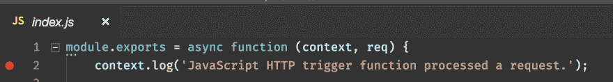](https://res.cloudinary.com/practicaldev/image/fetch/s--fjDOiD8l--/c_limit%2Cf_auto%2Cfl_progressive%2Cq_auto%2Cw_880/https://thepracticaldev.s3.amazonaws.com/i/u67t6u62bmcdwxi6lgur.png)

现在让我们进入`Debug`菜单，就像这样:

[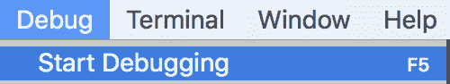](https://res.cloudinary.com/practicaldev/image/fetch/s--_9fW-6ur--/c_limit%2Cf_auto%2Cfl_progressive%2Cq_auto%2Cw_880/https://thepracticaldev.s3.amazonaws.com/i/srwrabrnwj7qmtqq5f7x.png)

这应该会启动该功能，并向终端写入许多内容，并且应该会以如下所示的 URL 打印输出结束:

[](https://res.cloudinary.com/practicaldev/image/fetch/s--YRL8V5Xg--/c_limit%2Cf_auto%2Cfl_progressive%2Cq_auto%2Cw_880/https://thepracticaldev.s3.amazonaws.com/i/pmma69eje43anl2zl6vk.png)

因此，我们在浏览器中访问指定的 URL `http://localhost:7071/api/graphql`,这将导致我们的断点被命中:

[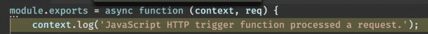](https://res.cloudinary.com/practicaldev/image/fetch/s--ely3YyIQ--/c_limit%2Cf_auto%2Cfl_progressive%2Cq_auto%2Cw_880/https://thepracticaldev.s3.amazonaws.com/i/7ilotme17k7zntd86xei.png)

很好，一切正常。我们现在可以进入下一步，即获取我们的 Graphql API 实现，并从我们的无服务器函数中调用它。

## 将 Graphql API 添加到我们的无服务器应用中

好了，补充这一点，我们需要使我们创建的 GraphQL 成为我们的无服务器应用程序的一部分。为此，我们需要移动一些文件。我们需要将`package.json`文件复制到我们的无服务器函数项目的根目录。当我们使用 VS 代码创建一个项目时，它会为我们运行`npm install`，只要它在正确的级别找到一个`package.json`。GraphQL API 的其余部分可以很容易地复制到我们的`serverless`目录下的子目录中。它现在应该是这样的:

[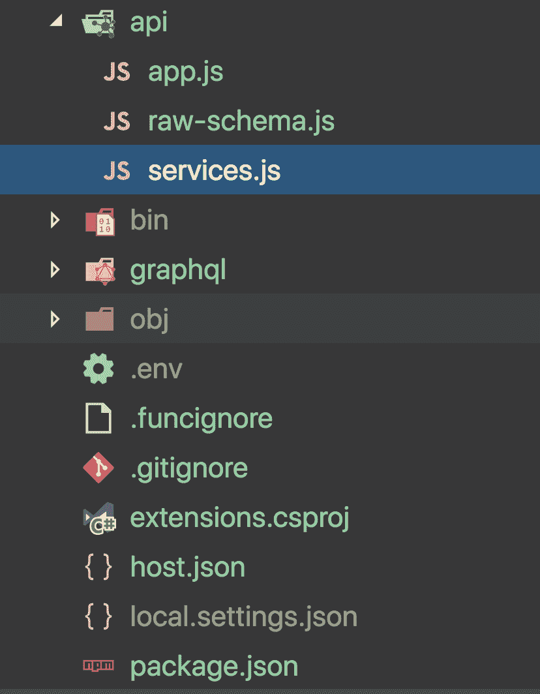](https://res.cloudinary.com/practicaldev/image/fetch/s--c8KjuBnT--/c_limit%2Cf_auto%2Cfl_progressive%2Cq_auto%2Cw_880/https://thepracticaldev.s3.amazonaws.com/i/f6c1avcge3q464fru2mi.png) 
正如你在上面看到的，我们的 GraphQL API 目录`api`已经被复制进来，现在它只包含文件`app.js`、`raw-schema.js`和`services.js`。我们已经将`package.json`和`.env`文件移到了无服务器项目的根目录下。

### 导入我们的 GraphQL API

此时，我们可以开始从我们的无服务器函数导入和调用 GraphQL 代码。让我们打开我们的函数所在的目录`graphql`，打开`index.js`，开始向我们的 GraphQL API 添加一个导入语句，就像这样:

```
// /graphql/index.js

const { graphql, schema } = require('../api');

// the rest omitted for brevity 
```

以上意味着我们正在导入一个文件`../api.index.js`。我们过去没有创建过，所以我们需要这样做:

```
// ../api.index.js

const {
  graphql
} = require('graphql');
const rawSchema = require('./raw-schema');

require('dotenv').config()

module.exports = {
  schema: rawSchema,
  graphql
} 
```

### 从我们的无服务器函数中调用 Graphql API

现在，我们该如何调用我们的无服务器函数呢？我们想从查询参数或主体中读取一个 GraphQL 查询。

在我们走到那一步之前，让我们确保我们可以启动我们的无服务器函数，用一个静态查询调用我们的 GraphQL API 并得到一些结果。所以把`serverless/graphql/index.js`的内容改成如下:

```
const { graphql, schema } = require('../api')

module.exports = async function (context, req) {
    context.log('JavaScript HTTP trigger function processed a request.');

    const query = `{ hello products { name, description } reviews { title, comment, grade, product { name, description } } }`;

    const result = await graphql({
        schema,
        source: query
    })
    context.res = {
        // status: 200, /* Defaults to 200 */
        body: result
    };
}; 
```

在继续测试我们的实现之前，让我们确保我们已经完成了以下工作:

1.  运行`npm install`，我们需要确保我们已经安装了`graphql`、`dotenv`、`node-fetch`
2.  **冉** `docker-compose up -d`，我们需要提升我们的服务，我们的 GraphQL API 查询
3.  **添加调用 GraphQL API 的代码**
4.  **调试**无服务器功能

完成步骤 1-4 后，我们就可以开始调试了。所以让我们选择`Debug/ Start Debugging`

此时，我们有了可以在本地测试的东西，所以我们就这样做吧:

[](https://res.cloudinary.com/practicaldev/image/fetch/s--zprsD2hV--/c_limit%2Cf_auto%2Cfl_progressive%2Cq_auto%2Cw_880/serverless-browser-result.png)

好吧，我们可以看到它似乎工作。现在是准备部署的时候了。

## 将我们的应用部署到 Azure

从更高的层面来看，我们需要做一些事情。我们的解决方案由两个主要部分组成，我们的微服务和调用 GraphQL API 的无服务器应用程序。为了让我们的云部署工作，我们需要分别部署这些部分。让我们列出我们需要做的事情和原因:

## 将微服务部署到云

微服务需要被创建为服务端点。因为我们已经在使用 Docker，所以让我们利用这一点，继续使用 Docker，但在云中使用。你怎么问？这是怎么回事:

1.  **在本地构建**Docker 映像
2.  **在云中创建**一个容器注册表，我们将把我们的映像推送到这个注册表中。原因是我们的容器注册中心能够将图像保存为存储库，但是它也能够从这些图像创建容器，只要它们在注册中心内。一旦我们从这些图像创建了容器，这将创建服务端点。每个服务端点将收到一个唯一的 URL。我们可以使用从云中获得的 URL，让我们的无服务器/GraphQL 解决方案指向这些 URL，而不是我们的本地 URL
3.  **标记图像**，在我们将每个 Docker 图像推送到云中的容器注册中心之前，我们需要用来自容器注册中心的凭证对其进行标记。然后，这是一个简单的推送命令，使图像最终在注册表中。
4.  **创建服务端点**，当 Docker 映像在我们云中的注册表中时，从它们创建容器真的很简单，这将创建具有真实 URL 的服务端点，每个服务一个。我们希望无服务器应用程序及其 GraphQL API 指向这些端点

### 创建容器注册表

如果我们没有想要使用的资源组，我们可能首先需要一个资源组。我建议为所有相关的东西建立一个特定的资源组，比如网络应用、服务、账户等等。下面是从终端创建`Resource Group`的语法:

```
az group create --name [name of resource group] --location westeurope 
```

至此，您已经准备好创建容器注册表:

```
az acr create --resource-group [name of resource group] --name [name of container registry, unique and only a-z or 0-9] --sku Basic --admin-enabled true 
```

上面将使用您现有的资源组创建一个容器注册中心，它还将为您的容器注册中心提供一个名称和一个价格等级`Basic`。

### 构建并标记图像

构建映像就像运行 Docker 命令一样简单。我们这样做两次，每次服务一次。我们可以将自己放在 docker 文件所在的每个服务目录中，或者我们需要为每个映像创建指定每个 docker 文件所在的位置。我们做的是前者，即把我们自己放在包含目录:
的每个 docker 文件中

```
// in /products

docker build -t products-service .

// in /reviews

docker build -t reviews-service . 
```

上面我们分别给它命名为`product-service`和`reviews-service`。此时，我们已经准备好标记图像，因此我们的容器注册中心可以识别它们。为此，我们需要来自容器注册中心的一条信息，我们需要用它来标记我们的图像。我们正在寻找的信息被称为`loginServer`。我们可以通过两种方式获得这些信息，两种方式都可行:

1.  登录到容器注册表并查询该属性
2.  通过将容器注册表名称与预设域合并来创建它

先做 1)吧:

```
az acr login --name [name of registry] 
```

这将使我们登录到注册表，我们准备好查询我们需要的信息:

```
az acr show --name [name of container registry] --query loginServer --output table 
```

上面我们主动查询`loginServer`，结果就是我们的`loginServer`。

第二个选项 2)是意识到我们可以通过合并`[name of registry].azurecr.io`来猜测这些信息。由于领域在未来可能会有所不同，我认为查询`loginServer`是未来更安全的做法。

**标记图像**

好了，该给我们的图片贴标签了:

```
docker tag products-service [loginServer]/products-service:v1 
```

然后再一次为对方服务:

```
docker tag reviews-service [loginServer]/reviews-service:v1 
```

### 将图片推送到云端

好了，最后我们准备好将图像推送到容器注册中心。这就像输入:
一样简单

```
docker push [loginServer]/products-service:v1 
```

现在是`review-service` :

```
docker push [loginServer]/reviews-service:v1 
```

我不想撒谎，如果你坐在家里，这需要时间。至少对我来说，我的连接下载速度很快，上传速度很慢。第一次尝试在公司 WiFi 上做这个步骤，或者至少在好的家庭 WiFi 上做。下一次你这样做将会很快，它能够缓存图像中的一些层。我们可以看到，当我们按下`reviews-service`时，缓存已经在起作用了，因为它们非常相似，并且使用了相同的图像和其他东西:
[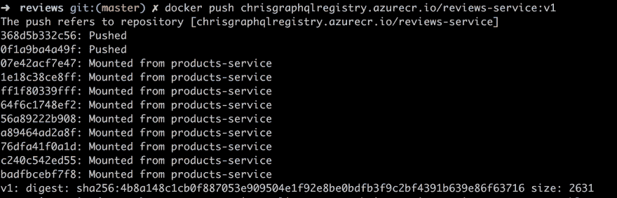](https://res.cloudinary.com/practicaldev/image/fetch/s--BPfxbKkx--/c_limit%2Cf_auto%2Cfl_progressive%2Cq_auto%2Cw_880/https://thepracticaldev.s3.amazonaws.com/i/hkdqxenenysd6keihe3n.png)

**验证我们的上传**

我们如何知道这些图像实际上在注册表中，在我们的云中？我们可以像这样查询它们:

[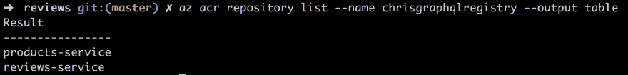](https://res.cloudinary.com/practicaldev/image/fetch/s--4ObbhqKc--/c_limit%2Cf_auto%2Cfl_progressive%2Cq_auto%2Cw_880/https://thepracticaldev.s3.amazonaws.com/i/03gybk1eq5ylsva5s9sd.png)

上面我们正在运行命令:

```
az acr repository list --name [name of registry] --output table 
```

而结果就是我们的`products-service`和我们的`reviews-service`。这是我们的图像，但是这次驻留在云中，在我们的容器注册表中。

### 创建服务端点

有两种方法可以做到这一点:

1.  我们继续使用终端，并运行一个命令，为每个映像创建一个服务端点/容器
2.  我们使用门户用户界面，并选择一个应用服务模板来选择正确的图像

**终端**
是的，你可以在这里使用终端，下面是实现这一点的命令。为此，特别是当我们第一次部署时，我建议您使用替代版本，即门户 UI，这样您可以直观地看到正在发生的事情。

```
az acr show --name --query loginServer 
```

然后我们得到密码和用户名

```
az acr credential show --name --query "passwords[0].value" 
```

然后我们最后推:

```
az container create --resource-group [resource group] --name aci-tutorial-app --image <acrLoginServer>/[products-service or reviews-service]] --cpu 1 --memory 1 --registry-login-server [acrLoginServer] --registry-username [acrName] --registry-password [acrPassword] --dns-name-label [aciDnsLabel] --ports 80 
```

**门户 UI**
这是我用的最多的一个，我得承认。我是一个习惯动物。我们从通常的创建资源按钮开始:

[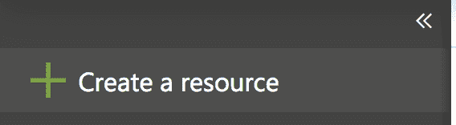](https://res.cloudinary.com/practicaldev/image/fetch/s--frZf4krz--/c_limit%2Cf_auto%2Cfl_progressive%2Cq_auto%2Cw_880/https://thepracticaldev.s3.amazonaws.com/i/m3u7ox70e1hnfcvfl269.png)

此后，我们需要选择一个接受容器的 Web 模板，如下所示:

[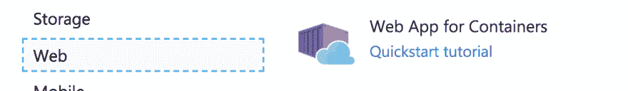](https://res.cloudinary.com/practicaldev/image/fetch/s--ImJCBSu_--/c_limit%2Cf_auto%2Cfl_progressive%2Cq_auto%2Cw_880/https://thepracticaldev.s3.amazonaws.com/i/tbho3zfew4auk5789dot.png)

此后，我们需要填写一些必填字段:

[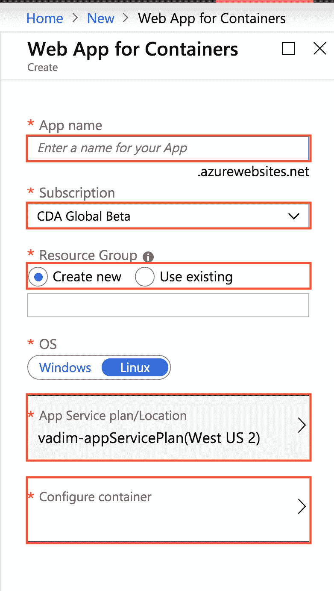](https://res.cloudinary.com/practicaldev/image/fetch/s--tz5K9lY8--/c_limit%2Cf_auto%2Cfl_progressive%2Cq_auto%2Cw_880/https://thepracticaldev.s3.amazonaws.com/i/hv4tjrud8dhybgav21ld.png)
`App name`需要是全局唯一的。选择您想要计费的`Subscription`。选择您刚刚创建的现有`Resource Group`。选择合适的`App Service plan`。最后，点击`Configure container`，现在是时候选择正确的容器注册表和镜像来创建容器了。

[](https://res.cloudinary.com/practicaldev/image/fetch/s--m6HFxETp--/c_limit%2Cf_auto%2Cfl_progressive%2Cq_auto%2Cw_880/portal-container-config.png) 这里我们选择我们创建的注册表`chrisgraphqlregistry`，在您的情况下，选择您创建的注册表。接下来我们选择图像`products-service`，接着是标签`v1`，最后我们选择启动文件`app.js`。最后，我们点击`Apply`，这将把我们带回之前的对话框，在这里我们按下`Create`。此时，它提供了一个服务端点，完成后会告诉我们结果 URL。

单击已配置的资源后，搜索您提供的`App name`。您应该看到这样的屏幕:

[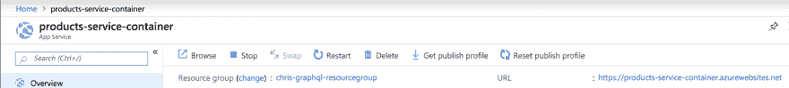](https://res.cloudinary.com/practicaldev/image/fetch/s--Fezk0hkt--/c_limit%2Cf_auto%2Cfl_progressive%2Cq_auto%2Cw_880/https://thepracticaldev.s3.amazonaws.com/i/qvida8dim90zzdfe2opv.png)

现在按照这些确切的说明做同样的事情，但是为`reviews-service`创建一个服务端点。

第一次点击任何一个网址都需要一段时间，所谓的*冷启动*。一旦准备好了，结果应该是这样的，对于`products-service`:

[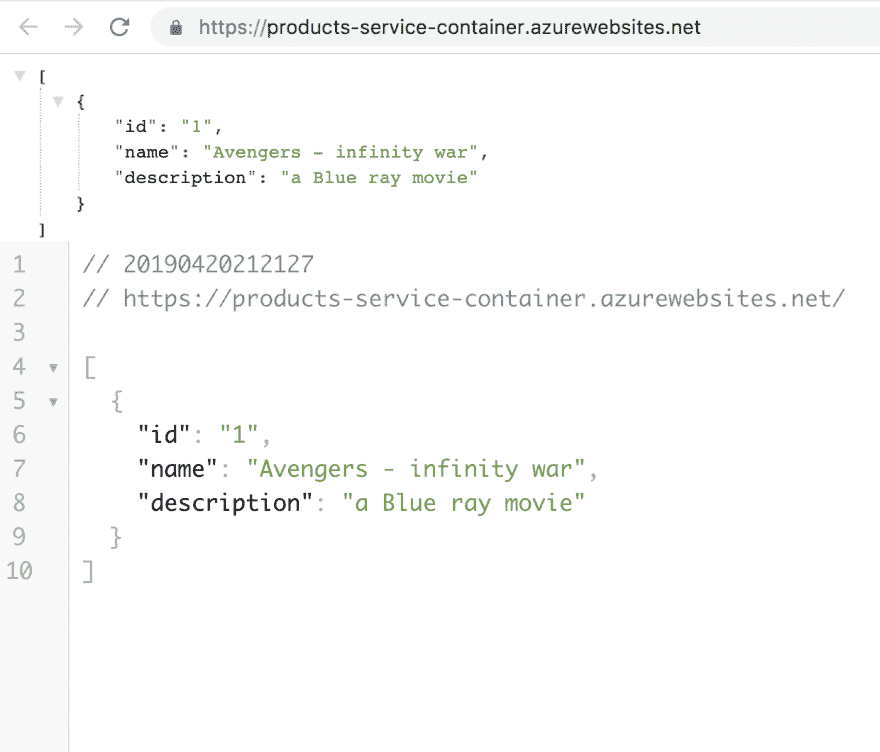](https://res.cloudinary.com/practicaldev/image/fetch/s--X090DWEs--/c_limit%2Cf_auto%2Cfl_progressive%2Cq_auto%2Cw_880/https://thepracticaldev.s3.amazonaws.com/i/kzb3jvuxe56mjub9r54g.png)

而像这样对于`reviews-service`:

[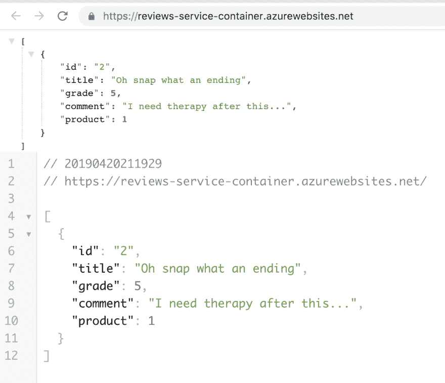](https://res.cloudinary.com/practicaldev/image/fetch/s--v0_CpyJM--/c_limit%2Cf_auto%2Cfl_progressive%2Cq_auto%2Cw_880/https://thepracticaldev.s3.amazonaws.com/i/0so113c6w5t4x6wgmm6i.png)

这意味着我们已经成功部署了我们的服务，并且我们已经完成了 90%的部署。还不算太糟，是吧？:)

## 部署无服务器应用

好的，我们需要做两件事来部署我们的无服务器应用程序:

1.  确保应用程序从云中读取其环境变量
2.  使用 VS 代码部署应用程序

### 使用 local.settings.json 结束。包封/包围（动词 envelop 的简写）

现在我们让库`dotenv`从一个`.env`文件中读入环境变量。这在我们要上云的时候就不行了。我们需要从我们的无服务器应用程序的`AppSettings`属性中读取这个，一旦它在云中。文件`local.setting.json`可以获取其内容并将其自身复制到 AppSettings 属性中，因此通过填充该文件，我们可以确保我们的环境变量最终出现在云中。

现在，我们已经成功地将服务部署到了云上，让我们在无服务器应用程序中创建一个名为`local.settings.json`的文件，内容如下所示，其中填充了服务端点 URL:

```
// local.settings.json

{
  "IsEncrypted": false,
  "Values": {
    "PRODUCTS_URL": "https://products-service-container.azurewebsites.net/",
    "REVIEW_URL": "https://reviews-service-container.azurewebsites.net/"
  }
} 
```

此时，我们可以进入`serverless/api/index.js`并删除显示
的行

```
require('dotenv').config() 
```

因为现在我们从`local.settings.json`开始读。现在运行调试器。转到您的浏览器，它应该在`http://localhost:7071/api/graphql`仍然可以工作。

### 部署无服务器应用

这意味着我们已经为最后的部署步骤做好了准备。你准备好了吗？我是说准备好了吗？好，好，我们开始吧:)

此时，我们需要与`Azure view`进行交互。如果看不到那就拿`View / Open View`，像这样:
[](https://res.cloudinary.com/practicaldev/image/fetch/s--wYHiwJA8--/c_limit%2Cf_auto%2Cfl_progressive%2Cq_auto%2Cw_880/open-view.png)

然后选择登录 Azure，如下所示:

[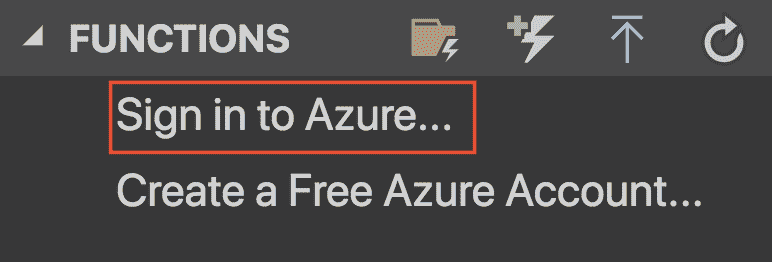](https://res.cloudinary.com/practicaldev/image/fetch/s--DFZcq5Xg--/c_limit%2Cf_auto%2Cfl_progressive%2Cq_auto%2Cw_880/https://thepracticaldev.s3.amazonaws.com/i/0485qfd86jawp4c9blx3.png)

这会将您带到一个浏览器页面，要求您登录。完成后，返回 VS 代码并选择以下内容:

[](https://res.cloudinary.com/practicaldev/image/fetch/s--AE4QKLqK--/c_limit%2Cf_auto%2Cfl_progressive%2Cq_auto%2Cw_880/https://thepracticaldev.s3.amazonaws.com/i/p07g5173lrpvuwuusvi0.png)

好了，此时会要求您选择一个订阅。之后，你来到这个对话框
[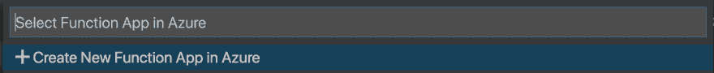](https://res.cloudinary.com/practicaldev/image/fetch/s--oXblb3JX--/c_limit%2Cf_auto%2Cfl_progressive%2Cq_auto%2Cw_880/https://thepracticaldev.s3.amazonaws.com/i/feovtte58st3x1l1byez.png) 。
点击在 Azure 中创建新的功能应用。

最后，系统会要求您为应用程序命名。它需要是全球唯一的。此时，它将开始调配资源。在我们等待它结束时，它会显示类似这样的内容:

[](https://res.cloudinary.com/practicaldev/image/fetch/s--5quiBwIh--/c_limit%2Cf_auto%2Cfl_progressive%2Cq_auto%2Cw_880/https://thepracticaldev.s3.amazonaws.com/i/sx350ke8d6u820s8kycn.png)

完成后，它会向您显示以下内容:

[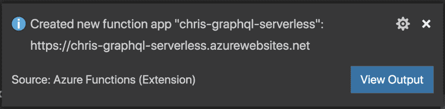](https://res.cloudinary.com/practicaldev/image/fetch/s--hFuSM_AP--/c_limit%2Cf_auto%2Cfl_progressive%2Cq_auto%2Cw_880/https://thepracticaldev.s3.amazonaws.com/i/7nis5z0xk4fcyv2y6dnm.png)

好了，让我们点击`View Output`:

第一次看到这个输出时，可能会说它不知道`PRODUCTS_URL`和`REVIEWS_URL`，但是我们可以在我们的 Azure 菜单中解决这个问题，就像这样:

[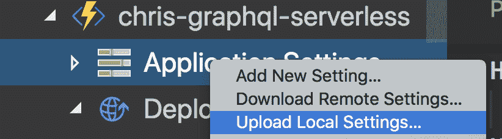](https://res.cloudinary.com/practicaldev/image/fetch/s--SCf7_LzH--/c_limit%2Cf_auto%2Cfl_progressive%2Cq_auto%2Cw_880/https://thepracticaldev.s3.amazonaws.com/i/yw4d7m5d02nneh1a4ro3.png)

之后。再次前往入口。点击`get function URL`:

[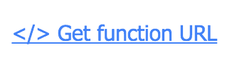](https://res.cloudinary.com/practicaldev/image/fetch/s--Kt73GTga--/c_limit%2Cf_auto%2Cfl_progressive%2Cq_auto%2Cw_880/https://thepracticaldev.s3.amazonaws.com/i/rbighlc06hrcsm35piha.png) 
这个时候你应该在浏览器里看到这个:

[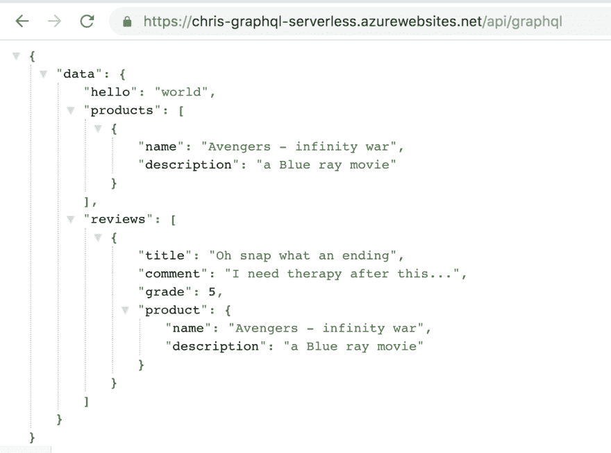](https://res.cloudinary.com/practicaldev/image/fetch/s--b25LhTSt--/c_limit%2Cf_auto%2Cfl_progressive%2Cq_auto%2Cw_880/https://thepracticaldev.s3.amazonaws.com/i/8ef5wfhx2pet77w1eaur.png)

我们做到了。我们将服务部署到云中，部署了无服务器应用程序。

**最终触摸**

现在，我们正在对发送到 GraphQL API 的查询内容进行硬编码，所以让我们解决这个问题并重新部署。代码现在应该是这样的:

```
// serverless/graphql/index.js

const { graphql, schema } = require('../api')

module.exports = async function (context, req) {
    context.log('Products url', process.env.PRODUCTS_URL);
    context.log('Reviews url', process.env.REVIEW_URL);

    context.log('JavaScript HTTP trigger function processed a request.');

    const query = req.query.query || (req.body && req.body.query);

    if(!query) {
        context.res = {
            status: 400,
            body: "You must send `query` as a query parameter or in the body"
        };
    }

    const result = await graphql({
        schema,
        source: query
    })
    context.res = {
        // status: 200, /* Defaults to 200 */
        body: result
    };
}; 
```

现在，重新部署
[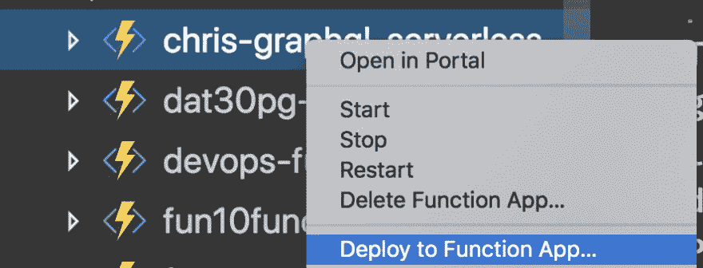](https://res.cloudinary.com/practicaldev/image/fetch/s--t9HjJQEb--/c_limit%2Cf_auto%2Cfl_progressive%2Cq_auto%2Cw_880/https://thepracticaldev.s3.amazonaws.com/i/zzz3vdn3cz1kvjv8ffsz.png)

它应该是这样的:

[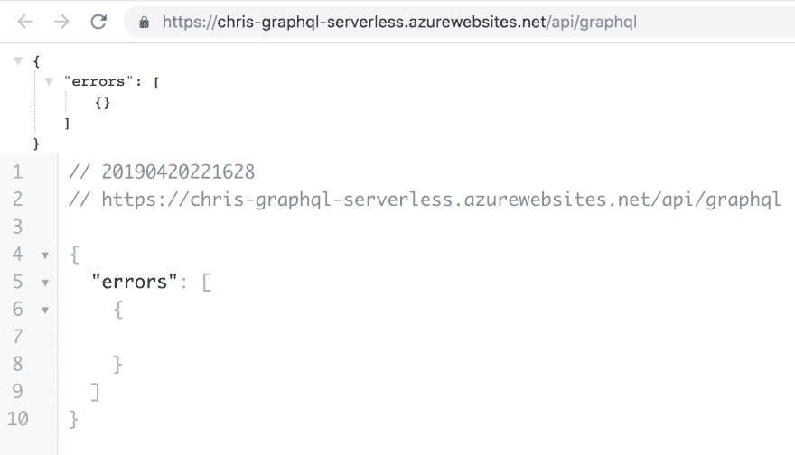](https://res.cloudinary.com/practicaldev/image/fetch/s--6cpEeaK3--/c_limit%2Cf_auto%2Cfl_progressive%2Cq_auto%2Cw_880/https://thepracticaldev.s3.amazonaws.com/i/s9qhcfgjogu6q277utav.png)

好的，它似乎在工作，如果它没有得到一个查询参数就会失败。让我们给它一个`query`，然后用查询`{ reviews { grade, product { name } } }`给它赋值

[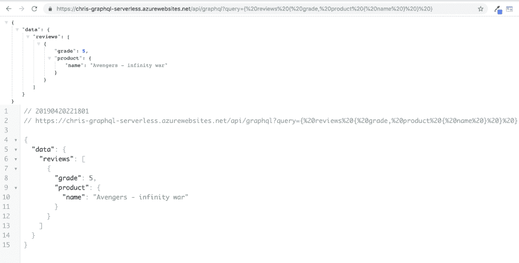](https://res.cloudinary.com/practicaldev/image/fetch/s--mBYt5PNW--/c_limit%2Cf_auto%2Cfl_progressive%2Cq_auto%2Cw_880/https://thepracticaldev.s3.amazonaws.com/i/lrjszjqshix6yoyg949y.png)

## 总结

好了，孩子们。一个工作的无服务器/GRaphQL API 与微服务对话，也在云中。你有多兴奋？我很兴奋:

[](https://res.cloudinary.com/practicaldev/image/fetch/s--y35k4xRa--/c_limit%2Cf_auto%2Cfl_progressive%2Cq_66%2Cw_880/https://thepracticaldev.s3.amazonaws.com/i/wcbuqieaaeln403ou7sn.gif)

我们从独立的微服务开始。将它们分类并确保每个服务都可以通过 URL 访问。那时，我们开始构建一个 GraphQL API，并开始查询这些服务，作为一种将数据缝合在一起的方式，这是 GraphQL 在许多其他 API 之上的优势之一。

在这一部分中，我们将这些服务放到了云中。我们还创建了一个无服务器应用程序，并引入了我们的 GraphQL API，它也被发送到了云中，突然间一切都在云中，可以单独维护和重新部署。我们以一种很好的方式来扩展我们的 GraphQL API，我们真的在利用无服务器的优势，我们专注于编写代码，并确保我们不会支付超过我们使用的费用。