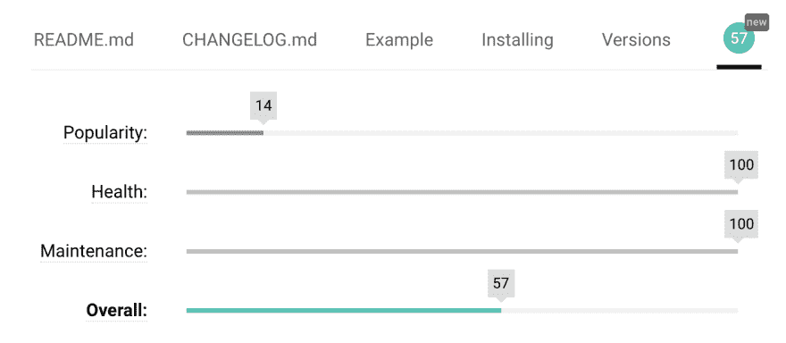
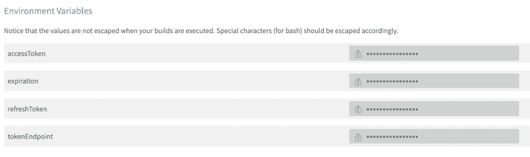

# 用 Travis CI 发布一个 Flutter 包

> 原文：<https://dev.to/robertohuertasm/publishing-a-flutter-package-with-travis-ci-20h3>

你正在考虑建立一个[颤振包](https://pub.dartlang.org/flutter)或者你已经建立了一个，但你不知道如何设置[特拉维斯-CI](https://travis-ci.org/) ？如果是这样的话，你来对地方了！

## 构建一个扑包

学习如何构建自己的[颤振包](https://pub.dartlang.org/flutter)的最好方法是阅读[颤振文档](https://flutter.io/docs/development/packages-and-plugins/developing-packages)。这个过程非常简单，所以我认为不值得在这里重复。😉

需要考虑的一件重要事情是，所有的[颤振包](https://pub.dartlang.org/flutter)都被[评定为](https://pub.dartlang.org/help#scoring)，这取决于包的质量。这意味着，如果你提供一个`Example`，你将获得更多的积分。但是不要担心，无论何时你发布你的包，你都会看到一些关于如何提高这个[分数](https://pub.dartlang.org/help#scoring)的信息。

[](https://res.cloudinary.com/practicaldev/image/fetch/s--UjEhsX9y--/c_limit%2Cf_auto%2Cfl_progressive%2Cq_auto%2Cw_880/https://thepracticaldev.s3.amazonaws.com/i/1k3bzto4u5bp8p6ee9gn.png)

## 构成 Travis-CI 配置文件

你所要做的就是在你的项目的根目录下创建一个名为`.travis.yml`的新文件，并复制下面的内容:

```
language: dart
dart:
  - stable
os:
  - linux
sudo: false
addons:
  apt:
    sources:
      - ubuntu-toolchain-r-test # you need this source to get the right version of libstdc++6
    packages:
      - libstdc++6
      - fonts-droid
install:
  - echo 'Avoid default Travis CI install step' # this is to avoid an error with pub in Travis
before_script:
  - cd ..
  - git clone https://github.com/flutter/flutter.git
  - export PATH=`pwd`/flutter/bin:`pwd`/flutter/bin/cache/dart-sdk/bin:$PATH
  - flutter doctor
script:
  - cd $TRAVIS_BUILD_DIR
  - flutter packages get
  - flutter analyze --no-pub --no-current-package lib
  - flutter test
  - flutter packages pub publish --dry-run
before_deploy:
  - chmod +x ./.travis/publish.sh # giving execution permissions to this file to avoid error 127.
  - mv ./.travis ../ # moving this out the publication folder as we don't want to publish it.
deploy:
  provider: script
  skip_cleanup: true
  script: '../.travis/publish.sh'
  on:
    tags: true
cache:
  directories:
    - $HOME/.pub-cache 
```

Enter fullscreen mode Exit fullscreen mode

请注意，我们只在创建新的`tag`时发布我们的包。

## 出版脚本

一旦准备好并设置好了`.travis.yml`文件，就必须创建一个**发布脚本**。

让我们创建一个名为`.travis`的新文件夹，并在其中创建一个名为`publish.sh`的文件。复制下面的脚本:

```
#!/usr/bin/env bash
mkdir -p .pub-cache

cat <<EOF > ~/.pub-cache/credentials.json
{
  "accessToken":"$accessToken",
  "refreshToken":"$refreshToken",
  "tokenEndpoint":"$tokenEndpoint",
  "scopes":["https://www.googleapis.com/auth/plus.me","https://www.googleapis.com/auth/userinfo.email"],
  "expiration":$expiration } EOF echo "Let's publish this!"
pub publish -f 
```

Enter fullscreen mode Exit fullscreen mode

如您所见，发布脚本需要一些环境变量。但是，我们如何得到它们呢？

不幸的是，获得这些信息的唯一方法是**手动发布您的包**，这样您就可以认证并获得所有必要的令牌。

这应该是一个**简单的一次性过程**所以让我们开始吧！

首先，让我们测试一下一切工作正常，并通过执行
来做一个*“假发布”*

```
pub publish --dry-run 
```

Enter fullscreen mode Exit fullscreen mode

如果你发现有问题，就去解决它。如果一切正常，那么就:

```
pub publish 
```

Enter fullscreen mode Exit fullscreen mode

你将被立即要求打开你的浏览器，用你的**谷歌凭证**进行认证，一旦你通过认证，一个**新文件将**在你的电脑中:`~/.pub-cache/credentials.json`。

打开它，在那里您将找到设置 [Travis 环境变量](https://docs.travis-ci.com/user/environment-variables/)所需的所有信息。

[](https://res.cloudinary.com/practicaldev/image/fetch/s--yRbzWuv---/c_limit%2Cf_auto%2Cfl_progressive%2Cq_auto%2Cw_880/https://thepracticaldev.s3.amazonaws.com/i/jcgahna80j4yvqwotn5r.png)

## 把事情考虑进去

有几件事我很艰难地发现了:

1.  如果你提供了一个**示例文件夹**，确保其中有一个`pubspec.yaml`，否则`flutter packages get`命令将会失败。在推送任何更改之前，请确保该文件夹中的所有内容都正常工作。

2.  检查您的`publish.sh`脚本是否有**执行权限**。如果你不这样做，你会得到一个**神秘的 127 错误**。

3.  当您选择`Dart`作为默认语言时，`Travis`会自动调用`pub get`。这将导致您收到一个错误(这似乎是 Travis 中的一个已知问题)。摆脱它的唯一方法是完全覆盖`install`步骤。这已经在我们之前的`.travis.yml`脚本中为你管理好了😉。

4.  **发布令牌**将最终过期，因此当这种情况发生时，我们必须重置`Travis`环境变量(因此再次进行手动发布😞).

## 试一试

如果你已经完成了所有的步骤，你的项目将会被分析、测试和构建，而不需要在每次你`push`到你的 git 库时发布。

无论何时你准备好发布，只要创建并推送一个新标签，`Travis`就会帮你搞定！😄

当然，您可以根据自己的需要随意定制脚本😉。

尽情享受吧！

-
最初发表于 2019 年 1 月 20 日[robertohuertas.com](https://robertohuertas.com/2019/01/20/publish-flutter-package-with-travis)。