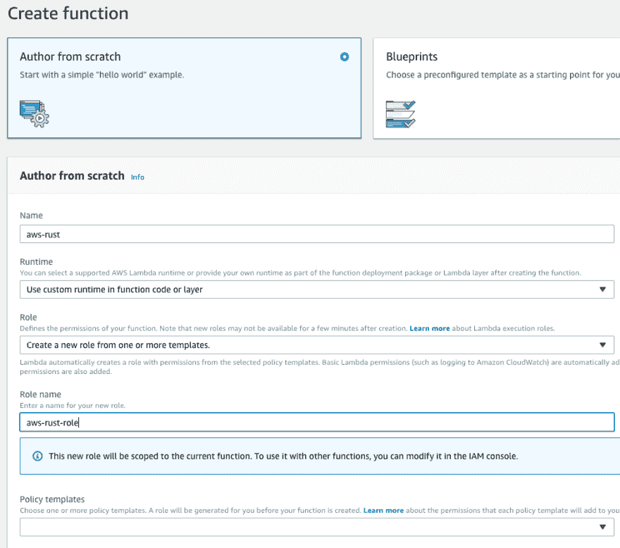
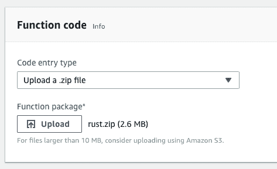
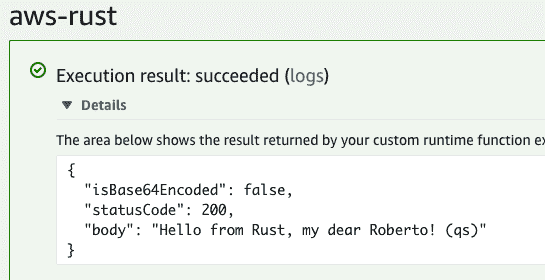
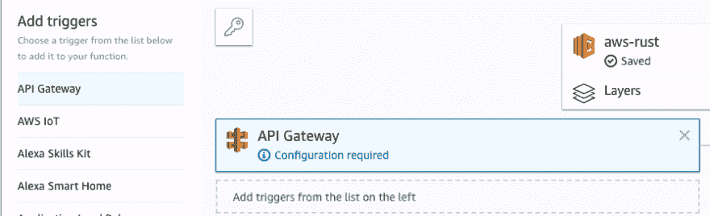
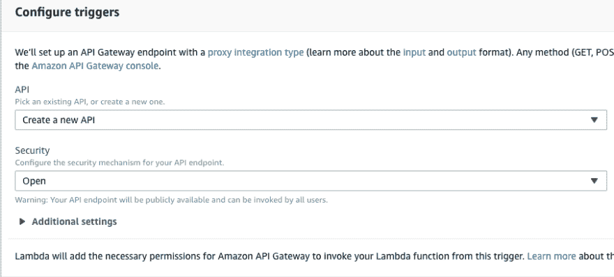
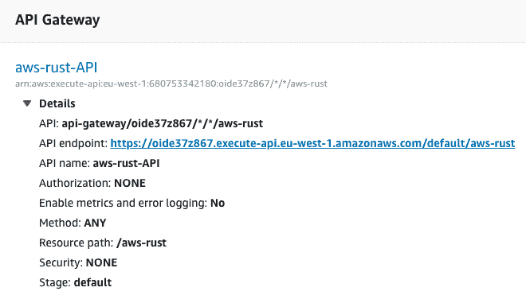

# 用 Rust 写的 AWS Lambda 函数

> 原文：<https://dev.to/robertohuertasm/aws-lambda-functions-written-in-rust-3bob>

[AWS Lambda](https://aws.amazon.com/lambda/) 最近宣布了**运行时 API**，并为[开源了 Rust 语言](https://github.com/awslabs/aws-lambda-rust-runtime)的运行时，这将允许我们使用 [Rust](https://www.rust-lang.org/) 来编写我们的 [AWS Lambda 函数](https://aws.amazon.com/lambda/)。

## 我们来构建一个 AWS Lambda 函数吧！

我们将从官方回购中扩展[基本示例，并提供一些提示使其与`API Gateway`一起工作，这样我们就可以从互联网上消费我们的`Lambda function`。](https://github.com/awslabs/aws-lambda-rust-runtime/blob/master/lambda-runtime/examples/basic.rs)

我们将要构建的`Lambda function`的代码在[这里](https://github.com/robertohuertasm/aws-lambda-rust)，如果你想看的话，你可以看看。

## 创建项目

让我们使用 cargo 来构建我们的项目:

```
cargo new aws-lambda-rust 
```

Enter fullscreen mode Exit fullscreen mode

一旦我们创建了项目，打开`Cargo.toml`文件，使它看起来像这样:

```
[package]
name = "aws-lambda-rust"
version = "0.1.0"
authors = ["You <your@email.com>"]
edition = "2018"
autobins = false

[[bin]]
name = "bootstrap"
path = "src/main.rs"

[dependencies]
lambda_runtime = "0.1"
serde = "1.0.80"
serde_derive = "1.0.80"
serde_json = "1.0.33" 
```

Enter fullscreen mode Exit fullscreen mode

我们必须创建的可执行文件需要被称为`bootstrap`。这是非常重要的，因为如果我们不坚持这个惯例，我们的`Lambda function`就不会工作。

如你所知，默认情况下，`Cargo`将使用项目的名称作为可执行文件。改变这种行为的一个简单方法是使用`autobins = false`并在`bin`部分中显式设置可执行文件的名称和路径:

```
[[bin]]
name = "bootstrap"
path = "src/main.rs" 
```

Enter fullscreen mode Exit fullscreen mode

## 编写我们的函数

打开`main.rs`文件，使用下面的代码。注意这个代码是`2018 edition`。查看评论，更好地了解正在发生的事情:

```
use lambda_runtime::{error::HandlerError, lambda};
use std::error::Error;
use serde_derive::{Serialize, Deserialize};

// Struct that will hold information of the request.
// When we use an API Gateway as a proxy, which is the default
// behaviour when we create it from the Lambda website, the request
// will have a specific format with many different parameters.
// We're only going to use `queryStringParameters` to check the
// query string parameters (normally for GET requests) and `body`
// to check for messages usually coming from POST requests.
#[derive(Deserialize, Clone)]
struct CustomEvent {
    // note that we're using serde to help us to change
    // the names of parameters accordingly to conventions.
    #[serde(rename = "queryStringParameters")]
    query_string_parameters: Option<QueryString>,
    body: Option<String>,
}

#[derive(Deserialize, Clone)]
struct QueryString {
    #[serde(rename = "firstName")]
    first_name: Option<String>,
}

#[derive(Deserialize, Clone)]
struct Body {
    #[serde(rename = "firstName")]
    first_name: Option<String>,
}

// Struct used for our function's response.
// Note again that we're using `serde`.
// It's also important to notice that you will need to explicitely
// inform these properties for our API Gateway to work.
// If you miss some of these properties you will likely get
// a 502 error.
#[derive(Serialize, Clone)]
struct CustomOutput {
    #[serde(rename = "isBase64Encoded")]
    is_base64_encoded: bool,
    #[serde(rename = "statusCode")]
    status_code: u16,
    body: String,
}

// Just a static method to help us build the `CustomOutput`.
impl CustomOutput {
    fn new(body: String) -> Self {
        CustomOutput {
            is_base64_encoded: false,
            status_code: 200,
            body,
        }
    }
}

// This is our function entry point.
// Note the use of the `lambda!` macro. It will hold our handler:
// pub type Handler<E, O> = fn(E, Context) -> Result<O, HandlerError>
fn main() -> Result<(), Box<dyn Error>> {
    lambda!(my_handler);
    Ok(())
}

// Our handler will just check for a query string parameter called `firstName`.
// Note the different behavior depending on the value of the parameter.
// In case there's no query string parameter, we'll check the body of the request.
// The body comes as a string so we'll have to use `Serde` again to deserialize it.
// Finally, if we have no body, we'll return a default response.
fn my_handler(e: CustomEvent, c: lambda_runtime::Context) -> Result<CustomOutput, HandlerError> {
    // checking the query string
    if let Some(q) = e.query_string_parameters {
        if let Some(first_name) = q.first_name {
            return match first_name.as_ref() {
                "" => Ok(CustomOutput::new(format!(
                    "Hello from Rust, my dear default user with empty parameter! (qs)"
                ))),
                "error" => Err(c.new_error("Empty first name (qs)")),
                _ => Ok(CustomOutput::new(format!(
                    "Hello from Rust, my dear {}! (qs)",
                    first_name
                ))),
            };
        }
    }

    // cheking the body
    if let Some(b) = e.body {
        let parsed_body: Result<Body, serde_json::Error> = serde_json::from_str(&b);
        if let Ok(result) = parsed_body {
            return match result.first_name.as_ref().map(|s| &s[..]) {
                Some("") => Ok(CustomOutput::new(format!(
                    "Hello from Rust, my dear default user with empty parameter! (body)"
                ))),
                Some("error") => Err(c.new_error("Empty first name (body)")),
                _ => Ok(CustomOutput::new(format!(
                    "Hello from Rust, my dear {}! (body)",
                    result.first_name.unwrap_or("".to_owned())
                ))),
            };
        }
    }

    Ok(CustomOutput {
        is_base64_encoded: false,
        status_code: 200,
        body: format!("Hello from Rust, my dear default user! No parameters"),
    })
} 
```

Enter fullscreen mode Exit fullscreen mode

## 建设我们的项目

[AWS Lambda](https://aws.amazon.com/lambda/) 将在[亚马逊 Linux 环境](https://docs.aws.amazon.com/lambda/latest/dg/current-supported-versions.html)中执行我们的功能。

这意味着我们将不得不添加一个名为`x86_64-unknown-linux-musl` :
的新`target`

```
rustup target add x86_64-unknown-linux-musl 
```

Enter fullscreen mode Exit fullscreen mode

现在，根据您的操作系统，您将不得不做不同的事情。

### 你用的是 Linux

如果你使用的是`Linux`，你只需要安装`musl-tools` :

```
sudo apt install musl-tools 
```

Enter fullscreen mode Exit fullscreen mode

### 您正在使用 Mac OSX

如果你碰巧正在使用`Mac OSX`，你将需要添加更多的东西。

首先，我们将使用`Homebrew`安装`musl-cross`，这将是我们的`linker` :

```
brew install filosottile/musl-cross/musl-cross 
```

Enter fullscreen mode Exit fullscreen mode

然后，我们将创建一个包含一些`config`文件的`.cargo`文件夹:

```
mkdir .cargo
echo '[target.x86_64-unknown-linux-musl]
linker = "x86_64-linux-musl-gcc"' > .cargo/config 
```

Enter fullscreen mode Exit fullscreen mode

最后，为了避免依赖关系的一些问题，确保为新的链接器
创建一个`symlink`

```
ln -s /usr/local/bin/x86_64-linux-musl-gcc /usr/local/bin/musl-gcc 
```

Enter fullscreen mode Exit fullscreen mode

### 常见的最后一步

因此，假设我们已经设置好了一切，我们将继续使用`Cargo` :
来最终构建我们的项目

```
cargo build --release --target x86_64-unknown-linux-musl 
```

Enter fullscreen mode Exit fullscreen mode

这将在`./target/x86_64-unknown-linux-musl/release`目录中创建一个名为`bootstrap`的可执行文件。

不幸的是， [AWS Lambda](https://aws.amazon.com/lambda/) 期望这个包作为`zip file`被部署，所以最后一步:

```
zip -j rust.zip ./target/x86_64-unknown-linux-musl/release/bootstrap 
```

Enter fullscreen mode Exit fullscreen mode

这将在我们项目的`root`中创建一个`rust.zip`文件。

## 部署功能

让我们通过浏览 [AWS Lambda 控制台](https://console.aws.amazon.com/lambda/home)来**创建一个新函数**。

一旦出现，确保你的屏幕看起来像下图，然后点击**创建功能**:

[](https://res.cloudinary.com/practicaldev/image/fetch/s--G2cELC5W--/c_limit%2Cf_auto%2Cfl_progressive%2Cq_auto%2Cw_880/https://thepracticaldev.s3.amazonaws.com/i/mteeetd9u3oily28xoqs.png)

然后，在**功能码**部分，上传`.zip file`，按**保存**按钮。

[](https://res.cloudinary.com/practicaldev/image/fetch/s--3TCA4RfQ--/c_limit%2Cf_auto%2Cfl_progressive%2Cq_auto%2Cw_880/https://thepracticaldev.s3.amazonaws.com/i/5gju2yq2dbztqa9obntk.png)

如果你愿意，你可以测试你的**函数**。请记住，我们期待的是这样一个对象:

```
{  //  query  string  params  is  an  object  "queryStringParameters":  {  "firstName":  "Roberto"  },  //  body  always  comes  as  a  string  "body":  "{ \"firstName\": \"Rob\" }"  } 
```

Enter fullscreen mode Exit fullscreen mode

您应该会看到类似这样的内容:

[](https://res.cloudinary.com/practicaldev/image/fetch/s--aK1u936e--/c_limit%2Cf_auto%2Cfl_progressive%2Cq_auto%2Cw_880/https://thepracticaldev.s3.amazonaws.com/i/9lc7zku8ji8ufogbw5w7.png)

## 通过 API 网关公开功能

现在我们要创建一个新的`API Gateway`，这样我们就可以从互联网上访问我们的功能。

在`Add triggers`部分，选择`API Gateway`。

[](https://res.cloudinary.com/practicaldev/image/fetch/s--e9cAeZOY--/c_limit%2Cf_auto%2Cfl_progressive%2Cq_auto%2Cw_880/https://thepracticaldev.s3.amazonaws.com/i/zwjbv71via02dnueeqm5.png)

然后这样配置触发器，点击`Add`和`Save`:

[](https://res.cloudinary.com/practicaldev/image/fetch/s--EYolYJwG--/c_limit%2Cf_auto%2Cfl_progressive%2Cq_auto%2Cw_880/https://thepracticaldev.s3.amazonaws.com/i/hwc70a7y7xl77u4c7mfj.png)

您应该会看到类似下图的内容:

[](https://res.cloudinary.com/practicaldev/image/fetch/s--RCSXjIWJ--/c_limit%2Cf_auto%2Cfl_progressive%2Cq_auto%2Cw_880/https://thepracticaldev.s3.amazonaws.com/i/vneh40y6egahyawt2xuy.png)

您可以点击您的 api 的名称(在我们的例子中是`aws-rust-API`),您将被重定向到`API Gateway`配置页面。从那里你应该能够重新测试你的 API，如果需要的话做一些映射和/或重新部署它。

你也可以通过浏览到这个网址来检查我们的 API 是否在工作:
[https://oide 37 z 867 . execute-API . eu-west-1 . Amazon AWS . com/default/AWS-rust？名字=读者](https://oide37z867.execute-api.eu-west-1.amazonaws.com/default/aws-rust?firstName=READER)

## 结论

如你所见，使用 [Rust](https://www.rust-lang.org/) 编写一个`AWS Lambda Function`非常简单。你现在没有任何借口不开始在你的**无服务器**项目中使用它😄。

记住，如果你想获得这篇文章的完整代码，你可以浏览到[这个报告](https://github.com/robertohuertasm/aws-lambda-rust)。

-
原载于 2018 年 12 月 2 日[robertohuertas.com](https://robertohuertas.com/2018/12/02/aws-lambda-rust)。