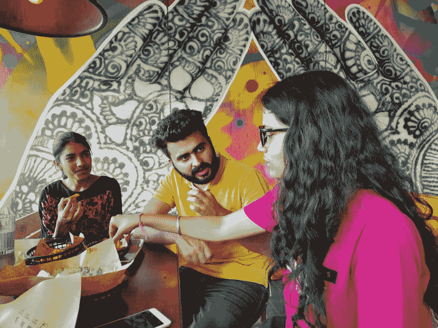

# 开发者如何度过他们的周末？

> 原文：<https://dev.to/xenoxdev/how-do-devs-spend-their-weekends-4mgj>

嘿伙计们！希望大家都顺利！周末到了，对我们许多人来说，这意味着休息和放松。我们都有自己的放松方式。有些人喜欢和家人在一起，有些人喜欢和朋友出去，有些人喜欢坐在咖啡馆里看书。可能性是无限的。

我个人？我喜欢时不时切换一下，让事情变得有趣。所以我和我的团队经常一起出去。有些周末，我们一起去看电影。我们一起抓到的最后一个是惊奇队长。

其他时候，我们去打保龄球或者去游乐场。永远都是爆款。

我们也喜欢在咖啡或午餐时进行头脑风暴。我们几乎每隔一周就做一次。
[T3】](https://res.cloudinary.com/practicaldev/image/fetch/s--eOZg9pOO--/c_limit%2Cf_auto%2Cfl_progressive%2Cq_auto%2Cw_880/https://thepracticaldev.s3.amazonaws.com/i/nz0r36hlq3fe5pizt6u1.jpg)

最后，每隔几个月，我们还会出去进行一次短途旅行。我们做的最后一个是二月份的 Gilbert Trail trek，Utkarsh 甚至制作了一个短视频。看看吧！

[https://www.youtube.com/embed/YjokMfiPIoc](https://www.youtube.com/embed/YjokMfiPIoc)

这只是 XenoX 团队喜欢的几个有趣的周末方式。你呢？

你如何度过周末？

在下面的评论里告诉我。如果你能用一两张 gif 总结你的周末，那就更好了！😉