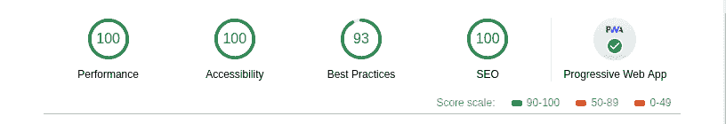

# 盖茨比把 SEO 放在第一位

> 原文：<https://dev.to/wesleylhandy/putting-seo-first-with-gatsby-3n2g>

[](/static/d580489e8877a5a2439959d5d0b2b3cd/de376/gatsby-stickers.jpg)

出于对 [React](https://reactjs.org/) 的热爱，以及对快速、高性能、响应性应用程序的渴望，我被[盖茨比](https://www.gatsbyjs.org/)所吸引。我开始学习 React 的时候，正好是图书馆开始接受 ES6 课程的时候，也是`create-react-app`刚刚起步的时候。起初，学习简单的代理让前端与一个`node` / `express` API 并发运行是一个挑战。然而，从这一点到服务器端渲染需要更多的研究和努力。和更大的编码社区一起学习很有趣。我可以继续列举我遇到并解决的其他技术问题，还有一些我仍然需要学习的其他问题，但请注意到目前为止关于我的旅程的一些重要内容——这是一次*技术的第一次旅程*，侧重于各种语言和库的知识和技能，这是必要的，但可能不是主要的。最后想到的是 **SEO** 、**可访问性**和**安全性**。

## 树立 SEO 第一的心态

我将把可访问性和安全性放在后面，但是在我深入到`Gatbsy`生态系统的过程中，给我留下深刻印象的是**配置搜索引擎优化**的便捷性。事实上，你可以在开发 UI 之前很久就为你的网站或应用程序创建一个 SEO 驱动的架构。我想从一开始就向你介绍我到目前为止在为 SEO 优化 Gatsby 站点时学到的东西。

### *我们开始之前*

你需要对盖茨比有所了解。要学习如何安装`gatbsy-cli`并从众多 Gatsby 初学者之一创建新的 Gatsby 项目，请考虑[完成 Gatsby 教程](https://www.gatsbyjs.org/tutorial/)。

否则，[从 SEO 类别中选择一个启动器](https://www.gatsbyjs.org/starters/?c=SEO&v=2)，打开 SEO 组件，或者从命令行运行
来使用`gatsby-starter-default`

```
gatsby new seo-blog https://github.com/gatsbyjs/gatsby-starter-default 
```

SEO 组件依赖于`react-helmet`，如果你的启动器没有初始化 SEO，请确保添加它。我们还想添加一些其他功能，如网站地图，谷歌分析，和 RSS 供稿，为联合。最后，我们需要创建`robots.txt`来管理搜索引擎如何抓取网站。出于间距的考虑，我将下面的命令分开，但是它们可以作为一个`yarn add`命令运行:

```
yarn add react-helmet gatsby-plugin-react-helmet 
yarn add gatsby-plugin-feed gatsby-plugin-google-analytics gatsby-plugin-sitemap
yarn add gatsby-plugin-robots-txt 
```

随着你的启动和这些插件的安装，我们已经准备好设置我们的搜索引擎优化性能的网站。

### 设置`gatsby-config.js`

在您的新 Gatsby 项目的根目录下，有一个 Gatsby 用来配置`siteMetaData`、`plugins`和[几个其他重要特性](https://www.gatsbyjs.org/docs/gatsby-config/)的文件。

这个文件，`gatsby-config.js`将负责将所有重要的 SEO 相关内容导入 GraphQL，或者直接创建必要的文件(比如`robots.txt`)。

#### 站点元数据

顾名思义，元数据是贯穿整个站点的数据。它可以在任何地方使用，但在配置您的 SEO 组件和 Google 结构化数据时最方便。

将元数据初始化为带有键/值对的对象文字，这些键/值对可以转换为`<meta>`标记，或者可以传递给站点地图或页脚，只要您可能需要全局站点数据:

```
<meta name="title" content="My Super Awesome Site"/>
<meta name="description" content="My Super Awesome Site will blow your mind with radical content, extravagant colors, and hip designs."/> 
```

在这里，您需要规划在您的站点中可能使用的内容:

*   标题
*   描述
*   关键词
*   现场验证
*   社会联系
*   其他的

设置好`siteMetadata`后，您现在可以查询插件初始化中使用的数据，甚至在同一个`gatsby-config.js`文件中。我已经组织好了我的`siteMetadata`，这样我就可以进行下面的查询:

```
query: `
  site {
    siteMetadata {
      title
      description
      author
      siteUrl
      siteVerification {
        google
        bing
      }
      social {
        twitter
      }
      socialLinks {
        twitter
        linkedin
        facebook
        stackOverflow
        github
        instagram
        pinterest
        youtube
        email
        phone
        fax
        address
      }
      keywords
      organization {
        name
        url
      }
    }
  }
` 
```

该查询返回与该查询结构匹配的对象:

```
site: {
  siteMetadata: {
    title: String,
    description: String,
    author: String,
    siteUrl: String,
    siteVerification: {
      google: String,
      bing: String
    },
    social: {
      twitter: String
    },
    socialLinks: {
      twitter: String,
      linkedin: String,
      facebook: String,
      stackOverflow: String,
      github: String,
      instagram: String,
      pinterest: String,
      youtube: String,
      email: String,
      phone: String,
      fax: String,
      address: String
    },
    keywords: [String],
    organization: {
      name: String,
      url: String
    }
  }
} 
```

#### 插件设置

我们将重点关注四个插件，分别用于网站地图、RSS 提要、robots.txt 文件和 Google Analytics(用于跟踪网站的 SEO 成功情况)。我们将在`siteMetaData`之后立即初始化插件。

```
module.exports = {
    siteMetadata: {
      / **SEE ABOVE** /
    },
    plugins: [/ **An ARRAY** /], } 
```

*   **盖茨比插件网站地图**

    sitemap 插件可以简单使用，也可以带选项使用。一般来说，您希望包含任何高质量的内容，而 ***排除重复的内容、单薄的内容或身份验证后的页面*** 。Gatsby 为设置你的站点地图提供了一个[的详细步骤。](https://www.gatsbyjs.org/docs/creating-a-sitemap/) 

    ```
    plugins: [
    {
    resolve: `gatsby-plugin-sitemap`,
    options: {
      exclude: [`/admin`, `/tags/links`] 
    }
    },
    ] 
    ```

*   **盖茨比插件提要**

    ***RSS 提要有助于整合你网站上的内容，就像如果你有一个博客，并想交叉发布到另一个更好的博客，它有助于向搜索引擎传达你网站的变化。这个插件允许你创建任意数量的不同的 feeds，利用 GraphQL 的能力来查询你的数据。下面的一些内容取决于你如何在`gatsby-node.js`中组织你的页面和文章。提要将在`markdown`中遍历您的每个页面，生成一个 XML RSS 提要。Gatsby 提供了添加 RSS 提要的详细步骤。***

    ***特别注意使用下面的查询来完成提要。【T2***

    ```
    {
    resolve: `gatsby-plugin-feed`,
    options: {
    // graphQL query to get siteMetadata 
    query: ` 
      { 
        site { 
          siteMetadata { 
            title 
            description 
            siteUrl 
            site_url: siteUrl, 
            author 
          }
        }
      } 
    `, 
    feeds: [
      // an array of feeds, I just have one below
      {
        serialize: ({ query: { site, allMarkdownRemark } }) => {
          const { siteMetadata : { siteUrl } } = site;
          return allMarkdownRemark.edges.map(edge => {
            const { 
              node: { 
                frontmatter: {
                  title, 
                  date, 
                  path, 
                  author: { name, email }, 
                  featured: { publicURL }, 
                  featuredAlt
                },
                excerpt, 
                html
              } 
            } = edge;
            return Object.assign({}, edge.node.frontmatter, {
              language: `en-us`,
              title,
              description: excerpt,
              date,
              url: siteUrl + path,
              guid: siteUrl + path,
              author: `${email} ( ${name} )`,
              image: {
                url: siteUrl + publicURL,
                title: featuredAlt,
                link: siteUrl + path,
              },
              custom_elements: [{ "content:encoded": html }],
            })
          })
        },
        // query to get blog post data 
        query: ` 
          { 
            allMarkdownRemark(  
              sort: { order: DESC, fields: [frontmatter___date] }, 
            ) { 
              edges { 
                node { 
                  excerpt 
                  html 
                  frontmatter { 
                    path 
                    date 
                    title 
                    featured { publicURL } 
                    featuredAlt 
                    author { 
                      name 
                      email 
                    } 
                  } 
                } 
              } 
            } 
          } 
        `, 
        output: "/rss.xml",
        title: `My Awesome Site | RSS Feed`,
      },
    ],
    },
    }, 
    ```

*   **盖茨比-插件-机器人-txt**

    有了`robots.txt`文件，你可以指示爬虫根据某些条件忽略你的站点和/或单独的路径。[更详细的用例](https://www.gatsbyjs.org/packages/gatsby-plugin-robots-txt/?=robots)见插件描述。

    ```
    {
    resolve: 'gatsby-plugin-robots-txt',
    options: {
    policy: [{ userAgent: '*', allow: '/' }] 
    }
    }, 
    ```

*   **盖茨比插件谷歌分析**

    谷歌分析将帮助您跟踪用户如何找到您的网站并与您的网站互动，因此您可以随着时间的推移管理和更新您的网站，以获得更好的搜索引擎优化结果。使用 Google 验证您的网站，并在此存储您的分析密钥:

    ```
    {
    resolve: `gatsby-plugin-google-analytics`,
    options: {
    trackingId: ``, 
    },
    }, 
    ```

### 优化 SEO 组件

SEO 组件背后的秘制酱就是众所周知的`react-hemlet`包。每个页面和每个模板都导入 SEO 组件，因此您可以传递特定的信息来调整每个面向公众的页面的元数据。

发挥您的想象力——您可以向该组件传递什么来创建完美的启用 SEO 的页面？页面是登录页面、博客文章、媒体集、视频、专业简介还是产品？在[https://schema.org](https://schema.org/docs/schemas.html)上列出了 614 种模式。您可以将特定的模式相关信息传递给 SEO 组件。

如果您将这些值中的任何一个传递给组件，那么一个`StaticQuery`将会填充`siteMetaData`所缺少的内容。根据这些数据，`react-helmet`创建所有的`<meta>`标签，包括`open graph`和`twitter`卡片标签，并将相关数据传递给另一个返回`Google Structured Data`的组件。

不要包含很长的代码片段，参考“开始之前”部分，或者[参考安装](https://www.gatsbyjs.org/packages/gatsby-plugin-react-helmet/)的`gatsby-plugin-react-helment`页面。但是请注意，我的 SEO 组件的结构遵循了达斯汀·绍的这篇优秀文章中的[所描述的结构。](https://blog.dustinschau.com/search-engine-optimization-with-gatsby)

由于我修补了 SEO 组件，以下是我添加的功能:

*   传递给组件的附加字段用于:区分页面类型(如博客文章),处理除主站点作者之外的内容作者，以及处理页面和文章修改日期的更改。将来还会增加更多。

```
function SEO({
  description,
  lang,
  meta,
  keywords,
  image,
  title,
  pathname,
  isBlogPost,
  author,
  datePublished = false,
  dateModified = false
}) { 
```

*   有条件地设置`og:type`

```
{
  property: `og:type`,
  content: isBlogPost ? `article` : `website`,
}, 
```

*   总是在图像对象上设置一个`alt`属性

```
// ALWAYS ADD IMAGE:ALT 
{ property: "og:image:alt", content: image.alt }, 
{ property: "twitter:image:alt", content: image.alt }, 
```

*   处理安全图像

```
.concat(
  // handle Secure Image 
  metaImage && metaImage.indexOf("https") > -1 
    ? [
        { property: "twitter:image:secure_url", content: metaImage, }, 
        { property: "og:image:secure_url", content: metaImage },
    ] 
    : [] 
) 
```

*   添加一个组件来处理使用[schema.org](https://schema.org)类别的`Google Structured Data`。我在阅读各种文档和文章时遇到了这样一个组件的例子，我不记得我是在哪里第一次看到这个链接的，但是我从杰森·伦斯托夫那里借用并改编了[。我对他的优秀作品做了两处小小的改编。](https://github.com/jlengstorf/gatsby-theme-jason-blog/blob/e6d25ca927afdc75c759e611d4ba6ba086452bb8/src/components/SEO/SchemaOrg.js)

### 配置 SchemaOrg 组件

您将从`SEO`组件中导入并调用`SchemaOrg`组件，并将它放在`Helmet`组件的结束标记之后，并传递以下属性:

```
function SEO(.....) {
  ...
  return (
    <> {/* Fragment Shorthand */}
      <Helmet 
        {/* All the Meta Tag Configuration */}
      />
      <SchemaOrg 
        isBlogPost={isBlogPost} 
        url={metaUrl} 
        title={title} 
        image={metaImage} 
        description={metaDescription} 
        datePublished={datePublished} 
        dateModified={dateModified} 
        canonicalUrl={siteUrl} 
        author={isBlogPost ? author : siteMetadata.author} 
        organization={organization} 
        defaultTitle={title} 
      />   
    </>
  )
} 
```

这里我不会复制粘贴整个`SchemaOrg`组件。从上面的链接中抓取它，并在你的代码中给 Jason Lengstorf 一些信任。以下是我做的一些补充:

*   我在模式中添加了作者电子邮件。这将来自大多数页面的`siteMetadata`和博客帖子的`frontmatter`。这将支持多个作者为您的网站和每个页面可以反映出独特的，如果你这样选择。

```
author: {
  "@type": "Person",
  name: author.name,
  email: author.email, 
}, 
```

*   我将公司的标志从简单的 URI 更新为`ImageObject`类型。虽然`String` URI 对于`Organization`类型来说是可以接受的，但是谷歌有特定的期望，并且一直在抛出一个错误，直到我把它改成了`ImageObject`。

```
publisher: {
  "@type": "Organization",
  url: organization.url,
  logo: { 
    "@type": "ImageObject", 
    url: organization.logo.url, 
    width: organization.logo.width, 
    height: organization.logo.height
  }, 
  name: organization.name,
}, 
```

*   添加`dataModified`以反映初始发布后对`BlogPosting`类型页面的更改。

```
datePublished,
dateModified, 
```

当您的站点更加复杂时，您可以向该组件传递标志，根据需要返回不同类型的模式。但是无论你做什么，不要在没有首先将组件生成的`script`传递给[谷歌结构化数据测试工具](https://search.google.com/structured-data/testing-tool/u/0/)的情况下将你的网站投入生产。

## 总结思想

当我按照上面概述的计划配置我的网站时，我不仅得到了图片丰富、描述性强的社交分享卡，还在我的网站上运行灯塔审计时获得了完美的 SEO 分数:

[](/static/384cdb474a81538eeda376637170d853/ac127/lighthouse_audit_seo.png)

你也可以看到我的网站的可访问性得到了 100 分。这是如此容易与盖茨比得分，我会说我在这个话题上学到了什么。

最初发布在我的博客上，网址为[https://www . wesleylhandy . net/blog/SEO-accessibility-first-Gatsby . html](https://www.wesleylhandy.net/blog/seo-accessibility-first-gatsby.html)