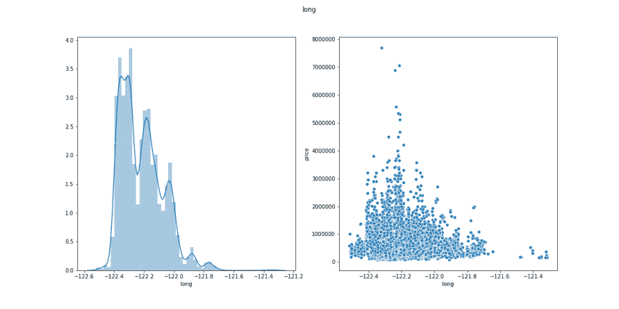
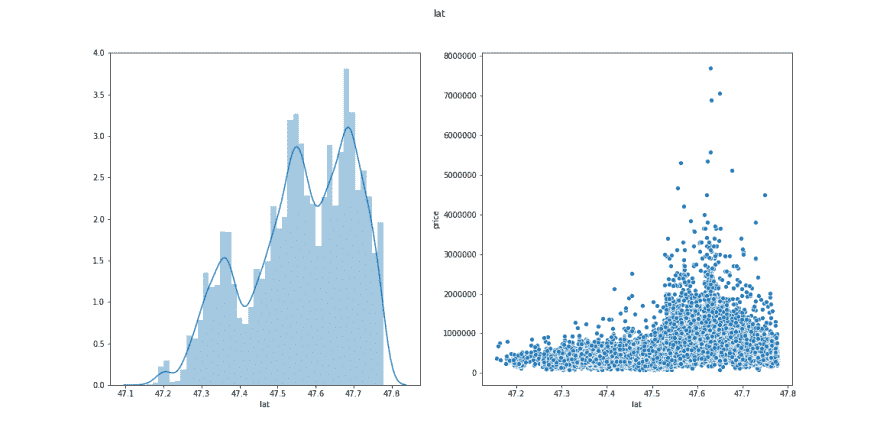
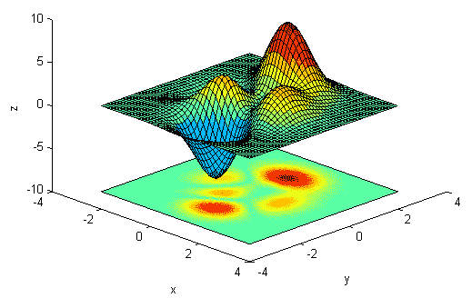

# 用哈弗辛公式预测建模的工程定位特征

> 原文：<https://dev.to/upwardtrajectory/engineering-location-features-with-haversine-s-formula-for-prediction-modeling-23n2>

以下是完整的 git 回购:[预测 King Co 房价](https://github.com/nkacoroski/dsc-1-final-project#module-1-final-project)这篇博文只是我们使用的一个策略的一个片段。
*与[合写娜塔莎·卡科罗斯基](https://github.com/nkacoroski)*

所以你想从一些数据中建立一个预测模型，但是有些列似乎有点。。。没用？或者，数据列可能会意外地推断出不应该存在的含义。让我们通过设计一些包含位置数据的列来尝试这一点，以便使用华盛顿州 King County Housing 数据集的一小部分来帮助预测房屋的价格。让我们探索如何将困难的列转化为有用的东西，而不是将它们扔掉或错误地使用它们。

```
import pandas as pd

df = pd.read_csv('kc_house_data.csv')
df.head().T 
```

|  | Zero | one | Two | three | four |
| --- | --- | --- | --- | --- | --- |
| 身份证明（identification） | Seven billion one hundred and twenty-nine million three hundred thousand five hundred and twenty | Six billion four hundred and fourteen million one hundred thousand one hundred and ninety-two | Five billion six hundred and thirty-one million five hundred thousand four hundred | Two billion four hundred and eighty-seven million two hundred thousand eight hundred and seventy-five | One billion nine hundred and fifty-four million four hundred thousand five hundred and ten |
| 日期 | 10/13/2014 | 12/9/2014 | 2/25/2015 | 12/9/2014 | 2/18/2015 |
| 价格 | Two hundred and twenty-one thousand nine hundred | Five hundred and thirty-eight thousand | One hundred and eighty thousand | Six hundred and four thousand | Five hundred and ten thousand |
| 卧室 | three | three | Two | four | three |
| 浴室 | one | Two point two five | one | three | Two |
| sqft _ 生活 | One thousand one hundred and eighty | Two thousand five hundred and seventy | Seven hundred and seventy | One thousand nine hundred and sixty | One thousand six hundred and eighty |
| sqft_lot | Five thousand six hundred and fifty | Seven thousand two hundred and forty-two | ten thousand | Five thousand | Eight thousand and eighty |
| 地面 | one | Two | one | one | one |
| 海滨 | 圆盘烤饼 | Zero | Zero | Zero | Zero |
| 视角 | Zero | Zero | Zero | Zero | Zero |
| 情况 | three | three | three | five | three |
| 等级 | seven | seven | six | seven | eight |
| sqft_above | One thousand one hundred and eighty | Two thousand one hundred and seventy | Seven hundred and seventy | One thousand and fifty | One thousand six hundred and eighty |
| 平方英尺 _ 地下室 | Zero | Four hundred | Zero | Nine hundred and ten | Zero |
| 建造年份 | One thousand nine hundred and fifty-five | One thousand nine hundred and fifty-one | One thousand nine hundred and thirty-three | One thousand nine hundred and sixty-five | One thousand nine hundred and eighty-seven |
| 翻新年份 | Zero | One thousand nine hundred and ninety-one | 圆盘烤饼 | Zero | Zero |
| 邮政编码 | Ninety-eight thousand one hundred and seventy-eight | Ninety-eight thousand one hundred and twenty-five | Ninety-eight thousand and twenty-eight | Ninety-eight thousand one hundred and thirty-six | Ninety-eight thousand and seventy-four |
| 拉脱维亚的货币单位 | 47.5112 | Forty-seven point seven two one | 47.7379 | 47.5208 | 47.6168 |
| 长的 | -122.257 | -122.319 | -122.233 | -122.393 | -122.045 |
| sqft _ living15 | One thousand three hundred and forty | One thousand six hundred and ninety | Two thousand seven hundred and twenty | One thousand three hundred and sixty | One thousand eight hundred |
| sqft_lot15 | Five thousand six hundred and fifty | Seven thousand six hundred and thirty-nine | Eight thousand and sixty-two | Five thousand | Seven thousand five hundred and three |

这些列中的每一列是什么意思？

```
from IPython.display import display, Markdown

with open('column_names.md', 'r') as fh:
    content = fh.read()

display(Markdown(content)) 
```

KING COUNTRY 数据集的列名和说明

*   **id** -为一栋房子唯一标识
*   **日期** -房子被卖掉了
*   **pricePrice** -是预测目标
*   **卧室数量** -卧室/房屋数量
*   **浴室数量** -浴室/卧室
*   **sqft_livingsquare** -家的镜头
*   **sqft_lotsquare** -批次的长度
*   **楼层总数** -室内楼层
*   海滨 -可以看到海滨的房子
*   **查看** -已被查看
*   **状况** -状况有多好(总体)
*   **等级** -根据金县分级系统，给予住房单元的总体等级
*   **sqft_above** -除地下室以外的房屋面积
*   **平方英尺 _ 地下室** -地下室的平方英尺
*   **yr _ build**-建造年份
*   **yr _ recruited**-房屋装修的年份
*   邮政编码
*   **纬度** -纬度坐标
*   **长** -经度坐标
*   **sqft_living15** -最近的 15 个邻居的室内居住面积
*   **sqft_lot15** -最近的 15 个邻居的土地面积

这些栏目中的许多似乎应该对价格有某种影响。特别是，俗话说“买房时要考虑的三个最重要的事情是位置、位置、位置”告诉我们，我们可能应该关心很多事情，如邮政编码、纬度和经度。另外，请注意，“sqft_living15”和“sqft_lot15”是数据库中其他人已经为我们设计的每栋房子的元数据。谢谢，金公司数据科学家！

我们可以使用很多专栏，但是对于这篇关于哈弗辛的教程，让我们只关注纬度和经度。让我们来看看这些数据是什么样子的。

```
target = df['price'].copy()
needs_work = df[['long', 'lat']].copy()

import seaborn as sns
import matplotlib.pyplot as plt

for col in needs_work:
    x = needs_work[col]
    y = target

    plt.figure(figsize=(16,8))
    plt.subplot(1,2,1)
    sns.distplot(x)
    plt.subplot(1,2,2)

    sns.scatterplot(x, y)
    plt.suptitle(col)
    plt.tight_layout
    plt.savefig(col + '.png') 
```

[](https://res.cloudinary.com/practicaldev/image/fetch/s--lvTLgunS--/c_limit%2Cf_auto%2Cfl_progressive%2Cq_auto%2Cw_880/https://github.com/nkacoroski/dsc-1-final-project/raw/blog/long.png)

[](https://res.cloudinary.com/practicaldev/image/fetch/s--RahDs9HH--/c_limit%2Cf_auto%2Cfl_progressive%2Cq_auto%2Cw_880/https://github.com/nkacoroski/dsc-1-final-project/raw/blog/lat.png)

尽管这两对图表看起来很相似，但请注意这些图上的 y 轴测量的是不同的东西。直方图只是简单地计算我们在数据中有多少 x 值的观察值，而散点图显示以 x 值出售的房屋的美元价格。这几乎就像卖出的房子越多(直方图高度)与更高的销售价格(散点图高度)有很强的相关性。供求法则在华盛顿州金县似乎仍然有效。我们将讨论如何使用哈弗辛的 3D 距离公式来处理这些关于预测销售价格的数据。

在我们进入公式的细节之前，让我们讨论一下为什么我们应该考虑增加位置数据。这里的问题是，只看地图上的一维运动不会特别产生准确的房价模式。另一种说法是，纬度和价格之间没有线性关系，经度和价格之间也没有线性关系。例如，如果有多个富人区，它们之间有价格较低的社区，那么仅使用一个维度的数据无法准确预测价值。在下图中(无耻地从[http://www . peteryu . ca/tutorials/MATLAB/image _ in _ 3d _ surface _ plot _ with _ multiple _ colormaps](http://www.peteryu.ca/tutorials/matlab/image_in_3d_surface_plot_with_multiple_colormaps))想象 Z 轴不是标高，而是房价。正如你在表面下的热图中看到的，当你只沿 X 方向或 Y 方向移动时，没有清晰的线性模式，但靠近图表右后部分附近的暗红色点*会有*预测价格的清晰模式。
(注意，在热点图上，靠近左下角的红色斑点实际上应该是蓝色的，因为在这个例子中，它代表非常低的房价。)

[](https://res.cloudinary.com/practicaldev/image/fetch/s--AjEVCWZC--/c_limit%2Cf_auto%2Cfl_progressive%2Cq_auto%2Cw_880/http://www.peteryu.ca/_media/tutorials/matlab/image_surf_3d_basic.png)

当使用多变量线性回归建模时，仅仅拥有纬度和经度实际上也没有帮助。相反，让我们想想为什么一些社区的房价会高而低。可能只是因为那些社区的房子可以看到山和水，但是任何一栋房子卖很多钱的唯一方式是如果有人出高价买它。我知道这看起来很简单，但是高房价需要高收入的工作，高收入工作的人会付更多的钱来方便地接近他们的工作(特别是如果房子可以看到山或水)。这让我相信，“高收入工作群的半径”可能是一个更好的住宅价值指标，而不是单独使用“经度”和“纬度”两列。我们来造一个吧！事实上，如果有多个就业集群，也许为每个“就业中心”建立一个单独的列是有意义的。

如果你愿意接受我们生活在一个圆形星球上，我们可以利用哈弗辛公式，它测量球体表面的三维弧长。这实际上只是勾股定理的一种改编。

我们改编了来自[https://stack overflow . com/questions/4913349/haversine-formula-in-python-bearing-and-distance-two-GPS-points/4913653](https://stackoverflow.com/questions/4913349/haversine-formula-in-python-bearing-and-distance-between-two-gps-points/4913653)的 python 代码

我们选择传入两个参数，每个参数的形式都是`[longitude, latitude]`。为此，我们首先构建一个新列作为函数的输入。

```
needs_work.head(2) 
```

|  | 长的 | 拉脱维亚的货币单位 |
| --- | --- | --- |
| Zero | -122.257 | 47.5112 |
| one | -122.319 | 47.7210 |

```
needs_work['long_lat'] = list(zip(needs_work['long'], needs_work['lat']))
needs_work.head(2) 
```

|  | 长的 | 拉脱维亚的货币单位 | -很久了 |
| --- | --- | --- | --- |
| Zero | -122.257 | 47.5112 | (-122.257, 47.5112) |
| one | -122.319 | 47.7210 | (-122.319, 47.721000000000004) |

现在我们定义哈弗辛函数。或者，你可以简单地从[https://pypi.org/project/haversine/](https://pypi.org/project/haversine/)导入它，但是我们想确保我们能够准确地控制正在发生的事情，并且看到三角学的应用是很有趣的！

```
from math import radians, cos, sin, asin, sqrt

def haversine(list_long_lat, other=[-122.336283, 47.609395]):
    """
    Calculate the great circle distance between two points 
    on the earth (specified in decimal degrees), in this case the 2nd point is in the 
    Pike Pine Retail Core of Seattle, WA.
    """
    lon1, lat1 = list_long_lat[0], list_long_lat[1]
    lon2, lat2 = other[0], other[1]
    # convert decimal degrees to radians 
    lon1, lat1, lon2, lat2 = map(radians, [lon1, lat1, lon2, lat2])
    # haversine formula 
    dlon = lon2 - lon1 
    dlat = lat2 - lat1 
    a = sin(dlat/2)**2 + cos(lat1) * cos(lat2) * sin(dlon/2)**2
    c = 2 * asin(sqrt(a)) 
    # Radius of earth in kilometers is 6371
    km = 6371 * c
    return km 
```

我们最终准备好使用`series.apply()`构建有用的输出列，它产生到西雅图的距离。

```
needs_work['dist_to_seattle'] = needs_work['long_lat'].apply(haversine) 
```

事实上，通过为执行不同的`series.apply(function, opt_arg=______)`的 haversine()传入可选参数，可以很容易地为不同的“job cluster location”构建另一列。西雅图的贝尔维尤“郊区”实际上已经发展成为一个拥有摩天大楼和高薪工作的城市。让我们也创建`'dist_to_bellevue'`列。

```
needs_work['dist_to_bellevue'] = needs_work['long_lat'].apply(haversine, other=[-122.198985, 47.615577]) 
```

最后，让我们删除用作这两个新列的构建块的列。(尽管我们没有使用`df.drop([columns], axis=1)`而是主动选择要保留的列。)

```
engineered_columns = needs_work.loc[:,['dist_to_seattle', 'dist_to_bellevue']] 
```

```
engineered_columns.head(10) 
```

|  | 从西雅图到西雅图 | 距离贝尔维尤 |
| --- | --- | --- |
| Zero | 12.434278 | 12.395639 |
| one | 12.477217 | 14.770934 |
| Two | 16.247460 | 13.838051 |
| three | 10.731122 | 17.970486 |
| four | 21.850148 | 11.542868 |
| five | 25.361129 | 15.217257 |
| six | 33.331870 | 35.347235 |
| seven | 22.284717 | 24.515385 |
| eight | 10.796605 | 15.463271 |
| nine | 35.274167 | 30.244215 |

现在，您可以将这些列添加回原始数据框架，并开始使用这些新的要素列来改进您的模型。