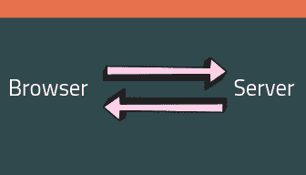
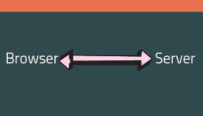
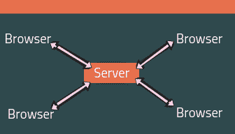

# 新手指南:插座。超正析象管(Image Orthicon)

> 原文：<https://dev.to/kauresss/socket-io-guide-for-newbies-5hdm>

## 向导

1.  介绍
2.  会发生什么？
3.  摘要
4.  设置主项目目录
5.  安装依赖项
6.  目录结构
7.  在 index.js 中创建一个服务器
8.  建立 index.html
9.  测试你的服务器 10。进行第一次套接字连接
10.  结论
11.  资源

#### [注:本指南涵盖直至设置插座。要使用的 IO。一个使用 socket 的聊天应用。IO 将在第 2 部分](https://dev.to/kauresss/newbie-guide-socket-io-code-a-chat-app-part-2-2c47)

## 简介

插座。IO 是一个 JavaScript 库，允许实时双向通信。意思是快！并且无需重新加载页面。插座。IO 基于 websockets API，它允许服务器和客户机之间的直接通信通道保持开放。

用图表代替这个:

[](https://res.cloudinary.com/practicaldev/image/fetch/s--xLNM9Aao--/c_limit%2Cf_auto%2Cfl_progressive%2Cq_auto%2Cw_880/https://thepracticaldev.s3.amazonaws.com/i/fuu3236jecf6n8y19gx3.png)

我们现在有:

[](https://res.cloudinary.com/practicaldev/image/fetch/s--ZIcTOCmR--/c_limit%2Cf_auto%2Cfl_progressive%2Cq_auto%2Cw_880/https://thepracticaldev.s3.amazonaws.com/i/q3xun5q80dnv50km5xyt.png)

所以服务器不能自己向客户端发送消息。必须刷新浏览器，并从服务器请求消息。然而 sockets.io 允许即时通信。

当我们从浏览器请求一个 URL 时，我们打开一个与服务器的聊天套接字连接。

## 会发生什么？

[](https://res.cloudinary.com/practicaldev/image/fetch/s--nEQDaxbD--/c_limit%2Cf_auto%2Cfl_progressive%2Cq_auto%2Cw_880/https://thepracticaldev.s3.amazonaws.com/i/66e5g4wys44j3t6bkr14.png)

*   数据在客户端和服务器之间来回流动
*   客户端“A”向服务器发送消息
*   聊天服务器接收该消息
*   服务器决定将消息发送给所有连接的客户端，以便它们可以看到客户端“A”发送的消息

## 总结

带走:

*   Sockets.io 是一个 JS 库
*   支持双边通信
*   客户端与服务器之间的实时同步通信
*   基于其他实时协议，如 websockets API
*   事件驱动
*   有两个部分:1。浏览器中的客户端库 2。节点的服务器端库

**所以在使用插座时。IO 你同时在玩两个文件，比如 chat.js(客户端)和 index.js(服务器端)。
这是因为您必须编写代码/逻辑来从服务器/客户端发送消息，然后在客户端/服务器的另一端接收它。**

## 设置主项目目录

```
//make a new folder
mkdir chat_app

//navigate to the folder
cd chat_app 
```

Enter fullscreen mode Exit fullscreen mode

## 安装依赖项

在您的终端中使用 npm 安装依赖项。首先检查您是否安装了节点和 NPM:

```
node -v
npm -v 
```

Enter fullscreen mode Exit fullscreen mode

**初始化 NPM**T2**T4】**

```
//create the package JSON file which will list all the dependencies used in the project
//leave index.js as the entry point
npm init 
```

Enter fullscreen mode Exit fullscreen mode

**安装快递**

```
//install express
npm install express --save 
```

Enter fullscreen mode Exit fullscreen mode

**安装插座。IO**

```
//install socket.io
npm install socket.io --save 
```

Enter fullscreen mode Exit fullscreen mode

**安装 nodemon 为了方便**

```
//automatically restarts server upon detecting changes
npm install nodemon --save-dev 
```

Enter fullscreen mode Exit fullscreen mode

## 目录结构

在主 chat_app 文件夹内(不在 node_modules 文件夹内):

1.  创建一个公共文件夹并包括:
    *   index.html
    *   style.css
    *   聊天. js

*【导航路径:/index.html，/style.css，/chat . js】*

您的目录结构将如下所示:

chat _ app□□□□□□□□□□□□□□□□□□□□□□□□□□□□□□□□□□□□□□□□□□□□□□□□□□□□□□□□□□□□□□□□□□□□□□□□□□□□□□□□□□○

## 在 index.js 中创建服务器

在 index.js 中使用 express
创建一个 node.js 服务器

```
// require express first
var express = require("express");
//require socket.IO
var socket = require('socket.io')

//setting up the express app by invoking the express function
var app = express();

//now create a server
//When the server starts listening on port 4000 then fire a callbak function
// The callback function will console.log a string 
var server = app.listen(4000, function(){
 console.log("Listening to requests on port 4000");

});
// serve a static file to the browser 
app.use(express.static("public"));

//Socket setup
//passing var server to the socket function and assigning it to var io
//essentially now socket.IO will work on this server just created
var io = socket(server); 
```

Enter fullscreen mode Exit fullscreen mode

## 成立 index.html

index.html 中:

*   包括对 socket.io 库的引用
*   包括对包含客户端 socket.io 代码的 JavaScript 文件的引用

```
<!DOCTYPE html>
<html>
    <head>
        <meta charset="utf-8">
        Newbie Guide
       <script src="/socket.io/socket.io.js"></script>
        <link href="/style.css" rel="stylesheet" />
    </head>
    <body>
        <h1>Socket.io</h1>
    <script src="/chat.js"></script>
    </body>
</html> 
```

Enter fullscreen mode Exit fullscreen mode

## 测试你的服务器

在终端中，使用
重启服务器

```
//if using nodemon
nodemon 

//if using node
node index.js 
```

Enter fullscreen mode Exit fullscreen mode

您应该会在您的终端
中看到一些控制台记录的内容

```
[nodemon] 1.18.11
[nodemon] to restart at any time, enter `rs`
[nodemon] watching: *.*
[nodemon] starting `node index.js`
listening for requests on port 4000, 
```

Enter fullscreen mode Exit fullscreen mode

在浏览器中进入[http://localhost:4000/](http://localhost:4000/)
你应该会在那里看到你的网页。现在，您已经准备好开始使用 socket 了。木卫一！

## 进行第一次套接字连接

在 index.js 中

```
//declare var io which is a reference to a socket connection made on the server
var io= socket(server);

//Then use the io.on method which looks for a connection
//upon a connection execute a callback function which will console.log something
io.on('connection', function(){
  console.log('made socket connection');
}); 
```

Enter fullscreen mode Exit fullscreen mode

在 chat.js

```
//you already included a reference to the socket.io library in index.html so now you have access to it
//make a socket by declaring var socket which will make a socket connection to localhost:4000
var socket = io.connect("http://localhost:4000"); 
```

Enter fullscreen mode Exit fullscreen mode

在终端:

```
nodemon 
```

Enter fullscreen mode Exit fullscreen mode

然后在终端中检查 console.log 消息:

```
[nodemon] 1.18.11
[nodemon] to restart at any time, enter `rs`
[nodemon] watching: *.*
[nodemon] starting `node index.js`
listening for requests on port 4000,
made socket connection 
```

Enter fullscreen mode Exit fullscreen mode

## 结论

现在您已经准备好开始使用 socket 了。服务器和客户端都有 IO，让聊天应用变得有趣。更多信息请见第 2 部分..

## 资源

1.  [https://socket.io/](https://socket.io/)
2.  [https://open classrooms . com/en/courses/2504541-ultra-fast-applications-using-node-js/2505653-socket-io-let-s-go-to-实时](https://openclassrooms.com/en/courses/2504541-ultra-fast-applications-using-node-js/2505653-socket-io-let-s-go-to-real-time)
3.  [https://sabe . io/tutorials/how-to-build-real-time-chat-app-node-express-socket-io](https://sabe.io/tutorials/how-to-build-real-time-chat-app-node-express-socket-io)
4.  [https://socket . io/docs/client-API/# socket-on-event name-callback](https://socket.io/docs/client-api/#socket-on-eventName-callback)
5.  [http://wern-an cheta . com/blog/2013/08/25/creating-a-real-time-chat-application-with-socket-dot-io/](http://wern-ancheta.com/blog/2013/08/25/creating-a-real-time-chat-application-with-socket-dot-io/)
6.  [http://danielnill.com/nodejs-tutorial-with-socketio](http://danielnill.com/nodejs-tutorial-with-socketio)