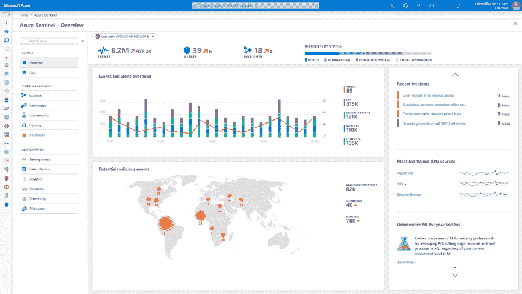

# 关于蓝色哨兵的思考

> 原文：<https://dev.to/nnthuan/thoughts-on-azure-sentinel-57p5>

当我们有 Azure Security Center (ASC)时，我有很多关于使用 Azure Sentinel 的目的或策略的问题。事实上，Azure Sentinel 拥有的一切都可以在 ASC 中构建。然而，Azure Sentinel 的目的完全不同。

> 对于不了解 Azure Sentinel 的人来说，这里是[介绍](https://azure.microsoft.com/en-us/blog/introducing-microsoft-azure-sentinel-intelligent-security-analytics-for-your-entire-enterprise/)。

ASC 专门设计用于**帮助组织遵守安全政策和行业合规性(例如 ISO、C is、PCI……)**。它在安全状态的生命周期中为您提供更早的安全性，从而最大限度地减少漏洞。此外，它还为您的整个基础架构(包括云和内部)提供了全面、一致的标准&安全控制。主动安全工程师实际上缺乏完成工作的能力(例如，威胁搜寻和动态威胁检测..).ASC 中的自定义警报规则功能非常有限，只能限制在日志分析工作区中(使用情形是监控个人活动……)。ASC 的目标受众是 Sec 和法规遵从性管理员。

当 Azure Sentinel 为您提供主动应对安全威胁的**真正能力时，它是您安全状况的延伸价值。如前所述，Azure Sentinel 是一个 SIEM 即服务(当然，它最近才发布，所以不太可能像 Splunk、Qradar 等大公司那样全面)。但是，有一些一般 SIEM 将具有的功能将很快提供给你。例如，您会看到从 Azure 和其他来源(如 AWS、Palo Alto、Juniper、Cisco)收集数据的集成功能(我相信会有更多)。另一个功能是 ASC 没有的安全事件案例管理。案例管理为您提供了超过 15 个实体的强大可视化功能，有助于您在发生违规时跨环境执行深入调查(这对于 APT 攻击来说是完全必要的)。你可能会看到微软如何在 Azure Sentinal 的搜索功能中对一系列阶段进行分类。这将有助于 APT 的检测和预防。**

Azure Sentinel 的另一个愿景是自带数据。您有自己的数据，并希望使用 ML 模型对其进行规范化，该模型有望更准确地检测威胁，而不是依赖传统的基于签名的检测。我认为这是现代安全工程师需要的主动数据探索。我看到的是 Azure Notebook 对 Python 的逢迎。

Azure Sentinel 确实是针对主动安全的。我必须强调这个词**【主动出击】**在这里的不同次数。但这就是蓝色哨兵对你的意义。一旦你意识到你必须积极主动，你会更喜欢 Azure Sentinel。简而言之，在 Azure Sentinel 工作时，作为一名主动安全工程师，你的机会是什么？他们在这里:

*   与微软服务(Office 365、APT、Azure)的智能紧密集成..)和第三方(F5、帕洛阿尔托、赛门铁克……)
*   自带数据或者 AI 模型，提高信噪比。
*   基于人工智能的图形化调查，缩短调查时间。

在现实世界中，你需要结合 ASC 和 Azure Sentinel。ASC 将是你达到第一个成熟度级别的朋友，而 Azure Sentinel 是较高的一个。无论你是负责侦查还是狩猎，Azure Sentinal 都适合你。