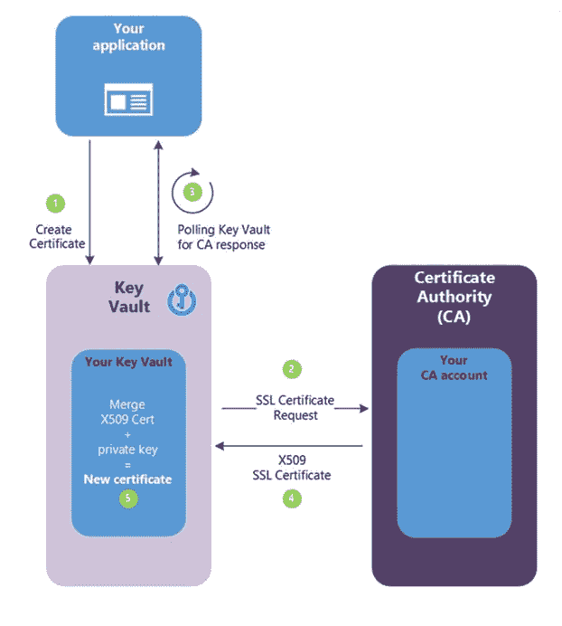

# 了解应用程序安全性

> 原文：<https://dev.to/cheahengsoon/understand-application-security-2gpn>

**了解 Azure 应用程序端点**

*   Azure AD 支持应用程序集成
*   集成需要在 Azure AD 中注册应用程序，包括:
    *   应用程序类型:
        *   当地的
        *   Web 应用程序/API 应用程序
    *   登录 URL(针对 web 应用程序/API 应用程序)
    *   重定向 URL(针对本机应用程序)

**了解 Azure Web App for Containers**
Azure Web App for Containers 的主要特征:
-有助于在 Azure App Service 的 Web Apps 功能中运行 Linux 和 Windows 容器
-为基于 Docker 的工作负载提供 Web App 功能

**了解应用洞察**

*   应用洞察的主要特征:
    *   为 web 开发人员提供可扩展的应用程序性能监控(APM)服务
    *   提供仪器和分析
    *   收集遥测数据，包括性能计数器、Azure 诊断和 Docker 日志
    *   支持多种开发平台
*   应用洞察运营模式:
    *   开发者在他们的 Azure 订阅中设置了一个应用洞察资源
    *   开发人员在他们的应用中配置特定于应用洞察的工具
    *   仪器收集应用遥测数据，并将其发送给应用洞察资源
    *   开发人员可以在 Azure 门户中查看和分析来自遥测数据的信息

**了解 API 管理**

*   APIM 的主要特点:
    *   便于向外部、合作伙伴和内部开发人员发布 API
    *   提供分析、安全和身份验证功能
*   APIM 运营模式:
    *   APIM 管理员发布 API 并将其集合作为产品提供
    *   APIM 管理员定义 API 使用策略
    *   开发者订阅产品
    *   开发者调用 API 的操作
*   APIM 组件:
    *   API 网关:端点接受 API 调用，将它们路由到 APIM，执行使用策略，提供 API 保护，并处理日志记录
    *   Azure 门户:APIM 的主要管理界面
    *   开发者门户:开发者使用 APIM 的主要界面

**了解证书**

*   证书的主要特征:
    *   促进广泛的加密操作，例如:
        *   证明
        *   加密
    *   依靠签名来提供公钥的验证:
        *   由 CA 签名(推荐)
        *   自签名的
*   使用密钥库创建证书:
    *   CA 提供商的管理员创建证书，供密钥库用来注册和续订证书
    *   应用程序在密钥库中创建一个密钥
    *   密钥库向 CA 发送签名请求
    *   CA 用证书响应请求
    *   应用程序轮询证书请求完成情况

**了解应用生命周期管理解决方案的安全考虑事项**
微软安全开发生命周期(SDL)在整个开发过程中引入安全和隐私考虑事项:
-提供培训
-定义安全需求
-定义指标和合规性报告
-执行威胁建模
-建立设计需求
-定义和使用加密标准
-管理使用非微软组件带来的安全风险
-使用经批准的工具
-执行静态分析安全测试
-执行动态分析安全测试