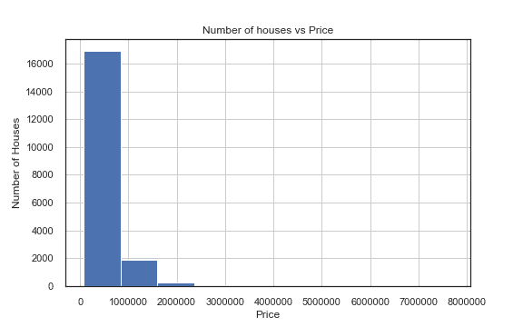
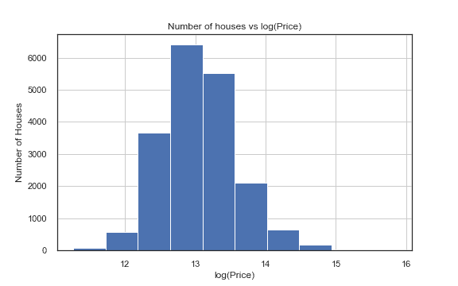
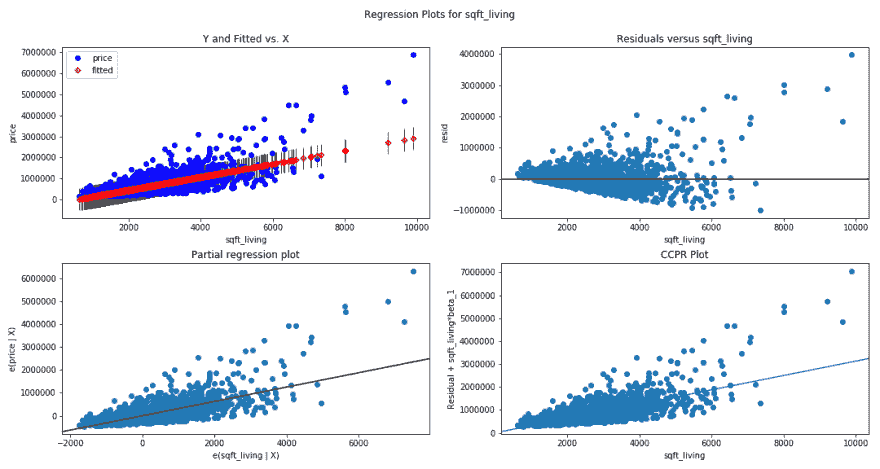
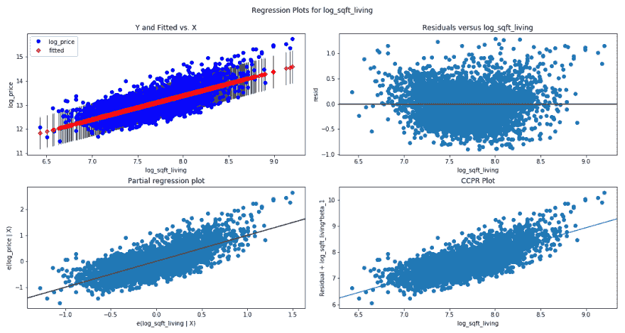

# 线性回归模型中的对数变换:为什么&何时

> 原文：<https://dev.to/rokaandy/logarithmic-transformation-in-linear-regression-models-why-when-3a7c>

有没有想过如何将数据从指数分布或偏斜分布转换为正态分布？在本文中，我将讨论为什么在数据集内使用对数变换的重要性，以及如何使用对数变换从线性回归模型中获得更好的预测结果。这个模型可以用下面的等式来表示:

y = B<sub>0</sub>+0<sub>1</sub>x<sub>1</sub>+0<sub>2</sub>x<sub>2</sub>+…+ 0 <sub>n</sub> x <sub>n</sub>

*   y 是预测值
*   B <sub>0</sub> 是 y 轴截距
*   0 <sub>1</sub> ，…，0 <sub>2</sub> 为模型参数
*   x <sub>1</sub> ，x <sub>2</sub> ，…，x <sub>3</sub> 为特征值

您可能会发现对数和指数函数的一些有用属性包括:

1.  log(e) = 1
2.  log(1) = 0
3.  log(x <sup>r</sup> ) = r log(x)
4.  log e <sup>A</sup> = A
5.  e <sup>logA</sup> = A

回归模型将具有 x 和 y 变量之间的 ***单位变化*** ，其中 x 中的单个单位变化将与 y 中的恒定变化一致。取一个或两个变量的对数将有效地将情况从单位变化变为 ***百分比变化*** 。这在使用中型到大型数据集时尤其重要。另一种思考方式是，当记录数据集的日志时，转换您的模型以利用统计工具(如线性回归)来改进正态分布的要素。

对数是正数的底数。比如 100 的 base10 log 就是 2，因为 10 <sup>2</sup> = 100。所以自然对数函数和指数函数(e <sup>x</sup> )是彼此相反的。

主题演讲:log(x)的 0.1 单位变化相当于 x 增加 10%。

**原因:**
对数变换是一种将高度偏斜的变量转换为更加规范化的数据集的便捷方法。当对具有非线性关系的变量建模时，产生错误的机会也可能是负向的。理论上，我们希望在进行预测时产生尽可能小的误差，同时也考虑到我们不应该过度拟合模型。当有太多的因变量时，过度拟合就会发生，因为它没有足够的数据集泛化能力来进行有效的预测。使用一个或多个变量的对数通过将特征的分布转换为更正常形状的钟形曲线来提高模型的拟合度。

**The When:**
在 python 中，让我们首先导入必要的库，这些库将用来展示这一切是如何工作的。我还使用华盛顿州金县的住房数据导入了一个数据框架。在下面的两个直方图中，您可以看到使用 numpy 的房屋实际价格与房屋日志价格之间的差异。

```
import pandas as pd
import numpy as np
import matplotlib.pyplot as plt 
```

```
df = pd.read_csv('kc_house_data.csv')

df.hist('price',figsize=(8,5))
plt.title('Number of houses vs Price')
plt.ylabel('Number of Houses')
plt.xlabel("Price") 
```

[](https://res.cloudinary.com/practicaldev/image/fetch/s--EoYf4MbQ--/c_limit%2Cf_auto%2Cfl_progressive%2Cq_auto%2Cw_880/https://github.com/ConnorAnderson29/mod1_project1/raw/master/price.png)T3】

```
df['log_price'] = np.log(df['price'])

df.hist('log_price',figsize=(8,5))
plt.title('Number of houses vs log(Price)')
plt.ylabel('Number of Houses')
plt.xlabel("log(Price)") 
```

[](https://res.cloudinary.com/practicaldev/image/fetch/s--11sNZnW1--/c_limit%2Cf_auto%2Cfl_progressive%2Cq_auto%2Cw_880/https://github.com/ConnorAnderson29/mod1_project1/raw/master/log_price_hist.png)

首先，确定目标参数和所使用的因变量将指示对数变换是否必要。让我们举个例子，我们的业务案例是向房地产公司 Redfin 展示一栋具有某些特征的房屋的挂牌价格。对于这个模型，我们将使用 2 个特征:浴室数量(从属(x)) +居住面积平方英尺(从属(x))与房价(独立(y)或我们的目标参数)。

如果我们绘制浴室数量的直方图，数据具有相对正态分布，因为大多数房屋有 1-4 个浴室，有 2 个浴室的房屋数量更多。然而，如果我们绘制居住面积平方英尺的直方图，我们会得到一个高度倾斜的数据表示，如上面的第一个图所示。这基本上是说，有很多价格相似的房子，只有少数在 1000 万美元以上。在查看我们的示例时，采用价格和生活平方英尺的对数会将系数重新调整为正态分布曲线。这有效地将数据的范围变成了自然对数。

现在，我们导入一个名为 statsmodels 的库。从那里，我们想要普通最小二乘(OLS)回归，也称为线性回归模型。下图显示了生活平方英尺与价格的关系。图 1 显示了 4 个单位尺度的相似度量图，采用未记录的自变量和因变量。你会注意到它有一个圆锥形状，随着平方英尺的增加，数据点基本上分散开来。图 2 显示了执行对数转换时的变化，我们现在可以看到百分比变化的关系。通过对您的变量应用对数，通过数据点的基数有一个更明显和/或调整的线性回归线，从而产生一个更好的预测模型。

```
import statsmodels.api as sm
from statsmodels.formula.api import ols

f = 'price~sqft_living'
model = ols(formula=f, data=df).fit()

fig = plt.figure(figsize =(15,8))
fig = sm.graphics.plot_regress_exog(model, 'sqft_living', fig=fig) 
```

##### 图 1 

```
df['log_bedrooms'] = np.log(df['bedrooms'])

f = 'log_price~log_sqft_living'
model_log = ols(formula=f, data=df).fit()

fig = plt.figure(figsize =(15,8))
fig = sm.graphics.plot_regress_exog(model_log,'log_sqft_living', fig=fig) 
```

##### 图 2 

**计算摘要:**
数据建模完成后，我们可以通过键入:
`print(model.summary())`打印一些有用指标的摘要

我从表中提取了几个数值供参考。r 平方是由线性模型解释的响应变量变化的百分比。因此，如果模型的 R2 是 0.50，那么大约一半的观察到的变化可以用模型的输入来解释。过高的 R 平方意味着模型过拟合，存在一些偏差。在这种情况下，当我们进行对数变换时，我们有一个稍好的 R 平方，这是一个积极的迹象！

| 变量 | 韵律学 | 价值观念 |
| --- | --- | --- |
| 价格，平方英尺 _ 生活 | r 平方 | Zero point five four three |
| '' | 系数 | Three hundred and twelve point six eight one |
| 对数价格，对数平方英尺生活 | r 平方 | Zero point six seven three |
| '' | 系数 | Zero point nine nine three |

为了将我们的结果放入商业案例中，让我们做以下事情:
`y = 312.681 * np.log(1.1) = 29.80`
`y = 312.681 * 0.095 = 29.80`

“居住面积每增加 10%，房屋价值就会增加 29.80 美元。”

由于上面的陈述有点难以概念化，通过将系数乘以 log(2)，我们可以得到每 1 平方英尺的值。
`y = 312.681 * np.log(2) = 216.73`

“大约每增加 1 平方英尺的居住空间，房屋价值就会增加 216.73 美元。”

因为取一个数据集的对数就是把它转换成它的自然基数；相反，要使用对数函数的度量，我们只需取系数的指数(`np.exp()`)。

**最后的想法:**
当查看预测准确性并最小化与您的项目相关的任何误差时，如平均绝对误差(MAE)、均方误差(MSE)和或均方根误差(RMSE)，请始终检查您的数据是否有任何偏差。如果是，记录下来！