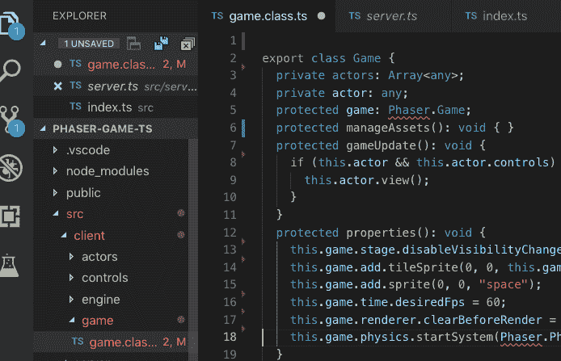

# 如何让 TypeScript 闭嘴关于库

> 原文：<https://dev.to/logicmason/how-to-make-typescript-shut-up-about-that-library-4jd3>

2019 年 4 月 14 日

TypeScript 是一种折衷。

> “当我觉得有几个小时的偏头痛时，我会使用 typescript 使用第三方库，并确保我没有一个空格或逗号不合适！非常管用！头疼 10/10 次。”
> 
> Reddit 上的某个人

TypeScript 可以为代码编辑器的自动完成功能创造奇迹，它可以在代码库的不同部分之间强制执行契约，这是文档无法做到的，它还可以帮助大型团队更快地前进。

[](https://res.cloudinary.com/practicaldev/image/fetch/s--upBHVSCS--/c_limit%2Cf_auto%2Cfl_progressive%2Cq_auto%2Cw_880/https://thepracticaldev.s3.amazonaws.com/i/x2107udznzf4ypn6kqnz.png)

在处理其日益迂腐的编译器时，尤其是在处理具有不完整、不正确或冲突类型的第三方库时，它还会将您逼到疯狂的地步。

一般来说，尽可能多的打字是有好处的，这样你就能得到 ts 提供的好处。但是当它不是你的代码并且上游库没有被正确输入时，你如何让编译器警告静音呢？

您可以将它添加到您的代码库中:

```
declare const annoyingLibrary: any; 
```

然后 TypeScript 编译器将停止抱怨`annoyingLibrary`类型。

*最初发布于[logicmason.com](https://logicmason.com/2019/how-to-make-typescript-shut-up-about-that-library/)2019 年 4 月 14 日。*