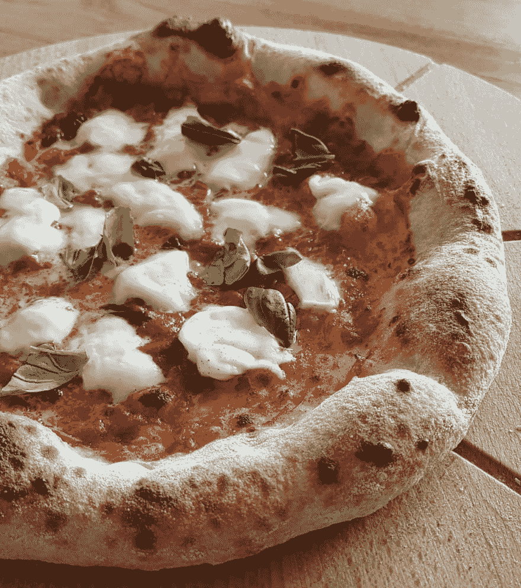

# 我的披萨食谱

> 原文：<https://dev.to/graphqleditor/my-pizza-recipe-3ook>

每个人都喜欢披萨，但不是每个人都知道做披萨有多容易！因为今天是星期五，所以我决定和你分享我的美味披萨食谱，这样你就有机会在周末做了。

### 配料

所提供的数量对于平均尺寸的馅饼(35 厘米/14 英寸)来说已经足够了。

##### 披萨面团:

*   **500 克**的 *00 型*面粉(我个人推荐[这款](https://www.amazon.com/Antimo-Caputo-Pizzeria-Flour-Repack/dp/B006XL9W7W)
*   300 毫升温水
*   12.5 克盐
*   新鲜酵母的小球

##### 浇头:

*   **番茄酱**(刚用的整个番茄，捣碎，加点盐和罗勒叶煮一会，[圣马尔扎诺番茄](https://en.wikipedia.org/wiki/San_Marzano_tomato)最好吃！)
*   **马苏里拉奶酪**(如果你有马苏里拉奶酪，那很好，如果没有用普通的)
*   **橄榄油**
*   **新鲜的罗勒叶**

#### 装备:

*   **一个大塑料盒**
*   **一块比萨石**
*   **一把披萨铲**(短的木制的就完全够用；它们经常被包含到比萨饼石头中)

### 准备面团

1.  用手将面粉和盐混合。
2.  将酵母溶解在水中，然后将混合物加入面粉中。
3.  揉面([这里有一个很好的教程](https://www.youtube.com/watch?v=adfzN_mfQ8o))
4.  当面团做好后，把它放入一个碗中，横着切一刀(这将使面团侧向上升而不是向上),用塑料厨房箔纸把碗包起来，让它静置...持续 24 小时！

我们使用的酵母量非常低，所以长时间的休息会让它们完成任务&披萨会保持容易消化。

在**24 小时**后，取出面团并将其切成三等份，做成三个面团球(这里有一个[视频展示](https://youtu.be/AmCRtCHPfyI?t=95)，然后让它们在洒有面粉的塑料盒中再静置 **2-3 小时。**

### 烘焙过程

##### 设置

我用的是烘焙石，因为这样效果最好，但是你也可以用披萨盘。

1.  将烤箱调到最高温度，预热披萨饼。我的烤箱在常规模式下的极限是**250 摄氏度&在烧烤模式下的极限是**300 摄氏度，所以我把它加热到 250 摄氏度，然后切换到烧烤模式以获得最高温度(给宝石至少 30 分钟的加热时间)。

##### 抻面团

让我们做比萨饼吧！让我们从塑料盒里拿出面团球。好吧，从技术上来说，它现在不是一个球(至少它应该是)，无论如何我们需要把它再拉伸一点(再一次[一个展示如何](https://youtu.be/s4lL5I-UYbk?t=100)的视频，抱歉，但我真的很难用语言解释这个技术)。

我们已经准备好了面团。我们拿一把披萨铲，撒上面粉，这样面团就不会粘在上面，然后把馅饼放在上面。在中间放一点橄榄油，番茄酱(太多了不好，因为会让披萨变得特别潮湿)并涂在整个馅饼上，准备烘烤吧！

等待...配料在哪里？诀窍在于，在专业的披萨烤箱中，温度会达到大约 500 摄氏度，这使得烘烤过程非常短(面团烤得很好，但奶酪没有完全融化)。

所以我想出，如果先用番茄酱烘烤面团 **~2 分钟**，然后取出，加入马苏里拉奶酪，罗勒叶，再烘烤一两分钟，我会达到最好的效果。这样可以使面团烤得更好，马苏里拉奶酪保持洁白。现在你要做的就是加入一些罗勒叶

额外提示:当用铲子将面团放在烘焙石头上滑动时，你可以轻轻吹一些空气到馅饼下面，这会让铲子上的比萨滑道非常光滑。

瞧啊。我们香脆可口的芝士派！

> Tomek Poniatowicz@ tomponiat迄今为止最好的一个！
> [【披萨】](https://twitter.com/hashtag/pizza) [【无样式】](https://twitter.com/hashtag/naplesstyle) [【芝士蛋糕】](https://twitter.com/hashtag/cheeseeee)2019 年 4 月 19 日下午 12:5300