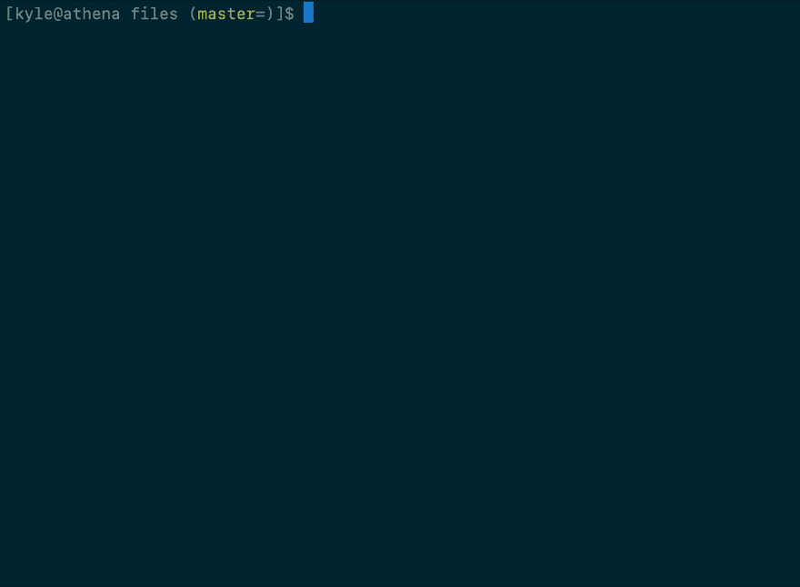
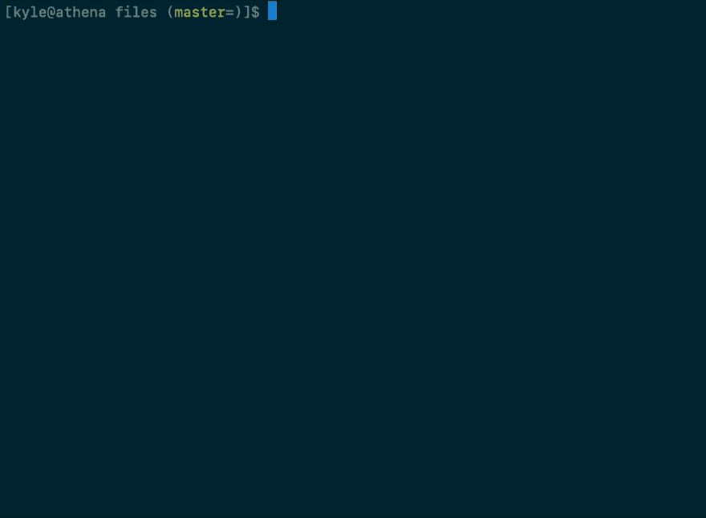
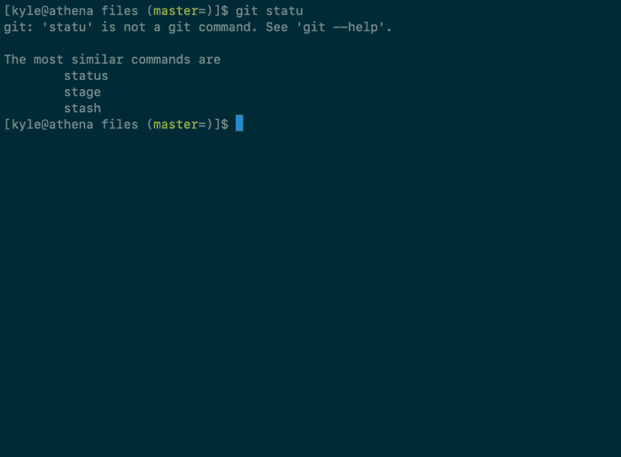

# 自动纠正 git 拼写错误

> 原文：<https://dev.to/chilcutt/auto-correct-git-spelling-mistakes-3896>

我在工作和个人项目中都经常使用 git，这意味着我每天都要输入大量的命令。git 有一个内置的拼写自动纠正系统，当你不是很有精确的一天。

**TL；dr** 自动纠正 git 拼写错误

```
$ git config --global help.autoCorrect 1 
```

这就变成了:

<figure>[](https://res.cloudinary.com/practicaldev/image/fetch/s--UVdoPCI_--/c_limit%2Cf_auto%2Cfl_progressive%2Cq_66%2Cw_880/https://cdn-images-1.medium.com/max/996/1%2ARTZe8E30Kvdyn929OuCnBQ.gif)

<figcaption>aarggghhhh</figcaption>

</figure>

对此:

<figure>[](https://res.cloudinary.com/practicaldev/image/fetch/s--Db3-zbiD--/c_limit%2Cf_auto%2Cfl_progressive%2Cq_66%2Cw_880/https://cdn-images-1.medium.com/max/996/1%2A_gsovN49Hcda_msIT4MieA.gif)

<figcaption>aww</figcaption>

</figure>

```
$ git config --global help.autoCorrect 1 
```

参数是在更正和执行命令之前等待的秒数(0.1 秒)，1 是可能的最短延迟。如果只找到一个选项，它将被执行，如果可以执行多个命令，它将出错并要求您重试:

[](https://res.cloudinary.com/practicaldev/image/fetch/s--5UKq7kwY--/c_limit%2Cf_auto%2Cfl_progressive%2Cq_auto%2Cw_880/https://cdn-images-1.medium.com/max/996/1%2A0F0D-F4z2VNCvsDWTzUdGQ.png)

结合我经常拼错的 git 的一些 bash 别名，我有机会不用额外的一杯咖啡就能完成一些事情。

```
$ alias gi='git'
$ alias gti='git'
$ alias gits='git' 
```

*我可能不小心使用这个 git 配置比其他任何配置都多……*