# 我是如何用 Twitter、Twilio 和无代码解决杰西卡的纽约停车问题的

> 原文：<https://dev.to/azure/how-i-solved-jessica-s-nyc-parking-problem-with-twitter-twilio-and-no-code-2mgg>

我最近在 [dev.to](https://dev.to) 上读了很多很棒的内容(说真的，你应该去看看，并关注一些标签……那里的社区很棒)，并看到了这个很棒的标题“[我是如何用 Python、搜索 Tweets API 和 Twilio](https://dev.to/twitterdev/how-i-solved-my-nyc-parking-problem-with-python-the-search-tweets-api-and-twilio-1chp) 解决我在纽约的停车问题的”，作者是 Twitter 的开发者倡导者[杰西卡·加森](https://twitter.com/jessicagarson)。杰西卡试图解决一个问题，纽约市民在试图确定每晚何时移动他们停在路边的汽车时遇到了这个问题，因为“备用侧规”决定了道路的某些侧边何时可以使用，或者由于假期、事件等原因，这些法规不会强制执行。

[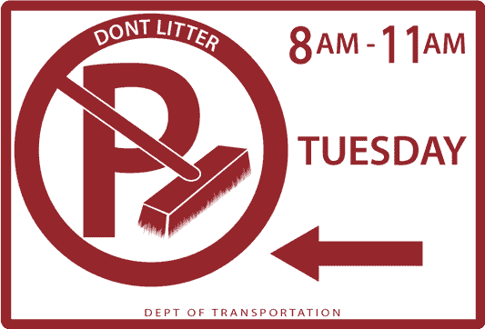](https://res.cloudinary.com/practicaldev/image/fetch/s--cPcN9xGo--/c_limit%2Cf_auto%2Cfl_progressive%2Cq_auto%2Cw_880/https://storage2.timheuer.com/parkingsign.png)

她深入研究了如何使用 Python、Twitter 搜索 API 和 Twilio 将这些结合在一起。解决有趣的问题，并给杰西卡发了一条短信，告诉她是否需要担心移动她的车。读完之后，我马上想到了游戏节目的名字，那首曲子。

这个游戏节目的前提是，参赛者根据一首歌中音符的最少数量来决定谁能识别这首歌。所以当然是 100%适用于代码，对吧？无论如何，我对自己说,*自己，我可以用更少的努力和代码解决这个问题！*

我立即开始使用 Azure Logic 应用程序工作。Azure Logic 应用是一种手段……好吧，让营销人员告诉我们它们是什么:

> Azure Logic Apps 简化了您构建自动化可扩展工作流的方式，该工作流可跨云服务和内部系统集成应用和数据。

这里有很多术语，但基本上是工作流/编排平台，允许您在各种输入和输出之间使用“连接器”。可以使用代码来开发逻辑应用程序，但是大多数逻辑应用程序不需要代码，使用图形连接器工具就可以轻松开发。如果你曾经使用/听说过 [Microsoft Office Flow](https://flow.microsoft.com/en-us/) 这是由 Azure Logic 应用程序支持的！所以读完这篇文章后，我马上去工作。我知道 Azure 已经为 Twitter 和 Twilio 预建了连接器，我应该可以轻松地做到这一点。[连接器](https://docs.microsoft.com/azure/connectors/apis-list?WT.mc_id=docs-blog-timheuer)是预定义的逻辑片段，有助于跨其他应用和平台访问事件、数据和动作，在我们的例子中是 Twitter 和 Twilio！

Jessica 的问题很简单:观察@NYCASP 账户发微博的时间，如果它显示规则被“暂停”,就发短信提醒她。现在，这依赖于@NYCASP 帐户在他们的推文中保持一致，事实证明他们在推文中非常一致，所以很容易像杰西卡那样搜索简单的术语。所以我们也这么做吧。

[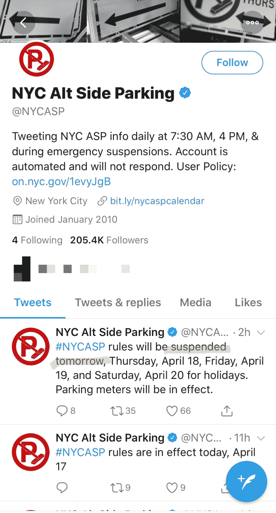](https://res.cloudinary.com/practicaldev/image/fetch/s--3n0PRUG4--/c_limit%2Cf_auto%2Cfl_progressive%2Cq_auto%2Cw_880/https://storage2.timheuer.com/tweets.jpg)

为了开始，我需要一个免费的 Azure 账户，并且有很多免费的服务你可以永远使用。我还需要一个像 Jessica 所说的 Twilio 账户，所以你仍然需要它来获得你的 Twilio 证书…确保你有。有了这些，让我们登录 Azure 门户网站…我们甚至不需要浏览器以外的任何工具来完成这个应用程序！

在门户中，您将在 Azure 中创建新资源…搜索 Logic App，它将显示:

[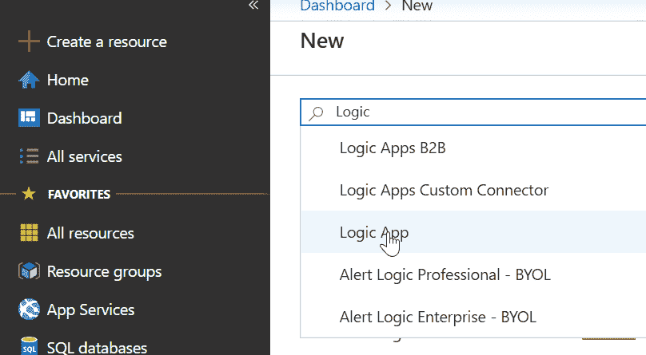](https://res.cloudinary.com/practicaldev/image/fetch/s--DAou4Pn2--/c_limit%2Cf_auto%2Cfl_progressive%2Cq_auto%2Cw_880/https://storage2.timheuer.com/createlogicapp.png)

您需要提供一个名称，选择一个资源组计划和一个地理位置。如果你以前从未创建过任何 Azure 资源，那么资源组就是特定计算资源的容器。为此，我建议创建一个应用服务资源组，并使用免费试用帐户附带的免费计划。然后，您可以将该资源组用于您的逻辑应用程序。创建完成后，导航到该资源，您将看到一个欢迎您的页面，其中有一个教程视频和一些预配置模板的选项。值得庆幸的是，其中一个启动选项是“当一条新的推文发布时”，所以让我们使用这个选项来帮助我们开始，因为它将默认添加 [Twitter 连接器](https://docs.microsoft.com/connectors/twitter/?WT.mc_id=docs-blog-timheuer)！

这让我们进入了逻辑应用程序设计器，一个帮助我们进行连接的图形界面。您将立即看到第一个“触发器”，这是我们的 Twitter，它希望您登录才能使用该功能(请将此视为授权使用 API)。登录后，单击继续，您将看到选项。现在，基本上我们想要寻找@NYCASP 在某个时间间隔发布新推文的时间。他们的账户相当一致，所以我选择每四个小时一次，并使用“from:@NYCASP”查询语言作为搜索文本。

[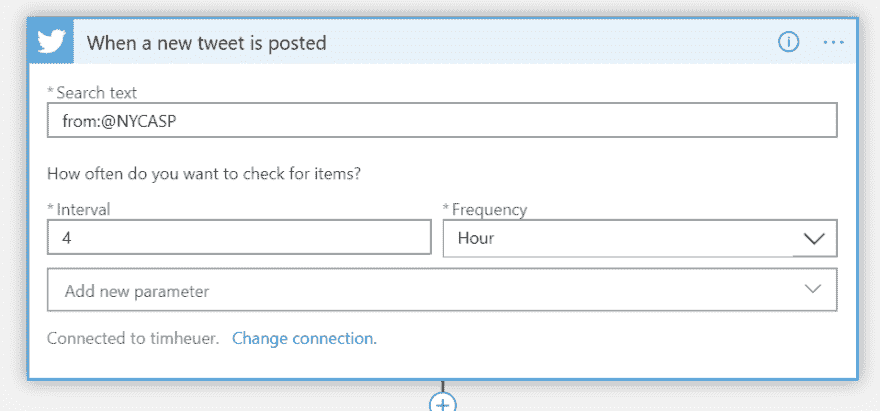](https://res.cloudinary.com/practicaldev/image/fetch/s--HYnDhHCu--/c_limit%2Cf_auto%2Cfl_progressive%2Cq_auto%2Cw_880/https://storage2.timheuer.com/newtweetconfig.png)

推特到此为止。到目前为止没有代码成功！所以现在每隔 4 个小时，它会检查一条来自那个账户的新推文。现在让我们做点什么吧！在 Jessica 的场景中，我们需要查看推文，只有在满足特定条件的情况下才根据推文采取行动。所以让我们使用设计器上的那个小“+”符号，并添加一个新动作。搜索“条件”，你会看到“控制”作为一个选项出现…选择它，然后你会看到条件连接器…选择它。条件连接器给了我们一个简单的决策树:条件是什么，如果为真，你想做什么，如果为假，你想做什么:

[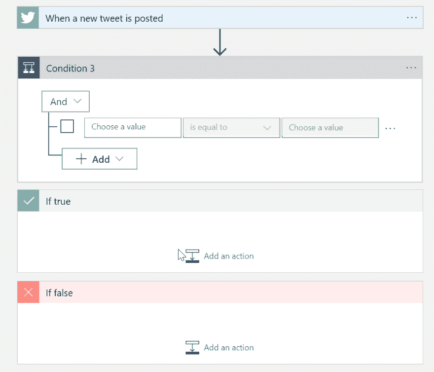](https://res.cloudinary.com/practicaldev/image/fetch/s--FW3K0zxp--/c_limit%2Cf_auto%2Cfl_progressive%2Cq_auto%2Cw_880/https://storage2.timheuer.com/conditionblank.png)

在条件区域，当你点击“选择一个值”的时候，你可以看到之前触发器的数据，你可以看到所有的细节。我们将滚动并查找 Tweet 文本并选择它。将 oeprator 更改为“contains”并键入“suspended”作为值。它应该是这样的:

[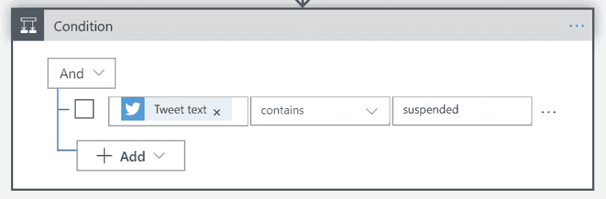](https://res.cloudinary.com/practicaldev/image/fetch/s--xUcHlGf6--/c_limit%2Cf_auto%2Cfl_progressive%2Cq_auto%2Cw_880/https://storage2.timheuer.com/conditionsuspended.png)

现在我们知道推文告诉我们一些关于暂停的事情…但是杰西卡想知道她明天是否必须移动她的车。让我们给 now 添加另一个条件，检查文本中是否包含“tomorrow”。我们按照相同的步骤创建一个新的条件触发器并连接它。

> 在这一点上，我们有一个嵌套条件。我们能把它们放在同一个盒子里吗？可能吧，但我只是在跟着杰西卡的思路走。

它应该是这样的:

[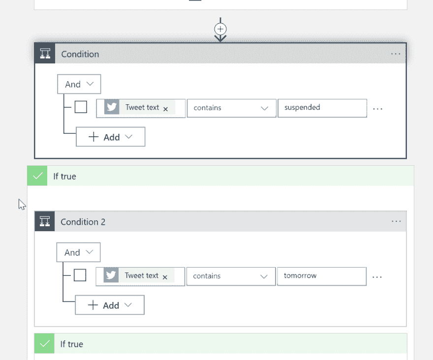](https://res.cloudinary.com/practicaldev/image/fetch/s--elIP8GKK--/c_limit%2Cf_auto%2Cfl_progressive%2Cq_auto%2Cw_880/https://storage2.timheuer.com/2ndcondition.png)

现在我们知道如果这两个都是真的，我们需要发送一条短信。点击 True condition 中的“添加操作”按钮，搜索 Twilio 并选择“发送短信”操作。这将添加所提供的 [Twilio 连接器](https://docs.microsoft.com/connectors/twilio/?WT.mc_id=docs-blog-timheuer)，该连接器提供该功能(以及更多功能)。与 twitter 类似，您会看到它，并在选择后必须验证您的帐户，以获得凭证。

[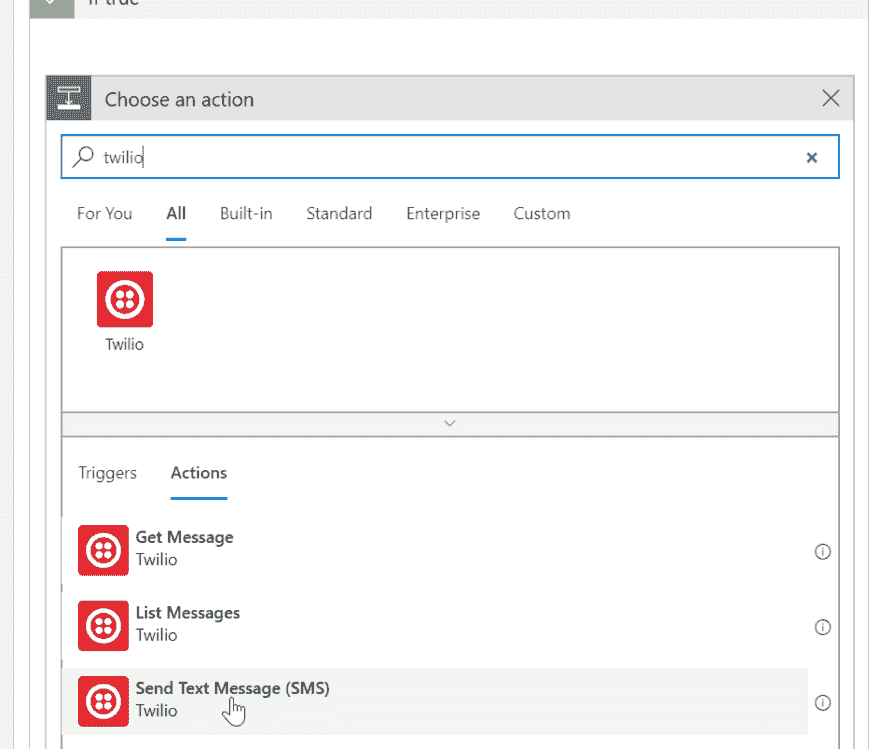](https://res.cloudinary.com/practicaldev/image/fetch/s--lAQTm4sp--/c_limit%2Cf_auto%2Cfl_progressive%2Cq_auto%2Cw_880/https://storage2.timheuer.com/twiliosearch.png)

完成后，你现在只需输入短信的详细信息。对于 Twilio,“发件人”号码必须是您的帐户短信号码，除非您拥有能够让您做更多事情的高级服务。如果你试图在没有他们的优质服务的情况下获得新奇感，这将会失败。别想入非非…我们只是把车移过街道，记得吗？输入你想发送的文本和你想发送到的电话号码…完成！

[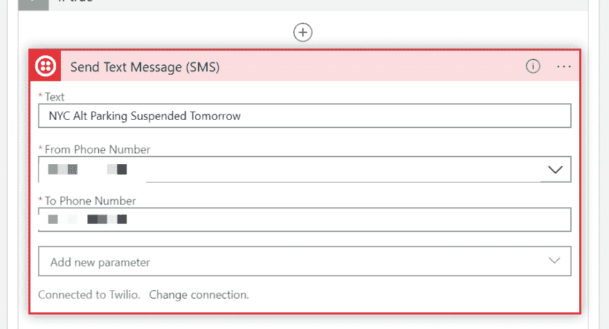](https://res.cloudinary.com/practicaldev/image/fetch/s--uiWpyRGi--/c_limit%2Cf_auto%2Cfl_progressive%2Cq_auto%2Cw_880/https://storage2.timheuer.com/twilioconfig.jpg)

现在，在错误的条件下，我们仍然需要告诉逻辑应用程序做什么。在这些情况下，除非你想做更多，再次添加一个动作并选择系统，然后寻找“终止”——这是一个简单的动作，基本上只是停止流，并可以记录一条消息。我在两种错误条件下都这样配置了我的:

[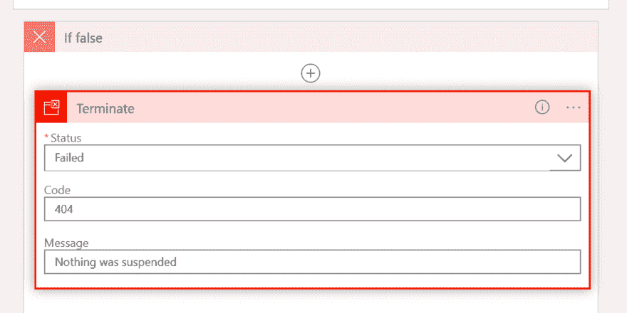](https://res.cloudinary.com/practicaldev/image/fetch/s--j86RX9PH--/c_limit%2Cf_auto%2Cfl_progressive%2Cq_auto%2Cw_880/https://storage2.timheuer.com/faslecondition.png)

就这样，我不干了。没有代码。这花了我更长的时间来写这篇文章，然后才第一次真正做逻辑应用。现在我在等待。等待着。等待着。在读完杰西卡的文章后，我完成了 logic 应用程序，并希望用真实交易的推文来“自然地”测试这一点。但是没有任何停车条例被中止。我的日志看起来像这样:

[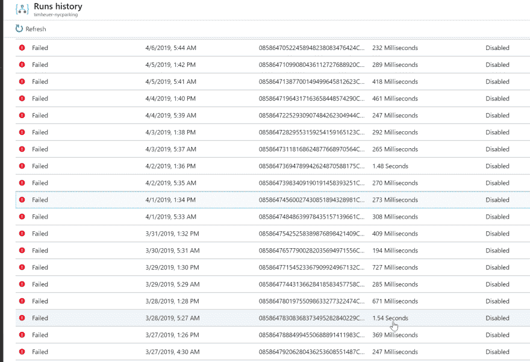](https://res.cloudinary.com/practicaldev/image/fetch/s--T9aSgUwi--/c_limit%2Cf_auto%2Cfl_progressive%2Cq_auto%2Cw_880/https://storage2.timheuer.com/logs.png)

直到前几天！我的手机嗡嗡作响，我低头一看，嘣:

[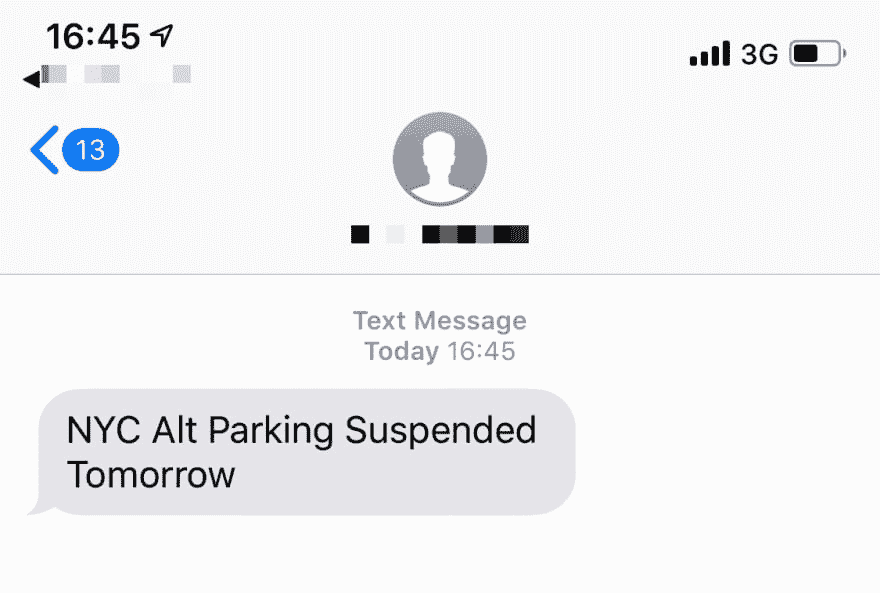](https://res.cloudinary.com/practicaldev/image/fetch/s--93eWt-k2--/c_limit%2Cf_auto%2Cfl_progressive%2Cq_auto%2Cw_880/https://storage2.timheuer.com/sms.jpg)

我想知道杰西卡是否也收到了短信！我太高兴了，我甚至不住在纽约，也不用担心把我的车开到街道的另一边！Logic 应用程序的日志也非常酷，并且以图形方式跟随您的流程，并显示您一路上的输入/输出状态:

[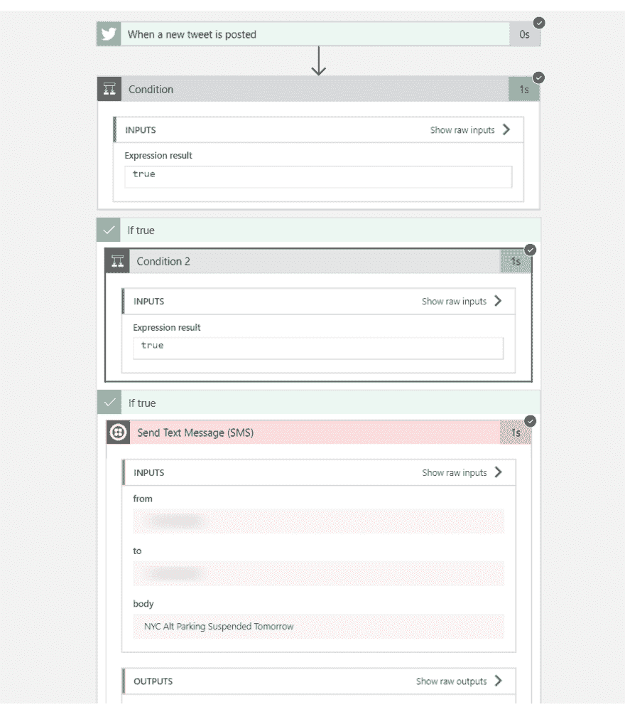](https://res.cloudinary.com/practicaldev/image/fetch/s--rlGgvy9P--/c_limit%2Cf_auto%2Cfl_progressive%2Cq_auto%2Cw_880/https://storage2.timheuer.com/successlog2.png)

因此，无需代码，只需几步就能通过 Twitter 和 Twilio 的认证，我只需使用一个浏览器就能完成同样的任务。我给那首曲子命名了吗？谁在乎呢…做软件不是一场竞赛，它很有趣，我们可以使用我们觉得最有效率的工具和技术。对我来说，这只是一种本能的反应，看看是否能像我想象的那样容易，事实上也确实可以。所以是的我赢了-D。

查看更多关于我用来将这些放在一起并让您的定制逻辑应用程序工作的部分:

*   [Azure 账户](https://azure.microsoft.com/free/?WT.mc_id=freetrial-blog-timheuer)–免费获得一个
*   [Azure Logic 应用](https://docs.microsoft.com/azure/logic-apps/?WT.mc_id=docs-blog-timheuer)(文档/教程)
*   [Twitter 连接器](https://docs.microsoft.com/connectors/twitter/?WT.mc_id=docs-blog-timheuer)
*   [Twilio connector](https://docs.microsoft.com/connectors/twilio/?WT.mc_id=docs-blog-timheuer)
*   [Azure App 服务](https://azure.microsoft.com/services/app-service/?WT.mc_id=docs-blog-timheuer)(针对资源组)
*   [为逻辑应用提供约 200 多个内置连接器](https://docs.microsoft.com/connectors/?WT.mc_id=docs-blog-timheuer)！

希望这有所帮助！

(本文[交叉转贴自 timheuer.com](http://timheuer.com/blog/archive/2019/04/19/how-i-solved-jessicas-nyc-parking-problem-with-twitter-twilio-and-azure.aspx))