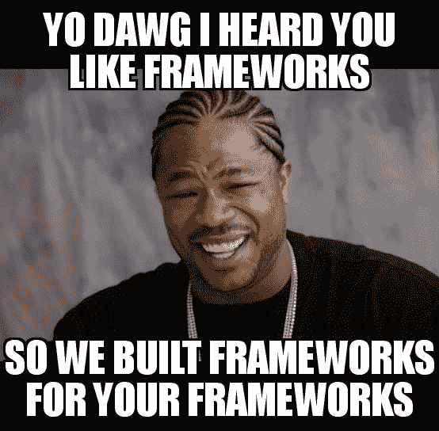

# 速成班:WebDev 流行语

> 原文：<https://dev.to/terabytetiger/crash-course-webdev-buzzwords-19l3>

# [T1】简介](#intro)

作为一个 Webdev 初学者，你会听到很多经验丰富的人抛出的词汇，并发现自己在一个流行词汇的池子里游泳。更糟糕的是，当你开始试图区分它们时，你发现你的列表越来越长，而你所做的只是看看“什么是{Buzzword}”登陆页！

不要再看了！我将把一些 Javascript 家喻户晓的名字分解成初学者友好的语言。

# 流行语

## API(应用编程接口)

当在网络上工作时，你将会编写 HTML、CSS 和 Javascript。只要一切都在您的站点内进行，就不会有问题，但是如果您想从另一个应用程序数据库中提取一些信息，该怎么办呢？这就是 API 的用武之地！API 为您从另一个位置请求信息提供了指导，并提供了程序间通信的方法，即使它们是用不同的语言编写的！

[了解更多关于 API 的信息](https://medium.com/@perrysetgo/what-exactly-is-an-api-69f36968a41f)

### 肥皂 vs 休息

> “肥皂非常干净。休息是给喜欢睡觉的人准备的”

SOAP 和 REST 是创建 API 的协议。我得到的解释是，SOAP 有更严格的规则列表，而 REST 就像狂野的西部(每个 API 都有自己的规则)。这是因为 SOAP 是一组可以获取数据的交互，而 REST 允许您获取数据并使用它做您需要的事情。

最有可能的是，您将花更多的时间使用 REST APIs，因为我的理解是 SOAP 主要被委托给遗留代码。[了解关于 SOAP 与 REST 的更多信息](https://www.guru99.com/comparison-between-web-services.html)

* * *

## 框架

您很可能听说过框架，但可能没有意识到它是一个框架(例如，React、Angular 和 Vue)。

*类比时间！*

想象一下，你正坐在数学课上，被要求在你面前的三张纸上画一个`y=x`的图形。

如果你使用一张白纸来实现这一点，那就像没有使用框架或编程语言一样。除了保持在纸张的物理界限内，没有其他指导。

如果你使用大学规定的论文，你已经增加了一门编程语言。你的一个轴将能够跟随预先画好的线，但是除此之外，你只能靠你自己。

最后，使用图表纸是给你的编程语言增加一个框架。有了绘图纸的帮助，你的图表会更整洁，更容易画出来。

### 组件

许多现代框架利用了被称为“组件”的东西，它们是可重用的代码片段。想象一个有 3 个页面的网站，但是你想在每个页面上添加相同的标题。一种方法是为每一页复制并粘贴你的标题 HTML。>但是如果需要更新部分头呢？要更新页眉，您需要转到每个页面并进行相同的调整。对于一个 3 页的网站来说，这可能不是一个大问题，但是如果你的网站有 100 页呢？这就是组件的用武之地！如果你把你的 navbar 构建成它自己的组件文件，你可以在构建的时候把它导入到你的站点的每一个页面中，最后得到类似这样的结果:

```
// page1
// import navbar statement
<navbar/> 
```

Enter fullscreen mode Exit fullscreen mode

```
// page2
// import navbar statement
<navbar/> 
```

Enter fullscreen mode Exit fullscreen mode

```
// page3
// import navbar statement
<navbar/> 
```

Enter fullscreen mode Exit fullscreen mode

```
//navbar file
`<nav>
  <ul>
    <li>
      <a href="#">
        <h1>Clever Site Name!</h1>
      </a>
    </li>
  </ul>
</nav> `
// Export navbar statement 
```

Enter fullscreen mode Exit fullscreen mode

现在，当你需要将导航条从`Clever Site Name!`更改为`Cool Site Name!`时，你只需调整导航条文件的单行即可，而无需单独调整每一页！

### 反应/角度/角度/余烬

酷！那么如何使用组件呢？这就是 React、Angular、Vue 和 Ember 出现的原因。它们都是允许你创建组件和使用你的组件建立网站/应用的框架。他们对如何创建组件有不同的看法，但是他们都有助于你实现相同的目标。为什么你会选择一个而不是另一个，这其中有一些细微的差别，但当谈到选择你想深入的领域时，我建议你尝试一下每一个，然后自己决定。

docs:[React](https://reactjs.org/)|[Angular](https://angular.io/)|[Vue](https://vuejs.org/)|[Ember](https://emberjs.com/)

#### 盖茨比&的朋友

[](//images.ctfassets.net/2ou7t1spiiyz/5y9PhbbjxtIvoU27qOCE9m/31a1948b2da87fa60cfe2ef4ce3061b6/frameworksOnFrameworks.jpg)

(以下内容适用于上述三个框架中的任何一个。Gatsby 适用于 React，但是您可以随意将 Gatbys 替换为 Gridsome，将 React 替换为 Vue[或者您想要的任何其他子/父框架对])

当您使用 React 时，您会发现有些事情需要很多挫折和设置才能工作。Gatsby 是一个基于 React 的框架，它通过提供预配置的设置来帮助缓解这些挫折，因此您不必自己去弄清楚。

docs:[Gatsby](https://www.gatsbyjs.org/)|[grid some](https://gridsome.org/)|[其他静态站点生成器](https://www.staticgen.com/)

### Node.js

所以你可以在你的站点上使用 Javascript 来添加交互，但是如果你想在你的服务器上也使用 Javascript 呢？

**Node.js 来帮忙了！**

虽然通常不被称为框架，但 Node 非常相似。它给出了一组指导原则，并为您做了一些后台工作，以使您的服务器启动并运行。

[关于 Node.js](https://nodejs.org/en/about/)

#### npm(节点包管理器)

`npm explain`

npm 是一个命令行工具，用于轻松管理项目的依赖关系。它允许你运行一个简单的命令`npm install react`来添加你需要添加 React 到你的项目中的所有东西，包括 React 依赖的任何 npm 包来做 React 的事情！

*请注意，使用 npm 有许多细微差别，这只是一个非常高层次的概述。*

[了解更多关于 npm 的信息](https://nodesource.com/blog/an-absolute-beginners-guide-to-using-npm/)

### 电子/原生/反应原生

好吧好吧。所以我们让 JS 在前端添加功能。我们让 JS 在后端运行服务器。*我们还可以用 JS 做什么？*

事实证明，基本上一切。

Electron 让您用 JS 构建可以在 Linux、Windows 甚至 macOS 上运行的桌面应用程序！一旦你写好了你的 Javascript，Electron 就会获取你的代码，对它进行一些巫术，然后抛出一个应用程序！这些应用程序会变得流行。也许你听说过一个叫 VS Code 的？

Nativescript 和 React Native 让您可以像变魔术一样将 Javascript 转换为 iOS 和 Android 可部署的应用程序。

*注意:尽管 JS 用于 Electron、Nativescript、React Native 和 Node.js，但它们在开发时确实需要不同的规则。遗憾的是，这并不容易:编写你的网站，在上面运行 3 个命令，突然你就有了一个 iOS 应用程序、Android 应用程序和桌面应用程序。这就是 PWA 的用武之地！*

Docs: [电子](https://electronjs.org/) | [原生脚本](https://www.nativescript.org/) | [反应原生](https://facebook.github.io/react-native/)

### PWA(渐进式网络应用)

渐进式网络应用对网络开发者来说是一个非常新的特性。虽然他们第一次可以花一点时间来启动和运行，但他们所做的真的很酷！他们让你把你的网站保存为一个应用程序，无论你在哪个平台上(macOS 支持即将推出)！

我认为 PWAs 最好被描述为书签的下一次进化。

> 关于这些如何工作的例子，你可以打开 Chrome 的`...`菜单，选择【T2 开发】到，然后点击`Install DEV community...`

了解更多:[谷歌的 PWA 指南](https://developers.google.com/web/progressive-web-apps/) | [免费代码营](https://medium.freecodecamp.org/progressive-web-apps-101-the-what-why-and-how-4aa5e9065ac2)

* * *

## JAMstack

> 为什么博客总是在谈论 PB&J？

JAM 是 Javascript+API+Markup 的缩写。JAMstack 是一种描述网站利用这三个部分来生成信息的方式。上面 **Gatsby & Friends** 中描述的许多“子框架”都是为了让开发 JAMstack 变得更容易而构建的。

"*等等！什么是加价？！*

你可能比你意识到的更熟悉标记。是一组应用于特定`tags`的样式。如果这听起来很熟悉，那可能是因为 HTML 中的“M”代表标记！它告诉浏览器`<h1>Title</h1>`应该大于`<h2>Title</h2>`。

[在 JAMstack.org 了解更多信息](https://jamstack.org/)

* * *

# 结论

希望这有助于澄清一些更有经验的开发人员在讨论 webdev 时抛出的词汇！我知道对我来说，当我刚开始的时候，被扔进每个人似乎都知道这些短语的深水区是非常可怕的！

如果你最近“点击”了某个单词/短语，或者有什么东西没有包括在这个列表中，但你仍然不确定，请随时在评论中或通过 DM 告诉我！