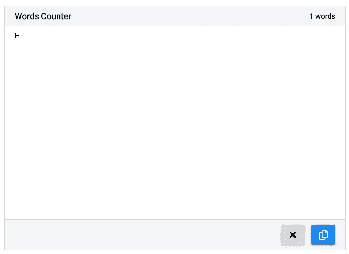
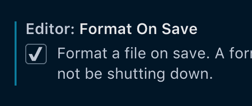
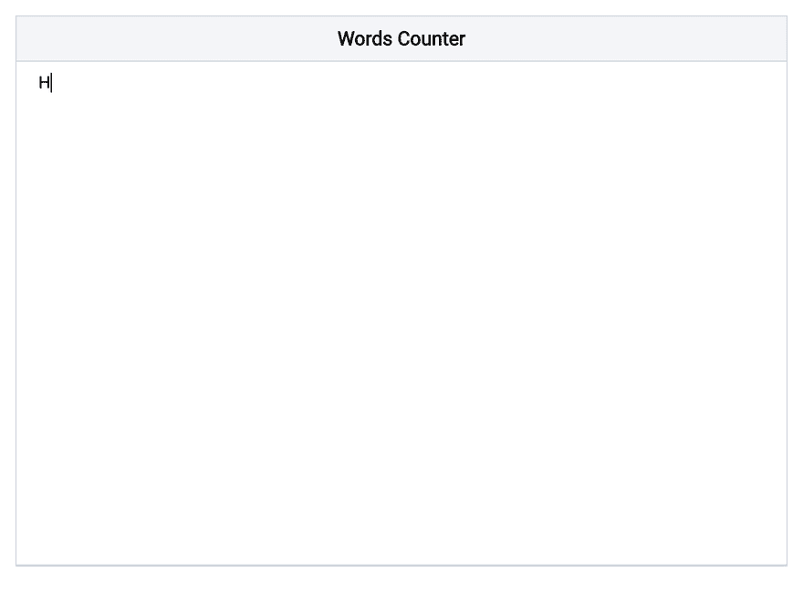
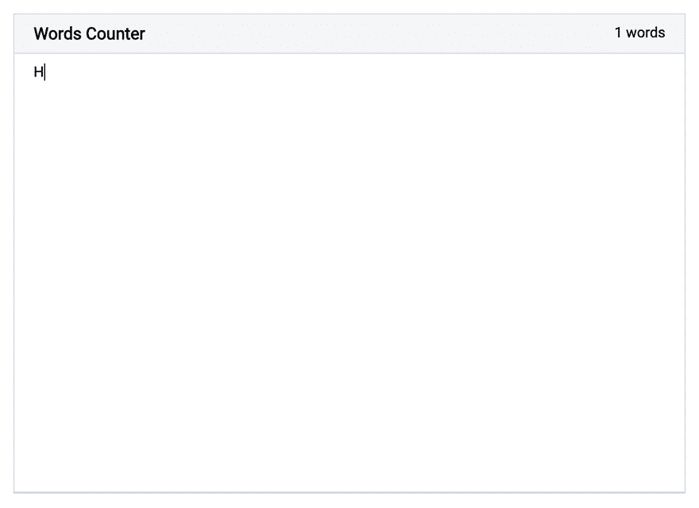
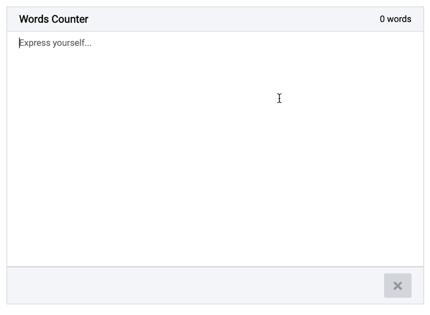

# 生产反应应用的原因？🤔(第一部分)

> 原文：<https://dev.to/seif_ghezala/reasonml-for-production-react-apps-part-1-3nfk>

ReasonML 是一种函数式编程语言，具有智能推断的严格类型，可以编译成 JavaScript。ReasonReact 是 ReactJS 的原因绑定(也称为 ReactJS 的 ReasonML 翻译版本)。它最近改进了很多，甚至在几天前的发布中增加了对钩子的支持。

在这一系列文章中，我将在 ReasonReact 中构建应用程序，并尝试完成我通常用 ReactJS 完成的大多数任务。对于每一篇文章，我都会分享我喜欢/不喜欢在 rational 中构建 React 应用程序的地方。目标是确定 React 应用程序的准备程度。

# 我们要造什么？

我决定从一个简单的应用程序开始。我们将构建一个具有以下特性的小单词计数器:

*   有一个输入，我可以写文本。
*   当我写文字时，字数会更新。
*   有一个清除文本的按钮。
*   有一个复制文本的按钮。

[](https://res.cloudinary.com/practicaldev/image/fetch/s--YUVH0Qt0--/c_limit%2Cf_auto%2Cfl_progressive%2Cq_66%2Cw_880/https://thepracticaldev.s3.amazonaws.com/i/1rl3gdneih3awmreato1.gif) 

<figure>

<figcaption>最终结果</figcaption>

</figure>

你可以在这里找到最终的源代码[。因为我们将在迭代中构建应用程序，所以每个迭代都有一个分支。](https://github.com/siffogh/words-counter)

# 设置项目&编辑

先把原因下载到 JavaScript 编译器[bs-platform](https://bucklescript.github.io/)(BuckleScript):

```
npm install -g bs-platform 
```

这个包附带了 *bsb* ，这是一个 CLI 工具，可以快速引导一个基于模板的 Reason 项目。
让我们基于 react-hooks 模板生成我们的项目:

```
bsb -init words-counter -theme react-hooks 
```

让我们也使用 VSCode 作为我们的代码编辑器，并下载 [reason-vscode](https://marketplace.visualstudio.com/items?itemName=jaredly.reason-vscode) 。这是 [ReasonML](https://reasonml.github.io/docs/en/editor-plugins) 官方推荐的编辑器插件。

为了利用格式化特性，让我们在编辑器的设置中启用保存时的*格式*选项:

[](https://res.cloudinary.com/practicaldev/image/fetch/s--UX0XpL4p--/c_limit%2Cf_auto%2Cfl_progressive%2Cq_auto%2Cw_880/https://thepracticaldev.s3.amazonaws.com/i/71vo3wmgs1e9revyjyza.png) 

<figure>

<figcaption>启用 VSCode 上的格式保存选项</figcaption>

</figure>

## 我喜欢👍

*   入门体验非常好。BuckleScript 构建工具(bsb)是 *create-react-app* 或 *yeoman* 的更快版本。

*   编辑器工具也很棒:

    *   它格式化代码样式和语法(就像用 Prettier 配置 ESLint 一样)。
    *   它还提供悬停在值上时有关类型的信息。

# 迭代#1:有一个我可以写文本的输入

在第一次迭代中，我们只想有一个漂亮的文本区域，它带有一个标题，用于编写文本并将其存储在一个状态变量中:

[](https://res.cloudinary.com/practicaldev/image/fetch/s--TwvIe4Pa--/c_limit%2Cf_auto%2Cfl_progressive%2Cq_66%2Cw_880/https://thepracticaldev.s3.amazonaws.com/i/pi8g9lchiksny3xymgxi.gif) 

<figure>

<figcaption>迭代#1:有一个我可以写文本的输入</figcaption>

</figure>

```
/* src/App.re */

[%bs.raw {|require('./App.css')|}];

[@react.component]
let make = () => {
  let (text, setText) = React.useState(() => "");

  let handleTextChange = e => ReactEvent.Form.target(e)##value |> setText;

  <div className="App">
    <div className="header">
      <h3> {"Words Counter" |> ReasonReact.string} </h3>
    </div>
    <textarea
      placeholder="Express yourself..."
      value=text
      onChange=handleTextChange
    />
  </div>;
}; 
```

## 我不喜欢👎

*   访问表单事件的目标值会有一点开销。
*   不得不对每个`string`值使用`ReasonReact.string`需要一些习惯，即使复合运算符`|>`有所帮助。
*   `useState`需要一个函数。虽然这在进行昂贵的初始状态计算时很有用，但在大多数情况下是不必要的。我更喜欢这个钩子的两种形式(一种接受值，一种接受函数)有不同的名字。

## 我喜欢👍

*   用 CSS 开发一个简单的应用程序非常容易。虽然要求 CSS 文件的语法有点奇怪，但整个体验仍然很棒。

*   DOM 元素是完全类型化的，这有两个好处:

    *   你可以在运行之前知道你是否给一个道具分配了一个错误的值:没有打字错误了！这就像为所有 DOM 元素的属性内置了 propTypes 一样。
    *   DOM 元素是自文档化的。您可以立即将鼠标悬停在一个元素上，查看它接受的可能属性(不再需要 Google 它们)。

## 迭代#2:当我写文章时，字数会更新

在这个迭代中，我们希望显示到目前为止输入的单词数:

[](https://res.cloudinary.com/practicaldev/image/fetch/s--IQFdCFWd--/c_limit%2Cf_auto%2Cfl_progressive%2Cq_66%2Cw_880/https://thepracticaldev.s3.amazonaws.com/i/v5jniuicgm8jucye597k.gif) 

<figure>

<figcaption>迭代#2:有一个字数在我写文字的时候更新</figcaption>

</figure>

首先，让我们创建一个函数，返回字符串输入中的单词数:

```
let countWordsInString = text => {
  let spacesRegex = Js.Re.fromString("\s+");

  switch (text) {
  | "" => 0
  | noneEmptyText =>
    noneEmptyText
    |> Js.String.trim
    |> Js.String.splitByRe(spacesRegex)
    |> Js.Array.length
  };
}; 
```

下面是这个函数的作用:

*   如果文本为空，我们只返回 0。
*   否则，我们只需修剪文本并使用`Js.String.splitByRe`通过正则表达式`\s+`对其进行分割(这基本上意味着 1 个或多个空格后跟任何字符)并返回我们获得的数组的长度。

```
/* src/App.re */

[%bs.raw {|require('./App.css')|}];

let countWordsInString = text => {
  let spacesRegex = Js.Re.fromString("\s+");

  switch (text) {
  | "" => 0
  | noneEmptyText =>
    noneEmptyText
    |> Js.String.trim
    |> Js.String.splitByRe(spacesRegex)
    |> Js.Array.length
  };
};

[@react.component]
let make = () => {
  let (text, setText) = React.useState(() => "");

  let handleTextChange = e => ReactEvent.Form.target(e)##value |> setText;

  let wordsCountText =
    (text |> countWordsInString |> string_of_int) ++ " words";

  <div className="App">
    <div className="header">
      <h3> {"Words Counter" |> ReasonReact.string} </h3>
      <span> {ReasonReact.string(wordsCountText)} </span>
    </div>
    <textarea
      placeholder="Express yourself..."
      value=text
      onChange=handleTextChange
    />
  </div>;
}; 
```

## 我喜欢👍

*   理性的聪明推论是伟大的:
    *   虽然我没有提供任何类型注释，但是`countWordsInString`函数是自文档化的。悬停在它上面显示它接受一个`string`并返回一个`int`。
    *   在某些时候，我从`countWordsInString`返回了分割数组，而不是它的长度。甚至在浏览器中查看应用程序之前，我就能够在构建时发现这个错误。

## 迭代#3:有一个清除文本的按钮

在这次迭代中，我们希望有一个按钮来清除文本:

[](https://res.cloudinary.com/practicaldev/image/fetch/s--nJhprTCv--/c_limit%2Cf_auto%2Cfl_progressive%2Cq_66%2Cw_880/https://thepracticaldev.s3.amazonaws.com/i/hbmtb7lvggsrvvlklbmh.gif) 

<figure>

<figcaption>迭代#3:有一个清除文本的按钮让我们在 textarea 中添加一个清除文本的按钮。</figcaption>

</figure>

在 JavaScript 中，我使用 [svgr](https://github.com/smooth-code/svgr) Webpack 加载器直接从对应的`.svg`文件中导入 SVG 图标作为 React 组件。

因为导入是在 Reason 中输入的，所以我决定在 clear 按钮中放置一个图标，看看将 SVG 图标作为 React 组件导入会有多痛苦。

由于我们将在下一次迭代中有另一个按钮，看起来会有所不同(剧透警报)，让我们将我们的按钮作为一个单独的组件，并使其具有两个类别的样式:

*   主要:蓝色按钮
*   次要:灰色按钮

```
/* src/Button.re */

[%bs.raw {|require('./Button.css')|}];

type categoryT =
  | SECONDARY
  | PRIMARY;

let classNameOfCategory = category =>
  "Button "
  ++ (
    switch (category) {
    | SECONDARY => "secondary"
    | PRIMARY => "primary"
    }
  );

[@react.component]
let make =
    (
      ~onClick,
      ~title: string,
      ~children: ReasonReact.reactElement,
      ~disabled=false,
      ~category=SECONDARY,
    ) => {
  <button onClick className={category |> classNameOfCategory} title disabled>
    children
  </button>;
}; 
```

为了使用 svgr，让我们在 Webpack `module`配置中添加以下规则:

```
{
  test: /\.svg$/,
  use: ['@svgr/webpack'],
} 
```

在 JavaScript 中，我们可以这样导入一个 svg 组件:

```
import {ReactComponent as Times} from './times'; 
```

由于 Webpack 将 svgr 应用于编译我们的 Reason 源代码得到的 JavaScript，我们只需要让 BuckleScript 将我们的 Reason 导入转换成一个命名的 es6 导入。

为此，我们首先必须配置`/bs-config.json`(BuckleScript 编译器的配置文件)来使用 es6 导入:

```
 "package-specs":  [  {  "module":  "es6",  "in-source":  true  }  ], 
```

React `make`函数编译成 JavaScript React 组件！这意味着，如果我们想使用一个用 JavaScript 编写的组件“Foo”，我们所要做的就是:
1-合理地创建组件。
2-导入 JS 组件作为 Reason 组件的`make`函数，并注释其 props。

因此，在模块`Foo.re`中，我们将拥有以下内容:

```
[@bs.module "./path/to/Foo.js"][@react.component]
external make: (~someProp: string, ~someOtherProp: int) => React.element = "default"; 
```

这意味着...我们可以用它来导入带有 svgr 的 SVG 组件！
让我们用它来导入`./times.svg`图标，并只注释`height`道具，因为这是我们将使用的唯一道具:

```
[@bs.module "./times.svg"] [@react.component]
external make: (~height: string) => React.element = "default"; 
```

我们的原因 React 组件被自动视为模块，因为我们在单独的文件(Button.re，App.re)中创建了它们。由于 Times 组件非常小(只有 2 行)，我们可以使用 Reason 的模块语法来创建它:

```
/* src/App.re */

[%bs.raw {|require('./App.css')|}];

let countWordsInString = text => {
  let spacesRegex = Js.Re.fromString("\s+");

  switch (text) {
  | "" => 0
  | noneEmptyText =>
    noneEmptyText
    |> Js.String.trim
    |> Js.String.splitByRe(spacesRegex)
    |> Js.Array.length
  };
};

module Times = {
  [@bs.module "./times.svg"] [@react.component]
  external make: (~height: string) => React.element = "default";
};

[@react.component]
let make = () => {
  let (text, setText) = React.useState(() => "");

  let handleTextChange = e => ReactEvent.Form.target(e)##value |> setText;

  let handleClearClick = _ => setText(_ => "");

  let wordsCountText =
    (text |> countWordsInString |> string_of_int) ++ " words";

  <div className="App">
    <div className="header">
      <h3> {"Words Counter" |> ReasonReact.string} </h3>
      <span> {ReasonReact.string(wordsCountText)} </span>
    </div>
    <textarea
      placeholder="Express yourself..."
      value=text
      onChange=handleTextChange
    />
    <div className="footer">
      <Button
        title="Clear text"
        onClick=handleClearClick
        disabled={String.length(text) === 0}>
        <Times height="20px" />
      </Button>
    </div>
  </div>;
}; 
```

## 我不喜欢👎

如果我想制作一个可重用的按钮，它应该接受原生 DOM 按钮的所有属性，我必须列出所有这些属性。在 JavaScript 中，我可以通过使用 spread 操作来避免这种情况:

```
function Button(props) {
    return <button {...props} /> } 
```

但是，ReasonReact 不允许 spread 运算符。(不知道有没有办法用 ReasonReact 达到我想要的🤔)

## 我喜欢👍

*   指定孩子类型的能力非常强大。这在 JavaScript 的 PropTypes 中是可能的，但是与 Reason 相比非常有限。例如，我们可以指定组件只接受 2 个子组件(作为一个元组)。
*   变体有助于对按钮进行分类。对组件进行分类是经常发生的事情，所以能够用实际的可靠类型而不是字符串常量来做这件事是一个巨大的胜利。
*   使用 Webpack svgr 插件将 SVG 作为一个组件导入实际上相当容易。这非常简单，但确保了类型安全，因为我们必须对类型进行注释。

## 迭代#4:有一个复制文本的按钮

在这次迭代中，我们希望有一个按钮将文本复制到剪贴板:

[](https://res.cloudinary.com/practicaldev/image/fetch/s--YUVH0Qt0--/c_limit%2Cf_auto%2Cfl_progressive%2Cq_66%2Cw_880/https://thepracticaldev.s3.amazonaws.com/i/1rl3gdneih3awmreato1.gif) 

<figure>

<figcaption>迭代#4:有一个复制文本的按钮</figcaption>

</figure>

为此，我想使用 [react-copy-to-clipboard](https://www.npmjs.com/package/react-copy-to-clipboard) ，这是一个 react 组件库，允许非常容易地将文本复制到剪贴板。因为它是一个 JavaScript 库，所以我们可以使用与上一次迭代中相同的导入方法。唯一的区别是，我们将进行命名导入，而不是默认导入。

```
/* src/App.re */

[%bs.raw {|require('./App.css')|}];

let countWordsInString = text => {
  let spacesRegex = Js.Re.fromString("\s+");

  switch (text) {
  | "" => 0
  | noneEmptyText =>
    noneEmptyText
    |> Js.String.trim
    |> Js.String.splitByRe(spacesRegex)
    |> Js.Array.length
  };
};

module Times = {
  [@bs.module "./icons/times.svg"] [@react.component]
  external make: (~height: string) => React.element = "default";
};

module Copy = {
  [@bs.module "./icons/copy.svg"] [@react.component]
  external make: (~height: string) => React.element = "default";
};

module CopyClipboard = {
  [@bs.module "react-copy-to-clipboard"] [@react.component]
  external make: (~text: string, ~children: React.element) => React.element =
    "CopyToClipboard";
};

[@react.component]
let make = () => {
  let (text, setText) = React.useState(() => "");

  let handleTextChange = e => ReactEvent.Form.target(e)##value |> setText;

  let handleClearClick = _ => setText(_ => "");

  let wordsCountText =
    (text |> countWordsInString |> string_of_int) ++ " words";

  <div className="App">
    <div className="header">
      <h3> {"Words Counter" |> ReasonReact.string} </h3>
      <span> {ReasonReact.string(wordsCountText)} </span>
    </div>
    <textarea
      placeholder="Express yourself..."
      value=text
      onChange=handleTextChange
    />
    <div className="footer">
      <Button
        title="Clear text"
        onClick=handleClearClick
        disabled={String.length(text) === 0}>
        <Times height="20px" />
      </Button>
      <CopyClipboard text>
        <Button
          title="Copy text"
          disabled={String.length(text) === 0}
          category=Button.PRIMARY>
          <Copy height="20px" />
        </Button>
      </CopyClipboard>
    </div>
  </div>;
}; 
```

## 我喜欢👍

导入 JavaScript React 组件库也非常简单，并且可以确保类型安全。