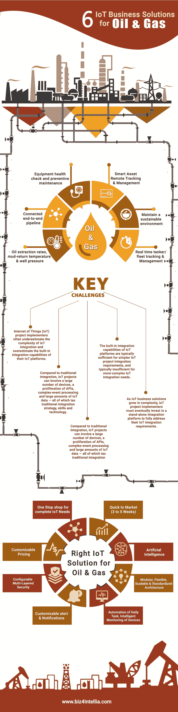

# 6 面向石油和天然气的物联网业务解决方案{信息图表}

> 原文：<https://dev.to/skyakashsoni/6-iot-business-solutions-for-oil-and-gas-infographics-2jlf>

无论上游、中游还是下游，油气行业面临的挑战与日俱增。这些挑战都与生产效率、安全和运营透明度有关。减少这些挑战将最终增加他们的利润，并最大限度地提高他们的运营。企业面临的最大挑战是如何实施物联网来增加收入。
为了减少上述挑战，石油&天然气行业必须在其运营中释放当今技术物联网的全部潜力。这张信息图将帮助石油&天然气工业有效地提高他们的运营。

[石油&天然气行业](https://www.biz4intellia.com/iot-in-oil-gas/)物联网解决方案