# 软件测试团队的 19 大协作工具

> 原文：<https://dev.to/lambdatest/top-19-collaboration-tools-for-your-software-testing-team-alc>

协作是每个组织都努力实现的一个方面，但这并不容易。特别是，如果你指的是大企业，员工为了支持一个共同的项目而在不同的地理位置工作。协作高度依赖于工具，选择合适的团队协作工具是必不可少的，因为它将帮助您:

*   让您的团队更有效率。
*   促进远程团队成员之间的高效沟通。
*   通过创建档案来维护工作历史。
*   允许未来的团队成员通过浏览历史来了解项目的更多信息。

然而，互联网上有大量的协作工具，选择正确的工具可能会很麻烦。本文的目的是为您和您的企业简化过滤过程。这里列出了 19 大团队协作工具，通过促进团队成员之间的联系，这些工具将使您的团队成员产生更多的生产力。

## 1。[体式](https://asana.com/)——为重要的工作腾出更多时间

[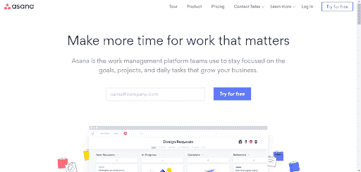](https://res.cloudinary.com/practicaldev/image/fetch/s--dNFuJvUt--/c_limit%2Cf_auto%2Cfl_progressive%2Cq_auto%2Cw_880/https://www.lambdatest.com/blog/wp-content/uploads/2018/11/asana.png)

它是一个基于云的平台，测试团队的所有成员都可以从任何地方登录，只要他们有一个工作的互联网连接。仪表板有三个面板，让您可以访问与项目相关的所有数据。

如果您是利益相关者或产品或业务的所有者，Asana 将为您提供关于您的组织正在进行的所有项目的数据，以及个人数据，如未完成的任务和任务的分配人。

LambdaTest 提供与 Asana 的整合。点击[此处](https://www.lambdatest.com/lambdatest-asana-documentation)了解如何建立 LambdaTest + Asana 整合。

## 2。[Wrike](https://www.wrike.com/)—领先的工作管理解决方案

Wrike 将帮助你把你的任务分成更小的部分。因此，测试领导可以很容易地跟踪每个成员的工作进度和团队贡献。

所提供的数据非常容易阅读，还为您提供了财务细节，以便您可以检查项目是否在预算范围内。这个团队协作工具对于基于服务的组织非常有用。

## 3。[支尔格](https://www.atlassian.com/software/jira)

[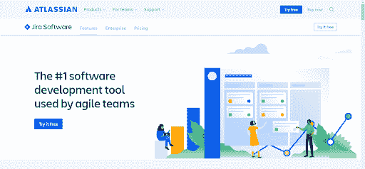](https://res.cloudinary.com/practicaldev/image/fetch/s--2iJtKm6l--/c_limit%2Cf_auto%2Cfl_progressive%2Cq_auto%2Cw_880/https://www.lambdatest.com/blog/wp-content/uploads/2018/11/jira.png)

这是一个打包的工具，允许用户创建一个任务，并根据其优先级将它们分配给测试团队的成员。由于可定制的 scrum 板、显示看板和敏捷团队工作进度的报告以及帮助项目经理设计策略和跟踪工作的积压整理等特性，它在各种组织中广受欢迎。

LambdaTest 提供与 JIRA 的整合。点击[此处](https://www.lambdatest.com/lambdatest-jira-documentation?utm_source=dev&utm_medium=Blog&utm_campaign=ar-03-190419eu&utm_term=OrganicPosting)了解如何建立 LambdaTest + JIRA 整合。

## 4。[斯科罗](https://www.scoro.com/):给你的工作带来结构

[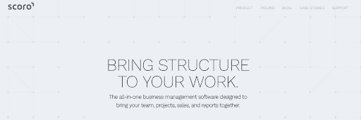](https://res.cloudinary.com/practicaldev/image/fetch/s--vgExzPQp--/c_limit%2Cf_auto%2Cfl_progressive%2Cq_auto%2Cw_880/https://www.lambdatest.com/blog/wp-content/uploads/2018/11/scoro.png)

这个团队协作工具不是免费的，但是由于它的成本，它附带了许多设施，可以很容易地定制以适应工作流。

*   它使个人成员能够在团队内部共享文件。
*   用户可以创建无限的项目，如果需要，团队成员可以联合访问多个项目。
*   除了跟踪团队的进展，用户还可以使用模板创建发票。

## 5。[懈怠](https://slack.com/)——工作发生的地方

除了广泛用作即时通讯工具，Slack 还是一个有效的团队协作工具。

*   它允许用户根据目的或部门将讨论分成不同的类别。
*   提供文件共享和信息搜索等机会。
*   用户可以根据自己需要的解决方案定制工具或设置首选项。

LambdaTest 提供了与 Slack 的集成。点击[此处](https://www.lambdatest.com/lambdatest-slack-documentation?utm_source=dev&utm_medium=Blog&utm_campaign=ar-03-190419eu&utm_term=OrganicPosting)了解如何建立 LambdaTest + Slack 集成。

## 6。 [WebEx](https://www.webex.co.in/) :在你所在的地方工作

这是一种即时消息和聊天服务，使您的团队成员能够创建聊天室并在房间内以及一对一地共享文件。不仅如此，它还提供了屏幕共享、视频通话、访客登录以及无限存储等功能。

## 7。[bit bucket](https://bitbucket.org/)——专为职业球队打造

[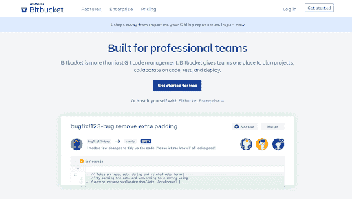](https://res.cloudinary.com/practicaldev/image/fetch/s--ofnG24Ew--/c_limit%2Cf_auto%2Cfl_progressive%2Cq_auto%2Cw_880/https://www.lambdatest.com/blog/wp-content/uploads/2018/11/bitbucket.png)

Bitbucket 由拥有 Hipchat 和 JIRA 的 Atlassian 公司开发，是一款高效的团队协作工具。它向用户提供无限数量的私有存储库。然而，与 Github 不同的是，它并不专注于开源。相反，它的目的是帮助组织中的开发人员和测试人员在项目中合作。

LambdaTest 提供了与 Bitbucket 的集成。点击[此处](https://www.lambdatest.com/lambdatest-bitbucket-documentation?utm_source=dev&utm_medium=Blog&utm_campaign=ar-03-190419eu&utm_term=OrganicPosting)了解如何建立 LambdaTest + Bitbucket 集成。

## 8。[冰屋](https://www.igloosoftware.com/)——数字化工作场所解决方案

[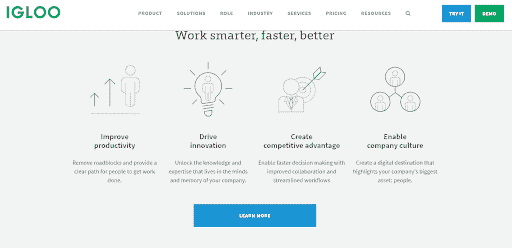](https://res.cloudinary.com/practicaldev/image/fetch/s--S4vd7ynk--/c_limit%2Cf_auto%2Cfl_progressive%2Cq_auto%2Cw_880/https://www.lambdatest.com/blog/wp-content/uploads/2018/11/iglooo.png)

现在，在这个团队协作工具的帮助下，团队凝聚力变得更强了，它让您有机会创建一个可定制的项目。对该项目的访问可以是公开的或私有的。您还可以限制或授予团队成员额外的访问权限。

## 9。[特雷罗](https://trello.com/)–让你更好地协作，完成更多工作

[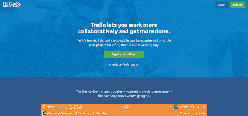](https://res.cloudinary.com/practicaldev/image/fetch/s--P6Pc0tb3--/c_limit%2Cf_auto%2Cfl_progressive%2Cq_auto%2Cw_880/https://www.lambdatest.com/blog/wp-content/uploads/2018/11/trello.png)

这是一个基于云的平台，允许用户使用显示在仪表板上的卡片来组织他们的项目。你可以在卡片上写字，移动卡片，或者在任何时候拿走卡片。

卡片中的栏目表示项目的不同阶段。随着每个项目的进展，卡片沿着棋盘移动。因此，您可以看到您的团队正在进行的所有项目的状态。

LambdaTest 提供与 Trello 的集成。点击[此处](https://www.lambdatest.com/lambdatest-trello-documentation?utm_source=dev&utm_medium=Blog&utm_campaign=ar-03-190419eu&utm_term=OrganicPosting)了解如何建立 LambdaTest + Trello 整合。

## 10。[Yammer](https://products.office.com/en-in/yammer/yammer-overview)–在您的整个组织中建立联系并参与其中

[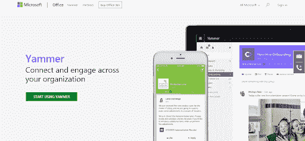](https://res.cloudinary.com/practicaldev/image/fetch/s--EbkI2oaM--/c_limit%2Cf_auto%2Cfl_progressive%2Cq_auto%2Cw_880/https://www.lambdatest.com/blog/wp-content/uploads/2018/11/yammer.png)

Yammer 是一个企业社交网络，帮助员工在不同地点和部门有效协作。它完全专注于商业，会员需要在公司域名下注册一个工作邮箱。您的测试团队可以创建一个单独的受限访问的组，在那里他们可以连接并分享他们的想法和知识。

[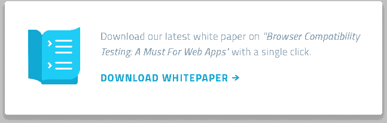](https://res.cloudinary.com/practicaldev/image/fetch/s--IVFz7F4z--/c_limit%2Cf_auto%2Cfl_progressive%2Cq_auto%2Cw_880/https://www.lambdatest.com/blog/wp-content/uploads/2018/03/Download-Whitepaper.png)

## 11。[微软 VSTS / Azure DevOps](https://visualstudio.microsoft.com/team-services/)

[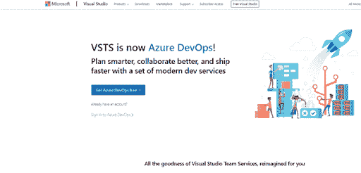](https://res.cloudinary.com/practicaldev/image/fetch/s--ur1Q-H6z--/c_limit%2Cf_auto%2Cfl_progressive%2Cq_auto%2Cw_880/https://www.lambdatest.com/blog/wp-content/uploads/2018/11/vsts.png)

Visual Studio Team Services，现在被称为 Azure DevOps，为项目中的不同团队提供协作，为测试人员、架构师、开发人员等提供特殊的工具。项目的每个成员都可以做他们分配的工作，并与团队的其他成员进行讨论和知识共享。

提供与微软 VSTS/ Azure DevOps 的集成。点击[此处](https://www.lambdatest.com/lambdatest-vsts-documentation?utm_source=dev&utm_medium=Blog&utm_campaign=ar-03-190419eu&utm_term=OrganicPosting)了解如何建立 LambdaTest + VSTS 整合。

## 12。[Podio](https://podio.com/site/en)–您的工作流程，结构化&更智能

[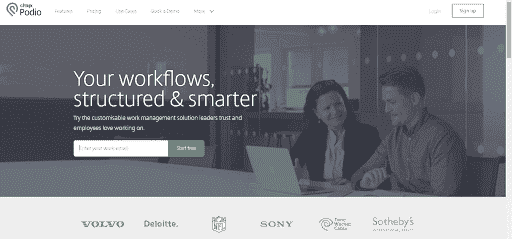](https://res.cloudinary.com/practicaldev/image/fetch/s--0fodFfbA--/c_limit%2Cf_auto%2Cfl_progressive%2Cq_auto%2Cw_880/https://www.lambdatest.com/blog/wp-content/uploads/2018/11/podio.png)

Podio 是一个优秀的团队协作工具，它使您的测试团队更容易共享数据和知识，尤其是当他们位于不同时区的远程位置时。

*   它为组织团队和跟踪客户提供了一个可定制的 CRM。
*   有自动化的工作流程来降低时间复杂性。
*   在敏捷方法中有效地管理业务流程和 scrums。

## 13。[git lab](https://about.gitlab.com/)——现代开发者的工具

[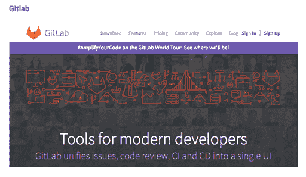](https://res.cloudinary.com/practicaldev/image/fetch/s--3NgKI5zV--/c_limit%2Cf_auto%2Cfl_progressive%2Cq_auto%2Cw_880/https://www.lambdatest.com/blog/wp-content/uploads/2018/11/gitlab.png)

就像 GitHub 一样，GitLab 是一个存储库服务，在这里你可以存储你的代码，创建分支和版本，根据其中的变化或者每个问题的解决。它为团队提供协作，团队可以从任何地方访问它，在分支中推送他们的代码或下载旧代码。

LambdaTest 提供与 GitLab 的集成。点击[此处](https://www.lambdatest.com/lambdatest-gitlab-documentation?utm_source=dev&utm_medium=Blog&utm_campaign=ar-03-190419eu&utm_term=OrganicPosting)了解如何建立 LambdaTest + GitLab 集成。

## 14。[汇合](https://www.atlassian.com/software/confluence)——通过合作让想法变得更好

[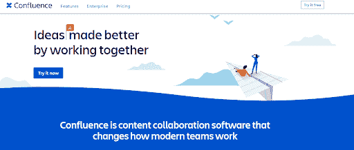](https://res.cloudinary.com/practicaldev/image/fetch/s--r-C6rX-E--/c_limit%2Cf_auto%2Cfl_progressive%2Cq_auto%2Cw_880/https://www.lambdatest.com/blog/wp-content/uploads/2018/11/confluence.png)

Confluence 是一个私人托管的聊天服务，目的是使您的测试团队能够以一种有效的方式进行交流。

*   所有者有权设置他们的团队可以访问的组。
*   提供保存对话的功能，以便在出现任何沟通错误或需要任何信息时进行访问。
*   还具有视频聊天功能，可以从任何桌面或移动设备启动，与位于不同位置的团队进行交谈。

## 15。[GitHub](https://github.com/)——专为开发者打造

[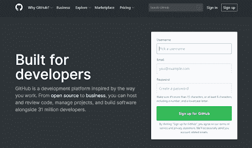](https://res.cloudinary.com/practicaldev/image/fetch/s--E0mW-CZj--/c_limit%2Cf_auto%2Cfl_progressive%2Cq_auto%2Cw_880/https://www.lambdatest.com/blog/wp-content/uploads/2018/11/github-1.png)

这可能是世界各地的组织和开发人员最常用的存储库服务。该工具可以免费使用，并且可以从任何地方访问。然而，这种团队协作工具只有一个缺点——存储空间有限。

LambdaTest 提供了与 GitHub 的集成。点击[此处](https://www.lambdatest.com/lambdatest-github-documentation?utm_source=dev&utm_medium=Blog&utm_campaign=ar-03-190419eu&utm_term=OrganicPosting)了解如何建立 LambdaTest + GitHub 集成。

## 16。[Tallium](https://tallium.com/)——您项目的软件开发团队

[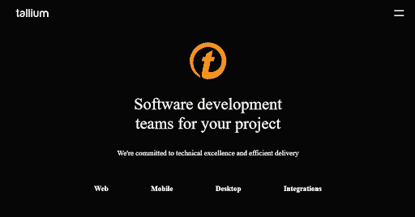](https://res.cloudinary.com/practicaldev/image/fetch/s--OGncBNg0--/c_limit%2Cf_auto%2Cfl_progressive%2Cq_auto%2Cw_880/https://www.lambdatest.com/blog/wp-content/uploads/2018/11/tallium.png)

Tallium 是一个社区平台，旨在允许用户创建社区，在那里他们可以分享新的想法和解决任何可能影响业务的问题的方法。

*   该工具加强了利益相关者和客户之间的联系。
*   有多个安全和隐私级别来保护您的数据安全。
*   用户友好且可定制，以满足您团队的需求。

## 17。[Paymo](https://www.paymoapp.com/)——快乐工作

[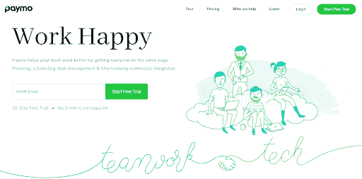](https://res.cloudinary.com/practicaldev/image/fetch/s--1TLP_k2l--/c_limit%2Cf_auto%2Cfl_progressive%2Cq_auto%2Cw_880/https://www.lambdatest.com/blog/wp-content/uploads/2018/11/paymo.png)

这是一个项目管理应用程序，主要面向自由职业者，也面向从事 web 开发项目、社交媒体、营销和其他机构的小型组织。该应用程序的主要目标是建立一个协作平台，在这个平台上，用户可以与团队共享他们的知识和资源，管理时间并为各个团队成员安排任务。

LambdaTest 提供与 Paymo 的集成。点击[此处](https://www.lambdatest.com/lambdatest-paymo-documentation?utm_source=dev&utm_medium=Blog&utm_campaign=ar-03-190419eu&utm_term=OrganicPosting)了解如何建立 LambdaTest + Paymo 整合。

## 18。[团队合作](https://www.teamwork.com/)

[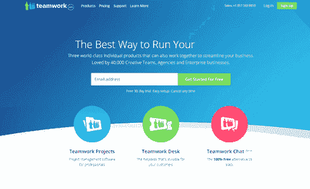](https://res.cloudinary.com/practicaldev/image/fetch/s--rWGplowK--/c_limit%2Cf_auto%2Cfl_progressive%2Cq_auto%2Cw_880/https://www.lambdatest.com/blog/wp-content/uploads/2018/11/teamwork.png)

团队协作是另一个多用途的团队协作工具，它允许您将任务分配给团队成员，与他们交流并跟踪他们的工作进度。由于它的健壮性、安全性和单点登录特性，受到了用户的欢迎。

LambdaTest 提供团队合作的整合。点击[此处](https://www.lambdatest.com/lambdatest-teamwork-documentation?utm_source=dev&utm_medium=Blog&utm_campaign=ar-03-190419eu&utm_term=OrganicPosting)了解如何建立 LambdaTest +团队合作整合。

## 19。[蜂巢](https://www.hive.com/)——生产力平台

[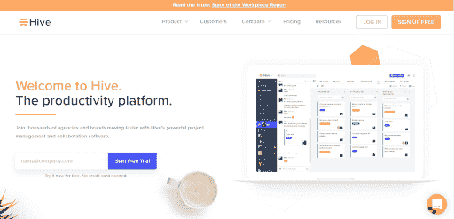](https://res.cloudinary.com/practicaldev/image/fetch/s--kGhBx9OS--/c_limit%2Cf_auto%2Cfl_progressive%2Cq_auto%2Cw_880/https://www.lambdatest.com/blog/wp-content/uploads/2018/11/hive.png)

这个工具让你的团队以他们想要的方式规划项目。你可以用任何方式组织你的项目，无论是黑板还是图表形式，并且可以很容易地在布局之间切换。多重视图功能还允许您根据状态、分配的标签或团队成员来查看项目。最棒的是，你的团队可以互相交流，共享所有的知识数据和所需的文件。

LambdaTest 提供的另一个伟大的工具[集成](https://www.lambdatest.com/hive-integration?utm_source=dev&utm_medium=Blog&utm_campaign=ar-03-190419eu&utm_term=OrganicPosting)。

## LambdaTest 有多在乎你的团队协作？

除了作为跨浏览器测试的领先解决方案之一，您现在还可以执行这些团队协作工具与 LambdaTest 的集成。

LambdaTest 的一键 bug 日志记录功能将 LambdaTest 测试套件中的所有问题推送到您想要的任何第三方团队协作工具中。现在，在测试过程中，您只需点击一个按钮，就可以在这些工具中记录您的错误。

那都是我们这边的。除此之外，市场上还有许多其他的团队协作工具。选择一个适合您的测试团队的，并开始分享想法。如果您找到任何其他符合您需求的工具，请务必通知我们。

**相关帖子:**

1.  [如何创建跨浏览器兼容的 HTML 进度条？](https://www.lambdatest.com/blog/how-to-create-a-cross-browser-compatible-html-progress-bar/?utm_source=dev&utm_medium=Blog&utm_campaign=ar-03-190419eu&utm_term=OrganicPosting)
2.  [我在面试中被问得最多的 19 个 JavaScript 问题](https://www.lambdatest.com/blog/19-javascript-questions-i-have-been-asked-most-in-interviews/?utm_source=dev&utm_medium=Blog&utm_campaign=ar-03-190419eu&utm_term=OrganicPosting)
3.  [开发网站的 21 大 JavaScript 和 CSS 库](https://www.lambdatest.com/blog/top-21-javascript-and-css-libraries/?utm_source=dev&utm_medium=Blog&utm_campaign=ar-03-190419eu&utm_term=OrganicPosting)