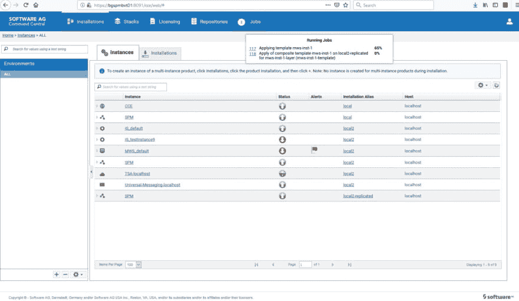
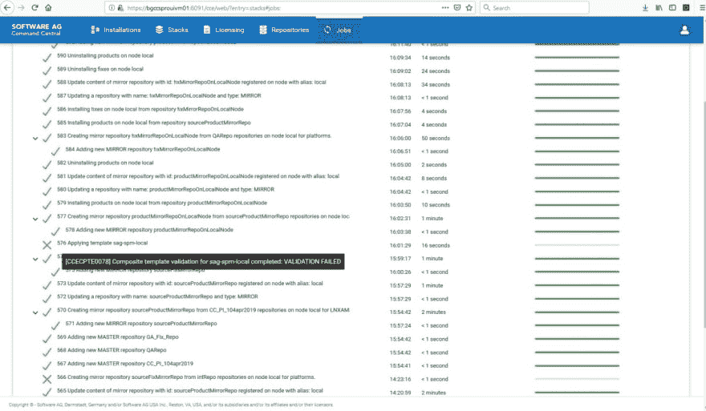

# 软件 AG Command Central 10.4 增强功能

> 原文：<https://dev.to/techcommunity/software-ag-command-central-10-4-enhancements-1l47>

# Command Central 10.4 中最有趣、最有用的新功能

以下是 Command Central 10.4 中最有趣、最有用的新功能的亮点。我们考虑了来自现场的反馈，并基于软件 AG Command Central 复合模板的大量使用，做出了这些改进:

## 优化运行时组件生命周期操作

在 10.4 之前，当应用任何模板时，无论如何，Command Central 都会重新启动目标节点上的所有运行时。现在，在 10.4 中，此行为得到了优化，以便:

*   默认情况下，所有运行时组件都不会在复合模板执行结束时重新启动
*   仅当需要重启的配置被应用于该层时，运行时组件才在该层应用期间重启
*   所有停止的组件在层应用结束时启动

最终结果与之前相同(堆栈在线)，但仅在需要时重启，从而加快了配置应用的周期，并允许此类更改零停机。

## 配置失败

10.4 之前版本的 Command Central 不会将配置失败报告为错误，最多会报告为警告。现在，在 Command Central 10.4 中，这种行为得到了改进，目标是按照模板中的定义创建环境。如果配置失败，模板会尽早失败，而无需对目标环境进行进一步的手动或自动检查。默认情况下，复合模板像以前一样工作，以便与以前的版本保持一致。您可以通过将模板 DSL 版本设置为 1.2 (dslVersion="1.2 ")并添加选项 abortOnConfigFailure: true 来启用这个新功能。命令行界面的任何爱好者也可以使用 enhance CLI 命令实现更好的自动化工具:

```
sagcc exec templates composite apply <templatealias> --sync-job -e <expectedstatus> </expectedstatus></templatealias> 
```

## 改进模板开发

为了帮助加快模板开发，Command Central 10.4 现在提供了将完整实例保存为模板片段的功能。这将允许任何模板开发人员根据需要简单地配置实例，将 Command Central 指向它，并将其导出为 yaml 片段。指挥中心将获取以下所需信息:

*   列出所选实例的已安装产品(来自该实例的所有运行时组件)
*   实例属性
*   实例配置

## 移除旧的作业视图，增加作业用户界面的可用性

在 Command Central 10.4 中，现在只存在一个作业视图，该视图包含传统作业视图的所有功能。除了对复合模板执行的即时和更好的反馈，它还提供:

*   改进的导航
*   所有正在运行的作业的简化视图
*   增强的错误报告

下面的截图显示了不同的情况是如何不出现在用户界面上的:

正在进行的作业:

[](https://res.cloudinary.com/practicaldev/image/fetch/s--Ab6qAS1_--/c_limit%2Cf_auto%2Cfl_progressive%2Cq_auto%2Cw_880/http://techcommunity.softwareag.com/documents/10157/10255328/CommandCentral_1.jpg/1c9480ff-8384-4eb1-8347-2c334b12779e%3Ft%3D1555658141797)

工作状态汇总:

[](https://res.cloudinary.com/practicaldev/image/fetch/s--_G3ol7pH--/c_limit%2Cf_auto%2Cfl_progressive%2Cq_auto%2Cw_880/http://techcommunity.softwareag.com/documents/10157/10255328/CommandCentral_2.jpg/0249f4cf-407b-4d56-b78b-342111b4df45%3Ft%3D1555658145108)

失败的作业，鼠标悬停时出现确切错误:

[](https://res.cloudinary.com/practicaldev/image/fetch/s--ePuCNK5m--/c_limit%2Cf_auto%2Cfl_progressive%2Cq_auto%2Cw_880/http://techcommunity.softwareag.com/documents/10157/10255328/CommandCentral_3.jpg/d7bb8740-9d26-4d9a-a9f6-3714adfae8d5%3Ft%3D1555658150117)

请在

【CommandCentral-Swat@softwareag.com T2】参加 10.4 基础培训或提问