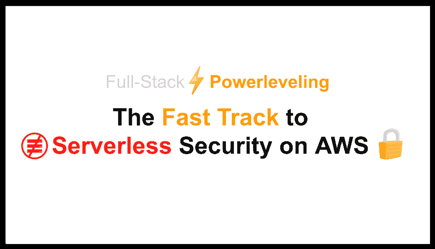
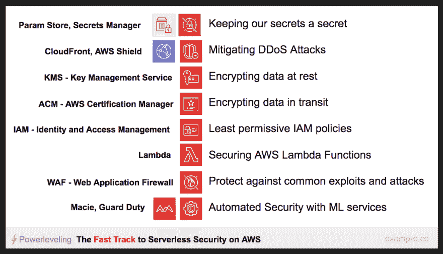
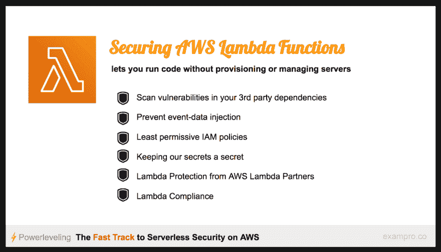

# AWS 上无服务器安全的快速通道

> 原文：<https://dev.to/exampro/the-fast-track-to-serverless-security-on-aws-53gb>

我的 AWS 安全演讲很受欢迎，我被邀请为无服务器多伦多用户组做一个无服务器安全演讲，这就是我的演讲。

#### 引用的资源

*   [无服务器多伦多用户组](https://www.youtube.com/redirect?v=lERw93Vk0No&redir_token=gmC_-2-MKfVfKjnodpmJ-K1lim98MTU1NTczMTM0MkAxNTU1NjQ0OTQy&q=https%3A%2F%2Fwww.meetup.com%2FServerless-Toronto%2F&event=video_description)
*   [OWASP 前 10 名](https://www.youtube.com/redirect?v=lERw93Vk0No&redir_token=gmC_-2-MKfVfKjnodpmJ-K1lim98MTU1NTczMTM0MkAxNTU1NjQ0OTQy&q=https%3A%2F%2Fwww.owasp.org%2Fimages%2F7%2F72%2FOWASP_Top_10-2017_%2528en%2529.pdf.pdf&event=video_description)
*   [WAF AWS 云形成模板](https://www.youtube.com/redirect?v=lERw93Vk0No&redir_token=gmC_-2-MKfVfKjnodpmJ-K1lim98MTU1NTczMTM0MkAxNTU1NjQ0OTQy&q=https%3A%2F%2Fdocs.aws.amazon.com%2Fsolutions%2Flatest%2Faws-waf-security-automations%2Ftemplate.html&event=video_description)
*   [纯秒](https://www.puresec.io/)
*   [白皮书-使用 AWS WAF 缓解 OWASP 的 10 大 Web 应用程序漏洞](https://www.youtube.com/redirect?v=lERw93Vk0No&redir_token=gmC_-2-MKfVfKjnodpmJ-K1lim98MTU1NTczMTM0MkAxNTU1NjQ0OTQy&q=https%3A%2F%2Fd0.awsstatic.com%2Fwhitepapers%2FSecurity%2Faws-waf-owasp.pdf&event=video_description)
*   [Snyk -扫描漏洞的第三方依赖性](https://snyk.io/)