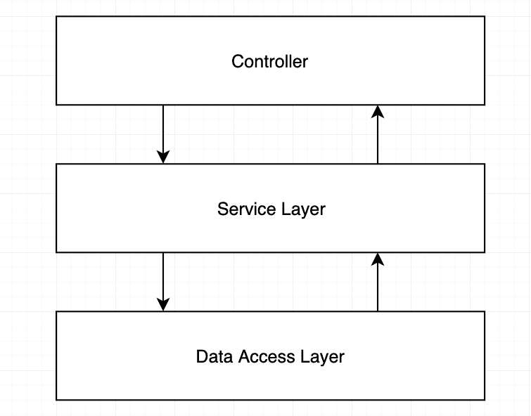
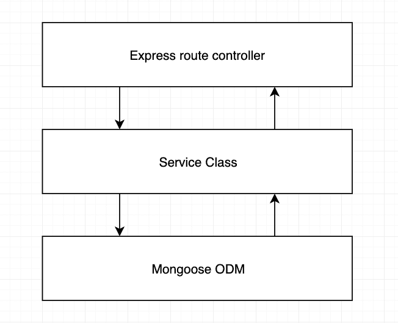

# 防弹 node.js 项目架构🛡️

> 原文：<https://dev.to/santypk4/bulletproof-node-js-project-architecture-4epf>

*原贴于[softwareontheroad.com](https://softwareontheroad.com/ideal-nodejs-project-structure?utm_source=devto&utm_medium=post)T3】*

**2019 年 4 月 21 日更新** : [在 GitHub 仓库中的实现示例](https://github.com/santiq/bulletproof-nodejs)

# 简介

Express.js 是制作 node.js REST APIs 的好框架，但是它没有给你任何关于如何组织 node.js 项目的线索。

虽然听起来很傻，但这确实是个问题。

node.js 项目结构的正确组织将避免代码的重复，将提高稳定性，如果做得正确，还可能帮助您扩展服务。

这篇文章是扩展研究，来自我多年来处理一个糟糕的结构化 node.js 项目的经验，糟糕的模式，以及无数小时的代码重构和移动。

如果你需要帮助来调整你的 node.js 项目架构，请给我写信，地址是[santiago@softwareontheroad.com](mailto:santiago@softwareontheroad.com)

# 目录

*   [文件夹结构🏢](#folder)
*   [3 层架构🥪](#architecture)
*   [服务层💼](#service)
*   [发布/订阅层️️️️🎙️️](#pubsub)
*   [依赖注入💉](#di)
*   [单元测试🕵🏻](#test)
*   [Cron 作业和周期性任务⚡](#cron)
*   [配置和秘密🤫](#configs)
*   [装载机🏗](#loaders)
*   [范例库](https://github.com/santiq/bulletproof-nodejs)

# 文件夹结构🏢

这里是我说的 node.js 项目结构。

我在我构建的每个 node.js REST API 服务中都使用它，让我们详细看看每个组件是做什么的。

```
 src
  │   app.js          # App entry point
  └───api             # Express route controllers for all the endpoints of the app
  └───config          # Environment variables and configuration related stuff
  └───jobs            # Jobs definitions for agenda.js
  └───loaders         # Split the startup process into modules
  └───models          # Database models
  └───services        # All the business logic is here
  └───subscribers     # Event handlers for async task
  └───types           # Type declaration files (d.ts) for Typescript 
```

Enter fullscreen mode Exit fullscreen mode

它不仅仅是一种订购 javascript 文件的方式...

# 3 层架构🥪

这个想法是使用**关注点分离原则**将业务逻辑从 node.js API 路由中移走。

[](https://res.cloudinary.com/practicaldev/image/fetch/s--NBWarb6c--/c_limit%2Cf_auto%2Cfl_progressive%2Cq_auto%2Cw_880/https://thepracticaldev.s3.amazonaws.com/i/8ujhfk47a3ciluri0wfx.png)

因为有一天，您会希望在 CLI 工具上使用您的业务逻辑，或者在一个重复的任务中不走远。

并从 node.js 服务器对自身进行 API 调用，这不是一个好主意...

[](https://res.cloudinary.com/practicaldev/image/fetch/s--8tp11HUq--/c_limit%2Cf_auto%2Cfl_progressive%2Cq_auto%2Cw_880/https://thepracticaldev.s3.amazonaws.com/i/9u6xqmp6yi7exa33th0e.png)

## ☠️不要把你的商业逻辑放在控制器里面！！☠️

你可能会尝试使用 express.js 控制器来存储你的应用程序的业务逻辑，但这很快就变成了意大利面条式的代码，一旦你需要编写单元测试，你将最终处理复杂的模拟对象 *req* 或 *res* express.js。

很难区分什么时候应该发送响应，什么时候在“后台”继续处理，比如说在响应发送到客户端之后。

这里有一个不要做什么的例子。

```
 route.post('/', async (req, res, next) => {

    // This should be a middleware or should be handled by a library like Joi.
    const userDTO = req.body;
    const isUserValid = validators.user(userDTO)
    if(!isUserValid) {
      return res.status(400).end();
    }

    // Lot of business logic here...
    const userRecord = await UserModel.create(userDTO);
    delete userRecord.password;
    delete userRecord.salt;
    const companyRecord = await CompanyModel.create(userRecord);
    const companyDashboard = await CompanyDashboard.create(userRecord, companyRecord);

    ...whatever...

    // And here is the 'optimization' that mess up everything.
    // The response is sent to client...
    res.json({ user: userRecord, company: companyRecord });

    // But code execution continues :(
    const salaryRecord = await SalaryModel.create(userRecord, companyRecord);
    eventTracker.track('user_signup',userRecord,companyRecord,salaryRecord);
    intercom.createUser(userRecord);
    gaAnalytics.event('user_signup',userRecord);
    await EmailService.startSignupSequence(userRecord)
  }); 
```

Enter fullscreen mode Exit fullscreen mode

#为您的业务逻辑使用服务层💼

这一层是您的业务逻辑应该存在的地方。

它只是一个具有清晰目标的类集合，遵循应用于 node.js 的**坚实**原则。

在这一层不应该存在任何形式的“SQL 查询”,使用数据访问层。

*   将您的代码从 express.js 路由器上移走

*   不要将 req 或 res 对象传递给服务层

*   不要从服务层返回任何与 HTTP 传输层相关的东西，比如状态码或报头。

**例题**

```
 route.post('/', 
    validators.userSignup, // this middleware take care of validation
    async (req, res, next) => {
      // The actual responsability of the route layer.
      const userDTO = req.body;

      // Call to service layer.
      // Abstraction on how to access the data layer and the business logic.
      const { user, company } = await UserService.Signup(userDTO);

      // Return a response to client.
      return res.json({ user, company });
    }); 
```

Enter fullscreen mode Exit fullscreen mode

下面是您的服务将如何在幕后工作。

```
 import UserModel from '../models/user';
  import CompanyModel from '../models/company';

  export default class UserService {

    async Signup(user) {
      const userRecord = await UserModel.create(user);
      const companyRecord = await CompanyModel.create(userRecord); // needs userRecord to have the database id 
      const salaryRecord = await SalaryModel.create(userRecord, companyRecord); // depends on user and company to be created

      ...whatever

      await EmailService.startSignupSequence(userRecord)

      ...do more stuff

      return { user: userRecord, company: companyRecord };
    }
  } 
```

Enter fullscreen mode Exit fullscreen mode

[访问范例库](https://github.com/santiq/bulletproof-nodejs)

# 使用 Pub/Sub 层太🎙️

发布/订阅模式超越了这里提出的经典 3 层架构，但它非常有用。

现在创建用户的简单 node.js API 端点可能想要调用第三方服务，可能是分析服务，或者可能开始一个电子邮件序列。

很快，这个简单的“创建”操作将会做几件事，最终你会得到 1000 行代码，所有这些都在一个函数中。

这违反了单一责任原则。

因此，最好从一开始就将职责分开，这样代码就可以保持可维护性。

```
 import UserModel from '../models/user';
  import CompanyModel from '../models/company';
  import SalaryModel from '../models/salary';

  export default class UserService() {

    async Signup(user) {
      const userRecord = await UserModel.create(user);
      const companyRecord = await CompanyModel.create(user);
      const salaryRecord = await SalaryModel.create(user, salary);

      eventTracker.track(
        'user_signup',
        userRecord,
        companyRecord,
        salaryRecord
      );

      intercom.createUser(
        userRecord
      );

      gaAnalytics.event(
        'user_signup',
        userRecord
      );

      await EmailService.startSignupSequence(userRecord)

      ...more stuff

      return { user: userRecord, company: companyRecord };
    }

  } 
```

Enter fullscreen mode Exit fullscreen mode

对依赖服务的命令式调用不是最好的方式。

更好的方法是发出一个事件，即“用户注册了此电子邮件”。

你已经完成了，现在听众有责任做好他们的工作。

```
 import UserModel from '../models/user';
  import CompanyModel from '../models/company';
  import SalaryModel from '../models/salary';

  export default class UserService() {

    async Signup(user) {
      const userRecord = await this.userModel.create(user);
      const companyRecord = await this.companyModel.create(user);
      this.eventEmitter.emit('user_signup', { user: userRecord, company: companyRecord })
      return userRecord
    }

  } 
```

Enter fullscreen mode Exit fullscreen mode

现在，您可以将事件处理程序/侦听器分成多个文件。

```
 eventEmitter.on('user_signup', ({ user, company }) => {

    eventTracker.track(
      'user_signup',
      user,
      company,
    );

    intercom.createUser(
      user
    );

    gaAnalytics.event(
      'user_signup',
      user
    );
  }) 
```

Enter fullscreen mode Exit fullscreen mode

```
 eventEmitter.on('user_signup', async ({ user, company }) => {
    const salaryRecord = await SalaryModel.create(user, company);
  }) 
```

Enter fullscreen mode Exit fullscreen mode

```
 eventEmitter.on('user_signup', async ({ user, company }) => {
    await EmailService.startSignupSequence(user)
  }) 
```

Enter fullscreen mode Exit fullscreen mode

您可以将 await 语句包装到一个 try-catch 块中，或者[您可以让它失败并处理‘unhandled promise’*process . on(‘unhandled rejection’，cb)*](https://softwareontheroad.com/nodejs-crash-exception-handler)

# 依赖注入💉

D.I .或控制反转(IoC)是一种常见的模式，通过向构造函数“注入”或传递类或函数的*依赖关系*，可以帮助组织代码。

通过这样做，您将获得注入*‘兼容依赖’*的灵活性，例如，当您为服务编写单元测试时，或者当服务在另一个上下文中使用时。

*无身份证代码*

```
 import UserModel from '../models/user';
  import CompanyModel from '../models/company';
  import SalaryModel from '../models/salary';  
  class UserService {
    constructor(){}
    Sigup(){
      // Caling UserMode, CompanyModel, etc
      ...
    }
  } 
```

Enter fullscreen mode Exit fullscreen mode

*代码与手工依赖注入*

```
 export default class UserService {
    constructor(userModel, companyModel, salaryModel){
      this.userModel = userModel;
      this.companyModel = companyModel;
      this.salaryModel = salaryModel;
    }
    getMyUser(userId){
      // models available throug 'this'
      const user = this.userModel.findById(userId);
      return user;
    }
  } 
```

Enter fullscreen mode Exit fullscreen mode

现在，您可以注入定制的依赖项。

```
 import UserService from '../services/user';
  import UserModel from '../models/user';
  import CompanyModel from '../models/company';
  const salaryModelMock = {
    calculateNetSalary(){
      return 42;
    }
  }
  const userServiceInstance = new UserService(userModel, companyModel, salaryModelMock);
  const user = await userServiceInstance.getMyUser('12346'); 
```

Enter fullscreen mode Exit fullscreen mode

一个服务可以拥有的依赖项的数量是无限的，当你添加一个新的实例时，重构它的每一个实例是一个令人厌烦且容易出错的任务。

这就是依赖注入框架产生的原因。

想法是你在类中声明你的依赖，当你需要那个类的一个实例时，你只需要调用“服务定位器”。

让我们看一个使用 npm 库 [typedi](https://www.npmjs.com/package/typedi) 将 D.I 引入 node.js 的例子

你可以在官方文档中阅读更多关于如何使用 typedi 的信息

*警告打字稿示例*

```
 import { Service } from 'typedi';
  @Service()
  export default class UserService {
    constructor(
      private userModel,
      private companyModel, 
      private salaryModel
    ){}

    getMyUser(userId){
      const user = this.userModel.findById(userId);
      return user;
    }
  } 
```

Enter fullscreen mode Exit fullscreen mode

*服务/用户服务*

现在 *typedi* 将负责解决用户服务所需的任何依赖性。

```
 import { Container } from 'typedi';
  import UserService from '../services/user';
  const userServiceInstance = Container.get(UserService);
  const user = await userServiceInstance.getMyUser('12346'); 
```

Enter fullscreen mode Exit fullscreen mode

**滥用服务定位器调用是一种反模式**

## 在 Node.js 中使用 Express.js 的依赖注入

在 express.js 中使用 D.I .是这个 node.js 项目架构的最后一块拼图。

**路由层**

```
 route.post('/', 
    async (req, res, next) => {
      const userDTO = req.body;

      const userServiceInstance = Container.get(UserService) // Service locator

      const { user, company } = userServiceInstance.Signup(userDTO);

      return res.json({ user, company });
    }); 
```

Enter fullscreen mode Exit fullscreen mode

太棒了，项目看起来棒极了！它是如此有条理，以至于我现在就想写点什么。

[访问范例库](https://github.com/santiq/bulletproof-nodejs)

# 一个单元测试例子🕵🏻

通过使用依赖注入和这些组织模式，单元测试变得非常简单。

您不必模仿 req/res 对象或要求(...)来电。

**示例:注册用户方法的单元测试**

*测试/单元/服务/用户. js*T2】

```
 import UserService from '../../../src/services/user';

  describe('User service unit tests', () => {
    describe('Signup', () => {
      test('Should create user record and emit user_signup event', async () => {
        const eventEmitterService = {
          emit: jest.fn(),
        };

        const userModel = {
          create: (user) => {
            return {
              ...user,
              _id: 'mock-user-id'
            }
          },
        };

        const companyModel = {
          create: (user) => {
            return {
              owner: user._id,
              companyTaxId: '12345',
            }
          },
        };

        const userInput= {
          fullname: 'User Unit Test',
          email: 'test@example.com',
        };

        const userService = new UserService(userModel, companyModel, eventEmitterService);
        const userRecord = await userService.SignUp(teamId.toHexString(), userInput);

        expect(userRecord).toBeDefined();
        expect(userRecord._id).toBeDefined();
        expect(eventEmitterService.emit).toBeCalled();
      });
    })
  }) 
```

Enter fullscreen mode Exit fullscreen mode

# Cron 作业和周期性任务⚡

因此，现在业务逻辑封装到了服务层中，从 Cron 作业中使用它就更容易了。

你永远不应该依赖 node.js `setTimeout`或其他延迟代码执行的原始方式，而应该依赖一个在数据库中持久化你的作业及其执行的框架。

这样你就可以控制失败的工作，以及那些成功者的反馈。
我已经写了这方面的良好实践，所以，[查看我的关于使用 agenda.js 的指南 node.js 的最佳任务管理器](https://softwareontheroad.com/nodejs-scalability-issues)。

# 配置和秘密🤫

遵循 node.js 的[十二因素应用](https://12factor.net)的久经考验的概念，即存储 API 键和数据库字符串连接的最佳方法，是通过使用 **dotenv** 。

放一个`.env`文件，这个文件永远不能被提交*(但是它必须以默认值存在于您的存储库中)*然后，npm 包`dotenv`加载。env 文件并将变量插入 node.js 的`process.env`对象中

这已经足够了，但是我想增加一个额外的步骤。
有一个`config/index.ts`文件，在这里`dotenv` npm 打包并加载。然后我使用一个对象来存储变量，这样我们就有了一个结构和代码自动完成。

*config/index . js*T2】

```
 const dotenv = require('dotenv');
  // config() will read your .env file, parse the contents, assign it to process.env.
  dotenv.config();

  export default {
    port: process.env.PORT,
    databaseURL: process.env.DATABASE_URI,
    paypal: {
      publicKey: process.env.PAYPAL_PUBLIC_KEY,
      secretKey: process.env.PAYPAL_SECRET_KEY,
    },
    paypal: {
      publicKey: process.env.PAYPAL_PUBLIC_KEY,
      secretKey: process.env.PAYPAL_SECRET_KEY,
    },
    mailchimp: {
      apiKey: process.env.MAILCHIMP_API_KEY,
      sender: process.env.MAILCHIMP_SENDER,
    }
  } 
```

Enter fullscreen mode Exit fullscreen mode

这样你就避免了用`process.env.MY_RANDOM_VAR`指令淹没你的代码，并且通过自动完成，你不需要知道如何命名 env 变量。

[访问范例库](https://github.com/santiq/bulletproof-nodejs)

# 装载机🏗️

我从 W3Tech 微框架中获取了这个模式，但是没有依赖他们的包。

想法是将 node.js 服务的启动过程分成可测试的模块。

来看一个经典的 express.js app 初始化

```
 const mongoose = require('mongoose');
  const express = require('express');
  const bodyParser = require('body-parser');
  const session = require('express-session');
  const cors = require('cors');
  const errorhandler = require('errorhandler');
  const app = express();

  app.get('/status', (req, res) => { res.status(200).end(); });
  app.head('/status', (req, res) => { res.status(200).end(); });
  app.use(cors());
  app.use(require('morgan')('dev'));
  app.use(bodyParser.urlencoded({ extended: false }));
  app.use(bodyParser.json(setupForStripeWebhooks));
  app.use(require('method-override')());
  app.use(express.static(__dirname + '/public'));
  app.use(session({ secret: process.env.SECRET, cookie: { maxAge: 60000 }, resave: false, saveUninitialized: false }));
  mongoose.connect(process.env.DATABASE_URL, { useNewUrlParser: true });

  require('./config/passport');
  require('./models/user');
  require('./models/company');
  app.use(require('./routes'));
  app.use((req, res, next) => {
    var err = new Error('Not Found');
    err.status = 404;
    next(err);
  });
  app.use((err, req, res) => {
    res.status(err.status || 500);
    res.json({'errors': {
      message: err.message,
      error: {}
    }});
  });

  ... more stuff 

  ... maybe start up Redis

  ... maybe add more middlewares

  async function startServer() {    
    app.listen(process.env.PORT, err => {
      if (err) {
        console.log(err);
        return;
      }
      console.log(`Your server is ready !`);
    });
  }

  // Run the async function to start our server
  startServer(); 
```

Enter fullscreen mode Exit fullscreen mode

如你所见，你的应用程序的这一部分真的很糟糕。

这里有一个有效的处理方法。

```
 const loaders = require('./loaders');
  const express = require('express');

  async function startServer() {

    const app = express();

    await loaders.init({ expressApp: app });

    app.listen(process.env.PORT, err => {
      if (err) {
        console.log(err);
        return;
      }
      console.log(`Your server is ready !`);
    });
  }

  startServer(); 
```

Enter fullscreen mode Exit fullscreen mode

现在，加载程序只是具有简洁目的的小文件

*loaders/index.js*

```
 import expressLoader from './express';
  import mongooseLoader from './mongoose';

  export default async ({ expressApp }) => {
    const mongoConnection = await mongooseLoader();
    console.log('MongoDB Intialized');
    await expressLoader({ app: expressApp });
    console.log('Express Intialized');

    // ... more loaders can be here

    // ... Initialize agenda
    // ... or Redis, or whatever you want
  } 
```

Enter fullscreen mode Exit fullscreen mode

快速装载机

*loaders/express.js*

```
 import * as express from 'express';
  import * as bodyParser from 'body-parser';
  import * as cors from 'cors';

  export default async ({ app }: { app: express.Application }) => {

    app.get('/status', (req, res) => { res.status(200).end(); });
    app.head('/status', (req, res) => { res.status(200).end(); });
    app.enable('trust proxy');

    app.use(cors());
    app.use(require('morgan')('dev'));
    app.use(bodyParser.urlencoded({ extended: false }));

    // ...More middlewares

    // Return the express app
    return app;
  }) 
```

Enter fullscreen mode Exit fullscreen mode

mongo 装载机

*loaders/mongose . js*

```
 import * as mongoose from 'mongoose'
  export default async (): Promise<any> => {
    const connection = await mongoose.connect(process.env.DATABASE_URL, { useNewUrlParser: true });
    return connection.connection.db;
  } 
```

Enter fullscreen mode Exit fullscreen mode

[点击此处查看装载机的完整示例](https://github.com/santiq/bulletproof-nodejs)

# 结论

我们深入研究了一个经过生产测试的 node.js 项目结构，以下是一些总结提示:

*   使用 3 层架构。

*   不要将您的业务逻辑放入 express.js 控制器中。

*   使用 PubSub 模式并为后台任务发出事件。

*   进行依赖注射，让你安心。

*   不要泄露你的密码、秘密和 API 密匙，使用配置管理器。

*   将 node.js 服务器配置分成可以独立加载的小模块。

# [参见此处的范例库](https://github.com/santiq/bulletproof-nodejs)

# ✋嘿！在你走之前🏃‍

如果你喜欢这篇文章，我推荐你订阅我的邮件列表，这样你就不会错过另一篇这样的文章了。⬇️ ⬇️

[](https://softwareontheroad.us20.list-manage.com/subscribe/post?u=337d8675485234c707e63777d&id=14f1331817)

我不会试图卖给你任何东西，我保证

还有不要错过我的最新帖子，相信你会喜欢的:)

[](/santypk4) [## 🛑你不需要 passport . js-node . js 认证指南✌️

### Sam May 31 ' 198min read

#node #javascript #tutorial #webdev](/santypk4/you-don-t-need-passport-js-guide-to-node-js-authentication-26ig)

阅读我对下载量最大的前端框架的研究，结果会让你大吃一惊！

[](/santypk4) [## 下载量排名前十的前端框架[2015-2019]

### Sam Jul 28 ' 195 分钟阅读

#javascript #angular #react #vue](/santypk4/top-10-front-end-frameworks-by-downloads-2015-2019-2427)

### 别忘了访问我的博客，获得更多类似这样的精彩帖子【softwareontheroad.com