# 为 SOAP 端点设置 REST 交付点

> 原文：<https://dev.to/solacedevs/setting-up-a-rest-delivery-point-for-soap-endpoints-2e9f>

将队列和主题放在同步 HTTP 端点的前面，允许信息的发送者和接收者积极地参与事件驱动的系统，这通常是异步消息传递交互的领域。

Solace PubSub+允许您通过 REST 交付点(RDP)和 API 微网关软件代理 RESTful 调用，从而将队列和主题放在 HTTP 端点的前面。在这篇文章中，我将讨论这些选项之间的区别，并向您展示如何使用 API Microgateway 来代理一个 [SOAP](https://en.wikipedia.org/wiki/SOAP) Web 服务。为了保持有趣，我们的示例 Web 服务要求客户端同时使用 TLS 和 WS-Security。

这是我们将要做的事情的直观概述:

**[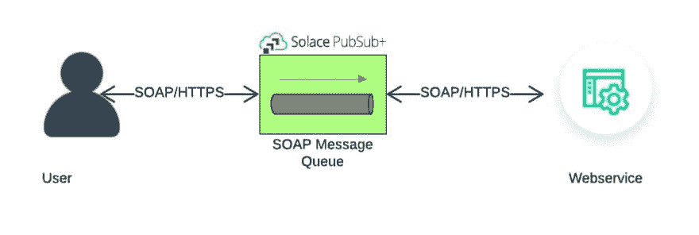](https://solace.com/wp-content/uploads/2019/04/rdp-for-soap_image-1.jpg)T4】**

**先决条件**

你应该知道:

*   如何设置、配置和使用 PubSub+，显然你需要一份 PubSub+，你可以在这里下载。
*   如何安装和使用 Docker 和 Linux
*   关于 SOAP Web 服务

## API Microgateway 与 RDP 的区别

Solace PubSub+支持两种 RESTful 消息传递方法，即 REST 消息传递模式和 API 微网关或 REST 网关模式。下表总结了这两种方法之间的一些主要差异。

|  | REST 消息模式 | REST 网关模式(微网关) |
| --- | --- | --- |
| 默认模式 | 解雇&忘记(请求/回复可选) | 请求/答复 |
| 传播 HTTP 头？ | 不 | 是 |
| 支持所有 HTTP 动词？ | 不 | 是 |
| 接收请求的时间 | 行列 | 主题 |

简而言之，当用例要求发送普通的 HTTP 帖子时，我们倾向于使用 RDP，使用*可选的*请求/回复语义。因为我们需要来自`postoffice`端点的回复，并且可能需要可选地设置`SOAPAction`头，所以微网关方法是更好的选择。

### 找到一个安全的 SOAP Web 服务

首先，我们需要找到一个支持 HTTPS 和 WS-Security 的 SOAP Web 服务。幸运的是，加拿大邮政提供了几个符合这些标准的 API，只要你注册了他们的免费[开发者程序](https://www.canadapost.ca/cpo/mc/business/productsservices/developers/services/gettingstarted.jsf)。为什么是加拿大邮报？因为我们是一家自豪的加拿大公司！

对于本教程，我们将查询`GetNearestPostOffice`操作来查找加拿大渥太华 Solace 总部附近的邮政网点。

### 点燃一个安慰 PubSub+实例

接下来，我们需要设置一个 PubSub+实例。实现这一点最简单的方法是通过 PubSub+Docker Compose[YAML](https://github.com/SolaceLabs/solace-single-docker-compose)。确保取消暴露`REST Default VPN`端口的行的注释，即 9000。否则，我们将无法对 PubSub+实例执行 HTTP POST。

### 登录您的代理实例

一旦容器启动，使用用户名`admin`和密码`admin`在浏览器中登录 [http://localhost:8080](http://localhost:8080/) 。

[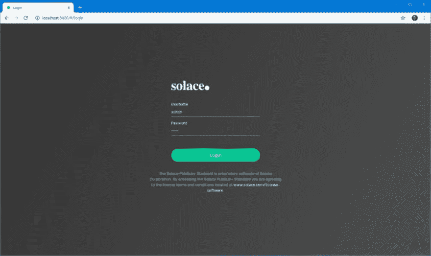](https://solace.com/wp-content/uploads/2019/04/rdp-for-soap_image-2.jpg)

现在，您应该有一个来自加拿大邮政的安全 SOAP Web 服务，一个 PubSub+实例，并登录到您的代理实例。

## 设置微网关

在这一节中，我将解释如何启用微网关连接，然后创建 RDP、REST 消费者和队列绑定。

### 启用微网关连接

要启用微网关连接:

1.  导航到**消息 VPN >连接> REST。**
2.  将服务模式更改为网关。[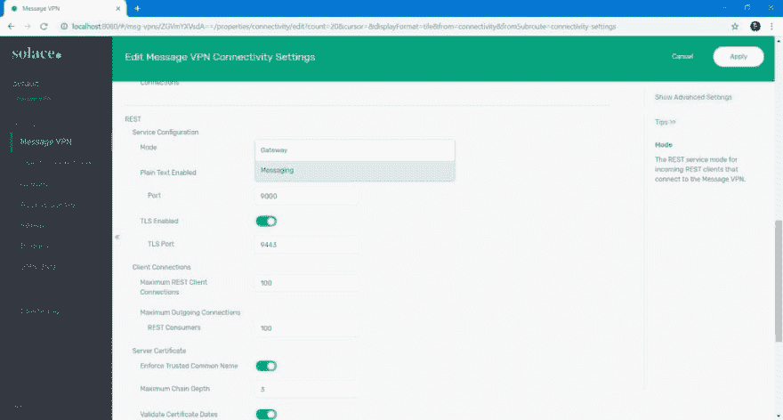](https://solace.com/wp-content/uploads/2019/04/rdp-for-soap_image-3.jpg)

请记住，微网关在 VPN 级别运行，这意味着您不能为给定的 VPN 混合和匹配 REST 传送点和网关。

### 创造 RDP

尽管不同，网关在内部利用 RDP 来实现服务连接。因此，我们仍然需要设置一个 RDP 来连接我们的加拿大邮政服务。

1.  点击默认 VPN，进入* *客户端连接> REST。** 这将调出 RDP 配置页面。【T2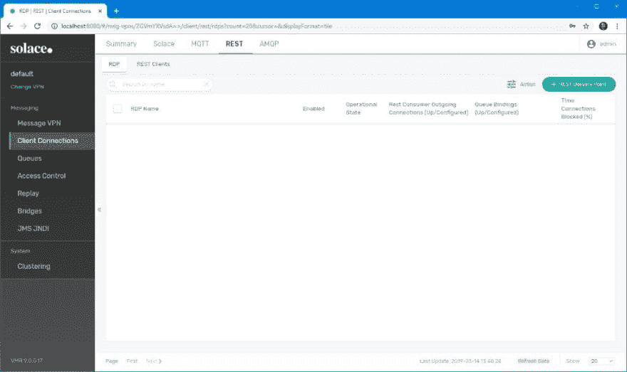
2.  点击右上角的绿色**休息交付点**按钮。
3.  给你的 RDP 起一个名字(如加拿大邮政)并点击**创建**。请记住，这一步不做任何功能。我们只是为实际的 SOAP 配置建立了一个顶级存储桶。【T2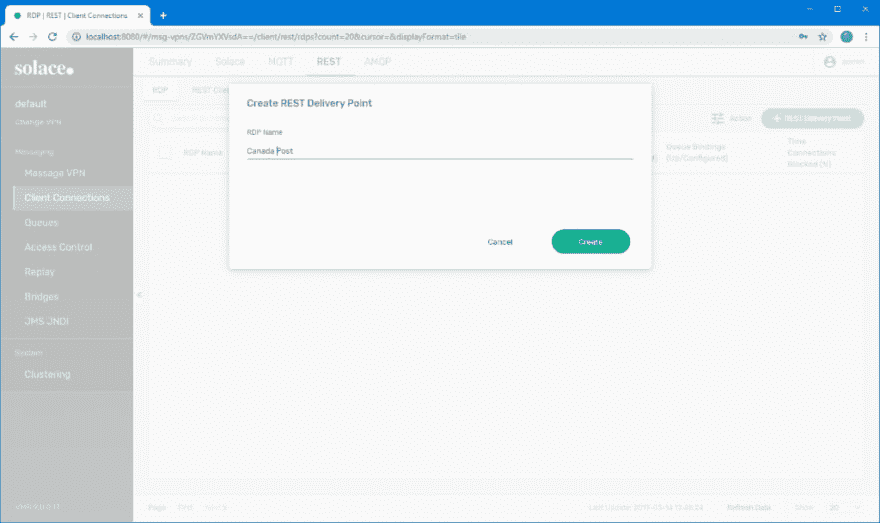
4.  保留默认设置，点击**应用**。暂时不要启用。【T2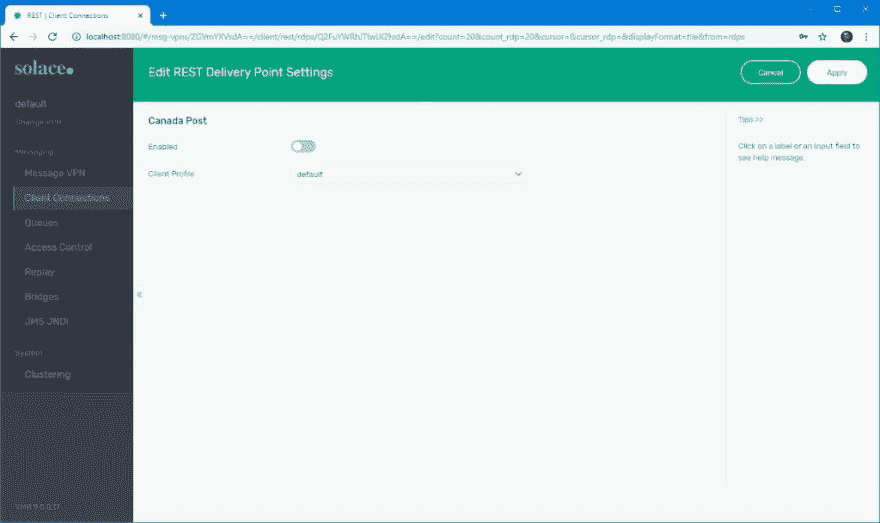
5.  新创建的 RDP 与一些运行数据一起显示在下一状态。[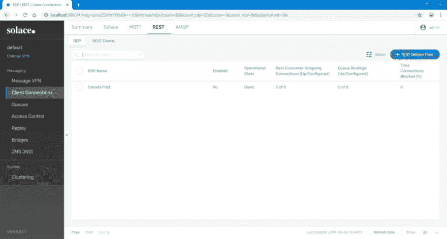](https://solace.com/wp-content/uploads/2019/04/rdp-for-soap_image-7-retake.png)

### 创建一个休息消费者

要创建 REST 消费者:

1.  点击新创建的 RDP 向下钻取到 **REST 消费者:加拿大邮政> REST 消费者。**这是我们为 Web 服务定义连接参数的地方。
2.  点击绿色的 **REST 消费者**按钮，添加一个新的 REST 消费者。
3.  给新的 REST 消费者起一个反映 SOAP 端点的名字(例如，如果 URL 是 http://www.canadapost.ca/ws/soap/postoffice 的，则为*邮局*)。虽然并非绝对必要，但以这种方式命名端点有助于在有多个端点的情况下保持事物的可识别性。 [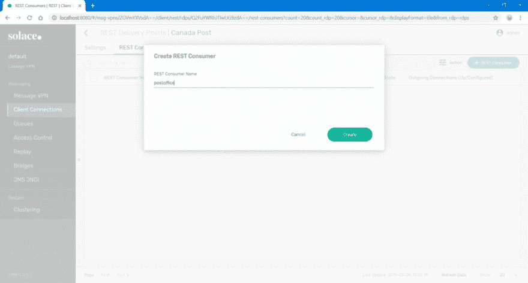](https://solace.com/wp-content/uploads/2019/04/rdp-for-soap_image-8-retake.png)
4.  单击您的新消费者端点，完成**主机**的详细信息，并将 HTTPS 的端口设置为 443。暂时不要启用消费者。【T2
5.  点击**应用**。

### 创建队列绑定

除了主机，您还需要确定要连接的确切端点。由于 PubSub+主要是一个事件代理，客户端通过队列和主题与它进行交互。因此，我们需要将端点连接到一个队列来接收 SOAP 有效负载。这是通过队列绑定完成的。

要绑定队列，您需要定义一个队列，将队列绑定到 SOAP 端点，并为队列订阅一个主题。

### 定义一个队列

1.  导航到 Queues 选项卡，点击右上角的绿色 **+ Queue** 按钮。【T2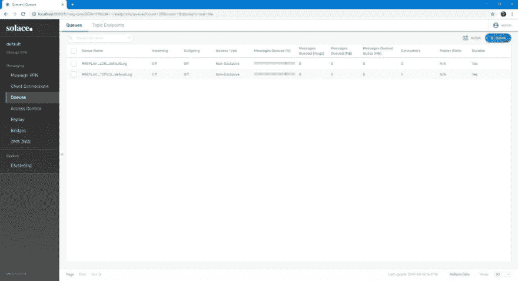
2.  以`[rdpname].[consumername]`的形式创建一个队列，点击**创建**。这种格式不是强制性的，但是在您需要快速识别与给定 SOAP 端点相关的队列时非常有用。 [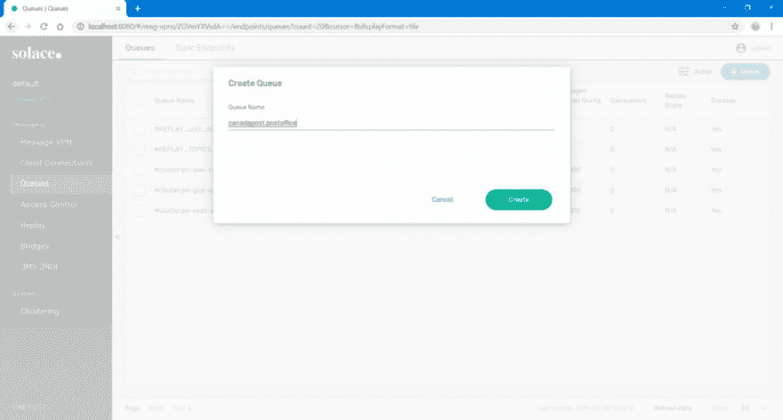](https://solace.com/wp-content/uploads/2019/04/rdp-for-soap_image-11-retake.png)
3.  根据实施需要调整队列设置，然后单击**应用**。【T2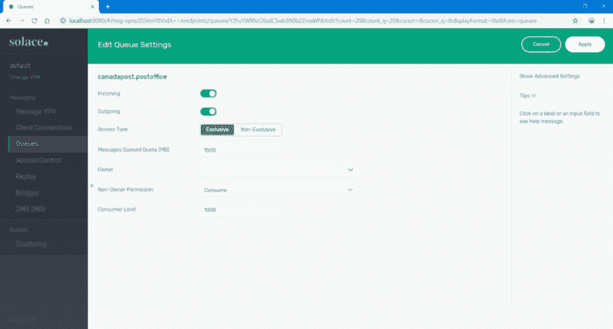

### 将队列绑定到 SOAP 端点

现在我们已经定义了一个队列，您可以将它绑定到您的 SOAP 端点。

1.  导航到**连接>休息>加拿大邮政>队列绑定**。
2.  点击绿色 **+队列绑定**按钮后，选择我们之前创建的队列，点击**创建**。
3.  在弹出的对话框中，在 Post 请求目标字段中输入 SOAP 端点，然后单击 **Apply** 。【T2

**注意**:不要忘记前导“/”。

### 设置一个主题来排队订阅

微网关模式要求用户发送由`HTTP Method` + `HTTP Resource Path`组成的特殊主题的服务请求。然后，这被映射到您在上面创建的队列绑定。清单 1 展示了如何构建主题。

*   来自 WSDL 的资源路径:[https://CT . SOA-GW . canapost . ca**/RS/soap/邮局**T3】](https://ct.soa-gw.canadapost.ca/rs/soap/postoffice)
*   HTTP 方法:POST
*   结果 PubSub+主题:POST/RS/soap/邮局

1.  要订阅我们的队列到这个主题，导航到**队列>** **邮局** **>订阅**，点击 **+订阅** **。**
2.  输入相关订阅，点击**创建**。【T2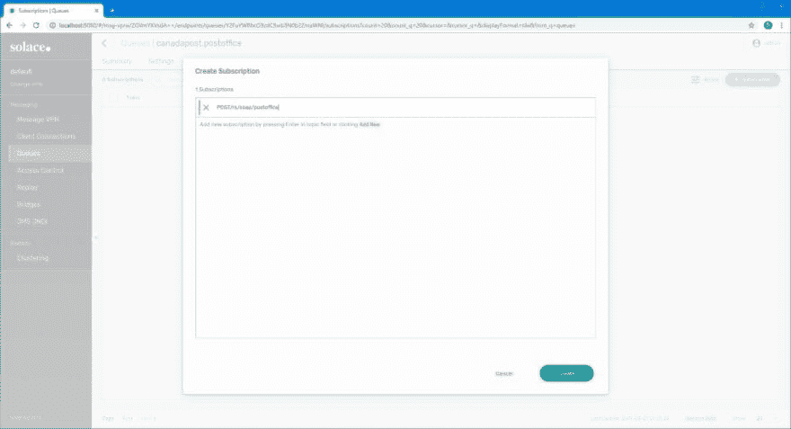

一旦被订阅，任何发送到代理上的 **/rs/soap/postoffice** 的请求都会被转发到相关的队列，从而触发对示例 Web 服务的调用。

## 设置 TLS

在这一节中，我将解释如何上传 TLS 证书、加载证书颁发机构以及添加可信的公用名。

唷！服务现在已经设置好了…嗯，差不多了。您会注意到我们还没有启用任何东西，因为 TLS 还没有配置。为此，我们将以 PEM 格式将适当的证书颁发机构(CA)添加到 PubSub+信任存储中。

**注意:**目前只能使用 PubSub+ CLI 和 Solace 元素管理协议(SEMP)设置认证机构。

### 上传 TLS 证书

PubSub+要求将给定站点的整个证书颁发机构链上传到代理上的/certs 目录。最初获取证书可以使用浏览器或`openssl`来完成。然而，确切的过程超出了本文的范围。

**注意:**根&所有中间 ca 必须单独安装在 PubSub+实例上。PubSub+不支持捆绑的 ca。

一旦有了单独的证书，就连接到容器的 shell 并将每个证书保存在/usr/sw/jail/certs 下。最简单的方法是在目录中打开一个文本编辑器，将每个证书的内容复制并粘贴到一个新文件中。

```
C:\Users\UshShukla\>docker exec -it \<PubSub+ container name\> /bin/bash The Solace PubSub+ Standard is proprietary software of Solace Corporation. By accessing the Solace PubSub+ Standard you are agreeing to the license terms and conditions. [root@f0fb1e6fe45d ~]# cd /usr/sw/jail/certs [root@f0fb1e6fe45d ~]# vi geotrust-rsa-ca.pem …paste contents… …save file… …repeat for other certificates… 
```

Enter fullscreen mode Exit fullscreen mode

### 加载认证机构

既然我们的 ca 已经保存，我们需要将它们加载到 PubSub+信任存储中，如这里的[所记录的](https://docs.solace.com/Configuring-and-Managing/Managing-Certificate-Authorities.htm)。下面提供了一个加载根证书颁发机构的示例。

```
[root@f0fb1e6fe45d certs]# /usr/sw/loads/currentload/bin/cli -A Solace PubSub+ Standard Version 9.0.0.17 The Solace PubSub+ Standard is proprietary software of Solace Corporation. By accessing the Solace PubSub+ Standard you are agreeing to the license terms and conditions. To purchase product support, please contact Solace at: https://solace.com/contact-us/ Operating Mode: Message Routing Node f0fb1e6fe45d&amp;gt; enable f0fb1e6fe45d# configure f0fb1e6fe45d(configure)# authentication f0fb1e6fe45d(configure/authentication)# create certificate-authority DigiCert-Global-Root-CA f0fb1e6fe45d(.../authentication/certificate-authority)# certificate file digitrust-root-ca.pem 
```

Enter fullscreen mode Exit fullscreen mode

我们根据通用名称(CN)来命名认证机构(例如 DigiCert…)。这种方法降低了在信任存储中复制 ca 的可能性。

一旦上传到信任存储，就可以从/certs/目录中删除原始 CA 文件。

### 添加可信的常用名

为了让 PubSub+在与 Web 服务交互时识别要使用的适当证书，我们需要用每个证书的公共名称来更新我们的 RDP 配置。下面的例子使用了`openssl`来获取这个信息，尽管你可以很容易地检查你的浏览器的 TLS 输出。

```
[root@f0fb1e6fe45d certs]# openssl s\_client -connect ct.soa-gw.canadapost.ca:443 CONNECTED(00000003) depth=2 C = US, O = DigiCert Inc, OU = www.digicert.com, CN = DigiCert Global Root CA verify return:1 depth=1 C = US, O = DigiCert Inc, OU = www.digicert.com, CN = GeoTrust RSA CA 2018 verify return:1 depth=0 C = CA, ST = Ontario, L = Ottawa, O = Canada Post Corporation, OU = Information Technology-2, CN = stg10.canadapost.ca 
```

Enter fullscreen mode Exit fullscreen mode

在上面的清单中，我们关心所有的 CN 条目。

*   在 WebUI 中，登录并导航到**客户端连接> REST >加拿大邮政> REST 消费者>邮局> TLS 选项**
*   点击绿色的 **+可信通用名称**按钮，添加个人 cn。

完成的设置看起来是这样的:

[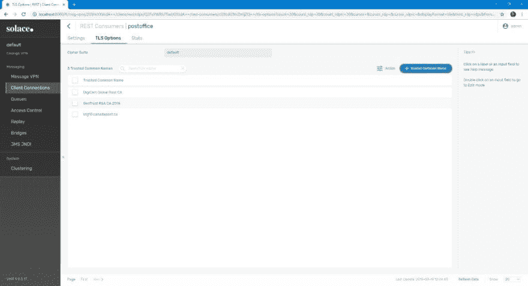](https://solace.com/wp-content/uploads/2019/04/rdp-for-soap_image-15.jpg)

**注:**我们也添加了叶证书的 CN，即 stg10.canadapost.com。

## 启用 RDP 并测试设置

在这一部分，我将解释如何启用 RDP 和测试设置。

### 启用 RDP

我们已经准备好启动 REST 交付点！分别启用以下每个配置元素:

*   REST 消费者>邮局>已启用
*   客户端连接> REST >加拿大邮政>已启用

如果一切配置正确，RDP 的状态应该是启动的。

[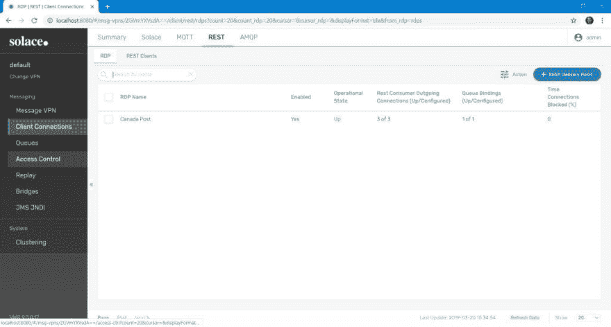T4】](https://solace.com/wp-content/uploads/2019/04/rdp-for-soap_image-16.jpg)

您可以深入查看以确保 REST 消费者也启动了。

[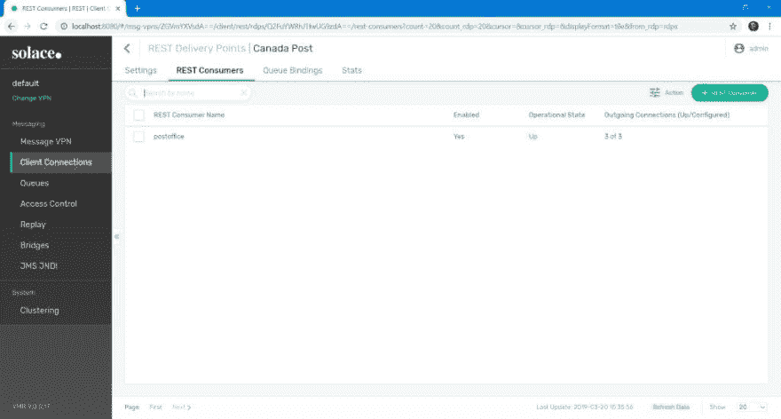T4】](https://solace.com/wp-content/uploads/2019/04/rdp-for-soap_image-17.jpg)

### 测试设置

我们可以使用 SOAPUI 测试我们的设置。

[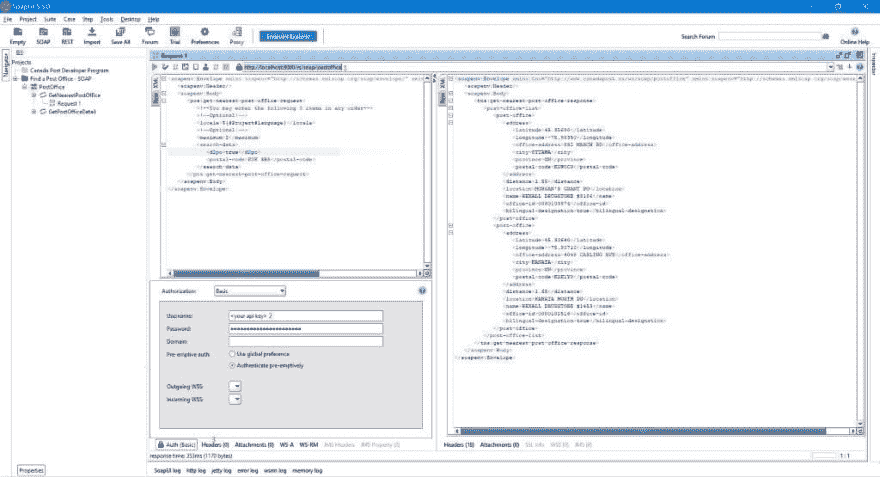 ](https://solace.com/wp-content/uploads/2019/04/rdp-for-soap_image-18.jpg) ** **

```
\<?xml version="1.0"?\> - \<soapenv:Envelope xmlns:pos="http://www.canadapost.ca/ws/soap/postoffice" xmlns:soapenv="http://schemas.xmlsoap.org/soap/envelope/"\> \<soapenv:Header/\> -\<soapenv:Body\> -\<pos:get-nearest-post-office-request\> \<!--You may enter the following 3 items in any order--\> \<!--Optional:--\> \<locale\>${#Project#language}\</locale\> \<!--Optional:--\> \<maximum\>2\</maximum\> -\<search-data\> \<d2po\>true\</d2po\> \<postal-code\>K2K 3B8\</postal-code\> \</search-data\> \</pos:get-nearest-post-office-request\> \</soapenv:Body\> \</soapenv:Envelope\> 
```

Enter fullscreen mode Exit fullscreen mode

**备注:**

*   在这种情况下，服务主机是代理，我们发送到主题队列映射中配置的资源路径。
*   我们启用基本认证并选择选项`Authenticate pre-emptively`。为什么？因为 PubSub+充当最终服务的代理，所以它需要发送整个有效负载。否则我们的呼叫将失败。选择上面的选项实际上确保了 SOAPUI 预先构建整个请求负载，包括 WS-Security 头。
*   如果需要，一定要设置 SOAPAction HTTP 头。这个例子不需要它。

## 结论

只需一点努力，PubSub+就可以让您跨异步消息传递架构公开 SOAP Web 服务，从而让它们充分享受事件驱动架构的好处。

**了解更多:**

*   [微门](https://docs.solace.com/Features/Microgateway-Concepts/Microgateways.htm#contentBody)
*   [管理休息交付点](https://docs.solace.com/Configuring-and-Managing/Managing-RDPs.htm#managing_rest_messaging_1948951837_1034318)

为 SOAP 端点设置 REST 交付点的帖子[最早出现在](https://solace.com/blog/rest-delivery-point-soap/) [Solace](https://solace.com) 上。