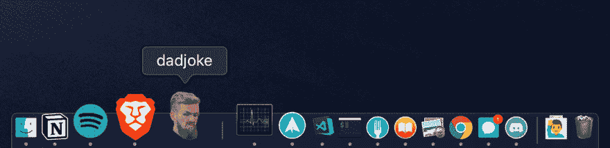

# 如何将 bash 脚本转换成 Mac 应用程序

> 原文：<https://dev.to/kennethlarsen/turning-a-bash-script-into-a-mac-app-217c>

<figure>[](https://res.cloudinary.com/practicaldev/image/fetch/s--YQuxV8WB--/c_limit%2Cf_auto%2Cfl_progressive%2Cq_auto%2Cw_880/https://www.kennethlarsen.org/conteimg/2019/04/dadjoke.png) 

<figcaption>我爸在 Mac dock 的笑话 app</figcaption>

</figure>

我有一个愚蠢的想法:在工作中，我们喜欢分享爸爸的笑话。我知道有一个叫做[https://icanhazdadjoke.com/](https://icanhazdadjoke.com/)的网站，当我`curl`它会返回一个爸爸的笑话。那么，为什么不开发一个 mac 应用程序来读取爸爸的笑话并大声朗读出来呢？

但我甚至不知道从哪里开始构建 Mac 应用程序。我做了很多东西，但从没做过 Mac 应用。所以我决定开始编写 bash 脚本。看起来是这样的:

```
JOKE=$(curl https://icanhazdadjoke.com)

say -v Daniel "$JOKE"

exit 0 
```

这个脚本将把网站上的爸爸笑话赋给一个名为`JOKE`的变量。然后我调用了`say`命令，这是一个本机 Mac OS 命令，它可以读出一个字符串。我选择了名为`Daniel`的声音，以保持这个笑话的一贯英国风格。

我可以轻松地运行它，并从中获得许多乐趣。但是，我想和我的同事们分享这个。我想把 bash 脚本变成一个 Mac 应用程序。

事实证明，如果你创建一个 Mac 应用程序的文件夹结构，并使用 bash 脚本作为`main.command`它实际上是有效的。你可以在这里看到结果:[https://github.com/kennethlarsen/dadjoke.app](https://github.com/kennethlarsen/dadjoke.app)

## 打造自己的 App

如果你有自己的 bash 脚本，你想把它变成一个 Mac 应用程序，那么就从派生我爸爸的笑话应用程序开始吧。然后:

1.  编辑 [Info.plist](https://github.com/kennethlarsen/dadjoke.app/blob/master/dadjoke.app/Contents/Info.plist) 以包含您的姓名和信息。
2.  将您的 bash 脚本添加到 [main.command](https://github.com/kennethlarsen/dadjoke.app/blob/master/dadjoke.app/Contents/MacOS/main.command)
3.  用你自己的图标替换 [cmd.icns](https://github.com/kennethlarsen/dadjoke.app/blob/master/dadjoke.app/Contents/Resources/cmd.icns)

就是这样！现在你可以把它发送给你的朋友。