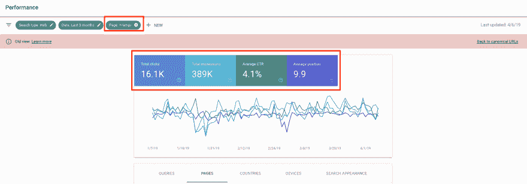
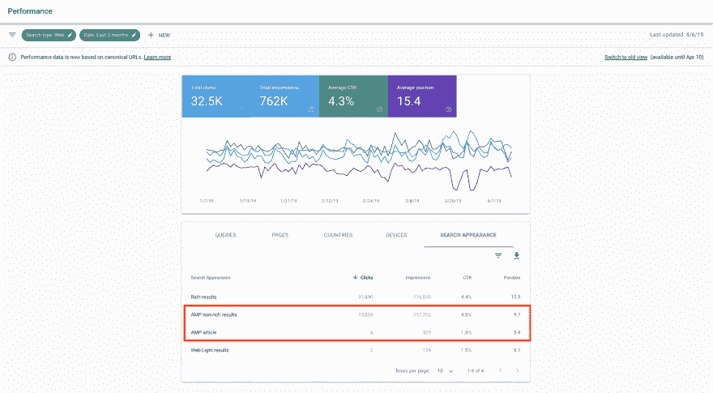
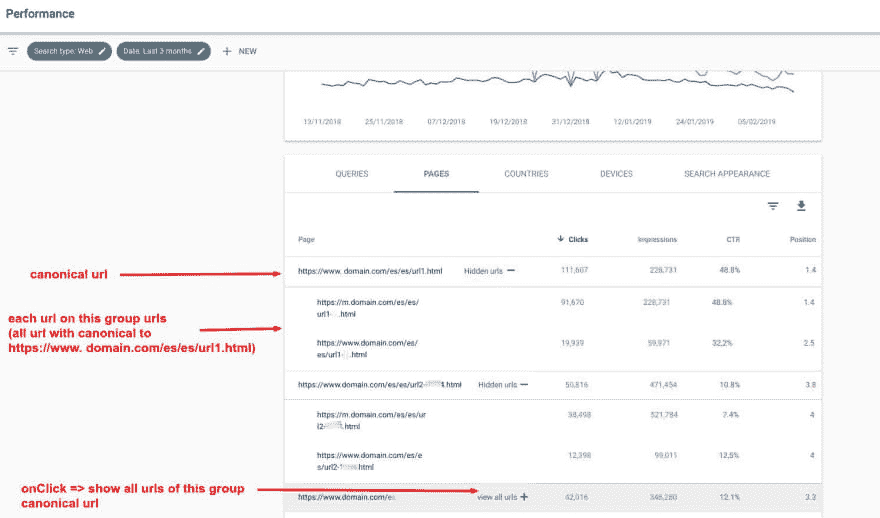

# Google 搜索控制台现在将搜索性能数据整合到规范的 URL 中:这对 SEOs 意味着什么？

> 原文：<https://dev.to/frontity/google-search-console-now-consolidates-search-performance-data-to-canonical-urls-what-does-this-mean-for-seos-42jd>

几个月前，[谷歌宣布](https://webmasters.googleblog.com/2019/02/consolidating-your-website-traffic-on.html)他们在搜索控制台中报告 URL 性能(点击量、浏览量、平均位置和平均点击率)的方式有了重大改变。在本帖中，我们将解释这一变化是怎么回事，以及它对 SEO 意味着什么。

## 从 4 月 10 日起，谷歌将只显示通过规范网址整合的数据

虽然在这几个月中，我们仍然能够用旧数据检查“旧视图”，但从 4 月 10 日**起，旧数据消失了，留给我们的是新版本，其中谷歌将信息合并到规范的 URL，而不是在搜索结果中向用户显示真实的 URL。**

稍后会有更多的内容，但是首先，让我们简单回顾一下 URL 的重要性以及什么是规范的 URL。

## URL 在 SEO 中的重要性

如果你有技术背景，就很容易注意到 URL 在 SEO 中的重要性，如果你明白对于 Google 来说，URL 就像数据库中的一个“ **id** ”。“id”可以是一个数字或一个字符串，它明确地标识数据库中的一个资源。所以它不应该随着时间而改变。

所以对于谷歌来说，它在网上爬行时找到的任何 URL 都是一个**独特网页**的“id ”,当用户搜索与该网页相关的内容时，它可能想要索引并向用户显示这些信息。

如果你有两个不同的网址显示完全相同的内容，这被认为是“**重复内容**”，谷歌需要知道这两个网址中哪一个是“好的”，当用户搜索时它可以显示给用户。此外，可能有链接(同一网站的内部链接和其他网站的外部链接)指向两个页面，因此 Google 需要一种方法来知道哪个是“好的”页面，以分配和计算这些页面的正确值。

## 规范和非规范 URL 的区别

这就是“规范的”概念出现的地方:对于显示相同内容的一组不同的 URL(2 个或更多),规范的 URL 是“好的 URL”。

谷歌提供**不同的方法**来自己处理这个问题(例如 301 重定向或规范标签)，如果你不这样做，他们的系统也有规则试图自己解决问题。

由于 web、服务器和开发框架的工作方式，显示相同内容的几个 URL 可能存在是正常的，所以我们作为 SEO 需要解决这些问题并实现 Google 给我们的机制。

这些是重复内容应该用 **301 重定向**处理的常见场景(因为额外的 URL 不会给用户增加任何价值):

*   www vs 非 www URL([https://frontity.org/careers](https://frontity.org/careers)vs【https://www.frontity.org/careers】T2

*   http vs https URL([https://frontity.org/careers](https://frontity.org/careers)vs【http://frontity.org/careers】T2

*   结尾有无斜线的网址([https://frontity.org/careers](https://frontity.org/careers)vs【https://frontity.org/careers/】T2

这些是常见的场景，其中重复的内容应该用一个**规范标签**来处理(因为额外的 URL 有它们自己的目的，对用户来说有些不同，但对搜索引擎来说是重复的):

*   在不同网址上提供服务的手机版本([https://en . m . Wikipedia . org/wiki/Progressive _ web _ applications](https://en.m.wikipedia.org/wiki/Progressive_web_applications)vs【https://en.wikipedia.org/wiki/Progressive_web_applications】T4)。

*   不同网址上的 AMP 版本([https://www . aleydasolis . com/en/search-engine-optimization/pwas-SEO-what-them-why-them-why-you-need-and-how-to-optimization-for-them/](https://www.aleydasolis.com/en/search-engine-optimization/pwas-seo-what-are-they-why-you-need-one-and-how-to-optimize-for-them/)[https://www . aleydasolis . com/en/search-engine-optimization/pwas-SEO-what-them-them-you-need-one-how-to-optimization](https://www.aleydasolis.com/en/search-engine-optimization/pwas-seo-what-are-they-why-you-need-one-and-how-to-optimize-for-them/amp/)

**另一种情况**是我们没有以正确的方式处理规范化问题，和/或 Google 的系统判定 URL A 是 URL B 的副本，并自动为其分配不同的规范化 URL (URL B)。在这些情况下，网址将被合并，即使我们没有指定给谷歌。

在这最后两个群体中，有趣的事情发生了，我们在谷歌在搜索控制台中实施的新方法中可能会遇到问题(也有好处)。

## 这个变化对 SEO 意味着什么？

基本上，根据前面的场景，我们有三种不同的情况:

1.  “重复的 URL”(被我们或 Google 正确地规范化为规范的 URL)**没有出现在搜索结果**中的情况。举个例子:如果我们有 https://frontity.org/careers 对 https://www.frontity.org/careers 的[。](https://frontity.org/careers)

2.  “重复的 URL”(被我们或 Google 正确地规范化为规范的 URL)**出现在搜索结果**中的情况。例如:替代移动或 amp 网址，如 amp.domain.com 或 m.domain.com。

3.  “重复的 URL”(不是 100%重复，但 Google 检测到重复)**出现在某些查询的搜索结果中**。例如:当你有两个非常相似且内容非常少的 URL，其中一个被 Google 检测为规范的，但如果查询包含一些只出现在“重复的”URL 上的特定信息，它会显示“重复的”URL。

### 这种变化的优点，[据谷歌](https://searchengineland.com/google-search-console-to-consolidate-search-performance-reports-to-canonical-url-311704)

*   (1)查看一个资产中特定内容的“全貌”的能力
*   (2)您的手机或 AMP 页面也将显示为一个属性，并且
*   (3)它还将通过显示更多数据来改进 AMP 和移动友好型报告。

在这一变化之前，如果你在一个子域(如 amp.domain.com 或 m.domain.com)上有你的移动特定或 AMP 页面，你会在每个**子域**(【www.domain.com】、amp.domain.com、【m.domain.com】)上得到你的站点**的点击和印象。**

这是一个**问题**:如果你有一个网站(【www.domain.com】)并决定在一个子域(amp.domain.com)上实现 AMP，一旦实现，搜索控制台为移动设备显示的性能数据(因为 AMP URLs 只出现在谷歌在移动设备上的搜索结果中)将不再出现在搜索控制台的【www.domain.com】属性上。相反，它会开始出现在 amp.domain.com 的地产上，导致你的数据混乱，并使你的分析变得复杂。

从现在起，你将获得所有关于 www.domain.com 的信息(如果你的页面被正确地规范化到主版本中)，而没有关于 amp.domain.com 的信息。

这显然是一件好事，也可能是谷歌改变策略的主要原因。

### 弊

另一方面，作为 SEO 分析师(和数据分析师)，我们喜欢拥有尽可能多的数据，并能够根据我们的需要对其进行分组或细分，以便获得知识并使用它来做出决策。

第一个问题是**丢失数据**。在两个版本的数据可用的情况下进行分析，我们可以很容易地检查出与之前相比我们缺少的数据:

这是包含/amp/

这是 Google 在**新视图**中标记为“AMP”的 URL 的数据:

我们可以清楚地看到，对于同一时期，我们有不同的数据:

这里发生了什么？有没有包含“/amp/”的 URL，但是根据谷歌搜索结果却没有显示为 amp 结果？如果是这样，为什么会这样？我们是否有/amp/ URLs 没有正确设置规范标记？或者也许我们这边一切都很好，但数据却因为谷歌的计算方式而不同？

这是一个问题，因为我们可能无法知道，谷歌可能不会分享任何细节，所以我们可以忘记旧的数据。

我们面临的另一个问题是，我们可能无法获得特定 URL 的**数据，这些数据可能被谷歌系统规范化，但有时会显示在搜索结果中，因为它们并不完全相同。**

例如，我们的网站上有一个产品，它有三个版本，每个版本都有自己的 URL。在这三种情况下，产品的名称是相同的，唯一改变的是来自制造商的产品参考和它的一些特征。虽然是同一个产品，但之所以有三个，是因为它们有不同的版本(特征上有很小的变化)，我们不会将它们合并到一个 URL，因为人们搜索产品名称和产品参考。

谷歌检测到这三个网址是重复的，它的系统选择其中一个作为标准网址，每当有人搜索产品名称时，就会显示这个网址。然而，当有人搜索产品参考时，它会显示“重复的”URL，即包含用户搜索的特定查询的 URL。

在这种情况下，如果我们获得了那些分配给“规范 URL”的点击和印象，我们就**错过了**有价值的**信息**(因为我们可能想要使用这些数据来决定是否值得索引产品的所有变化，或者只是其中的一个，并规范其余的)。

## 最后的想法

虽然这一变化有一些优势，特别是对于非高级用户，但我们认为这对 SEOs 来说是一种倒退，因为我们明显失去了数据和分析能力。

这一变化的主要优点是在旧的搜索控制台中有另一种方式，称为“**属性集**”。这允许你将不同的属性(域名、amp.domain.com 和 m.domain.com)分组，并将所有的**数据分组到**。这是完美的，因为您可以看到聚合数据和分段数据，而不会丢失任何信息。

我们希望，至少在不久的将来，谷歌会给我们一种方法来取回数据，这样我们就可以看到聚合数据以及特定 URL 的数据，就像 Lino uru uela[在这条推文](https://twitter.com/Errioxa/status/1098588851646402568)中建议的那样。

*本文最初由克里斯蒂安·奥利维拉
撰写，发表于 frontity.org/blog。*