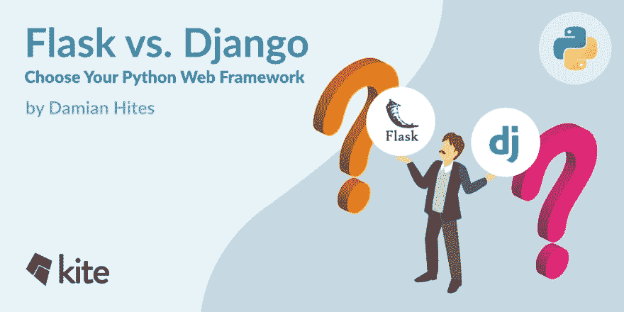

# 弗拉斯克 vs 姜戈

> 原文：<https://dev.to/kite/flask-vs-django-3pn7>

## 烧瓶还是 Django？

根据 [2018 Python 开发者调查](https://www.jetbrains.com/research/python-developers-survey-2018/)，Flask 和 Django 是迄今为止最受 Python 开发者欢迎的 web 框架。如果您决定为一个新的 web 应用程序使用哪一个框架，那么使用哪一个框架都不会出错。虽然由您来决定哪一个最适合您想要完成的任务，但是在做出决定时，您应该知道一些主要的区别。无论您最终使用哪种框架，这两种框架都有很好的文档记录并被广泛使用，因此它们拥有大量活跃的支持社区。所以，事不宜迟，让我们看看每个框架都提供了什么，并强调它们的一些差异和相似之处。

## TL；弗拉斯克博士与姜戈的差异

Flask 和 Django 是成熟的、可扩展的 web 框架，它们的核心在处理请求和提供文档方面提供了相似的功能，但是它们的职责范围不同。这两个框架之间的大部分差异源于这种不同的方法，尽管有些也源于一些不同的核心设计决策。以下是可能影响您决策的主要差异的简短列表:

*   请求对象 Flask 使用线程局部变量，而 Django 在需要的地方传递请求。
*   表单- Django 自带内置的表单，它们与 ORM 和管理站点集成在一起。Flask 没有对表单的默认支持，但是您可以使用 WTForms 来填补这个空白。
*   数据库- Django 附带了 Django ORM 和一个想要管理数据库的迁移系统。Flask 没有对数据库做任何假设，但是有一些工具，比如 SQLAlchemy，提供了类似的功能(可能更多)。
*   身份验证和权限——Django 附带了一个身份验证应用程序，它给出了用户管理和权限的默认实现。Flask 提供安全 cookies 作为您自己实现的工具。
*   管理站点——Django 带有一个完全集成的管理界面，用于管理应用程序数据。Flask 没有类似的东西，但是 Flask-Admin 是一个流行的扩展，可以用来创建一个类似的管理工具。

在风筝博客上阅读更多[！](https://kite.com/blog/python/flask-vs-django-python)