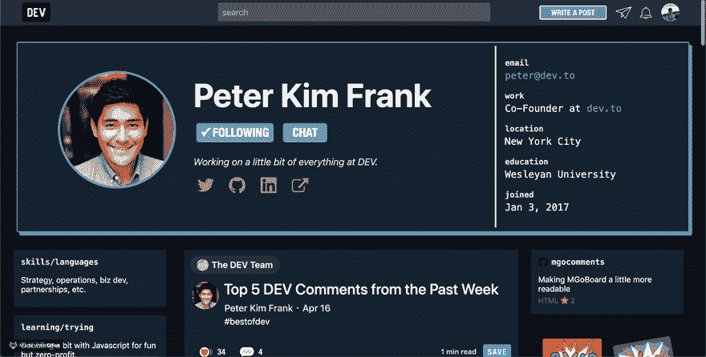
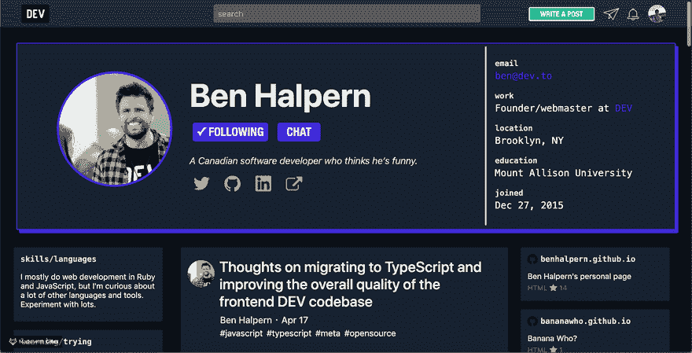

# 变更日志:开发连接打开收件箱！

> 原文：<https://dev.to/devteam/changelog-dev-connect-open-inbox-4ab1>

正如你们中的许多人所知， [DEV Connect](https://dev.to/connect/) 是一个平台上的信使，它允许你与其他开发者成员聊天。自从去年在[推出](https://dev.to/ben/changelog-announcing-dev-connect-beta-1i5f)以来，DEV Connect 只允许互相关注的用户直接聊天。

今年早些时候， [@bgadrian](https://dev.to/bgadrian) 提出了一个很棒的功能请求，建议增加一个可以选择打开收件箱接收所有用户发来的邮件的方式。我们认为这是一个伟大的想法，并开始致力于增加这一功能。

# [ 功能请求:打开连接/收件箱 #1460](https://github.com/thepracticaldev/dev.to/issues/1460) 

 **[bgadrian](https://github.com/bgadrian)** posted on [<time datetime="2019-01-04T14:25:47Z">Jan 04, 2019</time>](https://github.com/thepracticaldev/dev.to/issues/1460)

**您的功能请求是否与某个问题相关？请描述一下。**

无法使用 dev . Connect 私信联系我。

**描述您想要的解决方案**

我想一个复选框，允许社区中的任何人与我联系，类似于 twitter 上的开放 DM。

**描述你考虑过的替代方案**

在个人资料页面上更加强调我的电子邮件地址。

[View on GitHub](https://github.com/thepracticaldev/dev.to/issues/1460)

**打开收件箱现已可用**。要打开你的收件箱，进入你的[杂项设置](https://dev.to/settings/misc)，选择“打开”选项，如果你愿意，为那些希望与你联系的人键入一个简短的指南。您可以随时将您的设置更改回私人设置。

在收件箱打开的情况下查看用户资料时，单击聊天按钮将打开一个带有指导原则的模式和一个文本区，供您起草开场白。

[@nickytonline](https://dev.to/nickytonline) 也有一个很棒的建议，让在 DEV Connect 上导航到特定聊天变得更容易。现在，当您查看共同关注的用户的个人资料时，单击聊天按钮将直接转到该连接聊天。

# [ 作为 dev.to 社区的用户，我希望在我关注的人的个人资料上看到行动号召，以便与他们开始/继续对话。 #1567](https://github.com/thepracticaldev/dev.to/issues/1567) 

 **[nickytonline](https://github.com/nickytonline)** posted on [<time datetime="2019-01-16T03:30:14Z">Jan 16, 2019</time>](https://github.com/thepracticaldev/dev.to/issues/1567)

**您的功能请求是否与某个问题相关？请描述一下。**作为 dev.to 社区的用户，我希望在我关注的人的个人资料上看到行动号召，以便与他们开始/继续对话。

**描述你想要的解决方案**这样做的动机是，如果你关注某人，并且碰巧在他的个人资料上，你就可以很快与他开始对话。此外，拥有很多追随者的人目前无法在 dev connect 中轻松找到用户。

为了补充这个故事，考虑一下 dev connect 页面上的一个查找字段，这样用户就可以快速过滤他们要找的人。此外，如图所示，我将“关注”按钮设置为不如“聊天”按钮突出的动作。另外，我不确定“聊天”这个词

**描述你考虑过的替代方案**不适用

**附加上下文**在此添加关于功能请求的任何其他上下文或截图。

[View on GitHub](https://github.com/thepracticaldev/dev.to/issues/1567)

打开收件箱，你就把自己放在了外面。为了防止垃圾邮件和滥用，我们在 DEV Connect 中直接添加了阻止和报告滥用按钮。阻止关闭聊天，并防止该用户打开新的聊天-即使您保持收件箱打开。请注意，阻塞仅发生在 DEV Connect 上(不是站点范围)。

这个功能是全新的，所以如果你遇到任何 bug，请在 [GitHub repo](https://github.com/thepracticaldev/dev.to) 中告诉我们。