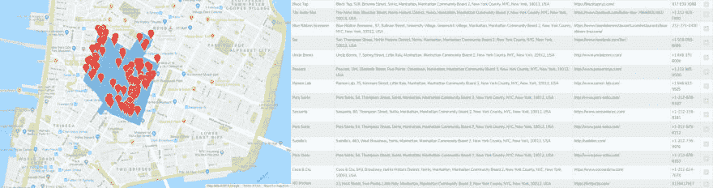

# 从一个小项目的小创意到一个全新的项目

> 原文：<https://dev.to/thedatapond/from-a-little-idea-for-a-little-project-to-a-brand-new-project-4cag>

数据池是如何诞生的。

在从事一个兼职项目时，我在寻找一种方法来获取给定城市中的餐馆列表。我需要一个特定类型的企业(餐馆)的网站列表，以便检查他们使用哪种技术和他们需要哪种服务器。我做了大量的研究，没有发现任何令人满意的东西。

所以我试图从谷歌地图和 Foursquare 上获取这些信息，直到我阅读了他们的服务条款。显然，来自谷歌地图或 Foursquare 等服务的数据不能被提取使用。例如，谷歌地图服务条款(3.2.4)规定“客户不得提取、导出、抓取或缓存谷歌地图内容用于服务之外”。

然后我尝试了 OpenStreetMaps，找到了我要找的东西:一个可以不受约束使用的列表。然而，提取这些数据是相当困难的。那时我决定创建一个工具来自动化这个过程。

如果您想从地图上获取数据，过程非常简单:在地图上绘制一个地理区域，定义您的参数(类别，关键字...)然后你会得到一个名字、地址、网站、电话号码的列表...

你得到的数据不像谷歌地图或 Foursquare 那样丰富，但至少，使用它们是合法的(ODC 开放数据库许可证)。

网站没有完全完成，仍然有 1000 件事情要做:设计，打字，功能，改进清单...但是这个想法是基于用户的评论或请求继续开发。

可以用[演示](https://www.thedatapond.net/mew-demo)试试。