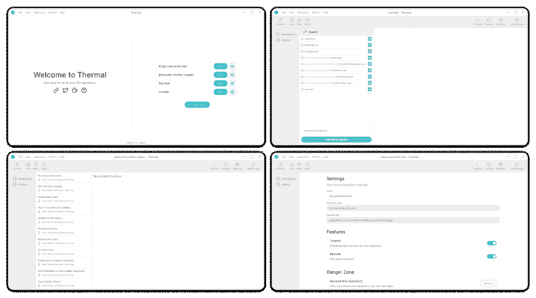
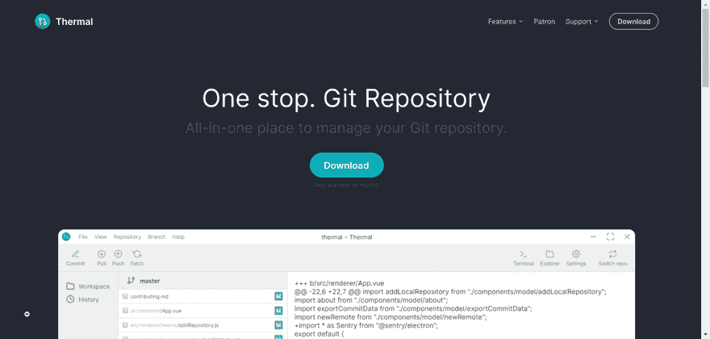

# 所有 Git 存储库的一站式服务

> 原文：<https://dev.to/mittalyashu/one-stop-to-all-git-repository-1llg>

# 什么是热？

[Thermal](https://thermal.netlify.com) 是一个开源的桌面应用程序，通过为您提供一个简单易用的图形用户界面以及内置的提交、历史、存储库设置等功能，允许您在一个位置管理所有 Git 存储库。

还可以看一段[快速演示视频](https://dev.to/mittalyashu/quick-thermal-app-tour-i7o)。

## 特性

*   提交更改
*   提交历史记录
*   提交详细信息
*   文件差异
*   存储库设置
*   推送至远程存储库
*   创建新存储库
*   还有更多...

下载 [**热能应用**](https://thermal.netlify.com/download/) ，立即免费试用。

# 发展

这些应用程序的源代码可以在 [GitHub](https://github.com/gitthermal/thermal) 上获得，欢迎您到[为项目](https://www.notion.so/gitthermal/Contribute-9d82f521342f4573b853d1bc793bdf02)做出贡献。

*我们刚刚开始使用这个应用程序，还有更多的计划功能要建立，[加入我们的 discord 服务器](https://discord.gg/s2PYYJV)解决您关于应用程序的问题，并保持与开发的同步。*

我们正在创建一个热应用的登录页面。

> 甚至我们的[路线图](https://www.notion.so/gitthermal/Thermal-060703b03c174d4bb36daf0ddaf27277)和每个特性的细节都在 idea 上公开。

我们希望收到您的来信，在下面留下评论或在 [Thermal discord server](https://discord.gg/s2PYYJV) 与我聊天。

*最初发表于 [CodeCarrot 博客](https://blog.codecarrot.net/one-stop-to-all-git-repository/)。*