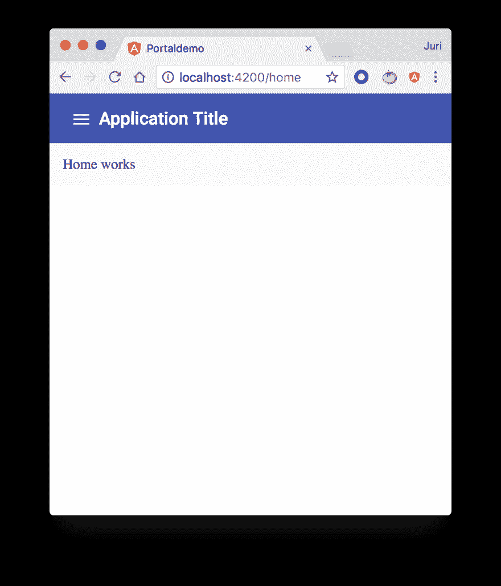
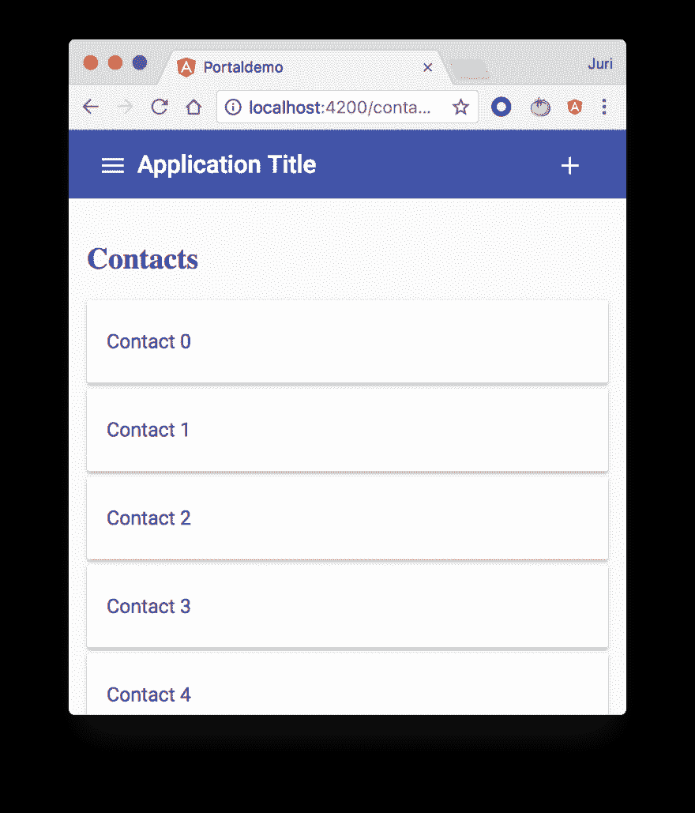

# 带有 CDK 模板门户和 DomPortalHost 的动态用户界面

> 原文：<https://dev.to/angular/dynamic-ui-with-cdk-templateportal-and-domportalhost-14gh>

曾经想把一些 UI 从一个组件动态地放到另一个组件上吗？但是拥有内容的组件与应该显示内容的组件没有任何联系。在这篇文章中，我们将学习如何利用角度 CDK 门户网站来实现这一点。

让我们假设我们有这个简单的(类似移动设备的)应用程序。

正如你所看到的，我们有一个工具栏，带有侧栏菜单按钮和应用程序标题，还有一个中心区域，当前显示的是主页应用程序屏幕。当用户点击菜单时，他/她可以如你所料导航到不同的屏幕。每个屏幕(即我们的路由组件)都有一组特定的操作。每当被路由的组件被激活时，我们都希望在应用程序的工具栏中显示这些动作(让我们称之为**页面动作**)。这是一个常见的场景，尤其是在移动应用程序中。

*注意工具栏右上角的“添加”图标。*

现在，从“组件化”的角度来看，我们有某种类型的`ShellComponent`来创建整体布局，包括工具栏、侧边栏(两者也可以是单独的组件)以及放置路由组件的中心区域。也就是说，**被路由的组件不知道它们被放置在哪里**。我们不希望有一个对工具栏或任何东西的硬编码引用。

基本上在我们具体的演示应用中，

*   `ContactListComponent`对工具栏一无所知。它可能驻留在不同的(甚至是延迟加载的)角度模块中。此外，我们不想将它们结合在一起。
*   所显示的动作是上下文特定的，这意味着如果我们单击“+”按钮，我们的`ContactListComponent`上的一些功能就会被触发。

[阅读更多](https://juristr.com/blog/2018/05/dynamic-UI-with-cdk-portals/?utm_source=devto&utm_medium=crosspost)